Services fondamentaux d'AWS :
- compute
- storage 
- Database
- Networking
Cours : what is cloud computing?
## Compute
Les ressources de calculs sont les cerveaux et la puissance de traitement requis par les applications.
Exemple: 
Dans un DataCenter : serveur qui a de la RAM et de la CPU
AWS: différents services qui offrent des capacités de calculs.
* EC2 : service en continu (millions d'instructions)
* Lambda: (qqs millisecond pour exécuter du code)
Le service à utiliser dépend du besoin de l'entreprise.

### EC2 
Service qui permet de déployer des serveurs virtuels au sein de l'environnement AWS
Une instance EC2 doit être configurée avec les éléments suivants :
#### AMI : Amazon Machine Images
Ce sont des modèles d'instances préconfigurées qui permettent de lancer rapidement une nouvelle instance EC2 basée sur la configuration définit dans l'AMI.
Une AMI contient un OS et une ou des applications ainsi que toute configuration personnalisées supplémentaires.
Les images peuvent être déployées sur une instance puis customisées pour créer de nouvelles images qui peuvent alors être déployées sur de nouvelles instances

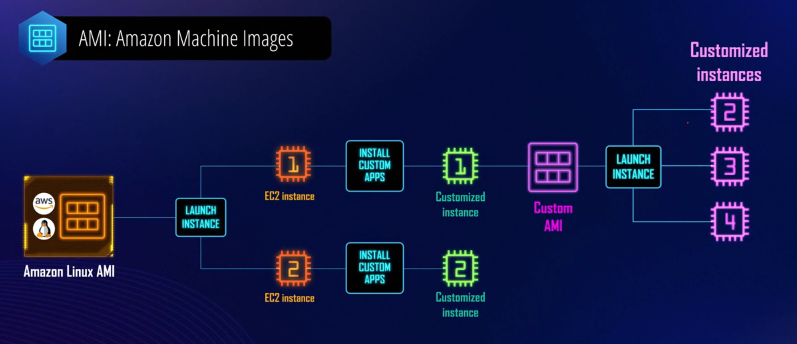

Les images peuvent être récupérées sur le marketplace AWS ou sur des marketplace privés.
#### Instance types
* définit simplement la taille de l'instance en fonction d'un certains nombre de paramètres :
	* cpu : cpu virtuels sur l'instance
	* architecture: i386...
	* memory :
	* storage : 
	* storage type : ssd ou disque dur magnétique
	* network performance :  taux de transfert de données
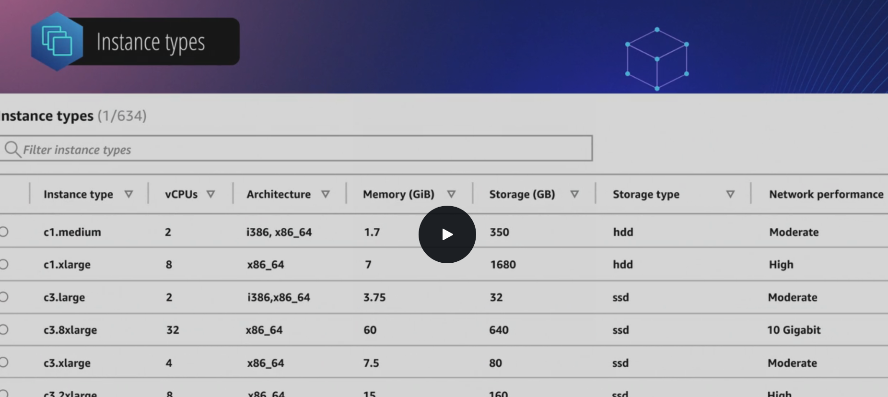

Les types d'instance sont catégorisées en différentes familles qui offrent des avantages de performances distincts :
🟢*General purpose* 
* mélange équilibré de cpu, ram et storage
* idéal pour les Bdd de petite et moyennes tailles, environnement de tests et de développement ou les serveurs web

🟢*Compute optimized*
* met l'accent sur la puissance de calcul
* idéal pour les process nécessitant de hautes performances (traitement par lots / machine learning)

🟢*Memory optimized*
* pour les applications en mémoire telles que le traitement en temps réel de données non structurées.

🟢*Accelerated computing*
* calcule accéléré qui utilise des accélérateurs matériels  ou coprocesseurs pour des calcules en virgule flottante

🟢*Storage optimized*
* pour un stockage optimisé / stockage d'instance soutenu par SSD pour une faible latence et des entrées/sorties très élévées.
* utiles pour les systèmes de fichiers de données et les applications de traitement de journaux.

🟢*HPC optimized*
* pour le calcul haute performance *
####  Instance purchasing options 
* options d'achat différent pour les instances EC2
* Les options permettent d'optimiser les coûts en fonction du besoin.
##### 📌On-Demand Instances
* Instance EC2 qui peuvent être lancées à tout moment. Elles sont provisionnées et disponibles pour les utiliser en quelques minutes.
* peut être utilisé aussi longtemps que nécessaire ; coût est basé sur un coût forfaitaire basé sur le type d'instance.
* utilisé pour des charges de travail à court terme et irrégulières mais qui ne peut être interrompu. Idéal pour les tests et environnement de développements.
* une fois arrêté ou résilié, le paiement s'arrête.
##### 📌Spot Instances (instance ponctuelle)
* exploitent la capacité EC2 inutilisée pour offrir d'énormes remises par rapport au tarif à la demande
* prix variable définit par aws en fonction de l'offre et la demande
* possibilité de définir le prix maximum que le client est prêt à payer pour l'instance ; si le prix spot dépasse le prix maximum ou si la capacité spot n'est plus disponible, le service EC2 récupérera l'instance via ce qu'on appelle une interruption d'instance spot. Lorsque cela se produit l'instance se termine, s'arrête ou hiberne en fonction du comportement spécifié à la création.
* comme la demande peut fluctuer, il existe toujours un risque que l'instance soient interrompu à tout moment ; il faut donc des applications qui résistent aux interruptions comme les tâches par lots ou le traitement de données en arrière plan.
##### 📌Reserved Instances
* Les instances réservées permettent d'acheter une remise pour un type d'instance à la demande avec des critères et pour une période de temps déterminées.
* idéal pour une utilisation à long terme et prévisible
* engagement de 1 à 3 ans
* économie plus importante en fonction du montant que vous souhaitez payez d'avance:
	* all upfront : paiement complet au début du contrat et  pas plus qqs soit le nombre d'heure d'utilisation de l'instance / offre la plus gde remise 
	* partial upfront : paiement partiel au début du contrat (small) puis une réduction est appliquée à toutes les heures restantes pendant la durée.
	* No upfront : aucun paiement inital et la plus petite remise de ces 3 options est appliquées à toutes les heures restantes du contrat
* l'instance vous appartient pour la durée du contrat / le contrat peut être revue et l'instance échangée. Ces instances se déclinent en deux offres
	* standard reserved
		* possibilité de modifier certains attributs de l'instance comme sa zone de disponibilité, sa taille mais elles ne peuvent pas être échangées ou remplacées par une autre famille d'instances. Il est possible de la revendre sur le marché des instances réservées aws.
	* convertible reserved
		* peuvent être modifiées et échangées contre une instance réservée convertible avec des attributs complètement nouveaux (famille, type ou plate forme d'instances différéntes)
		* en échange de cette flexibilité, ces instances bénéficient d'une remise inférieure à celle des instances standard.
		* ces instances ne peuvent s'acheter ou se vendre sur le marché aws.
##### 📌On-Demand Capacity Reservations
* ne peut être annulé
* Réservation de capacité à la demande en fonction de différents attributs tels que le type d'instance et la plate-forme au sein d'une zone de disponibilité particulière
* peut être effectuée pour n'importe quel durée ; ce qui garantit d'avoir le nombre d'instance disponibles souhaitées dans la zone de disponibilité immédiatement
* aucune remise mais possibilité de créer ou annuler ces réservations
* possiblité de faire des économies en combinant avec des instances réservées ou avec des plans d'économies d'instance EC2, en échange d'un engagement à utiliser une quantité donnée de puissance de calcul sur une période et un temps donnée.

#### Tenancy (location)
* Location d'instances EC2 qui peut se faire sur des hôtes dédiée ou partagées
##### 📌location partagée
* par défaut une instance EC2 s'exécute dans le mode location partagée ; c'est à dire sur n'importe quel hôte disponible avec les ressources disponibles pour le type d'instance sélectionné
#####  📌location dédiée
* la location dédiée inclut à la fois des instances dédiées et des hôtes dédiés
* pour des raisons spécifique comme la sécurité. 
* Aucun autre client ne peut accéder au matériel ou sont stockées ces instances. 
* Le coût est donc plus important car il y a des risques d'inutilisation. Mais ce matériel peut être partagé avec d'autres ressources dont dispose le client.
* permet d'organiser les intances sur l'hôte physique

#### User Data
* permet d'entrer des commandes qui s'exécuteront lors du premier boot de l'instance.
#### Storage options
la sélection du stockage dépend du type d'instance choisi
* comment l'instance va être utilisé
* est-ce que les données sont critiques ?
##### 📌persistent storage : Amazon Elastic Block Store (EBS)
 EBS Volume sont des appareils distincts de l'instance EC2, considérés comme des périphériques de stockage connectés au réseau
* logiquement attachés à l'instance EC2 via le réseau AWS. Il faut voir la chose de la manière suivante : si le PC est EC2, un disque dur externe représente l'EBS
* pour la résilience les données sont dupliquées  dans la même zone de disponibilité.
* EBS peut être attachés à un autre EC2
* il est possible de créer un instantané qui peut être mis sur Amazon S3
* il est possible d'encrypter les volumes EBS et les instantanés

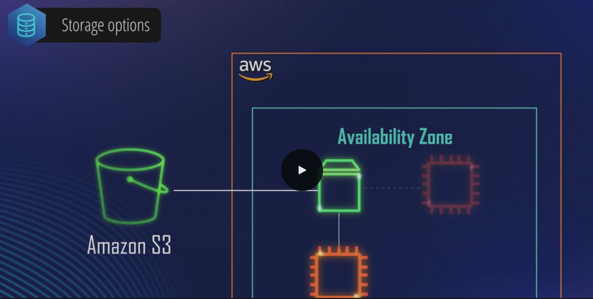
##### 📌Ephemeral storage :
En créant des instances EC2 qui utilisent des volumes de stockage d'instance qui sont des disques locaux sur l'hôte physique sous jacente.
* l'instance de stockage éphémère ne peut être détaché de l'instance EC2
* les données sont perdues après une veille longue ou si l'instance est stoppée ou terminée
* sur le reboot de l'instance, les données sont conservées
* idéal pour stocker du cache ou du contenu temporaire

#### Sécurité
##### 📌Groupe de sécurité
* à la création de l'instance il est demandé de choisir un groupe de sécurité qui est essentiellement un pare feu au niveau de l'instance permettant de restreindre à la fois le trafic d'entrée et de sortie vers votre instance en spécifiant le trafic avec lequel il est autorisé de communiquer.
* flux entrants et sortant: restriction par ports sources et protocoles
##### 📌Paire de clés (clé publique, clé privée)

 🎯 **But**
- **Sécurité** : Évite l’usage de mots de passe, plus vulnérables aux attaques par force brute.
- **Authentification** : Vérifie que la personne qui se connecte à l’instance est bien autorisée.
- **Connexion SSH** : Permet de se connecter de façon chiffrée à votre serveur Linux (ou via RDP pour Windows avec mot de passe généré).

Principe
* utilisées pour chiffrer les informations de connexions pour les instances Linux et Windows EC2, puis décrypter ces mêmes informations qui permettent l'authentification auprès de l'instance

 🔑 **Fonctionnement**
1. **Génération de la paire de clés**
    - Vous générez une **clé privée** et une **clé publique** (AWS peut la générer pour vous ou vous pouvez la créer localement via `ssh-keygen`).
    - Exemple :
		```bash
		    `ssh-keygen -t rsa -b 4096 -f ma_clef`
		```
        Cela crée :
        - `ma_clef` → **clé privée** (gardée secrète, jamais partagée)
        - `ma_clef.pub` → **clé publique** (que vous pouvez partager)
            
2. **Stockage dans AWS**
    - Lors du lancement de l’instance EC2, vous associez la **clé publique** à cette instance.
    - AWS copie cette clé dans le fichier `~/.ssh/authorized_keys` de l’utilisateur (souvent `ec2-user` ou `ubuntu`).
        
3. **Connexion au serveur**
    - Quand vous tentez de vous connecter :
```bash
ssh -i ma_clef.pem ec2-user@<IP_INSTANCE>
```

- Le serveur utilise la **clé publique** qu’il connaît pour vérifier que la **clé privée** que vous utilisez est valide (via un mécanisme de chiffrement asymétrique).    
- Si elles correspondent, l’accès est accordé sans mot de passe.
- 
 🔒 **Avantages**
- Pas de mot de passe à deviner ou intercepter.
- Clés privées protégées par des permissions (600) ou un mot de passe local.
- Possibilité de gérer plusieurs utilisateurs (chacun avec sa clé publique).
- Compatible avec l’automatisation (Ansible, Terraform…).
- 
💡 **Bonnes pratiques** :
- **Ne jamais partager la clé privée**.
- **Protéger la clé privée** avec un mot de passe.
- **Désactiver l’accès SSH par mot de passe** (`PasswordAuthentication no` dans `sshd_config`).
- **Utiliser AWS Systems Manager Session Manager** comme alternative plus sécurisée à SSH.

-----
En réalité, **la paire de clés publique/privée sur EC2 n’est pas utilisée pour chiffrer un mot de passe** – **elle remplace le mot de passe**.

🔑 **Comment ça marche vraiment**
- Quand vous vous connectez en SSH :
    - Le serveur EC2 envoie un **challenge** (message aléatoire) à votre client.
    - Votre client le **signe** avec votre **clé privée**.
    - Le serveur utilise la **clé publique** qu’il a en mémoire pour vérifier cette signature.
- ✅ Si la signature est valide → vous êtes authentifié **sans qu’aucun mot de passe ne circule**.
    
❌ **Pas de mot de passe chiffré**
- Il n’y a pas de mot de passe envoyé ou chiffré.
- Pas besoin d’en stocker un sur l’instance.
- La sécurité repose uniquement sur la possession de la clé privée (et éventuellement son mot de passe local).

📌 **Exception** :  
Sur les instances **Windows EC2**, la paire de clés sert uniquement à **chiffrer/déchiffrer le mot de passe administrateur**.
- AWS génère un mot de passe admin chiffré avec votre **clé publique**.
- Vous utilisez votre **clé privée** pour le déchiffrer via la console AWS.

| **Système**     | **Rôle de la paire de clés**                             | **Connexion**                      | **Mot de passe utilisé ?**                                   |
| --------------- | -------------------------------------------------------- | ---------------------------------- | ------------------------------------------------------------ |
| **Linux EC2**   | Authentification SSH par signature (pas de mot de passe) | `ssh -i ma_clef.pem ec2-user@<IP>` | ❌ Non (la clé privée remplace le mot de passe)               |
| **Windows EC2** | Chiffrement/déchiffrement du mot de passe administrateur | RDP (Remote Desktop Protocol)      | ✅ Oui, mot de passe nécessaire (décrypté avec la clé privée) |

------
#### EC2 Image Builder
* aide à automatiser la création d'images de VM pour les instances EC2
* configuration de configuration automatisée pour créer les AMI

##### pipeline
dispose d'un pipeline de création qui prend en charge de nombreuses facettes importantes de la construction de l'image
* le pipeline peut aider à personnaliser les logiciels installés sur les images comme la mise à jour de l'OS, les correctifs de sécurité...
* traite la vérification de la sécurité en activant le cryptage du disque, en fermant les ports non essentiels
	* peut tester l'image
	* peut distribuer l'image
* le pipeline peut être scheduler ou lancer manuellement

##### recette
La recette est un ensemble prédéfini d'instructions que le pipeline exécutera lors de la création de la nouvelle image (c'est une sorte de dockerfile).
*  doit d'abord définir l'OS.
* définir certains composants que le pipeline peut ajouter à l'image. Un composant est utilisé pour installer ou ajouter des fonctionnalités à l'image. Il permettent de définir une séquence d'étapes exécutées sur une instance avant la création de l'image.
* les composants sont de deux type : Build Component et Test Component
##### Build Component
contient le logiciel et les paramètres à installer sur l'image pendant le process de build
	* installé la dernière version de tomcat *
	* installé la dernière version de aws-cli
	
##### Test Component
s'exécute après la création de l'image et permet de valider sa fonctionnalité, sa sécurité et ses performances

##### Document Component
Document YAML, à créer pour les composants de tests et de construction et qui décrit les actions que EC2 Image Builder doit effectuer sur cette image.
Le document YAML, contient le code, les commandes et les définitions; chaque document peut contenir des phases qui sont des regroupements logiques d'étapes (steps); il peut y avoir 3 phases différentes.
###### Build
Phase de construction de l'image
###### Validate
Phase de validation après la phase de build ; l'exécution est  vérifié sur une instance. Si l'instance est fonctionnelle, l'instance est arrêtée et une image finale est créée et envoyée à la dernière étape qui est le test.
###### Test
Une instance est créée avec l'image créée précédemment ; l'image builder peut alors exécuter tous les composants de tests

### AWS Beanstalk
C'est un service géré par aws permettant de télécharger le code source de l'application web, de spécifier les paramètres de configuration pour son environnement ; à partir de là, le service gérera tout y compris le provisionnement automatique de l'infrastructure et le déploiement pour rendre l'application opérationnelle.
C'est une solution simple, efficace et rapide pour déployer des applications web

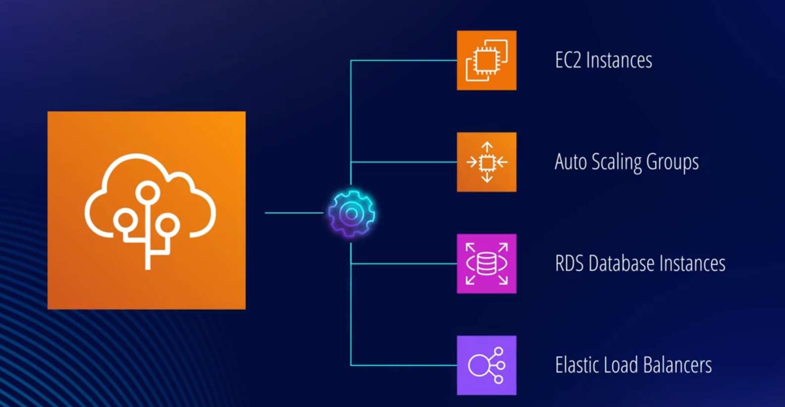

La maintenance est possible via un dashboard, y compris l'ajustement du nombre d'instances EC2.

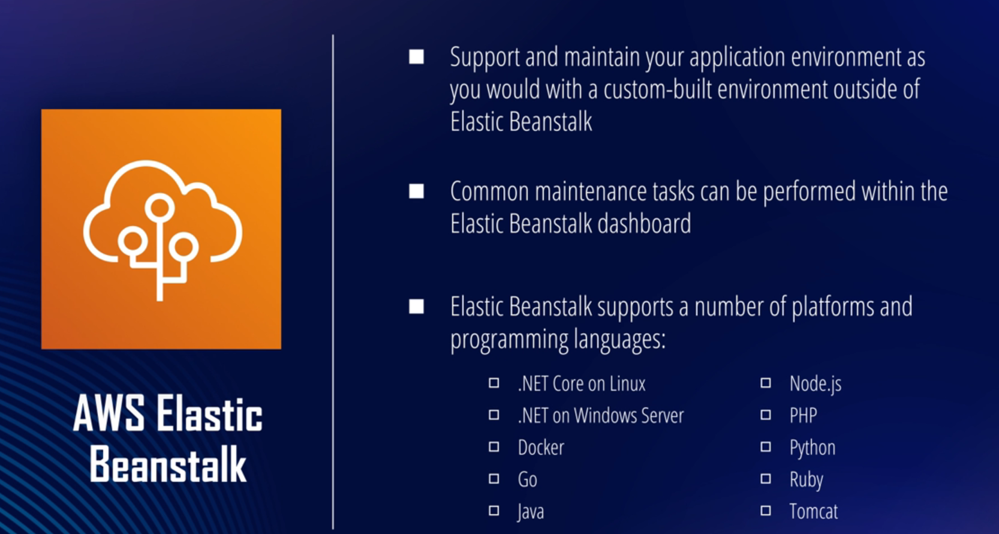

Concernant le coût, seront facturées les ressources créées par EBS sur le serveur de l'application (EC2 / load balancer).
#### components
Une application se compose d'un ou plusieurs environnements, versions et environnement configuration.
* environnement : a un nom, une url et une description et fait référence à la collection de ressources aws qui sont créés par EBS
* version : référence au code base qui pointe généralement sur un objet S3 qui contient le code déployable
* chaque environnement exécute une seule version de l'application
* une version de l'application peut s'exécuter dans plusieurs environnement en même temps
* une configuration d'environnement est un ensemble de paramètre et de réglages qui dictent la manière dont les ressources de l'environnement seront provisionnées par EBS. 
* une configuration d'environnement peut être enregistrée et servir de modèle pour créer de nouveaux environnements

#### Environnement tier
Il doit être définit lors de la configuration d'un environnement.
* Web server Environnement : http request
* Worker environnement : not http request, exécution dans un environnement de travail ; plutôt des tâches backend qui interagissent avec Amazon SQS, le service Simple Queue.

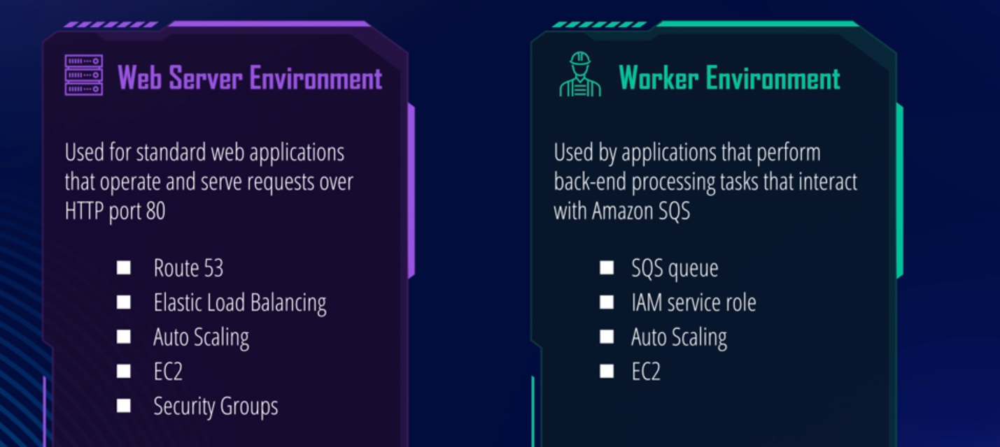

#### Configuration
Configuration de l'ensemble du processus de déploiement et de gestion de l'application :

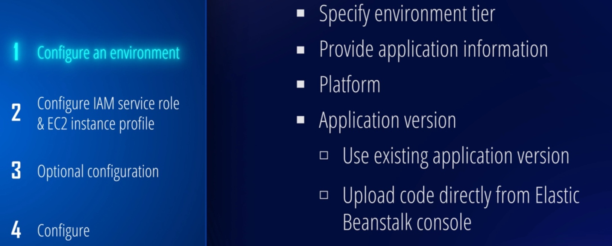

* iam profile permet aux instances d'exécuter les opération requises.
* optional configuration : 
	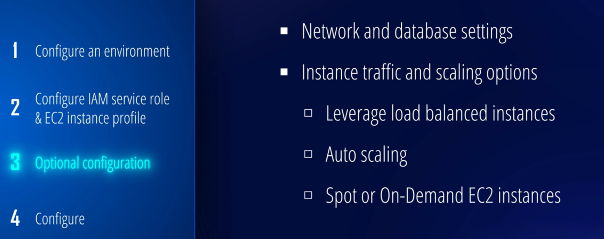
* Configure: sont configurables les rapports sur l'état (reporting), la surveillance (monitoring) et la journalisation (Logging).


### AWS Lambda
C'est un service de calcul sans serveur  "serverless" conçu pour permettre l'exécution du code applicatif sans avoir à provisionner ou gérer des instances EC2.
Il n'y a pas de maintenance et d'administration de l'infrastructure ; c'est de la responsabilité du service qui est géré par AWS.
On se concentre sur le code et le métier.
Comprendre AWS Lambda revient en réalité à comprendre presque toutes les fonctions dans le code : Input, Functions, Output.
#### Functions
Tout comme EC2 est constitué d'instance, Lambda est constitué de fonctions, qui sont le code que vous écrivez et qui représente la logique métier.
Les lambda fonctions sont définies de la manière suivante :
*  code
* permissions / autorisations
* environnement variables
* cpu/memory : quantité souhaitée pour exécuter la fonction. En proportion de la quantité, les quantités de cpu, réseau et disques seront définis.
Uploader le code sur le service Lambda :
* écrire le code dans le service
* télécharger le code via un fichier zip ou des objets dans Amazon S3
Le langage utilisé pour le programme doit correspondre au moteur d'exécution sélectionner dans le service.
Comment exécuter le code ? il faut l'invoquer. 

#### Input
Plusieurs options pour appeler la fonction:
*  aws-console
* aws-sdk
* aws-toolkits
* aws-cli
* url de fonction qui est un endpoint HTTP
* via un déclencheur tel qu'un autre service ou ressource aws ; le déclencheur exécutant la fonction en réponse à certains évènements ou selon un calendrier (scheduler). Lorsque la fonction est appelée, il est possible de lui transmettre des évènements à traiter par la fonction. Si un service appelle la fonction, il peut également transmettre des évènements ; le service lambda sera responsable de la structuration de ces évènements.
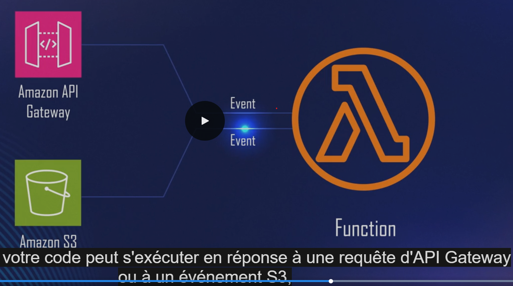
	Exemple : la lambda peut s'exécuter en réponse à une requête d'API Gateway ou à un évènement S3, tel qu'un appel API d'objet PUT. 
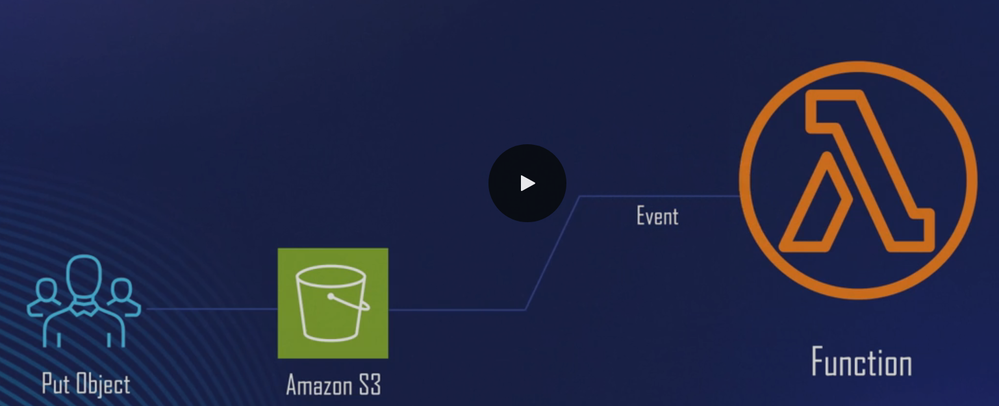
	Une fois l'appel API de l'objet PUT effectué, la lambda exécutera le code.
#### Output
Une fois l'appel exécuté, le service peut effectuer des appels vers d'autres services tels que DynamoDB, SQS, SNS et plus depuis le code.
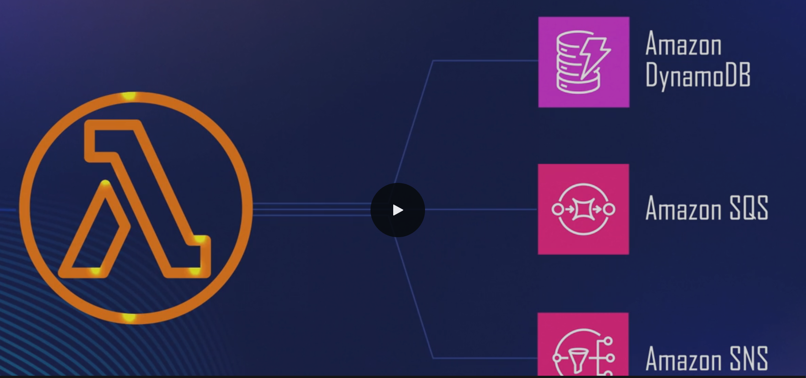

#### Métrique / Monitoring
Lorsque la lambda est déclenchée, le service surveille automatiquement la fonction via des journaux et des métriques communes (surveillance,) disponibles sur CloudWatch.
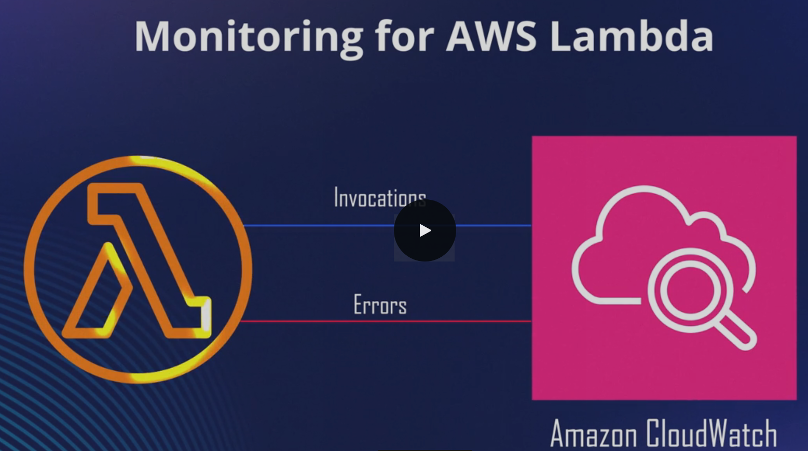

#### Log
Il est possible de personnaliser des logs dans le code dans des journaux ; c'est un enregistrement de la séquence d'évènements de la fonction.
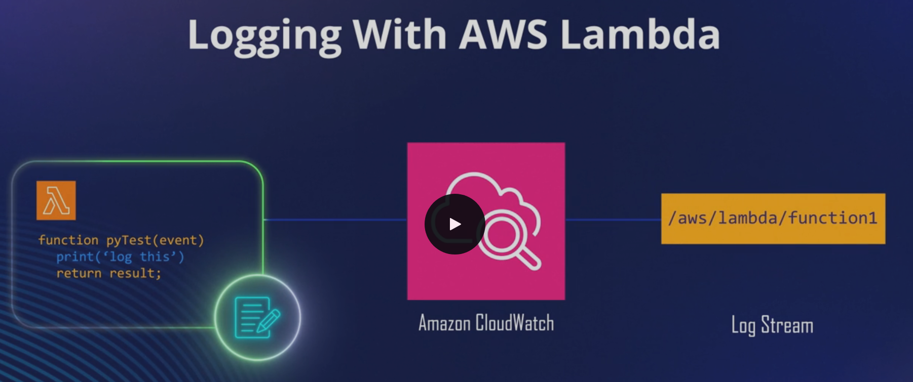

### Coût
On ne paie que les ressources utilisées.
* le nombre de requêtes envoyées à la fonction
* la durée d'exécution du code mesurée à partir du moment où la fonction est déclenchée
* la puissance de calcul allouée à la fonction
### AWS Batch
* Service pour gérer et exécuter des charges de travail de calcul par lots au sein d'AWS.
* utiliser dans des situations qui nécessite une grande puissance de calcul répartis sur un cluster de ressources qui exécutent une série de travaux ou de tâches par lots (analyse de modèles financiers par exemple).
* un système de calcul peut être difficile à obtenir sans le cloud car il demande de grandes quantités de ressources de calcul.
* possible de créer de manière transparente un cluster de ressources de calcul, hautement évolutif, avec de gros volumes, en optimisant la répartition des charges de travail sur les zones de disponibilités.
* aws gère l'ensemble du provisionnement, de la surveillance, de la maintenance et de la gestion de vos clusters.

* aws batch comprend quatre composants : jobs, job definitions, job queues, Comput Environnement
#### Jobs
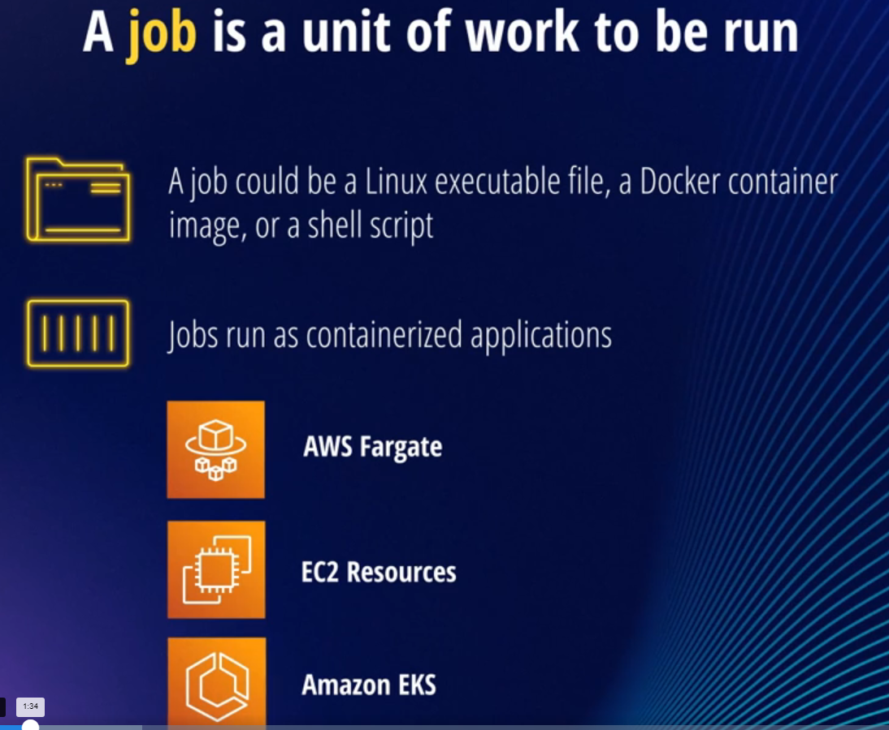
* Fargate : aws met en place toute l'infrastructure pour vous
* EC2: pour des tâches à plus grande échelles si le travail doit avoir une architecture particulière ou accès à des processeurs spécifiques ou GPU
* EKS

Il est possible de déterminer des dépendances entre les jobs et donc de les ordonnancer.
Un job peut avoir différents états : soumis, en attente, running, failed (entre autres)
#### Job Definition
Définit des paramètres du job y compris la façon dont le travail sera exécuté et sa configuration.
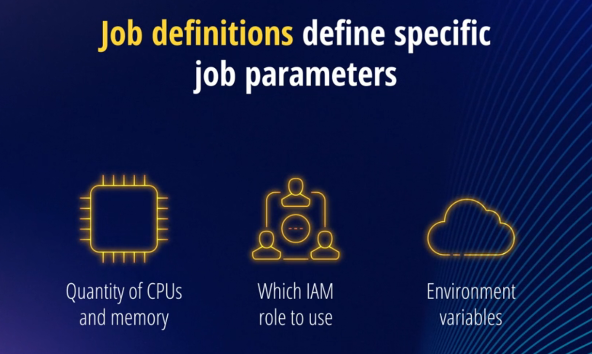
* iam role : pour pouvoir communiquer avec d'autres services
* variable d'environnement et autre propriétés tel que les points de montage vers des volumes de stockage.
#### Job Queues
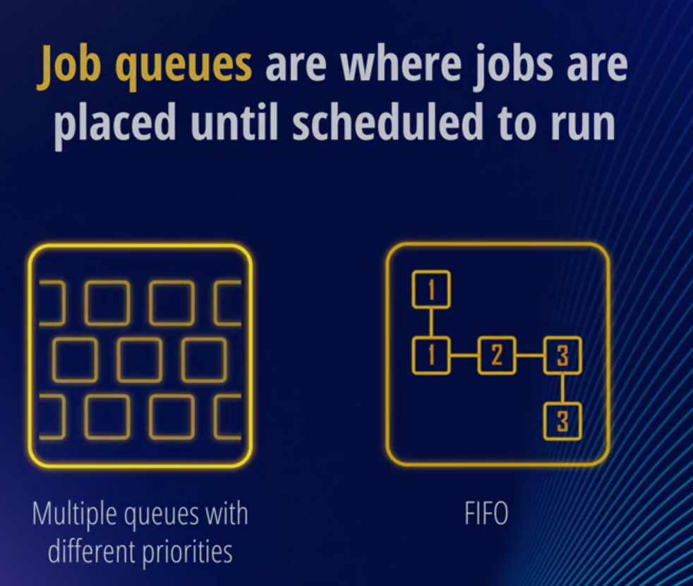
* possibilité de définir la propre politique de planification

#### Compute Environments
Les files d'attentes sont associées à un ou plusieurs environnements de calcul, qui contiennent les tâches réelles.
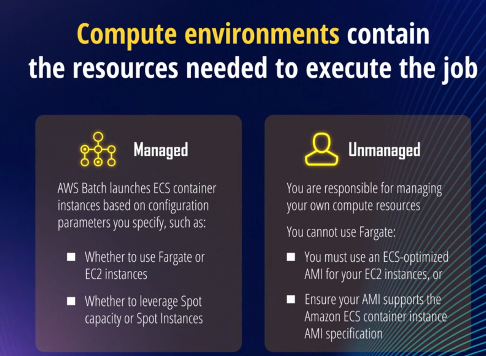
### Amazon LightSail
VPS: serveur privé virtuel soutenu par l'infrastructure d'AWS ; C'est un EC2 light sans autant d'étapes de configuration
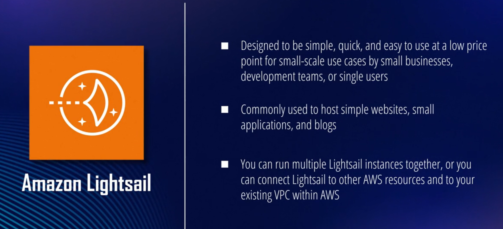

### AWS App Runner
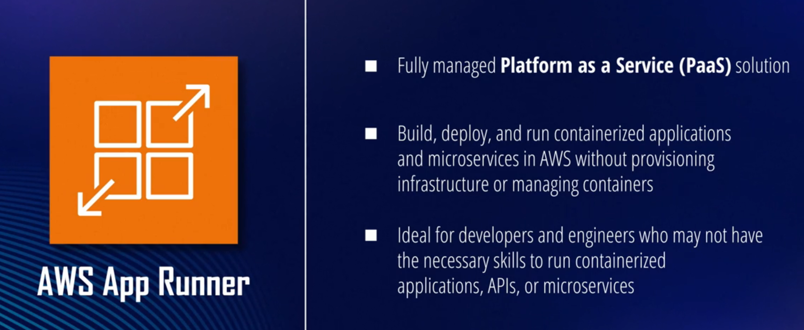
Il faut spécifier :
* soit l'emplacement du code source
* soit un container registry
alors App Runner peut automatiquement créer et déployer l'application à tout moment

AppRunner peut être ajouter comme cible de déploiement dans un pipeline CI/CD existant.
Il est possible de configurer la CPU et mémoire allouer au service, s'il faut utiliser la valeur par défaut ou une valeur custom.
AppRunner surveille en permanence le nombre de requête pour démarrer ou arrêter si nécessaire des instances.
Au niveau network, il est possible de choisir entre un service public accessible via internet ou un réseau privé.
A partir de là, AppRunner créera une image conteneur de l'application, la déploiera et fournira une url d'accès au service.