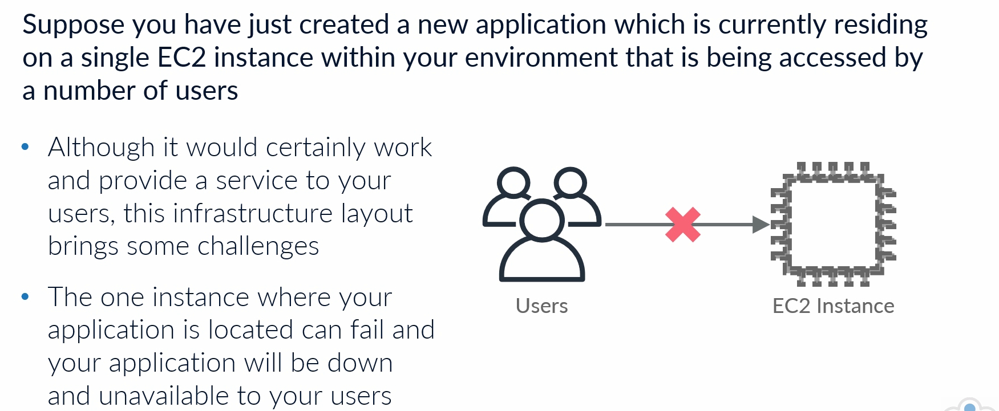
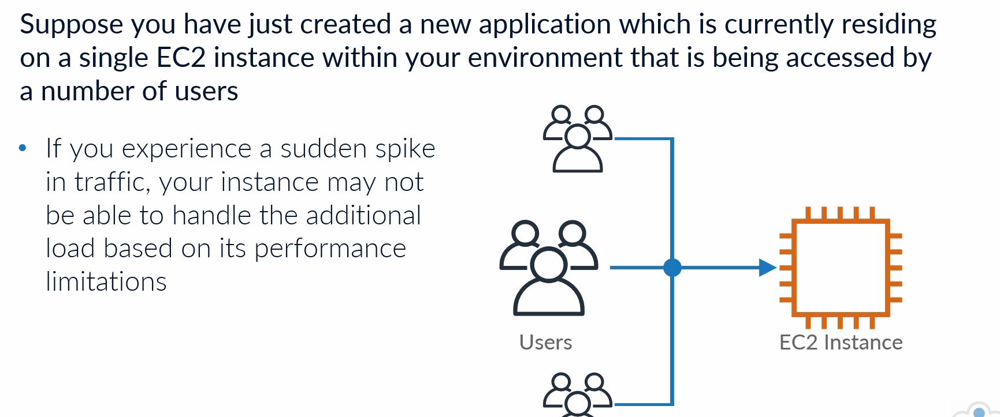
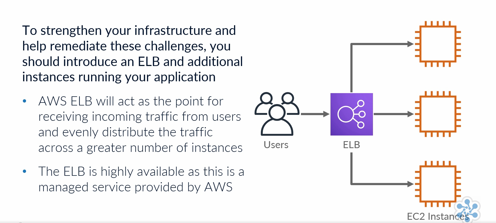
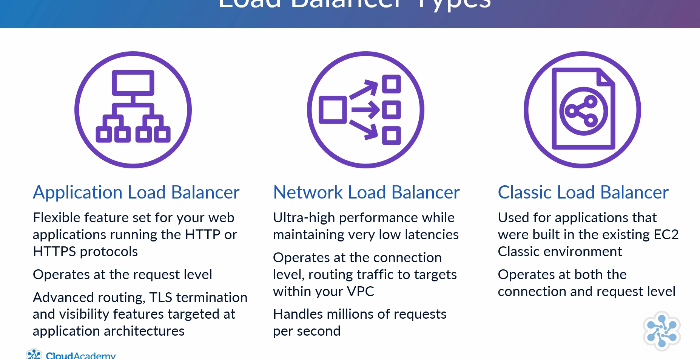
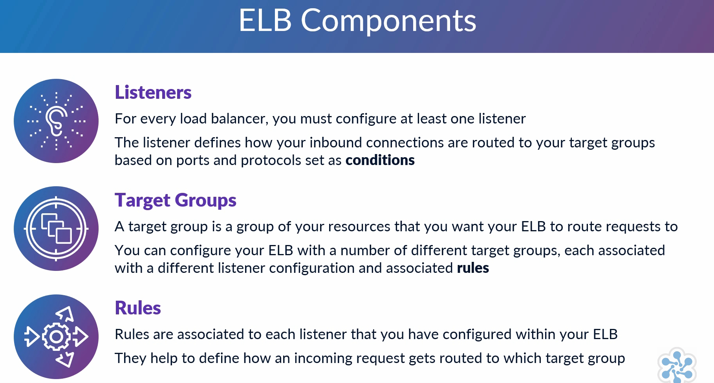
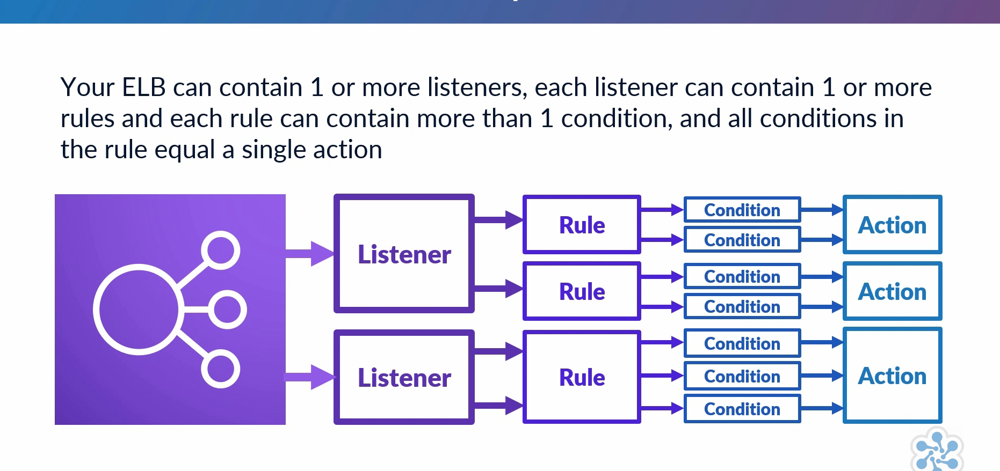
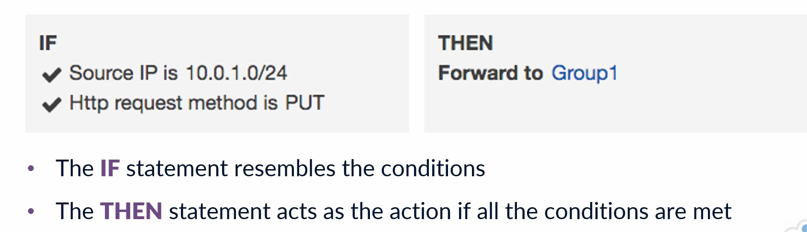
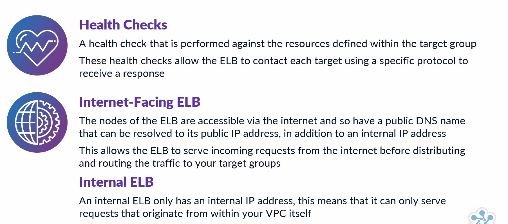
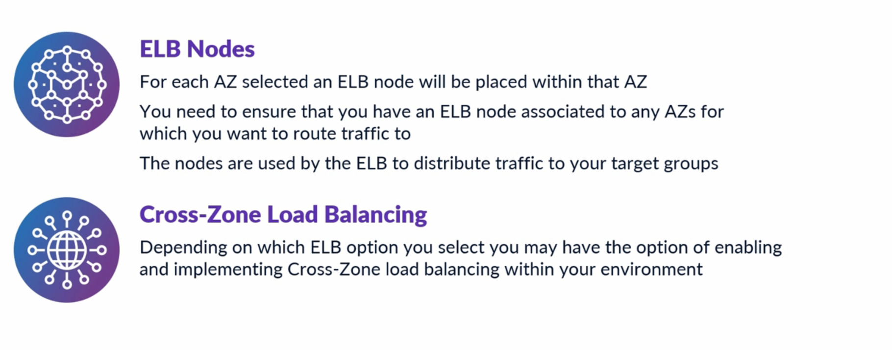
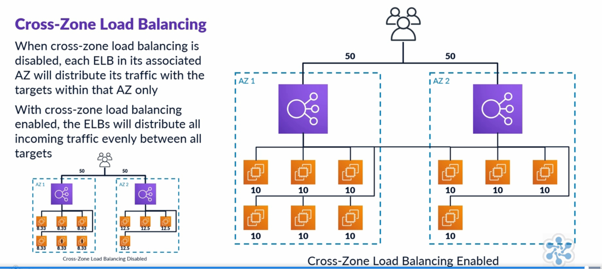

Elastic load balancer:

 # 🎯 **But** : renforcer l'infra et remédier à ces challenges
* machine EC2 peut tomber en panne
* un pic de traffic peut ne pas être savoir gérer par l'instance EC2 en fonction de ses limites de performances

🟥 ELB: une instance supplémentaire qui exécute l'application qui offre résilience et haute disponiblité.
Il n'y a pas de SPOOF car l'ELB est en fait composé de plusieurs instances gérée par AWS.

Elastic : 
* signifie que l'infra sera automatiquement mis à l'échelle pour répondre au traffic entrant et sortant, en fonction de son évolution, s'il augment ou diminue
* détecte les instance KOs
* détecte un pic de traffic

### Load Balancer Types

### ELB Components

### ELB Rules

### ELB Interne vs Internet

📚 Exemple: il est possible d'avoir un ou plusieurs serveurs Web dans un sous réseau publics et des serveurs d'applications dans un sous réseau privés. Un ELB interne  peut alors être assis entre les serveurs web et les serveurs d'applications.

### ELB Nodes
Sert à définir dans quelle zone de disponibilité l'ELB fonctionne.
Pour chaque zone, il devra être défini un node.

### Cross Zone Load Balancing

