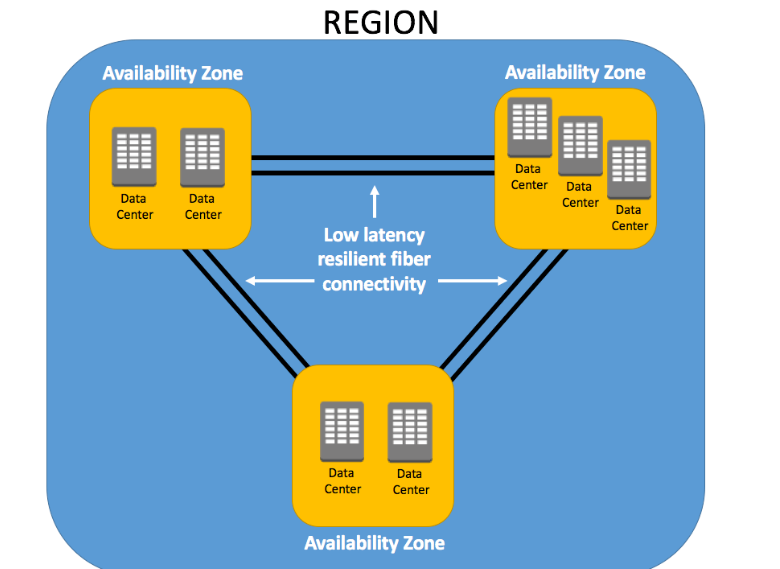
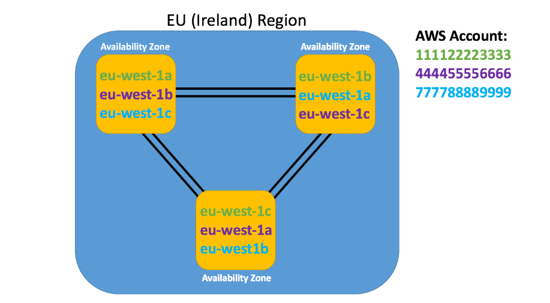
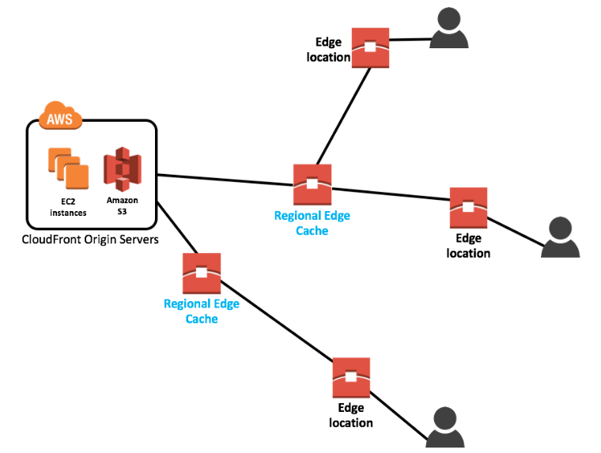

## Availability Zones (AZs)
* est physiquement un ou plusieurs data-centers où sont les réseaux, calcul, stockage et base de données que les clients provisionnent dans leur VPC.
* chaque AZ aura toujours au moins une autre AZ qui est géographiquement situé dans la même zone (reliée par des connexions privées à fibre optique hautement résilientes et à très faible latence)
* chaque AZ sera isolé des autres en utilisant une alimentation et une connectivité réseau séparée, pour minimiser les impactes si un seul AZ échoue.
* la faible latence entre les AZs est utilisé par beaucoup de services pour répliquer les données pour une haute disponibilité et résilience.
* il y a souvent 3 à 5 AZs liés ensemble.

### nommage
* une AZ est préfixé par le code région suivi d'une lettre. 
	Exemple: pour paris:  
	• eu-west-1a
	• eu-west-1b
	• eu-west-1c


## Regions
* le regroupement géographique localisé de plusieurs AZs est défini en tant que région AWS


* chaque région est indépendante et contient au minimum deux AZs.
* tout comme utilisé plusieurs AZs dans une région permet une haute disponibilité, le même schéma s'applique aux régions. Il est possible d'architecturer l'environnement d'AWS à travers plusieurs régions (pour éviter un désastre naturel qui pourrait impacter toute la région...).
* A noter que tous les services AWS ne sont pas forcément disponibles dans toutes les régions.
 
### nommage
* chaque région à un nom 'friendly' et un nom de code
*  Exemple : Paris => Europe(Paris) / eu-west-3



📌 Ce que dit AWS
- Une région (ex : **eu-west-3** = Paris) contient **3 AZ**.
- Dans la console AWS, tu les vois nommées : **eu-west-3a**, **eu-west-3b**, **eu-west-3c**.
- MAIS 👉 **le suffixe "a", "b", "c" n’est pas le même pour tous les comptes AWS**.
---
🔎 Exemple concret
- Ton compte AWS → `eu-west-3a` = datacenter réel n°1 (disons à Saint-Denis).
- Mon compte AWS → `eu-west-3a` peut en réalité être datacenter réel n°2 (disons à Clichy).
Donc **mon "3a" ≠ ton "3a"**.
---
 🎯 Pourquoi AWS fait ça ?
1. **Éviter les déséquilibres** :  
    Si tout le monde choisissait "3a" parce qu’elle est "la première de la liste", une seule AZ serait saturée.  
    En changeant l’association pour chaque compte, AWS répartit automatiquement la charge.
2. **Transparence relative** :  
    Toi, tu n’as pas besoin de savoir si c’est Clichy, Saint-Denis ou Aubervilliers.  
    Tu sais seulement que c’est une **AZ différente**.
---
✅ Ce qu’il faut retenir
- Le **nom d’AZ (eu-west-3a, 3b, 3c)** est **logique et propre à ton compte**.
- Si tu veux t’assurer que deux ressources sont vraiment dans la **même AZ physique**, il faut comparer leur **Zone ID** (un identifiant unique interne AWS), pas juste "3a" ou "3b".

👉 Exemple de commande pour voir les vrais **Zone IDs** (via AWS CLI) :
`aws ec2 describe-availability-zones --region eu-west-3`

Tu obtiendras un truc comme :
```json
{
  "AvailabilityZones": [
    {
      "ZoneName": "eu-west-3a",
      "ZoneId": "euw3-az1"
    },
    {
      "ZoneName": "eu-west-3b",
      "ZoneId": "euw3-az2"
    },
    {
      "ZoneName": "eu-west-3c",
      "ZoneId": "euw3-az3"
    }
  ]
}

```

👉 Les `ZoneId` (`euw3-az1`, `euw3-az2`, etc.) sont stables et identiques pour tous les comptes.

 🟢 Compte AWS n°1
```scss
eu-west-3a  ──►  euw3-az1 (datacenter réel A)
eu-west-3b  ──►  euw3-az2 (datacenter réel B)
eu-west-3c  ──►  euw3-az3 (datacenter réel C)
```

🔵 Compte AWS n°2
```scss
eu-west-3a  ──►  euw3-az2 (datacenter réel B)
eu-west-3b  ──►  euw3-az3 (datacenter réel C)
eu-west-3c  ──►  euw3-az1 (datacenter réel A)
```

✅ Ce qu’on voit
- **Les labels "3a/3b/3c" changent selon le compte** → ils sont "logiques".
- **Les ZoneIDs (`euw3-az1`, `euw3-az2`, …)** sont les vrais identifiants physiques → communs à tout le monde.
## Edge Locations
* Les emplacements périphériques sont des sites AWS déployés dans de grandes villes et des zones très peuplées à travers le monde.
* Ils sont bien plus nombreux que le nombre de zones de disponibilité disponibles.
* Bien que les emplacements Edge ne soient pas utilisés pour déployer vos infrastructures principales telles que les instances EC2, EBS stockage, VPC ou ressources RDS comme les AZ, ils sont utilisés par des services AWS tels que AWS CloudFront et AWS Lambda@Edge (actuellement dans Preview) pour mettre en cache les données et réduire la latence pour l’accès des utilisateurs finaux en utilisant les emplacements périphériques comme un réseau mondial de diffusion de contenu (CDN)
* 
🔑 Par exemple, vous pouvez avoir votre site web hébergé sur des instances EC2 et S3 (votre origine) dans l’Ohio région avec une distribution CloudFront configurée associée. Lorsqu’un utilisateur accède à votre site web d’Europe, ils seraient redirigés vers leur emplacement périphérique le plus proche (en Europe) où les données mises en cache pourrait être lu sur votre site web, réduisant considérablement la latence.

## Regional Edge Caches

 * Cache périphérique régional qui se trouvent entre vos serveurs CloudFront Origin et les emplacements périphériques. 
 * Un cache périphérique régional a une largeur de cache plus grande que chacun des emplacements périphériques individuels, et parce que les données expirent dans ces derniers, les données sont conservées dans les caches périphériques régionaux.
* Par conséquent, lorsque des données sont demandées à l’emplacement périphérique qui n’est plus disponible, l’emplacement périphérique peut récupérer les données en cache à partir du Regional Edge Cache au lieu des serveurs d’origine, ce qui ont une latence plus élevée.



## Local Zones
* nouveau type de déploiement d’infrastructure conçu pour placer les services de base AWS Compute, Storage, Networking et Database à proximité des zones très peuplées telles que les grandes villes qui n’ont pas déjà une région AWS à proximité.
* Les zones locales AWS permettent aux clients dans ces zones de déployer des ressources et des applications qui nécessitent une latence à un chiffre en millisecondes qui ne serait pas autrement atteignable étant donné la distance géographique par rapport aux Régions les plus proches. Ils sont également utiles lorsque les exigences en matière de résidence des données peuvent imposer que les données soient stockées dans certaines limites géographiques.

🔑 Note : Toutes les zones locales AWS sont connectées à une région parente, ce qui vous permet de vous connecter en toute transparence à tous les autres services AWS via une connexion haute vitesse sécurisée et dédiée. Les zones locales AWS sont actuellement disponibles dans 33 zones métropolitaines, avec 19 autres prévues à l’avenir. Pour utiliser les zones locales, vous devez d’abord les activer dans votre compte AWS. Après cela, toutes les zones locales seront listées à côté des zones de disponibilité dans cette région et peut être sélectionné lors du déploiement de tout, des sous-réseaux VPC aux instances EC2 et volumes EBS, en passant par les clusters ECS et EKS.
En août 2023, AWS a annoncé des zones locales dédiées, qui offrent une infrastructure dédiée et entièrement gérée conçue pour l’usage exclusif d’un client ou d’une communauté spécifique.

## Wavelength Zones

* Tout comme les zones locales AWS, les zones de longueur d’onde AWS placent également les services AWS principaux plus près des grandes bases d’utilisateurs finaux et sont connectées à une région parente via une connexion sécurisée et dédiée à haute vitesse.
* Cependant, les zones de longueur d’onde AWS sont intégrées dans les réseaux mobiles haut débit 5G et sont déployées dans les centres de données des grands fournisseurs de télécommunications. 
* Déployer des ressources AWS tels que les sous-réseaux VPC, les instances EC2 et les volumes EBS vers une zone de longueur d’onde AWS permet aux utilisateurs finaux de se connecter à ces ressources sans jamais quitter le réseau du fournisseur mobile. 
* En réduisant le nombre de sauts de réseau et en éliminant la nécessité pour tout trafic de traverser l’internet public, les développeurs peuvent offrir une latence ultra faible et une fiabilité accrue pour les applications 5G telles que le streaming vidéo en direct et les jeux interactifs. Les zones de longueurs d’onde AWS sont actuellement disponibles via Verizon aux États-Unis, KDDI au Japon, SK Telecom en Corée du Sud, Vodafone au Royaume-Uni et en Allemagne, et Bell au Canada

## Outposts

* AWS Outposts apporte les capacités du cloud AWS à votre centre de données sur site. Cela inclut le même matériel utilisé par AWS dans leurs centres de données, ce qui vous permet d’utiliser les services AWS natifs, y compris les mêmes outils et API que vous utiliseriez lors de l’exécution de votre infrastructure avec AWS. 
* Les postes avancés sont disponibles sous forme de serveurs montables en rack 1U ou 2U, ou sous forme de racks 42U complets pouvant être mis à l’échelle pour des déploiements allant jusqu’à 96 racks. 
* Les avant-postes peuvent être connectés à AWS en utilisant soit une connexion directe, soit une connexion VPN. Outposts vous permet d’exécuter des services AWS tels que EC2, ECS, EKS, S3, RDS et EMR sur site. Les clients peuvent également utiliser les points de terminaison de la passerelle PrivateLink pour se connecter en toute sécurité et confidentialité à d’autres services et ressources, tels que DynamoDB. 
* Il y a un grand nombre de types d’instances EC2 disponibles sur AWS Outposts. Ceux-ci incluent les instances M5, C5 et R5, ainsi que options de stockage pour les volumes EBS, les disques locaux et le stockage d’instance local.
* Comme AWS Outposts est entièrement géré, vous n’avez pas besoin de maintenir un niveau de gestion des correctifs dans votre infrastructure ni de vous soucier d’installer ou de mettre à jour un logiciel. AWS s’assurera que vos Outposts sont corrigés et mis à jour si nécessaire.