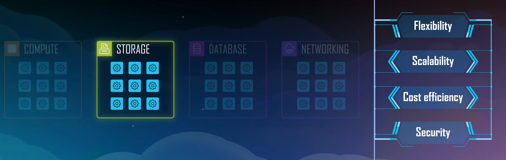

## Différents types de stockage

Pourquoi différents supports de stockage
Tout comme il y a plusieurs supports de stockage dans une entreprise, AWS se doit d'offrir les mêmes services :

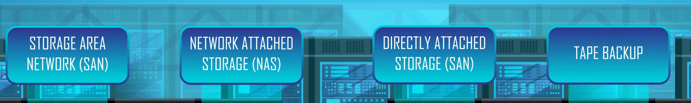

* SAN : stockage area network => réseau de stockage
* NAS: network attached storage => stockage connecté au réseau
* Directly attached storage
* Tape Backup : sauvegarde sur bande

AWS est pleinement conscient que toutes les données ne doivent pas être traitées exactement de la même manière d'où un ensemble de service.
Toutes ces solutions ont le même but : stocker des données. Mais chaque solution apporte des bénéfices et des fonctionnalités différentes.

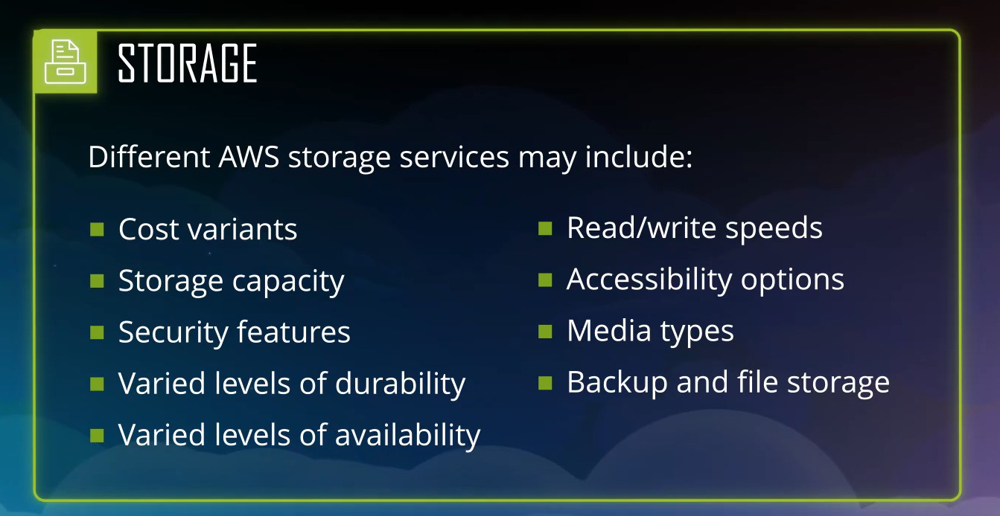

Le stockage de données peut être classé entre 3 grandes catégories:

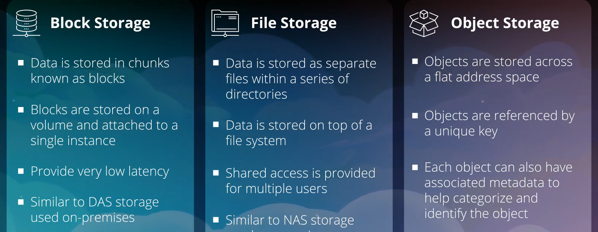

* Block Storage: considérés comme similaire à vos disques directement connectés au sein de votre propre centre de données ; les données sont stockées dans des morceaux appelés block
* File Storage
	* données structurés sous forme fichiers dans des répertoires
	* permet à plusieurs utilisateurs d'accéder aux données
	* peut être associé au système de stockage en réseau 
* Object Storage
	* chaque objet n'est pas conforme à une hiérarchie de structure de données
	* espace d'adressage plat référencé par une une clé unique
## Amazon S3 
* Amazon Simple Service
* certainement le plus utilisé car il peut être adapté à de nombreux cas d'utilisation différente
* s'intègre à de nombreux services AWS différents
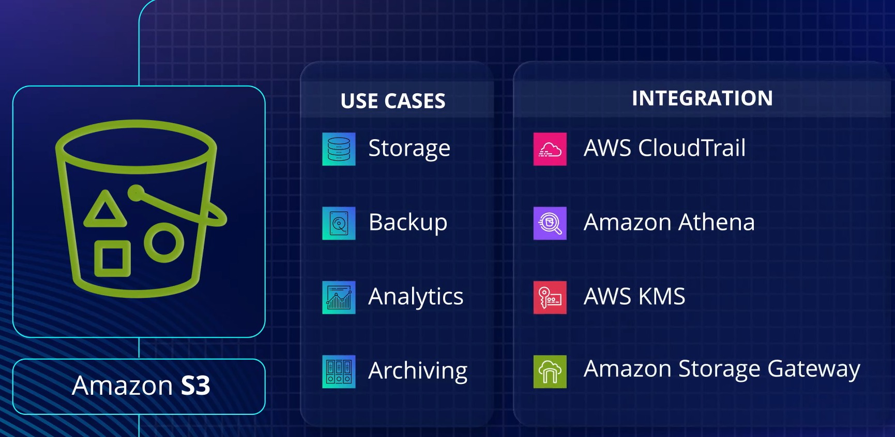

Amazon S3 est basé sur des objets entièrement géré (hautement disponible, durable, rentable accessible)

### service de stockage d'objets
* Amazon S3 est extrêmement évolutif.
* Cependant, il existe des limitations quant à la taille individuel d'un seul fichier qu'il peut prendre en charge : 0 octets la plus petite taille jusqu'à 5 Teraoctets.

* Le service exploite un service service de stockage d'objets ce qui signifie que chaque objet téléchargé n'est pas conforme à une hiérarchie de structure de données comme le ferait un système de fichiers. 
 * Son architecture existe sur un espace d'adressage plat et est référencé par un URL unique
 
 ### service régional
 * en tant que client, il faut spécifier l'emplacement régional dans lequel ces données doivent être placées
 * amazon s3 va alors stocker et dupliquer vos données téléchargées plusieurs fois sur plusieurs zone de disponibilité au sein de cette région pour augmenter sa durabilité et sa disponibilité.

### Durabilité
Le pourcentage de durabilité (99.9999%) fait référence à la probabilité de conserver vos données sans qu'elles soient perdues par corruption, dégradation des données.

### Disponibilité
AWS garantit que la disponibilité d'AS3 est comprise entre 99.5% et 99.9% selon la classe de stockage, permettant l'accès aux données.

###  Bucket - Compartiment
Lors de téléchargement d'objet sur Amazon S3, une structure spécifique est utilisée pour localiser vos données dans l'espace d'adressage plat.

#### nom = unicité
* il faut d'abord définir et créer un bucket (conteneur pour void données)
* le nom du bucket doit être unique pour la région mais aussi par rapport autres buckets S3 ; cela est dû à la structure à plat qui fait qu'un nom de bucket doit être unique
* une fois créer, les données peuvent y être téléchargées.

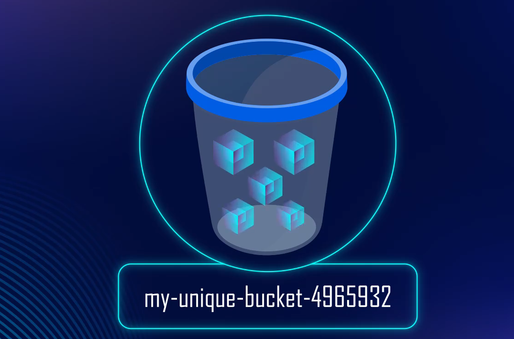

* un compte utilisateur peut avoir jusqu'à 100 buckets

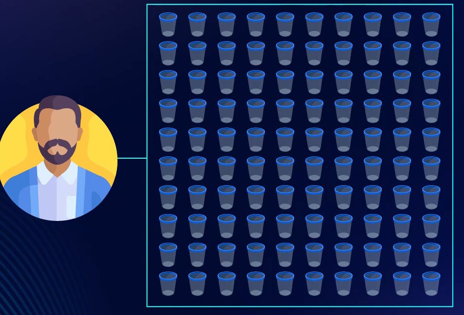

#### 🔑 clé d'objet 
* Tout objet téléchargé dans un bucket reçoit une  🔑 clé d'objet unique pour l'identifier
* Dans un bucket, il est possible de créer des dossiers pour faciliter la catégorisation des objets et facilité ainsi la gestion des données

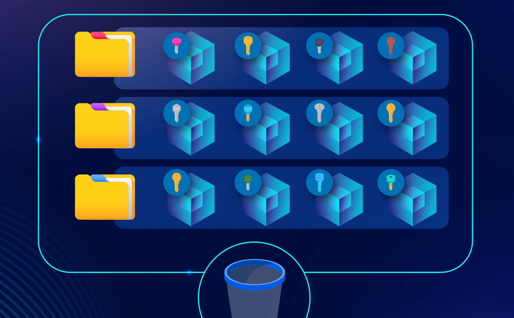

 🎯 Attention: il n'en demeure pas moins que S3 reste un service de stockage objet. En effet, beaucoup de fonctionnalités de S3 fonctionnent au niveau du compartiment et non du dossier spécifique ; la clé unique de chaque objet contient le bucket, tous les dossiers présents ainsi que le nom du fichier lui-même.

### S3 Storage Classes
* Classe de stockage pour l'objet téléchargé.
* classe à sélectionner en fonction des coûts, des fonctionnalités et des performances

### S3 Général

#### S3 Standard
* classe de stockage à usage général : débit élevé, faible latence, accès fréquent aux données
* ssl pour le cryptage des données en transit + options de cryptage lorque les données sont stockées au repos
* peut être déplacés vers une autre classe de stockage moins chère après une période de temps définie (cycle de vie à configurer à la création du bucket) ou supprimer

####  S3 INT
* lorsque l'on ne sait pas avec certitude à quelle fréquence vous devrez accéder aux objets
* s3 va déplacer les objets entre la couche accès fréquent / infrequent access / archive instant access. Les objets seront placés dans la couche supérieure plus chère et en fonction de utilisation ou non seront déplacés automatiquement vers les couches inférieures respectivement (30 jours et 90 jours de non utilisation). Une couche supplémentaire peut être configurée pour déplacer automatiquement les objets qui n'ont pas été accédés pendant 180 jours. Inversement un objet nouvellement accédé de voit déplacé dans la couche supérieure.

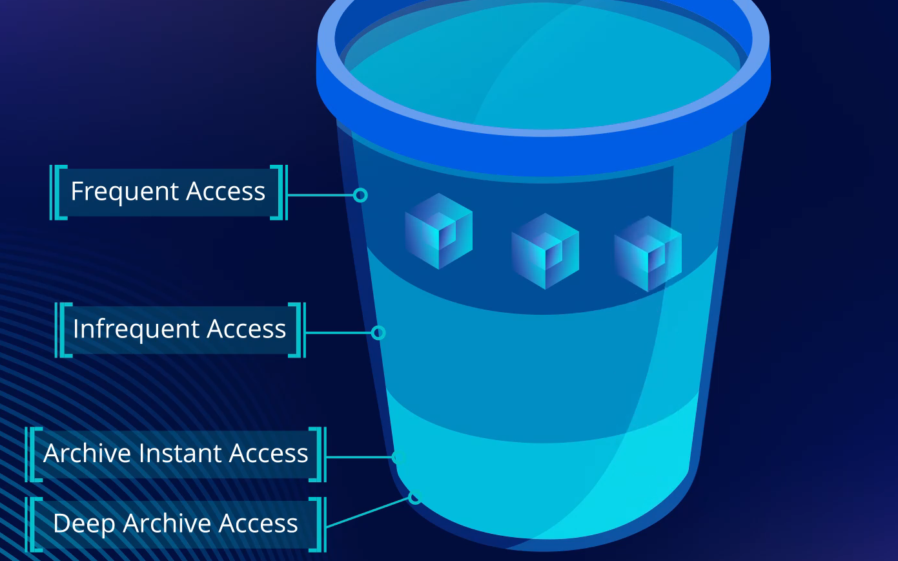

####  S3 S-IA (infrequent access)
* conçues pour des données auxquelles il n'est pas nécessaire d'accéder aussi fréquemment du niveau standard mais offre nénamoins un débit élevé et un accès à faible latence.

#### S3 Z-IA
* S3 une zone, infrequance access
* conçus pour les objets peu susceptibles d'être consultés.
* les objets sont copiés plusieurs fois dans la même zone de disponibilité et non vers une autre zone de disponibilité.
* réduction des coûts de 20 à 30% par rapport à s3 standard

### S3 Glacier

* peut être accéder de manière indépendance au service Amazon S3 mais fonctionne toujours en collaboration étroite avec lui.
* Les classe de stockages S3 Glacier interagissent directement avec les règles de cycle de vie Amazon S3 à la différance qu'elles coûtent une fraction du coût par rapport au stockage des mêmes données dans les classes de stockage S3 non glacier.
* Glacier n'offre donc pas toutes les même fonctionnalités qu'Amazon S3
	* il n'offre pas un accès instantané aux données
	* il offre une solution de stockage durable à long terme extrêmement économique adapté au besoin de sauvegarde et d'archivage à long terme
	* il est capable de stocker tous les mêmes types de données qu'Amazon S3
#### Accès aux données
* L'accès aux données peut prendre plusieurs minutes à plusieurs heures avant récupération
* structure des données est centrée autour des coffres-forts et des archives

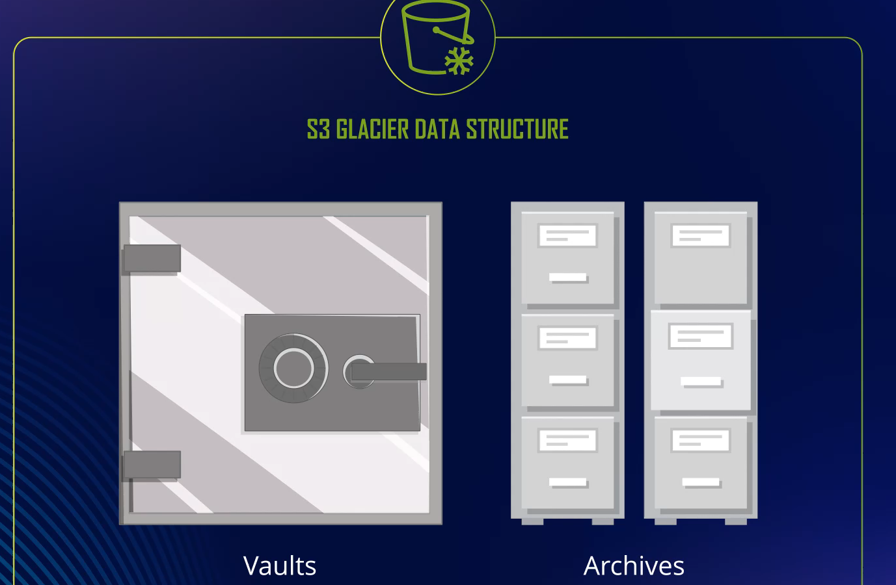
* les buckets et les folders ne sont pas utilisés (utilisés juste pour S3)
* un coffre-fort Glacier sert de conteneur pour les archives glacier. Ces coffres fort sont régionaux donc lors de la création d'un coffre-fort, il sera demandé la région dans laquelle il résidera.
* Dans un coffre fort les données sont stockées sour forme d'archives
* Les archives peut être n'importe quel objet
* il peut y avoir un nombre illimité d'objet dans un glacier

#### console
La console AWS est moins riche que pour Amazon S3 et ne permet que:
* de définir des politiques de récupération de données
* de configurer des notifications d'évènements

#### Envoyer les données
Transférer des données vers S3 glacier est un processus en deux étapes :
* créer un coffre-fort
* déplacer les données dans le coffre-fort à l'aide des API ou SDK
L'autre moyen pour transférer les données est d'utiliser les règles de cycle de vie S3

#### Récupérer les archives
* la récupération se fait via du code, ou API, ou SDK ou AWS CLI.
* il faut créer une tâche de récupération d'archives
* puis demander l'accès à tout ou partie de cette archive

#### Classes Glacier

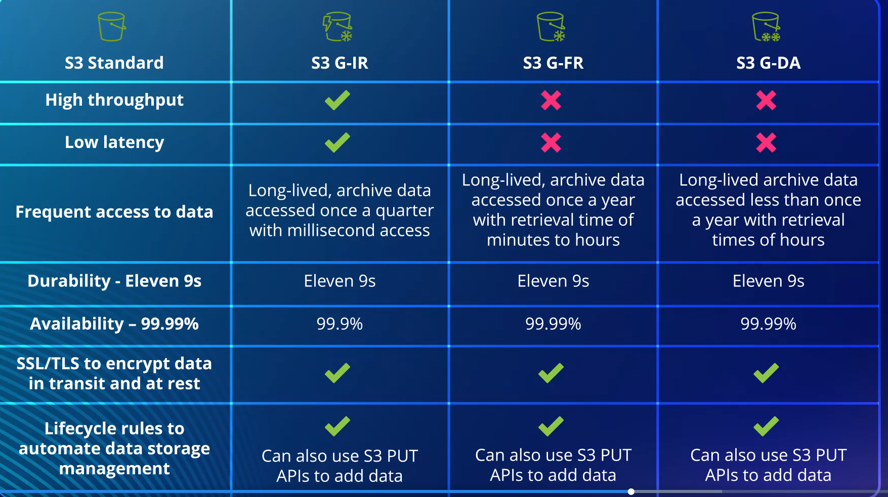

##### S3 G-IR (Instant Retrieval)
* cette classe permet une récupération rapide des données
* pour les données peu fréquemment accéder

##### S3 G-FR (Flexible Retrieval)
* données qui ne doivent être consultées qu'une fois pas an environ
* 3 options de récupération :
	* accélérée pour un besoin urgent (dispo en 5 minutes)
	* standard : non disponible avant 3 à 5 heures
	* bulk : pour récupérer des pétaoctets entre 5 et 12 heures

##### S3 G-DA (Deep Achive)
* stockage d'archive à long terme
* secteur de la finance ou de la santé : pour les documentations réglementées devant être conservées pendant longtemps
* 2 options de récupération
	* une de 12h
	* l'autre de 48h

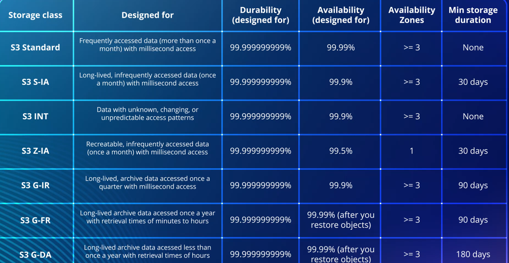