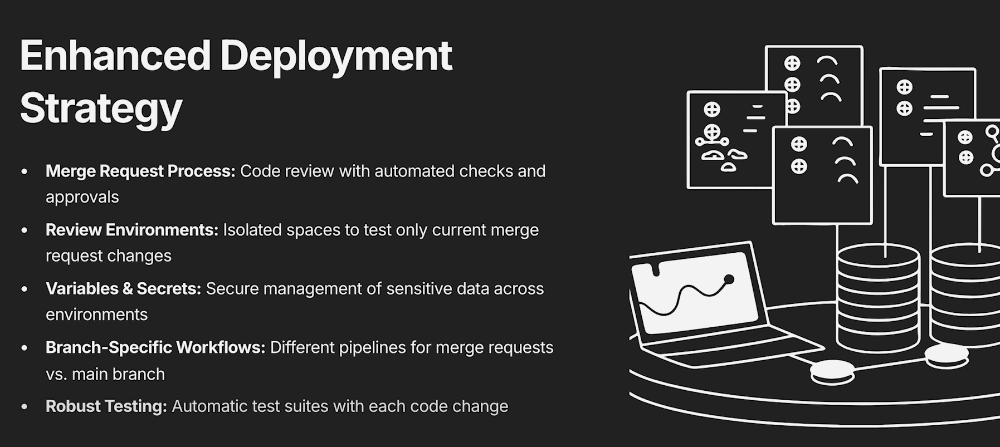

## Account
login/pasword
```
netlify2024
```

est une plateforme cloud pour le déploiement sans serveur ce qui signifie que nous n'avons pas besoin de définir ou maintenir un serveur.
Process de déploiement facile qui le rend parfait pour les sites web statiques à faible trafic



## Deploy

Pour déployer l'application sur netlify, on peut le faire
* manuellement en uploadant un zip
* en utilisant le client Netlify CLI qui permet d'interagir avec Netlify en tant que service et créer un déploiement

### Netlify CLI
* permet à Gitlab d'interagir avec Netlify
* permet de se connecter
* permet d'uploader des fichiers

#### Installation
```
npm install -g netlify-cli
```

#### yaml
```yaml
netlify:
  image: node:22-alpine
  stage: .pre
  script:
    - npm install -g netlify-cli@20.1.1
    - netlify --version
```

### variable d'environnement
Il faut indiquer à Netlify quel site nous souhaitons déployer et pour celà il faut utiliser des variables d'environnement.
Ces variables doivent être positionner sur la pipeline, pour que GitLab via Netlify.CLI puisse interagir avec le site.
Pour configurer Netlify CLI (cela est valable pour les outils clients en général - concept clé de DevOps), et pour pouvoir utiliser le client Netlify, il faut fournir deux variables d'environnement: 

- `NETLIFY_AUTH_TOKEN` - an access token to use when authenticating commands. Keep this value private.
- `NETLIFY_SITE_ID` - override any linked project in the current working directory.

Le client NetLify recherchera automatiquement ces variables d'environnement lors du déploiement du projet. Elles doivent donc être défini sur le pipeline.
SiteId
```yaml
Le site id est à récupérer au niveau de NetLify sur la configuration du projet
siteId = b47ed375-4921-45ce-bd67-8e1caadf0408
```
### authentification

#### Principe
Pour pouvoir déployer sur Netlify le SITE_ID ne suffit pas mais il faut aussi s'identifier sinon n'importe qui pourrait déployer avec le client.
Le client n'utilisera pas de credentials au sens login/mdp mais plutôt un jeton d'autorisation qui donnera les droits nécessaires pour les actions spécifiques requises. C'est une sorte de mot de passe temporaire qui permet d'accéder au compte mais qui ne permet pas de se connecter sur le site lui même.

#### Process
Il faut générer un token dans l'application Netlify et fournir ce token à GitLab pour que ce dernier via le client Netlify puisse se connecter et faire les opérations appropriées.


### deploy Prod

Il faut utiliser la commande suivante pour déployer une version sur un environnemet de PROD sur Netlify.
```yaml
- netlify deploy --prod --dir build
```
