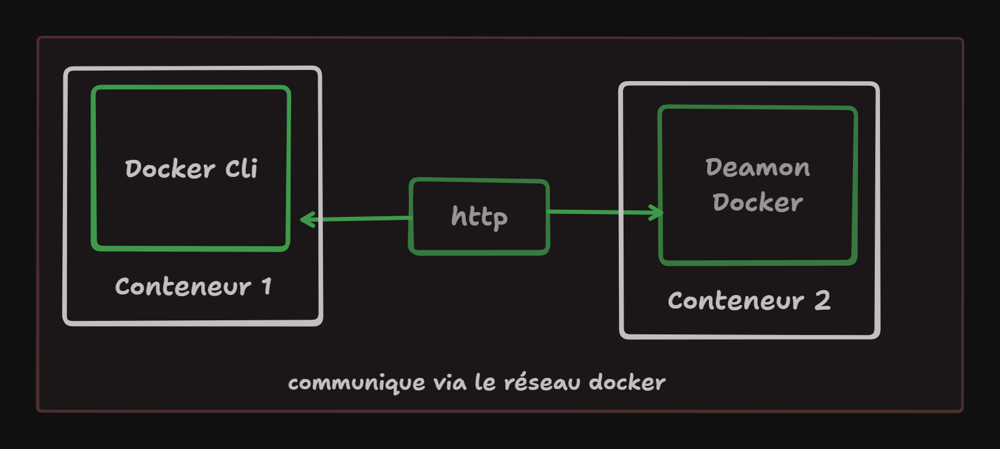

## Commande Système

Pour pouvoir utiliser certaines commande système il faut parfois les installés via le package manager

### apk
alpine package manager

### apt
### Explication :
- `apt-get update` → récupère la dernière liste des paquets depuis les dépôts Ubuntu.
- Sans cette commande, la liste locale des paquets est **vide ou obsolète**, donc `apt` ne connaît pas `curl` ni aucun autre paquet.
```yaml
> apt-get update && apt-get install -y curl ## `-y` permet d’auto-confirmer.
```
### echo
``` yaml
> echo $NETLIFY_SITE_ID ## --> afficher une variable d'environnement
> echo "Deploying to site id $NELTLIFY_SITE_ID"
> echo "Deploying to site id ${NELTLIFY_SITE_ID}"

> echo 'Deploying to site id $NELTLIFY_SITE_ID' 🟥 ## --> affiche une chaine de caractère
```

### curl
```yaml
> apk add curl
> curl 'https:// ... /' | grep 'GitLab'
```

### service
```yaml
> service nginx start | status 
> service apache2 start | status

```

### logs
```yaml
## regarder les logs d'apache
> tail -f /var/log/apache2/access.log
>tail -f /var/log/apache2/error.log
```

### lister les ports ouverts
```yaml
## à installer au niveau du conteneur
> apt update && apt install -y net-tools
> netstat -tulnp

## Erreur possible: si l'heure est désynchronisé
> date
> apt update && apt install -y tzdata
> dpkg-reconfigure tzdata ## => choisir la bonne timezone
## si l'erreur persiste relancer le conteneur
```

## Docker et GitLab
### docker executor vs shell executor

* shell executor : installer tous les outils nécessaires au build du projet sur le runner Gitlab ; c'est une approche manuelle qui n'est pas conseillée car le runner peut être utilisé pour construire et tester plusieurs applications ; il faudrait alors installer tous les versions nécessaire pour chacun des outils (une application pouvant nécessité NodeJs v22 alors qu'une autre NodeJs v18). 
  Il faut le voir comme une VM où tout doit être installée manuellement.


* utilise Gitlab-Runner et docker pour lancer la tâche
	* docker : container contenant tout ce dont a besoin une application pour être construite, testée et exécutée.
	* il suffit de spécifier ce dont on a besoin et docker s'en charge ; si tout est bien spécifier le container aura tous les éléments pour le besoin souhaité.
	* le runner utilisera le container le temps de l'opération, les commandes souhaitées seront exécutées et le container sera détruit.
  Il faut le voir comme une VM ou docker est installé et fait tourner 1 ou n conteneurs. Il sera donc important ici, de construire une image docker permettant de créer un conteneur personnalisé et optimisé pour la tâche à réaliser.

___
### docker image
* Pour construire son pipeline, il convient de récupérer une image docker. Cette dernière devra être de préférence la plus légère possible. Il faut donc privilégier les images **alpine** et **slim**, si elles existent et si elles sont compatibles avec le projet.
* Les images alpines sont de tailles réduites et se téléchargent donc plus rapidement au cours de l'exécution de la pipeline.
* L'inconvénient c'est qu'il manquera peut-être certains outils sur cette image plus light.
* Il faut aussi et surtout regarder la doc officiel de l'outils ou framework que l'on veut utiliser.
* Tag: une version/un identifiant qui spécifie la version de l'image à récupérer.

## Architecture Docker



Pour construire une image docker, on va avoir besoin de ces deux composants:
* docker client
* Deamon docker  
Le deamon docker est le docker-engine qui s'occupe des tâches lourdes (construction d'image ou l'exécution du conteneur).
Le docker client permet de communiquer avec le docker-engine.


## Configuration de la tâche GitLab :
L'image docker par défaut apporte la partie cliente.
Le docker deamon doit être démarré sous la forme d'un service (DInD / Docker in Docker).
Le client va utiliser le réseau pour communiquer avec le deamon docker.
docker --version : info sur le client docker
docker version: info plus détaillée sur les composants docker

### Service
Avec cette notion de service, il est possible de démarrer toute sorte de service :
* base de données
* web application
* serveur de cache
* api web
* message queue

Il est possible d'interagir avec le service à partir du pipeline
Toutes les commandes positionnées au niveau de la partie script (dans le yaml) sont exécutées dans l'image ; les services sont accessibles via le réseau docker permettant la communication entre les conteneurs.
GitLab rend donc cette configuration de service plus simple.

Les services démarrent avant le job et sont arrêtés une fois le travail terminé.

#### Version des images : attention
* Attention à bien utiliser une version de l'image, sinon il y a un risque d'utilisation d'une nouvelle version de l'image et des librairies/logiciels utilisés
* il faut utiliser la version majeure au moins : 27.4.1 => 27
* il en va de même pour les services
#### sécurité
* Il n'est pas conseillé de faire tourner les 2 services dans un même conteneur
* le service docker-engine doit s'exécuter avec des permissions élevées qui nécessitent un mode privilégié 
* le conteneur doit  donc avoir plus de permission qu'un conteneur normal  
* le conteneur qui fait tourner le docker-engine a en fait plus de pouvoir sur la machine hôte, ce qui est préoccupant si tout devait se passer sur le même conteneur.