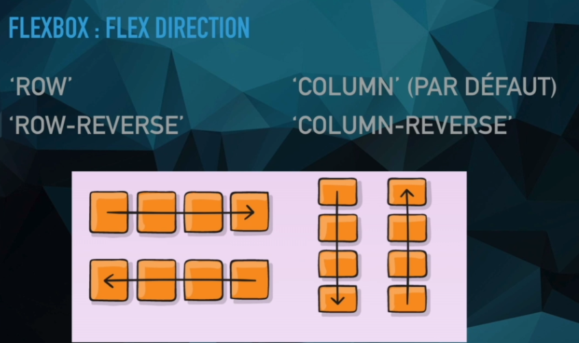
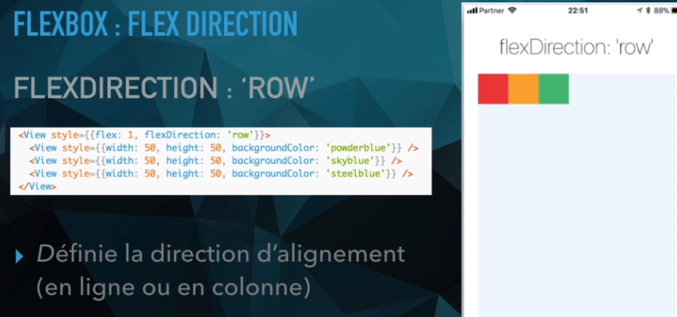
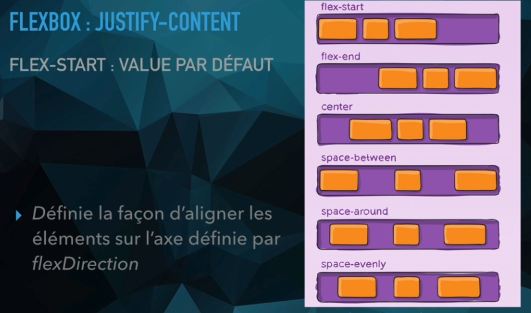
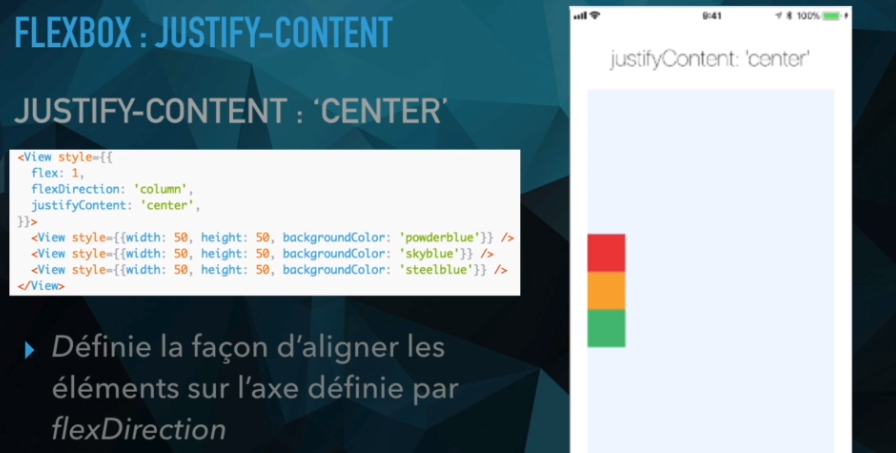

# style

[retour](./../../index-html.md)

## display

- block : occupe la ligne entière
- inline-block: est positionnable sur la ligne en gardant les propriétés block
- inline : met tous les éléments les uns à la suite des autres sur la ligne sans tenir compte des witdh
  - attention : cette propriété laisse souvent de la place au dessus et en dessous (pour le texte,...)

## position

- static : c'est la valeur par défaut quand elle n'est pas précisé.
  - affiche l'élément dans le flux de manière static
- relative : permet d'utiliser les propriétés top/bottom/right/left
  - permet de positionner l'élément par rapport à sa position dans le flux static
  - n'impact pas la postion des autres éléments siblings
  - permet d'utiliser la propriété "absolute" sur les éléments children
- absolute: permet de postionner un élément dans l'espace d'un élément parent "relative"
  - ne dispose donc pas de son propre espace dans le flux d'affichage

## couleur et opacity

- couleur : hexadecimal: #RRJJBBOO
  - RR: rouge
  - JJ: jaune
  - BB: bleu
  - OO: composante du niveau de transparence :
    - FF: pas de transparence
    - 00: 100% transparent
    - opacity => C0
  - rgba(0,0,0,0.2) => noir avec transparence

## table td|th et alignement du text

- text-align : aligne le texte horizontalement
- vertical-align : aligne le texte verticalement dans la cellule
  - top: aligne texte vers le haut dans tous les cellules
  - bottom: aligne le texte vers le base dans tous les cellules

## table tr

- min-height: ne fonctionne pas sur table
- height :
  - se comporte comme min-height - le moteur s'autorise à déborder.

## Image : object-fit

- object-fit: cover
  - à utiliser quand on met une taille fixe sur la hauteur de l'image
  - l'image ne se rezise pas et l'image n'est donc pas déformer
  - C'est juste que l'on perd du contenu à l'affichage

## Puce avec numéro : box-sizing: border-box;

- problématique :
  - mettre une hauteur et largeur sur la puce
  - mettre un padding pour centrer le texte mais s'ajoute à la hauteur
  - on a donc une taille différente entre hauteur et largeur
- permet de calculer la taille différemment et d'inclure le padding dans la taille totale

## overflow

- overflow : le fait de dépasser du conteneur
<pre>
- : {
overflow: auto; // adpate la taille du conteneur au contenu
}
</pre>

## scss

<pre>
CSS avec des supers pouvoirs

Avec React: 
yarn add node-sass
</pre>

## Flex-Box

<pre>
* <b>flex</b> 
	* permet de mettre une valeur pour une occupation de l'espace.
	* plus cette valeur est grande, plus la place occupé par
		le composant est grande
* <b>flexDirection </b> 
	* valeur par défaut : column
	* valeurs :
		* row / 
		* row-reverse / 
		* column / 
		* column-reverse
</pre>

<pre>
* <b>justifyContent </b>:
	* valeur par défaut : flex-start 
	* valeurs
		* center / 
		* flex-end / 
		* space-between : les éléments essaient de s'éloigner le plus des uns des autres
		* space-around : espace entre le début et fin de container
		* space-evenly : toutes les distances sont égales
</pre>

<pre>
* <b>alignItems</b>  
	<i>principe</i> : alignement sur l'axe perpendiculaire à l'axe principal (flexDirection)
	* flex-start / 
	* center / 
	* flex-end
</pre>
