[retour](./index-certificats.md)

## Enjeu SSL / TLS

<pre>
* Chiffrer : cacher les informations afin que personne n'identifie ces informations
* Identifier : s'assurer que l'ordinateur avec lequel on cummunique est bien le bon
</pre>

## Chiffrement

### Type de Cryptographie

#### Cryptographie asymétrique

##### Principe

<pre>
* échange entre un client et un serveur.
* le serveur possède
	* une <b>clé publique</b>
	* une <b>clé privée</b>
	
1- <i>Client vers Serveur</i>
* La clé publique est envoyée au client pour chiffrer les infos
* La clé privée est utilisée par le serveur pour déchiffrer les infos chiffrées avec la clé publique

2- <i>Serveur vers Client</i>
* Le serveur chiffre avec sa clé privée 
* le client déchiffre avec sa clé publique

<b>Problème</b>
	* Seul la sécurité est garantie dans le sens Client vers Serveur
		* car seul la clé privée connu simplement du serveur peut déchiffrer
	* Dans l'autre sens, 
		* toute info envoyée par le serveur peut être déchiffrer 
			par tous ceux qui possèdent la clé publique
</pre>

#### Cryptographie symétrique

##### Principe

<pre>
Plutôt que d'avoir deux clés comme dans la crypto asymétrique :
	* seul <b>une seul clé indentique</b> est partagée entre le client et le serveur
	* clé utilisé pour <b>chiffer</b> et <b>déchiffrer</b> les informations
	* système plus performant car il permet de chiffre plus rapidement
	
<b>Problèmatique : Comment échanger cette clé</b>
1- le <b>navigateur</b> entre en <b>communication</b> avec le <b>serveur</b> en indiquant les paramètres suivants
	* clef : type de clé qu'il supporte (RSA / DH-RSA / PSK)
	* cipher : algorithme de chiffrage
	* hash : permet de vérifier l'intégrité d'un message
		* (HMAC-MD5)
2- le <b>serveur</b> établit alors ses <b>priorités</b> :
	* je veux utiliser le couple [cle / cipher / hash]
	* de plus, le serveur enovie une <b>clé publique</b> au client
		* pour qu'il puisse chiffer tous les infos à envoyer au serveur
		
3- génération d'une clé <b>pré-master-secret</b> par le <b>client</b>
	* le client et le serveur à ce stade se sont mis d'accord sur les propriétés de la clé
	* le client génère une clé pre-master-secret qui sert à générer la clé symétique
	* le pré-mater-secret est <b>chiffré</b> avec la <b>clé publique</b> 
	* le pré-mater-secret est <b>envoyé au serveur</b>
	
4- <b>serveur</b> : génération de la clé symétrique
	* le serveur déchiffre le pré-master-secret avec sa <b>clé privée</b>
	* les deux ont le pré-master-secret et peuvent alors obtenir la <b>clé symétrique</b>	

<b>Problème</b>
	* Ce système permet de remédier au problème de chiffrage
	* <b>Ne résouds pas</b> le <b>problème d'identification</b>, car n'importe qui peut 
		* générer une clé publique et privée
		* donc se faire passer pour le serveur
	
</pre>

##### Schéma des clé symétrique

<pre>
* voila les infos que je veux envoyé :
	* infos que je souhaite postées
	* url
	* header
	
<i>voir schma ci-dessous</i>	
</pre>

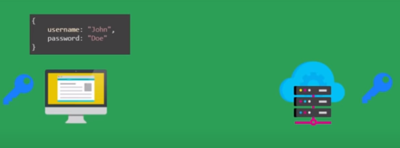

<pre>
* le navigateur 
	* utilise la clé pour chiffrer le message
	* envoie le message au serveur

<i>voir schemas ci-dessous</i>
</pre>

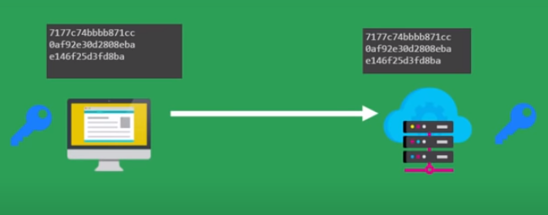

<pre>
* le serveur utiliser :
	* la clé symétrique pour déchfiffer le message
	* obtenir les infos demandées par le client
<i>voir schema ci-dessous</i>
</pre>

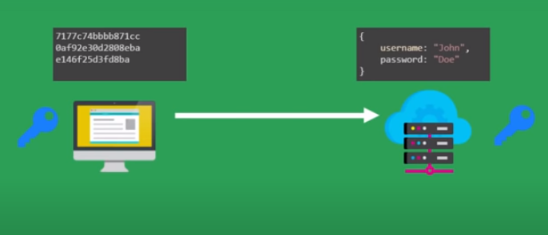

<pre>
* le serveur utilise un langage de programmation pour générer la réponse au client
	* génération de la ressouce demandées : html, image, ...

<i>voir schema ci-dessous</i>
</pre>

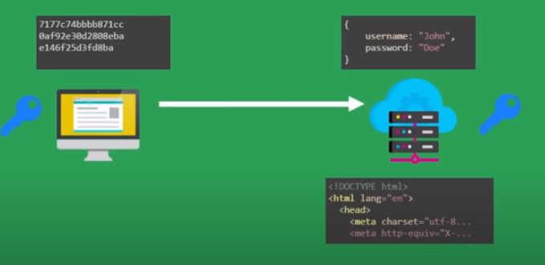

<pre>
* le serveur utilise :
	* la clé symétrique pour chiffrer les données

<i>voir schema ci-dessous</i>
</pre>

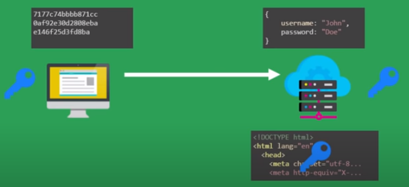
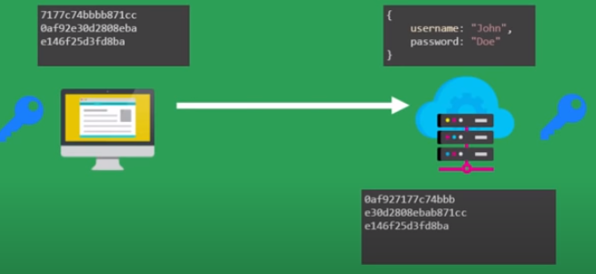

<pre>
* le serveur envoie les données chiffrées aux clients

<i>voir schema ci-dessous</i>
</pre>

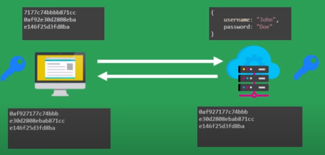

<pre>
* le client :
	* recoit les données chiffées 
	* utiliser la clé symétrique pour déchiffrer
	
<i>voir schema ci-dessous</i>
</pre>

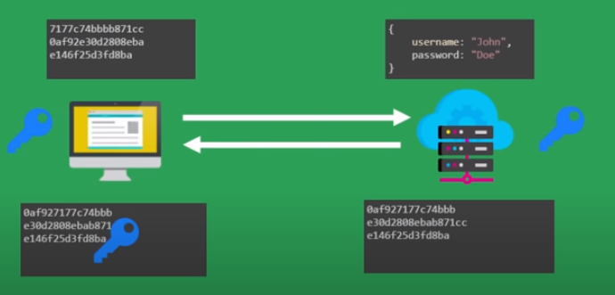
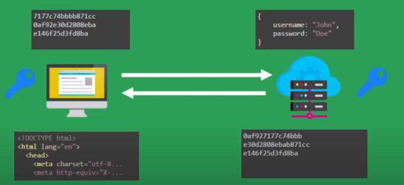

## Indentification

### Certificat

#### définition

<pre>
* <b>certificat </b> : on peut imaginer cela comme une <b>carte d'identité</b> pour ton serveur
	* contient diverses informations
	* permet de s'assurer que vous êtes bien la personne que tu prétends être
</pre>

#### génération

<pre>	
* <b>autorité de certification (AC)</b> : comme pour une carte d'identité où on va en mairie,
	on passe par une autorité de certification capable de délivrer des certificats

* <i>mode opératoire</i>:
	1- envoie d'informations : domaine, nom, email, .... + <b>clé publique</b>
	2- autorité de certification
		* fait des vérifications
		* envoie alors un certificat qui contient :
			* votre clé publique
			* les infos communiqué
			* une <b>signature</b> : combinaison [clé publique  + infos]
				<b>chiffré par la clé privée de l'autorité de certification</b>
	<b>Important</b> : 
		* Le seul moyen pour vérifier le certificat est alors d'utiliser 
			<b>la clé publique de l'autorité de certification</b>
			
</pre>

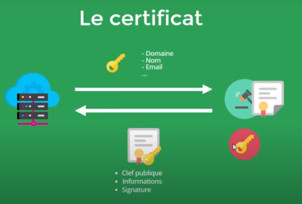

#### Certifcat intermédiaire et racine

##### Certificat intermédiaire

<pre>
* L'autorité de certification envoie en général
	* le certificat
	* plus son certificat à lui appelé : <b>certificat intermédiaire</b>
</pre>

##### Certificat racine

<pre>
* Problème : de nombreux organismes délivrent des certificats
* il a fallu définir des autorités de certification racine limités et reconnue comme de confiance
* Ce sont eux qui donnent des certificats à d'autres organismes (autorités de certificat intermédiaire)
	qui vont délivrés des certificats à des individus ou organismes

* Dans le schéma ci-dessous:
	* AC intermédiaire renvoie
		* son certificat
		* le certificat du serveur demandé à être certifié
	
	* le certificat de l'AC intermédiaire a été établit par une AC racine

<i>voir schéma ci-dessous</i>
</pre>

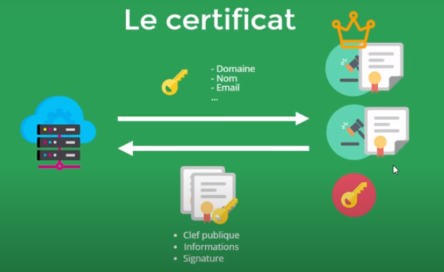

#### Principe de fonctionnement : chaine de confiance

<pre>
<i>Scénario</i>
* le serveur envoie au client : 
	* son certificat : certificat validé par une AC intermédiaire
	* certificat de l'AC intermédiaire
</pre>

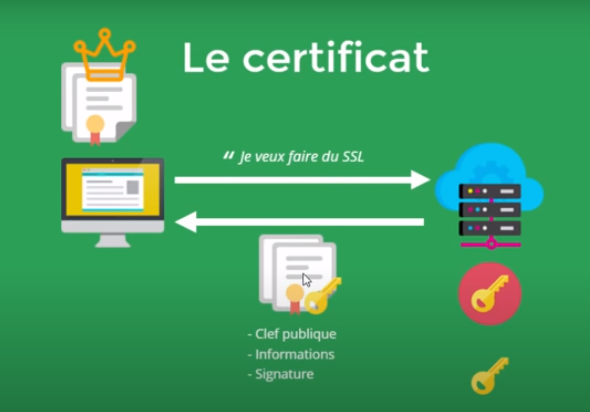

<pre>
<b>Comment fait alors le navigateur pour valider les certificats ?</b>

<i>Note:</i> 
* Le navigateur est équipé par défaut des clés publiques des différentes autorités de certification racine. 
* Il pourra alors utiliser ces clés publiques pour vérifier la signature du certificat intermédiaire	
	
1- <b>validation du certificat intermédiaire</b> avec <b>la clé publique</b> de l'<b>AC racine</b>
	* le navigateur utilise alors la clé publique de l'autorité racine pour vérifier la validité du certificat intermédiaire 
	* utilisation de la clé publique pour déchiffer la signature : 
		* doit retrouver les mêmes infos chiffrées avec la clé privée de l'autorité racine

	* Conclusion pour le navigateur
		* le <b>certificat intermédiaire</b> est un certificat <b>de confiance</b>
			car j'arrive à le déchiffrer avec la clé publique de l'AC racine

2- <b>validation du certificat</b> avec la <b>clé publique</b> de l'<b>AC intermédiaire</b>
	* le navigateur utilise alors la clé publique de l'AC intermédiaire pour valider le certificat
	* utilisation de cette clé publique pour déchiffrer la signature :
		* doit retrouver les mêmes infos chiffrées avec la clé privée de l'autorité de certification
		
	* Conclusion pour le navigateur
		* le <b>certificat du serveur</b> est un certificat <b>de confiance</b>
			car j'arrive à le déchiffrer avec la clé publique d'un autre certificat de confiance
	
</pre>

#### Tentative d'usurpation d'identité

<pre>

<i>Scénario</i> :
* un <b>pirate</b> prend le certificat et <b>modifie</b> la clé publique

* le <b>problème</b> c'est que la <b>signature</b> ne va plus correspondre
	* utilisation de la clé publique de l'AC pour déchiffrer
	* les infos (notamment clé publique) ne vont plus correspondre
	
* le seul moyen d'avoir une signature correcte, c'est d'avoir la clé privée de l'AC (intermédiaire)
	* ce qui est impossible
	
</pre>

#### Handshake

<pre>
* handshake : 
	* étapes mises en place avant le premier échange de données 
	* serrage de main qui se fait avant la première connection
	* but : établissement de la clé symétrique pour échanger les données de manière sécurisée	
	
1- Le client
	* informe le serveur qu'il souhaite utiliser le protocole SSL ou TLS 
	* indique quelle version du protocole il va utiliser 
	* ainsi que les systèmes de chiffrement qu'il supporte

2- Le serveur 
	* envoie au client son certificat qui contient sa clé publique
	* indique au client quel système de chiffrement il a choisi parmi les choix proposés

3- Le client 
	* tente alors de déchiffrer la signature numérique du certificat (ou du certificat intermédiaire) 
		à l'aide des clés publiques des AC intégrées par défaut dans le navigateur.
	* Si le certificat intermédiaire est jugé de confiance, on utilise sa clé publique pour vérifier le certificat du serveur.
	* Si la signature du certificat intermédiaire, ou du certificat du serveur n'est pas déchiffrable 
		alors le navigateur affichera une alerte comme quoi le certificat n'est pas valable et 
		l'utilisateur peut choisir de continuer à communiquer avec ce serveur malgré tout ou de s'arrêter là.

<i>voir schéma ci-dessous</i>
</pre>

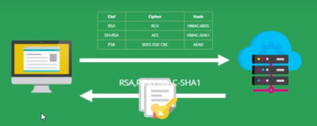

<pre>
4- Le client
	* génère alors une clé pemaster secret 
	* et la chiffre avec la clé publique reçue à l'étape 2. 
	* Il envoie alors cette clé chiffrée au serveur 
	* le <b>client</b> utilise le <b>pre-master secret</b> pour générer la <b>clé de session symétrique</b>.

5- le serveur reçoit le pre-master-secret

<i>voir schéma ci-dessous</i>	
</pre>

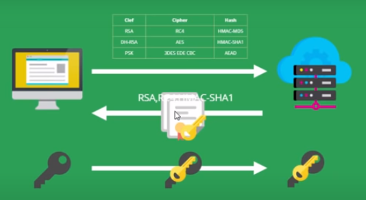

<pre>
5- Le serveur 
	* déchiffre le pre-master-secret à l'aide de sa clé privée 
	* utilise le <b>pre-master-secret</b> aussi pour générer la <b>clé de session symétrique</b>

6- Le serveur et le client disposent alors maintenant qu'une clé symétrique qui permettra de chiffrer les futurs échanges.
	
7- Une fois la connexion terminée (après un temps d'inactivité prédéfinie ou par l'envoi d'un signal de déconnexion) 
	* le serveur va révoquer la clé de session. 
	* et il faudra alors repasser par toutes les étapes précédentes pour entamer une nouvelle connexion.	
	
<i>voir schéma ci-dessous</i>
</pre>

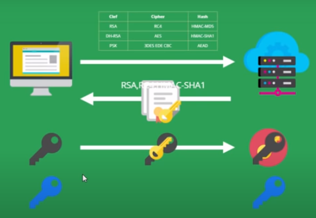
