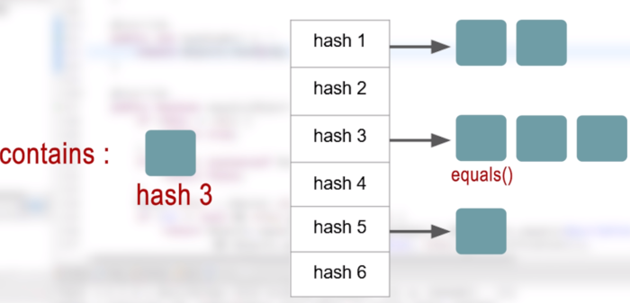
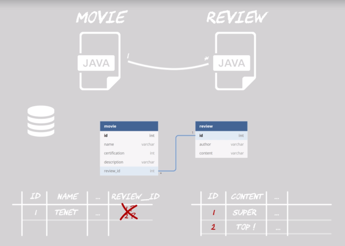
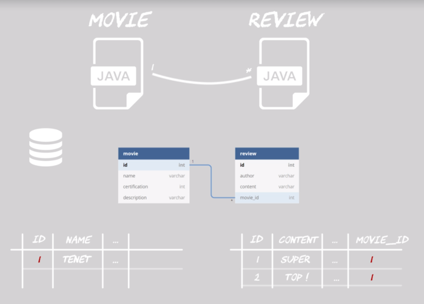
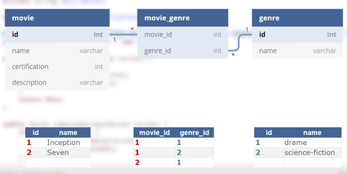
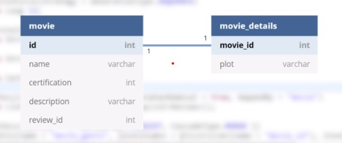

# HIBERNATE - Mapping - Annotations

[home](../index.md)

# Annotation

### mapping implicit
<pre>
* sans annotation sur les attributs, hibernate regarde les attributs pour les mapper en base
* tout ce qui est implicit peut être configuré
</pre>


## @Entity
<pre>
* annotation JPA: indique une classe à persister ou à mettre dans le contexte de persistence
</pre>

## @Id
### Note
<pre>
* la place des annotations est importantes
    * sur les attributs (FieldAccess)
    * sur les getters (GetterAccess)
* hibernate regarde ces annotations pour mapper les attributs en base
    FieldAccess: hibernate regarde sur les attributs
    GetterAcess: hibernate regarde sur les getters
* Bonne pratique : mettre les annotations sur les attributs
    @ID sur le champ ID plutôt que sur GETID()
    Sinon chaque getter (??) qui commence par un "get" entraine un mapping
    sur la base de données
</pre>

### @GeneratedValue
<pre>
* représente la façon dont l'id est généré
* il faut utiliser la Sequence si possible car c'est la plus performante
</pre>

#### SEQUENCE
<pre>
SEQUENCE : 
    * utilise une séquence en base de données
    * la séquence est décorrélée de la table
    * L'appel à la séquence est atomique et hors transaction
    * Si la transaction échoue et déclenche le rollback, la valeur de la séquence aura augmenté
</pre>

##### hibernate_sequence
<pre>
* Par défaut hiberante tentera d'utiliser la sequence "hibernate_sequence"
* il faut donc la créer au préalable au niveau du SGBD
</pre>

```
CREATE SEQUENCE public.hibernate_sequence INCREMENT 1 START 1 MINVALUE 1;
```

```
  @Id
  @GeneratedValue(strategy = GenerationType.SEQUENCE)
  private Long id;
```

##### @SequenceGenerator
<pre>
* Quand c'est possible, utiliser une séquence custom par entité.
</pre>

```
@SequenceGenerator(name="seq_id", sequenceName = "seq_utilisateur", allocationSize = 1)
public class Utilisateur {

    @Id
    @GeneratedValue(strategy = GenerationType.SEQUENCE, generator = "seq_id")
    private Long id;
```

```
@Entity
public class User {
  @Id
  @GeneratedValue(generator = "user_id_seq", strategy = GenerationType.SEQUENCE)
  @SequenceGenerator(
      name = "user_id_seq", 
      sequenceName = "user_id_seq", 
      allocationSize = 50
  )
  private Long id;
}
```

#### IDENTITY
<pre>
IDENTITY : 
    * Similaire à la séquence : mécanisme de génération est associé à la table
        et pas disponible sur toutes les bases
    * à utiliser sur MYSQL qui n'a pas le mécanisme de séquence
</pre>

#### TABLE
<pre>
TABLE : 
    * Très peu utilisé
    * Hibenate va créer une table pour la génération de l'id
</pre>

#### AUTO
<pre>
AUTO : 
    * Hibernate choisit en fonction de la base de données
</pre>

#### @Transient
<pre>
* pour ne pas mapper un attribut
</pre>

## Enum and Converter

### @Enumerated: Ordinal ou String
<pre>
Mode: 
    * EnumType.Ordinal : stocke en base l'ordre dans l'Enum
    * EnumType.String : stocke en base le nom de l'Enum

</pre>
<pre>
    // Code 
    @Enumerated(EnumType.STRING)
    private Certification certification;
</pre>

### Converter

####  Définition
<pre>
* le but du converter est de convertir la valeur stockée en base dans une énumération
* pour mapper un type non standard
* la conversion s'implémente dans les deux sens
* <b>IMPORTANT</b> : si un converter est mis en place sur un attribut de type énumération
    l'annotation @Enumerated n'a plus lieu d'être
</pre>


#### Exemple

* Exemple d'énumération, candidate à un converter:

<pre>
    TOUT_PUBLIC(1, "Tout public"),
    INTERDIT_MOINS_12(2, "Interdit au moins de 12 ans"),
    INTERDIT_MOINS_16(3, "Interdit au moins de 16 ans"),
    INTERDIT_MOINS_18(4, "Interdit au moins de 18 ans");

    private Integer key;
    private String description;
</pre>


```
// autoApply=true indique que, dès qu'une entité du modèle a un attribut Certification
// hibernate applique le converter
@Converter(autoApply = true)
public class CertificationAttributeConverter implements AttributeConverter<Certification, Integer> {

    @Override
    public Integer convertToDatabaseColumn(Certification certification) {
        return certification != null ? certification.getKey(): null;
    }

    @Override
    public Certification convertToEntityAttribute(Integer dbData) {
        return Stream.of(Certification.values())
                     .filter(certif -> certif.getKey().equals(dbData))
                     .findFirst()
                     .orElse(null);
    }

}
```

#### Config
<pre>
* ajouter le converter au niveau du package to scan de l'entity manager
    
    em.setPackagesToScan("com.hibernate4all.tutorial.domain",
        "com.hibernate4all.tutorial.converter");
</pre>

### Bonne pratique
<pre>
* La bonne pratique, c'est d'avoir un entier stocké en base et dans le code, une
    énumération qui fait le lien entre les entiers et les valeurs de l'énumération
    ==> Converter
</pre>

## Equals / HashCode / toString

### Problématique
<pre>
* on implémente equals/hashcode pour de bonnes raisons :
    * comparer des entités avec des entités transientes/détachées
    * comparer des entités avec des références
    * utilisation des entités dans un Set.

* si non redéfinit:
    * java compare les objets sur leur idenitifiant java
    * ne pas prendre en compte les assocations:
        * déclenche un lazyException (erreur technique) en plus de 
          l'erreur fonctionnelle que cela représente

* avec redéfinition : 
    * privilégié un id fonctionnel qd c'est possible.
    * toutefois attention, car quand on manipule une reference,
        c'est l'id qui est remonté.    
</pre>

[identité des objets](https://docs.jboss.org/hibernate/stable/core.old/reference/fr/html/persistent-classes-equalshashcode.html)

### Défintion

#### id fonctionnel
<pre>
* Un id fonctionnel est caractéristique
* il doit impérativement être non null, immuable et unique
</pre>

#### hash

<pre>
<b> définition </b>:

* un hashSet associe un objet à une adresse
* plusieurs objets peuvent avoir la même adresse
* adresse = hashCode de l'objet

<b> problèmatique </b>:

* L'état des entités ne devraient pas influencer le résultat des méthodes equals / hashcode

* Que se passe-t-il quand on fait un Set.contains(entity) ?
    * hashset va voir à l'adresse donnée par le hashcode de l'objet
    * utilise equals pour comparer l'entité à chaque objet préent
        à cette adresse

* <b>explication : </b> une entité transiente que l'on met dans le set est 
    renseigné avec un hash. Si l'entité est persisté, son hash va changer,
    et l'entité ne sera plus connu du Set, en tout cas pas à la nouvelle adresse
    généré par le nouveau hash.
</pre>


### Règle
<pre>
Règle 1:
* Quand une entité a un identifiant fonctionnel, il faut s'appuyer dessus
  pour implémenter les méthodes

* Il faut donc repérer les entités avec et sans id fonctionnel.
  C'est ce qui permet d'écrire les equals et hashcode

Règle 2:
* Evitez les entités associées dans les méthodes toString(), equals() et hashCode()
</pre>

### Implémenter equals / hashCode

#### implementation avec un identifiant fonctionnel

* name est un identifiant fonctionnel sur l'entité GENRE

```
    @Override
    public boolean equals(Object o) {
        if (this == o) return true;
        if (!(o instanceof Genre)) return false;
        Genre other = (Genre)o;

        // ATTENTION : comment gère-t-on la comparaison avec une référence ?
        if (other instanceof HibernateProxy && this.getId() != null && other.getId() != null) {
            return Objects.equals(this.id, other.getId());
        }

        return Objects.equals(this.name, other.getName());
    }
```

#### implémentation sans identifiant fonctionnel
* equals : on se base sur l'id
* hash : on retourne une constante

```
    @Override
    public boolean equals(Object o) {
        if (this == o) return true;
        if (!(o instanceof Movie)) return false;
        Movie other = (Movie) o;

        // permet de verifier les objets TRANSIENT
        if (this.getId() == null && other.getId() == null) {
            return Objects.equals(this.getName(), other.getName()) &&
                    Objects.equals(this.getDescription(), other.getDescription()) &&
                    Objects.equals(this.getCertification(), other.getCertification());
        }

        // permet de veirifier les objets MANAGED
        return this.getId() != null && Objects.equals(this.getId(), other.getId());
    }

        @Override
    public int hashCode() {
        return Objects.hash(31);
    }

    @Override
    public String toString() {
        return "Movie{" +
                "id=" + id +
                ", name='" + name + '\'' +
                ", description='" + description + '\'' +
                ", certification=" + certification +
                '}';
    }

```

## Association

### Théorie
<pre>
* les associations hibernate reflète les associations de la base

* une association entre deux tables est matérialisé par une <b>clé etrangère</b> entre deux tables

* la clé étrangère est une colonne qui référence la clé primaire de l'autre table

* <b>important</b> : la chose à savoir, c'est laquelle des deux tables référence l'autre,
    laquelle des deux possèdent la clé étrangère
</pre>

### Exemple
<pre>
* un Movie peut avoir plusieurs Review
</pre>

Exemple Schéma 1 faux:
* si la clé étrangère est dans Movie, il est impossible de renseigner plusieurs Review



Exemple Schéma 2 ok:
* les 2 lignes dans Review vont référencées la clé dans Movie




### @ManyToOne and @OneToMany

#### Association bidirectionnelle

<pre>
* Association qui permet de faire la navigation dans les 2 sens
* accèder aux Review depuis Movie
* accèder aux Movie depuis Review

Attention : dans notre exemple
* seul le sens Review -> Movie est matérialisée
* le sens Movie -> Review ne l'est pas

<b>Important</b> : dans une relation bidirectionnelle @OneToMany/@ManyToOne,
<b>la clé étrangère</b> se trouve sur l'attribut annoté <b>@ManyToOne</b>.
L'entité ayant cet attribut est l'entité <b>propriétaire</b> de la relation
</pre>

#### Mapping 
<pre>
* table [REVIEW] : côté de l'asso avec clé 

    <b>@ManyToOne</b>(fetch = FetchType.LAZY)
    @JoinColumn(name="movie_id")
    private Movie movie;

* table [MOVIE] : côté de l'asso sans clé

    // Dans Review, l'attribut Movie correspond à la clé étrangère
    // Qd on sauvegarde un movie, ca va sauvegarder les reviews de ce Movie
    <b>@OneToMany</b>(mappedBy = "movie", cascade = CascadeType.ALL, orphanRemoval = true)
    private List< Review > reviews;

</pre>

##### @JoinColumn
<pre>
* Cette annotation indique la clé étrangère sur l'entié en cours.
* Si non renseigné, mapping implicit qui sera déduit par convention (Entité Associée_ID)
</pre>

##### Fetch
<pre>
* permet d'indiquer le type de récupération des associations

* Attention au FetchType par défaut
* Hibernate s'aligne maintenant avec JPA: 
    * <b>Eager sur @ManyToOne</b>
        * il s'agit de charer l'unique entité associée
        * il faut donc explicitement le charger en LAZY
    * <b>Lazy sur @OneToMany</b>
        * ici, on charge la liste, ca a donc plus de sens.

    Question ?? : Quiz
    Par défaut dans JPA, toute association est en EAGER.
</pre>

##### mappedBy
<pre>
* indique le côté de l'assocation qui contient la clé étrangère et donc ou est fait 
    le mapping de l'association
</pre>

##### cascade
<pre>
* on propage les actions effectuées sur l'entité vers l'association (Ex: Persist, Delete)
</pre>

##### orphanRemoval
<pre>
* true : évite les orphelins
    * par exemple si on fait review.setMovie(null)
    * si hibernate voit une entité Review non associé à une entité Movie, il supprime l'entité Review
</pre>


#### règle de la bidirection
<pre>
* <b>Attention</b> : la bidirection implique du code en plus
* Il faut redéfinir les méthodes d'ajout et de suppression
* Il est important de passer par ces méthodes
</pre>

##### Exemple de Test
```
@Test
public void association_casNominal() {
    Movie movie = new Movie().setName("Fight Club")
                    .setCertification(Certification.INTERDIT_MOINS_12)
                    .setDescription("Le Fight Club n'existe pas");
    Review review1 = new Review().setAuthor("max").setContent("super film!");
    Review review2 = new Review().setAuthor("jp").setContent("au top!");
    movie.getReviews().add(review1);
    movie.getReviews().add(review2);
    repository.persist(movie);
    }
```
<pre>
<b>Analyse:</b> 
Dans ce test les Reviews sont créés <b>sans valeur pour MOVIE_ID</b>.

Pourquoi?
C'est Review qui est <b>propriétaire</b> de la relation.
C'est le Movie renseigné dans Review qui fait foi.

A aucun moment, on a fait un review.setMovie( ... )
<b>Solution</b> : Il faut donc penser à renseigner les deux côtés de l'associations
</pre>

##### Solution
* Réécriture des méthodes de suppression et d'ajout

```
    public Movie addReview(Review review) {
        if (review != null) {
            this.reviews.add(review);
            review.setMovie(this);
        }
        return this;
    }

    public Movie remmoveReview(Review review) {
        if (review != null) {
            this.reviews.remove(review);
            review.setMovie(null);
        }
        return this;
    }
```

* Protéger la méthodes getReviews() pour qu'elle ne soit pas utiliser pour faire un 
  ajout de Review.
  
```  
    public List<Review> getReviews() {
        return Collections.unmodifiableList(reviews);
    }

    ==> Permet d'empêcher la modification de la liste
    movie.getReviews.add(...) : va déclencher une RuntimeException.
```

### @ManyToMany

#### Principe
<pre>
* La relation :
    * est matérialisée au travers d'une <b>table d'association</b> à part entière
    * n'est présente ni dans la table Movie, ni dans la table Genre

* La relation est matérialisée au travers d'une table à part entière
* La relation n'est présente ni dans la table [MOVIE], ni dans la table [GENRE]
* Le <b>propriétaire</b> de l'association, c'est cette table à part entière  

* <b>Important</b> : 
    * @ManyToMany n'est utilisable que si la table d'association n'a pas de colonnes 
      en plus des clés étrangères
    * on ne caractérise pas l'association
    * on ne compte pas ajouté d'attributs par la suite
    * on a juste une table d'association avec des clés étrangères
</pre>



#### Exemple avec l'entité [GENRE]
<pre>

## Identifiant fonctionnel

* Genre est une entité dont le l'attribut name peut être utiliser comme identifiant fonctionnelle
* Il est unique à travers tous les genres et immuable

* Une bonne pratique serait de ne pas autoriser la modification de NAME en
    1/ obligeant à utiliser un constructeur spécifique genre(String name)
    2/ en supprimant la méthode setName()

## ManyToMany

* Comme la <b>table d'association n'a pas d'attributs</b> autres que les ids, 
    on peut se permettre de ne pas la matérialiser sous forme d'entité.

* Pour le mapping, il faut quand même définir :
    * quelle entité définit la relation
    * quelle entité définit la relatin inverse

* Ici, ce que l'on veut, c'est que le <b>propriétaire</b> de la relation soit <b>Movie</b>.
  Ce qui nous intéresse, c'est de connaître la liste des genres pour un film.
</pre>

#### code
<pre>
* table [MOVIE] : Côté qui porte l'assocation
    * quand on persiste un movie, on veut persister les genres associés
    * pas de cascade DELETE, ni de cascade ALL
    * si on supprime un film, on ne veut pas supprimer les genres associés

    @ManyToMany(cascade = {CascadeType.PERSIST, CascadeType.MERGE})
    @JoinTable(
        name="Movie_Genre",
        joinColumns = {@JoinColumn(name="movie_id")},
        inverseJoinColumns = {@JoinColumn(name="genre_id")}
    )
    Set<Genre> genres = new HashSet<>();


* table [GENRE] : Côté qui ne porte pas l'association  

    @ManyToMany(mappedBy = "genres")
    private Set<Movie> movies = new HashSet<>();

</pre>

##### JoinTable [name, joinColumns, inverseJoinsColumns]
<pre>
* permet de matérialiser la table d'association
* il faut spécifier

    * name: le nom de la table

    * joinColumns: 
        * spécifier la colonne de jointure 
        * colonne qui sera assciée à la clé primaire de l'entié propriétaire.

    * inverseJoinColumns: 
        * spécifier la relation inverse 
        * colonne qui sera associée à la clé primaire de l'entité secondaire.
</pre>


#### Méthode addGenre, addMovie
TODO

### @OneToOne
<pre>
* Pourquoi avoir deux tables ?
    * séparé les informations pour charger des infos à la demande
    * cela concerne les infos consommatrices 
</pre>




### Mapping

#### @MapsId
<pre>
* pas de colonne "ID" en BDD pour cette entité 
    => pas de @GeneratedValue
    => cet Id ne sera pas généré en base de données
* par contre il represente la clé primaire de la table [MOVIE_DETAILS]
  cet attribut doit être renseigné / hibernate en a besoin

* pour le renseigner, on va faire référence au Movie : @MapsId
    * @id sera renseigner et aura la valeur de l'id du Movie
    * on dit que movie_id qui est clé étrangère est aussi clé primaire de la table.

* @Mapsid : map une clé primaire (utilisable sur @ManyToOne ou @OneToOne) 
</pre>

#### Code
```
@Entity
@Table(name="Movie_Details")
public class MovieDetails {

    @Id
    private Long id;

    @Column(length=4000)
    private String plot;

    @OneToOne
    @MapsId
    private Movie movie;
```


### relation Unidirectionnelle
<pre>
* Si on fait une relation Movie --> MovieDetails, hibernate va automatiquement chargé MovieDetails quand on va charger Movie
* Lors du chargement de Movie, hibernate doit savoir s'il doi initialiser MovieDetails à null ou avec un proxy.
* Il charge pour cela MovieDetails
 * @OneToOne : préférerz l'unidirectionnel
   Le lazy est toutefois possible si l'association est obligatoire

* Dans notre cas, le besoin est implémenté.
* En effet, pas de mapping de MovieDetails dans Movie donc Movie n'a pas connaissance de MovieDetails.   
* Il faudra une requête spécifique pour avoir le détails
</pre>

## Hibernate-Validator

### url
[hibernate-validator](https://docs.jboss.org/hibernate/annotations/3.4/reference/fr/html/validator.html)

### Principe
<pre>
* permet de définir des contraintes sur les entités sous forme d'annotation
* les contraintes définies sont traduites en meta-données de mapping :
     @NotNull ==> la colonne sera déclarée not null dans le schéma DDL généré par hibernate
</pre>

### Evenènement / Exception
<pre>
* Hibernate Validator a deux listeners d'évènement Hibernate intégrés
    * PreInsertEvent
    * PreUpdateEvent

* Quand un de ces events survient, les listeners vérifieront les contraintes de l'instance de l'entité
    et lèveront une exception si une contrainte est violée.

* Les objets sont vérifiés avant les insertions et avant les mises à jour effectuées par hibernate

* <b>exception</b>: de type InvaliStateException (RuntimeException) laquelle contient un
    tableau d'InvalidValues décrivant l'échec, est levée sur une violation de contrainte
</pre>

### Validation applicative
<pre>
* peut être utilisé partout dans le code
    * pour valider tout le bean
    * pour valider une seule partie du bean
</pre>