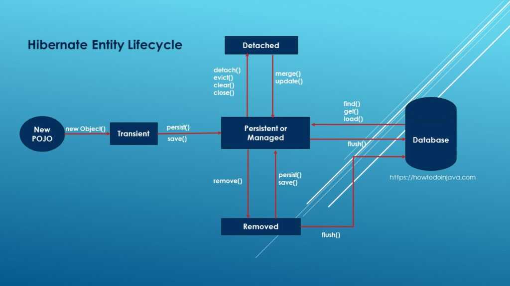

## HIBERNATE - Principe et définition

[home](../index.md)

### 3 règles d'or
<pre>
- toujours connaître l'état de la <b>session/contexte de persistence</b>
  - savoir si on est ou pas dans une session
- savoir si on est ou pas dans une <b>transaction</b>
- toujours se soucier du <b>sql généré par hibernate</b>
</pre>

### Définition

#### hibernate
<pre>
- c'est un orm : intermédiaire entre applis et la base de données
- l'orm permet de gérer un contexte de persistence
</pre>

#### session hibernate = contexte de persistence
<pre>
- une session c'est quoi ? :
  - contexte de persistence : ensemble des entités géréés par hibernate
  - physiquement c'est une map < classe+ID, entité >
  - une entité géré par hibernate se trouve dans la session dans la map
</pre>

#### entity et données
<pre>
* une entité est une classe Java mappé directement sur un objet physique de la base de données.
* ainsi, une entité est un POJO qui correspond à un enregistrement de la table.
</pre>

#### entityManager
<pre>
- permet de déclencher des actions sur les entités
- ces actions permettent entre autre de changer l'état d'une entité
</pre>

#### les états JPAs

##### schéma


##### transient
<pre>
- entité non connu du contexte de persistence
- concerne les nouveaux objets (new)
- méthode persist(e) 
  * pour mettre l'entité dans le contexte de persistence
  * se traduit par INSERT INTO
</pre>

##### managed
<pre>
- état indiquant que l'entité est gérée par hibernate, 
- elle est dans la session
- flush(): hibernate enverra les modifs vers la base de données
    pour toutes les actions opérées sur cet entité.

- méthode pour mettre l'entité dans l'état "managed"
  - persist(e)
  - find(e)
  - getReference()
  - getResultList()
</pre>

##### removed
<pre>
- état indiquant à hibernate que l'entité doit être supprimé de la base

- remove(e): permet de supprimer une entité qui est dans l'état managed
  - sur une entité connu du contexte de persistence
  - l'entité passe dans l'état <b>REMOVED</b> et hibernate envoie les suppressions au SGBD
    via la méthode flush()

- persist(e): on peut l'utiliser pour remettre l'entité dans la session dans l'état managed
</pre>

##### detached
<pre>
- une entité peut être retirée du contexte de persistence

- méthode pour retirer l'entité de la session :
  - detach(e)

- Les méthodes suivantes agissent sur la session.
- Tous les objets contenus dans la session, passent alors dans l'etat <b>DETACHED</b>
  - clear() 
  - close()
- Tous les objets de la couche view sont dans un état détaché (normalement).

- merge(e) :
  - réattacher l'entité à la session
    - récupère l'entité en base
    - fait un update s'il y a un delta
  - si l'entité est nouvelle, cela revient à faire un persist()
</pre>

#### Remarque
##### merge
<pre>
* faire un merge sur une entité non existante se traduit par un INSERT INTO
</pre>

#### Mauvaise pratiques
<pre>
1- ID
- Il ne faut jamais déterminé l'id de manière programmatique. C'est hibernate qui s'en occupe.
- On peut le faire pour tricher, pour simuler un merge.
</pre>

<pre>
2- faire un merge en dirty
- voir l'évènement DefaultMergeEventListener
- cet évènement est déclencher au merge et intercepter par la classe précédente
- le code est exécuté alors qu'on en a pas besoin
  * hibernate va mettre à jour toutes les données du snapshots associés à l'entité
    comme les collections.
    L'opération peut alors être gourmande en CPU
</pre>


####  proxy

##### définition
<pre>
- un proxy est une référence vers une entité de la base qui n'est pas complètement chargée,
    mais chargeable à la demande si la session hibernate est encore ouverte.
</pre>

##### lazy loading
<pre>
- le lazy-loading ne peut donc se faire que pour des entités dans un état 'MANAGED'
</pre>

##### getReference() -
<pre>
* permet de récupérer un proxy
* L'entité se retrouve dans la session mais sous forme d'un proxy
  Cela signifie qu'il n'y a pas eu d'appel en base pour charger la donnée
</pre>

#### unproxy
<pre>
* sert à forcer le chargement du prox
hibernat.unproxy(proxy)
</pre>


### Dirty checking

#### Définition
<pre>
- Fonctionnalité du contexte de persistence qui concerne les entités managed
- permet de faire la mise à jour des données et donc
  de répondre à la question suivante : comment fait-on un update avec hibernate ?
- Toute modification faite sur l'entité à l'état MANAGED sera enregistrée dans la session et
  propagée jusque dans la base de données.
</pre>

#### Principe :
<pre>
  Hibernate maintient en plus de la session, un <b>snaphot</b> qui est une photographie des entités au
  chargement. 
  Au flush, hibernate fait une comparaison entre les entités de la session et du snapshot. 
  Toute entité modifiée sera mis à jour en base.
  Attention : Hibernate met à jour toute l'entité même si un seul champ a été modifié.
</pre>


### Cache

#### Session : cache de premier niveau
<pre>
- si on demande des objets à Hibernate, hibernate va d'abord les chercher dans son cache

- utilité du cache de session:
  1- réduire le nombre de requête vers la BDD
  2- stocker les modifs et les envoyer en BDD au bon moment

- hibernate à la charge de renvoyer l'état à jour de l'entité
  - Sale = Dirty = modifié
  - C'est à hibernate de savoir qu'un objet est sale
</pre>


### Flush

#### Définition
<pre>
- permet de synchroniser la session avec la base de données
- force l'entity manager a envoyé ses modifications à la base de données
- ATTENTION : en général, c'est une mauvaise pratique
</pre>

#### Quand ? : FlushMode

##### flushMode = auto

###### definition
<pre>
- le FlushMode permet de paraméter le flush
- la stratégie par défaut est le mode AUTO
  * force le flush au moment du commit
  * et aussi avant chaque query
- hibernate flush automatiquement à la fermeture de la session
</pre>

###### remarque
<pre>
* Attention : sans l'utilisation de JPA, le flushMode AUTO avec hibernate
  ne flush pas les query sql native du type:
  entityManagre.createNativeQuery("Select ....")
</pre>

##### flushMode = commit
```
properties.setProperty("org.hibernate.flushMode","COMMIT");
```
<pre>
* le flush ne se fait qu'au commit
</pre>

#### Comment ?
<pre>
url
https://docs.jboss.org/hibernate/orm/5.4/userguide/html_single/Hibernate_User_Guide.html#flushing-order

Décrit la file d'attente des opérations qu'hibernate exécute lors d'un flush
hibernate commence par insérer, puis modifier et supprimer les entités.
</pre>


### Transaction

#### @Transactional

- Spring va ouvrir une session avec la Transaction


### Hibernate et Event

- Hibernate fonctionne beaucoup par Event
- Utile pour trouver/surcharger certaines classes
