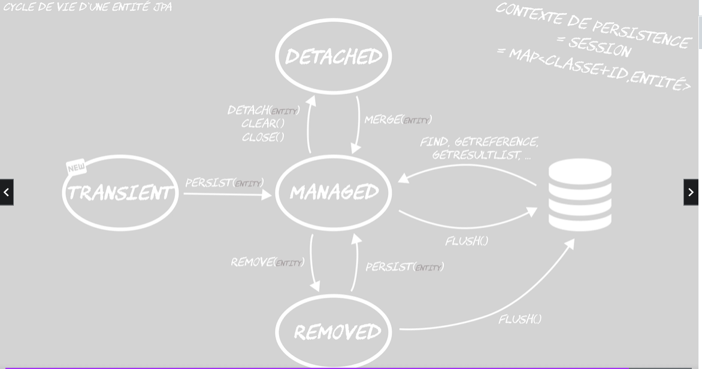
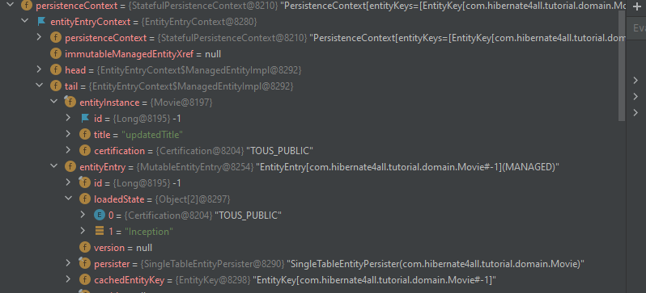

## HIBERNATE - Principe et définition

[home](../index.md)

### 3 règles d'or

<pre>
- toujours connaître l'état de la <b>session/contexte de persistence</b>
  - savoir si on est ou pas dans une session
- savoir si on est ou pas dans une <b>transaction</b>
- toujours se soucier du <b>sql généré par hibernate</b>
</pre>

### Définition

#### hibernate

<pre>
- c'est un orm : intermédiaire entre applis et la base de données
- l'orm permet de gérer un contexte de persistence
</pre>

#### session hibernate = contexte de persistence

<pre>
- une session c'est quoi ? :
  - contexte de persistence : ensemble des entités géréés par hibernate
  - physiquement c'est une map < classe+ID, entité >
  - une entité géré par hibernate se trouve dans la session dans la map

- interface principale de persistance :
  c'est l'objet qui permet de manipuler les entités hibernate
</pre>

#### entity et données

<pre>
* une entité est une classe Java mappé directement sur un objet physique de la base de données.
* ainsi, une entité est un POJO qui correspond à un enregistrement de la table.
</pre>

#### entityManager

<pre>
- permet de déclencher des actions sur les entités
- ces actions permettent entre autre de changer l'état d'une entité
</pre>

#### les états JPAs

##### schéma



##### transient

<pre>
- entité non connu du contexte de persistence
- concerne les nouveaux objets (new)
- méthode persist(e) 
  * pour mettre l'entité dans le contexte de persistence
  * se traduit par INSERT INTO
</pre>

##### managed

<pre>
- état indiquant que l'entité est gérée par hibernate, 
- elle est dans la session
- flush(): hibernate enverra les modifs vers la base de données
    pour toutes les actions opérées sur cet entité.

- méthode pour mettre l'entité dans l'état "managed"
  - persist(e)
  - find(e)
  - getReference()
  - getResultList()
</pre>

##### removed

<pre>
- état indiquant à hibernate que l'entité doit être supprimé de la base

- remove(e): permet de supprimer une entité qui est dans l'état managed
  - sur une entité connu du contexte de persistence
  - l'entité passe dans l'état <b>REMOVED</b> et hibernate envoie les suppressions au SGBD
    via la méthode flush()

- persist(e): on peut l'utiliser pour remettre l'entité dans la session dans l'état managed
</pre>

##### detached

<pre>
- une entité peut être retirée du contexte de persistence

- méthode pour retirer l'entité de la session :
  - detach(e)

- Les méthodes suivantes agissent sur la session.
- Tous les objets contenus dans la session, passent alors dans l'etat <b>DETACHED</b>
  - clear() 
  - close()
- Tous les objets de la couche view sont dans un état détaché (normalement).

- merge(e) :
  - réattacher l'entité à la session
    - récupère l'entité en base
    - fait un update s'il y a un delta
  - si l'entité est nouvelle, cela revient à faire un persist()
</pre>

### Opérations

#### persist

##### Pb: Faire un persist avec entité détachée.

<pre>
# Scénario :
Faire un persiste sur une entité ayant une collection:
* qui a une entité nouvelle
* qui a une entité détaché

Faire un persiste va engendrer l'erreur suivante :
org.springframework.dao.InvalidDataAccessApiUsageException: detached entity passed to persist 

Attentions avec la méthode persist, l'entité détaché ne peut être enregistré.
Persist est fait pour enregistrer des données transientes et non détachées.
</pre>

##### Solution

<pre>
Il faut au préalable persister l'entité parente.
Elle aura un id, et ensuite on fera un merge qui fera un 
* persist sur les nouvelles entités enfants
* merge sur les entités détachées
</pre>

#### merge

##### principe

<pre>
* Il est possible d'utiliser merge sur les entités transientes mais cela n'est pas dans la norme.
* Hibernate ne fera pas de Select sur les entités n'ayant pas d'id.
* Quand on fait un merge sur une entité transiente:
    * il y a un insert into
    * par contre l'entité (l'id) n'est pas remonté / n'est pas changée
</pre>

##### Mauvaise pratiques

<pre>
1- ID
- Il ne faut jamais déterminé l'id de manière programmatique. C'est hibernate qui s'en occupe.
- On peut le faire pour tricher, pour simuler un merge.
</pre>

<pre>
2- faire un merge en dirty
- voir l'évènement DefaultMergeEventListener
- cet évènement est déclencher au merge et intercepter par la classe précédente
- le code est exécuté alors qu'on en a pas besoin
  * hibernate va mettre à jour toutes les données du snapshots associés à l'entité
    comme les collections.
    L'opération peut alors être gourmande en CPU
</pre>

##### collections

<pre>
Besoin: modifier une entité qui a des collections associées.
Comment merger les collections quand on les a pas modifiées?
Comment merger une collection ?
- Faire un mapping dto => domain
  ==> nécessite de remonter le contenu des collections.
  ==> faire un merge sur l'objet de domain
</pre>

<pre>
* Overwrite anti-pattern

* Sans faire de merge :
Si la liste contient des entité détachées, ils ne seront pas persistés.
==> detached entity passed to persist

* Avec un detach et merge 
==> il faut faire un merge pour que cela passe.
==> Néanmoins les nouvelles entités seront créées sont id.

* Solution : 
faire une méthode de DAO qui prend en paramètre
  - l'id de l'entité
  - les éléments de la collection
1- récupére l'entité et la collection dans une query
2- faire un detach
3- faire les modifs sur la collection (new collection avec )
4- ajouter les éléments dans la collection avec la méthode entité.add
5- faire un merge

</pre>

<a href="https://vladmihalcea.com/merge-entity-collections-jpa-hibernate/" target="_blank">merger une collection</a>

### proxy

#### définition

<pre>
- un proxy est une référence vers une entité de la base qui n'est pas complètement chargée,
    mais chargeable à la demande si la session hibernate est encore ouverte.
</pre>

#### lazy loading

<pre>
- le lazy-loading ne peut donc se faire que pour des entités dans un état 'MANAGED'
</pre>

#### getReference() -

<pre>
* permet de récupérer un proxy
* L'entité se retrouve dans la session mais sous forme d'un proxy
  Cela signifie qu'il n'y a pas eu d'appel en base pour charger la donnée

<b>IMPORANT</b> : dans le repository il ne faut pas mettre l'annotation @Transactional
Sinon c'est l'équivalent d'un find(...)
</pre>

```
    public Movie getReference(Long id) {
        Movie proxy = entityManager.getReference(Movie.class, id);
        return proxy;
    }
```

#### unproxy

<pre>
* sert à forcer le chargement du prox
hibernat.unproxy(proxy)
</pre>

### Dirty checking

#### Définition

<pre>
- Fonctionnalité du contexte de persistence qui concerne les entités managed
- permet de faire la mise à jour des données et donc
  de répondre à la question suivante : comment fait-on un update avec hibernate ?
- Toute modification faite sur l'entité à l'état MANAGED sera enregistrée dans la session et
  propagée jusque dans la base de données.
</pre>

#### Principe :

<pre>
  Hibernate maintient en plus de la session, un <b>snaphot</b> qui est une photographie des entités au
  chargement. 
  Au flush, hibernate fait une comparaison entre les entités de la session et du snapshot. 
  Toute entité modifiée sera mis à jour en base.
  Attention : Hibernate met à jour toute l'entité même si un seul champ a été modifié.
</pre>

#### Inspect
<pre>
On peut inspecter la session : SessionImpl
Exemple: mettre un point d'arrêt sur le code : entityManager.contains(<i>monEntité</i>)
Ici, on a modifié le titre de l'entité:
<i>
    Movie movie = entityManager.find(Movie.class, id);
    movie.setTitle(newTitle);
    entityManager.contains(movie);
</i>
<b>EntityEntryContext</b> contient:
* <b>entityInstance</b>: entité dans le contexte de persistence
* <b>MutableEntityEntry</b>: entité dans le snapshot

</pre>

#### hibernate-enhance-maven-plugin
<pre>
Plugin permet d'aider Hibernate dans le mécanisme de Dirty-Checking.
Permet à la compilation de créer des proxies sur les setters des entités.
Le proxy porte un attribut qui va indiquer si l'entité à été modifié
Ce qui fait qu'à chaque modification d'une entité, le setter met à jour cet attribut.
Hibernate n'a donc plus besoin de faire la comparaison entre le snaphot et la session.

<b>Important </b>:
* Cela ne réduit pas l'empreinte mémoire
* Cela soulage le CPU car évite de faire la comparaison champ à champ.
</pre>

### Cache

#### Définition

<pre>
c'est avant tout une duplication de données.
C'est une copie de données d'une source de données existantes pour les rapatrier
dans un endroit un peu plus proche.
Mais on récupère les problématiques liées à ces données :
- Comment gère-t-on la synchronisation de ce cache ?
- Comment gère-t-on les modifications concurrentes ?
- Comment faire si les données du cache grossissent...? 
La mise en place n'est donc pas anodine:
- on peut régler les pbs de performances
- on peut engendrer d'autres pbs dont il faudra s'occuper...
Donc à utiliser avec précaution.

Il faut bien analyser le cheminement des données avant leur arrivée dans le cache.
Par exemple, avec hibernate:
- qd hibernate envoie une requête à la base :
1- la base requêtes son système de fichiers ou peut accéder à sa mémoire dans laquelle
   elle a déjà stockée les données (premier cache)
2- la base peut utilisée un index qui au final duplique les données. On peut parler 
  d'un second cache de donnée
3- mais hibernate a déjà lui aussi sa session qui fait office de cache...

Est-on sûr de vouloir en créer un quatrième ?
Peut-être améliorer le plan d'exécution de la requête.
</pre>

#### Session : cache de premier niveau

##### Principe

<pre>
Quand on récupère des entités avec hibernate, ce dernier les stocke dans la Session.
La session fait alors office de cache. 
Cela signifie que  si on demande des objets à Hibernate, il ira d'abord les chercher dans son cache.

- utilité du cache de session:
  1- réduire le nombre de requête vers la BDD
  2- stocker les modifs et les envoyer en BDD au bon moment

- hibernate à la charge de renvoyer l'état à jour de l'entité
  - Sale = Dirty = modifié
  - C'est à hibernate de savoir qu'un objet est sale
</pre>

##### Find

<pre>
La méthode find sur une entité déclenche une requête Select pour chargement dans la session
L'appel à la méthode find une seconde fois ne déclenche pas de select mais récupère l'entité en cache.
</pre>

##### CreateQuery

<pre>
La méthode CreateQuery faisant un Select sur une entité déclenche une requête 
Select pour chargement dans la session
L'appel à la méthode CreateQuery faisant un Select, une seconde fois, déclenche un select,
dans le sens ou dans les logs, on peut observer la requête SQL.
<b>Important</b>:
Néanmoins, le select ne s'exécute pas en base car l'objet récupéré est bien celui du cache de session.
Hibernate regarde là encore dans sa Session.
Ce n'est donc pas parce que la requête apparaît dans les logs qu'hibernate l'exécute.
</pre>

##### Isolation des transactions

<pre>
En terme d'isolation, la session met une <b>couche supplémentaire</b> par rapport à la base de données.
Ainsi, si une donnée en Session est chargée avant qu'une autre transaction la mette à jour et la valide,
la session ne sera pas mise à jour et même s'il l'on fait de nouveau un find sur cette entité.
En effet, hibernate travaille avec sa Session.
Solution
- détachée l'entité puis la réattachée de nouveau à la session.
- utiliser la gestion de version d'hibernate sur les entités pour empêcher la mise à jour
==> voir le lock optimiste.
</pre>

#### Cache d'entités de second niveau

##### ehcache

<pre>
* cache accessible hors-session, à l'intérieur de la JVM
* cache d'entités:
  * hibernate l'utilise un peu comme son cache de session, pour accéder
    à des entités.
  * hibernate récupère les entités de ce cache via les ids
* fonctionnalité :
 * limiter la taille
 * décider de la localisation du cache : en mémoire, sur fichier
 * avoir des statistiques d'utilisation du cache pour savoir 
   s'il est utiliser à bon escient
</pre>

##### création du cache

###### pom.xml

```
  <dependency>
    <groupId>org.hibernate</groupId>
    <artifactId>hibernate-ehcache</artifactId>
  </dependency>
```

###### Configuration

```
  properties.setProperty("hibernate.cache.use_second_level_cache", "true");
  // dire a hibernate comment il doit fabriquer le cache
  properties.setProperty("hibernate.cache.region.factory_class","org.hibernate.cache.ehcache.EhCacheRegionFactory");
```

##### données et stratégies d'accès

###### @Cacheable

<pre>
La première question à se poser :
quels sont les données éligibles pour le cache ?
ce sont les données qui ne bougent pas beaucoup.
Cette annotation permet de cacher l'entité.
Hibernate cherche dans le cache de second niveau,
  s'il ne le trouve pas il va le chercher en base de données
</pre>

###### @Cache Stratégie

<pre>
* Stratégie de concurrence d'accès
* Genre: données non décisives et non critiques...
@org.hibernate.annotations.Cache(usage = CacheConcurrencyStrategy.NONSTRICT_READ_WRITE)
</pre>

###### Invalidation

<pre>
hibernate au travers d'ehcache gère le cache en fonction de la configuration faite
Cache READ_TRUE:
au moment de la lecture, que les entités sont mises en cache.
Si le genre est mis à jour:
* modif est envoyé en base et le cache invalidé.
* à la prochaine, lecture du genre, le cache serati mis à jour
Cache READ_TRUE:
les entités sont mises en cache au moment de l'écriture
</pre>

#### Cache de requête

<pre>
* la requête et son résultat est mis dans le cache
* hibernate ne peut pas savoir que les entités qu'il a en cache suffise à répondre
  à la requête
* on indique au niveau de la requête que le résultat doit être caché

Note: le cache de requête, met dans le cache d'entités toutes les entités 
  récupérées.
  Ce qui fait qu'une requête sur l'entité, ne déclenchera pas d'appel en 
  base.
</pre>

##### Configuration

```
properties.setProperty("hibernate.cache.use_query_cache", "true");
```

##### Utilisation

```
return entityManager.createQuery("from Genre", Genre.class)
                    .setHint(QueryHints.HINT_CACHEABLE, "true")
                    .getResultList();
```

#### Cache de collections

<pre>
* hibernate ne met pas les collections en cache par défaut
* il faut lui dire explicitement
* il met en cache des références vers les entités du premier type de cache
* Si entre 2 appels, si la collection a bougée, hibernate ne peut pas le savoir 
  avec le seul cache de premier niveau.
* Par contre en cachant (les refs des éléments de la collection), les références, 
  hibernate pourra le voir et invalidé le cache.

</pre>

### Flush

#### Définition

<pre>
- permet de synchroniser la session avec la base de données
- force l'entity manager a envoyé ses modifications à la base de données
- ATTENTION : 
* en général, c'est une mauvaise pratique
</pre>

#### Quand ? : FlushMode

##### flushMode = auto

###### definition

<pre>
- le FlushMode permet de paraméter le flush
- la stratégie par défaut est le mode AUTO
  * force le flush au moment du commit
  * et aussi avant chaque query
- hibernate flush automatiquement à la fermeture de la session

<b>IMPORTANT</b>:
* il est important de noter, que la session en mémoire d'hibernate
se synchronise avec la base avec ce flush.
D'ou le flush avant chaque query. Cela permet de pousser les mofifications
éventuelles faites.
Si tel n'est pas le cas (avec un flushMode = COMMIT), une récupération des 
datas ne prendra pas en compte les données non flushées. 
</pre>

###### remarque

<pre>
* Attention : sans l'utilisation de JPA, le flushMode AUTO avec hibernate
  ne flush pas les query sql native du type:
  entityManagre.createNativeQuery("Select ....")
</pre>

##### flushMode = commit

```
properties.setProperty("org.hibernate.flushMode","COMMIT");
```

<pre>
* le flush ne se fait qu'au commit
</pre>

#### Comment ?

<pre>
url
https://docs.jboss.org/hibernate/orm/5.4/userguide/html_single/Hibernate_User_Guide.html#flushing-order

Décrit la file d'attente des opérations qu'hibernate exécute lors d'un flush
hibernate commence par insérer, puis modifier et supprimer les entités.
</pre>

### Hibernate et Event

- Hibernate fonctionne beaucoup par Event
- Utile pour trouver/surcharger certaines classes

## Problématique de production

### Connexion

<a href="../../spring/spring-jdbc/transaction/connexion.md" target="_blank">pool-de-connexion</a>

### Transaction

#### @Transactional

<pre>
* permet de définir un contexte de transaction et assure que les opérations
  hibernate s'exécute dans la même Session.
</pre>

#### bonne pratique

<pre>
* Ce n'est pas forcément une bonne idée de placer cette annotation au niveau
  de la couche présentation, car plus les méthodes grossisent, les traitements
  durent plus longtemps et peuvent prendre du temps.
  Du coup, la transaction prend plus de temps.
  C'est donc autant de temps pendant laquelle la session est ouverte et que des 
  locks sont potentiellement crées sur la base.
</pre>

#### Test

<pre>
Alors que signifie @Transactional si vous annotez votre suite de test avec elle? 
Eh bien cela signifie que chaque méthode de test dans votre suite est entourée par une transaction globale. 
<b>Cette transaction sera annulée à la fin de la méthode d’essai, peu importe le résultat.</b>
<a href="https://www.marcobehler.com/2014/06/25/should-my-tests-be-transactional" target="_blank">test et transaction</a>
</pre>

#### doc

<a href="../../spring/spring-jdbc/transaction/notes/spring-transaction.md#transactional" target="_blank">spring-transaction</a>

### lock-optimiste et dead-lock

<a href="../../spring/spring-jdbc/transaction/notes/concurrence-acces.md#dead-lock" target="_blank">lock-optimiste et dead-lock</a>

### Architecture

<pre>
La couche DAO manipule des objets Entity.
Ces objets n'ont pas vocation a être utilisé dans les autres couches de l'application.
En effet, il peut être plus opportun d'utiliser des objets plus léger au niveau 
des couches supérieurs.
Au niveau de la couche service et supérieure, on pourra utiser un objet DTO,
voir même un objet VIEW au niveau de la couche présentation.

Exemple :
Pour serialiser les données au format JSon, on peut utiliser Jackson par exemple.
Néanmoins dans cette serialisation, il faut pouvoir casser les référence cyclique.
Sans l'utilisation de DTO, cela peut s'avérer complexe et oblige l'utilisation des 
annotations @ignore au niveau de la couche @Entity.

Comment faire pour casser les références circulaires?
On trouve ces références quand deux objets se références mutuellement.
Pour cela, il faut :
- utiliser l'annotation @JsonIgnore dans l'un des objets.
- utiliser un objet de type DTO, qui ne référence plus l'objet mais simplement
  son id.
  C'est une bonne pratique, car sinon non manipule des objets trops complexes et
  trop lourd dans les couches supérieures
</pre>
