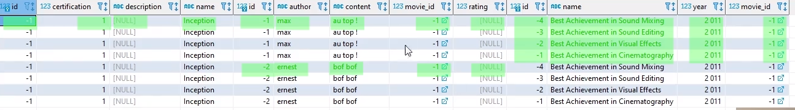

## HIBERNATE - Requêtage

[home](../index.md)

### Question

<pre>
Quiz 52 : ne manque-t-il pas le fetch dans le request ?
</pre>

### Récupération par Id

#### find

<pre>
* permet de récupérer l'entité
* ouvre une session si pas de session ouverte
* déclenche une requête
</pre>

```
Movie result = entityManager.find(Movie.class,id);
```

#### getReference

<pre>
* permet de récupérer un proxy qui n'est pas initialisé
* pas de Session, pas de requête
* hibernate ne tentera pas de l'initialiser tant qu'on accède pas à une propriété
</pre>

```
Movie result = entityManager.getReference(Movie.class, id);
```

### Récupération par association

#### Principe

<pre>
* récupérer les entités associées en mode Lazy quand on est dans la session
    * exemple : proxy de collections
* les entités ne sont chargées qu'à la demande
* il faut garder la maîtrise du contexte et ne jamais accèder au proxy sans
  savoir les requêtes générées
</pre>

#### Proxy - danger

<pre>
Attention aux performanaces: toujours avoir en tête ce que votre code va engendrer niveau SQL.
Exemple :
* Charger plein de films
* Pour chaque film, accéder au proxy des reviews (proxy de collections)
    Pas bien : cela va générer maintes requêtes SQL.
* Solution : PréChargé toutes les entités existantes ==> JPQL
* Préconisation : utilisé les Proxy dans des cas unitaires.
</pre>

### JPQL

<pre>
JPQL: langage de requête de JPQL
HQL: langage de requête d'hibernate

Avantage : code lisible et intuitif
Inconvénient : 
    * écrit en dur dans une chaine de caractère le nom des attributs
    * pb: si on change le nom d'un attribut en Java, il faudra repasser sur les requêtes
        et l'éditeur ne pourra pas nous aider
    * on peut se retrouver avec une chaine de caractère conséquente avec plein
        de concaténation => compliqué à lire.
    Note : les requêtes peuvent être externalisées dans des 
        * annotations : @NameQuery
        * fichier dédié
</pre>

#### createQuery

<pre>
* prend en paramètre la requête et la classe du résultat : type query
* Méthode :
    getResultList() : 0, 1 ou plusieurs résultats
    getSingleResult() : 1 résultat ou une exception
*<b>IMPORTANT</b>: valoriser les requêtes avec setParameter()
    C'est la façon la plus sûre de paramétrer les requêtes
</pre>

#### exemple

```
    List<Movie> movies = entityManager.createQuery("select m from Movie m where m.name = : param",
            Movie.class)
            .setParameter("param", searchString).getResultList();
    return  movies;
```

#### jpql avec jointure

<pre>
* récupération des collections et données associées
=> souvent la cause première des pbs rencontrés avec hibernate

Atttention : Hibernate raisonne en objet.

Quand la requête SQL remonte des lignes, Hibernate remonte des objects.
Exemple : Remontées la liste des commentaires pour un film.

</pre>

##### Récupérer une collection associée à une entité

###### fetch-join

<pre>
Pour récupérer une collection avec les entités associés, il faut faire une jointure.
Cela passe par l'opéarteur <b>join fetch</b>
</pre>

- SQL

```
select m.*, r.*
from movie m
	left join review r on m.id = r.movie_id
==> Requête qui remonte deux lignes car deux reviews sur le Movies.
```

- JPQL:

```
select m
from Movie m
left join fetch m.reviews
==> remonte deux fois l'entité movies (2 objets)
```

###### Problématique

<pre>
* Le SQL renvoie une liste de ligne.
    - Produit Cartésien sur la jointure
    - 1 ligne par Review

* Le JPQL renvoie une liste d'objets
    - l'objet Movie avec sa liste de Reviews. 

Dans la requête JPQL, on obtient 2 fois l'entités Movie.
On a deux fois le même Movie.
Par défaut, hibernate ne regroupe pas.

</pre>

###### Solution: distinct

<pre>
- Solution: distinct en JPQL pour ne remonter qu'une seule entité Movie

select distinct m
from Movie m
left join fetch m.reviews

L'opérateur 'distinct' en JPQL:
- il engendre un distinct en SQL
- mais transforme aussi le résultat en mémoire

Note: pour juste transformer le résulat en mémoire, et ne pas tenir compte du distinct SQL
==> .setHint(QueryHints.HINT_PASS_DISTINCT_THROUGH, false)
</pre>

###### LazyInitalisationException

<pre>
Attention le JPQL suivant ne remonte pas les reviews :
<b>select m from Movie m left join m.reviews</b>

Il faut mettre le mot-clé fetch pour la récupération des entités Reviews

==> Correspond à cette requête en sql :
select m.*
from movie m
left join review r on m.id = r.movie_id

<b>Attention</b>
Du coup, accèder à la collection Reviews déclenche un LazyInitializationException

</pre>

##### Récupérer plusieurs collections associées à une entité

###### Problématique : Produit Cartésien

<Pre>
 Pour remonter la lise de 2 collections associées à une entité, on fait un
 produit cartésien.
 Or cette requête multiplie les lignes et remonte des lignes inutiles.
 Remonte toutes les combinaisons de lignes contenant des Reviews et des lignes
    contenant des awards
</pre>



###### Solution

<pre>
* faire deux requêtes séparées pour les deux jointures
    * première requêtes 2 lignes
    * deuxième requêtes 4 lignes

* utilisation du cache d'hibernate
  * le cache stocke les données.
  * pour la deuxième jointure, hibernate a déjà une partie des données en cache
  * il va compléter les données déjà en cache avec les données de la seconde requête

    <b>Attention : </b>
    Les deux requêtes doivent s'exécuter dans la même Session.
</pre>

- le scaling sur 2 requête fait gagner en performance


###### Code

```
    public List<Movie> getMoviesWithAwardsAndReviews(){

        EntityManager entityManagerLocal = entityManagerFactory.createEntityManager();

        List<Movie> movies = entityManagerLocal
                .createQuery("select distinct m from Movie m left join fetch m.reviews", Movie.class)
                .setHint(QueryHints.HINT_PASS_DISTINCT_THROUGH, false)
                .getResultList();

        LOGGER.trace("session contains movie2 : " + entityManagerLocal.contains(movies.get(0)));

        movies = entityManagerLocal
                .createQuery("select distinct m from Movie m left join fetch m.awards
                    where m in :movies", Movie.class)
                .setParameter("movies", movies)
                .setHint(QueryHints.HINT_PASS_DISTINCT_THROUGH, false)
                .getResultList();

        entityManagerLocal.close();

        return movies;

    }
```

### Criteria JPA

#### Principe

<pre>
Criteria: il en existe en hibernate et en JPA
Api qui permet de construire des requêtes

Avantage: plus adapté quand il y a des 'if' dans tous les sens
Inconvénient:
    * plutôt verbeux
    * pb si on utilise une chaine de caractère pour spécifier les attributs,
      on a le même problème que JPQL
    ==> on peut quand même utiliser le plugin < maven-compiler-plugin >, en activant,
    la génération du modèle JPA
</pre>

#### API

#### Exemple:

```

    CriteriaBuilder builder = entityManager.getCriteriaBuilder();
    CriteriaQuery<Movie> query = builder.createQuery(Movie.class);
    // creation d'une racine qui represente ce qu'il y a dans le Select
    Root<Movie> root = query.from(Movie.class); // equivalent select m from Movie
    Predicate predicat;
    if ("<".equals(operation)) {
        predicat= builder.lessThan(root.get(Movie_.CERTIFICATION), certif);
    } else if("<=".equals(operation)) {
        predicat = builder.lessThanOrEqualTo(root.get(Movie_.CERTIFICATION), certif);
    } else if("=".equals(operation)) {
        predicat = builder.equal(root.get(Movie_.CERTIFICATION), certif);
    } else if(">".equals(operation)) {
        predicat = builder.greaterThan(root.get(Movie_.CERTIFICATION), certif);
    } else if(">=".equals(operation)) {
        predicat = builder.greaterThanOrEqualTo(root.get(Movie_.CERTIFICATION), certif);
    } else {
        throw new IllegalArgumentException("valeur de paramètre de recherche incorreect");
    }
    query.where(predicat);

    return  entityManager.createQuery(query).getResultList();

```

#### root

<pre>
* élément racine qui initialise la requête (clause From)
</pre>

```

Root<Movie> root = query.from(Movie.class);
==> Select m from Movie

root.get("certifiction")
=> m.certification

```

#### predicats

<pre>
* instructions à insérer dans la clause where
</pre>

#### builder

<pre>
* sert à construire de la query
    * initialisation
    * sert à cosntruire les predicats

Dans les criterias, il n'y a pas de notions explicit de paramètres.
C'est dans le builder qu'est créé le paramètre et valorisé par la suite.
</pre>

#### query - execution

```

entityManager.createQuery(query).getResultList();

```

### sql natif

<pre>
A éviter
* zapping du mapping hibernate et donc des mécanismes hibernate (cache...)

* définition du mapping à un seul endroit du domaine
    avec sql ==> risque que cette définition soit reporté également ailleurs ???

* à utiliser en dernier recours:
    * pour des fonctions sql non implémentées en sql.
      exemple : reverse en Postgre
    * alternative:
        * voir si c'est possible en jpql : en l'occurence, c'est possible car on peut étendre le dialecte.
        * metadatabuildercontributor : interface à implémenter (depuis hibernate 5.2.18)

* utiliser pour les requêtes compliquées :
    * comme les requêtes récursives

* créer une requête SQL native pour ne récupérer que certaines colonnes.
    ==> mais c'est possible en HQL => via les tuples.
</pre>

### @EntityGraph

#### principe

<pre>
* façon de décrire une entité et ses ramification.
* permet de passer un graph d'entité pour faire un fetch
</pre>

#### exemple

```
@Override
@EntityGraph(attributePath = {"movie"})
List<MovieDetail> moviesDetails = em.findAll();
```

### n+1 select

#### problématique

<pre>
1 requête qui va générée n autres requêtes.
</pre>

#### exemple

<pre>
* relation OneToOne : Movie <==> MovieDetail
* MovieDetail fait le lien avec Movie dans une relation en Eager.
</pre>

#### solution

<pre>
* mettre la relation en FetchType.Lazy
* par contre: dans la Session, j'accède aux "Movie" via le MovieDetail,
    on aura encore le problème de N+1 Select.
</pre>

#### Important

<pre>
Quand on récupère des listes d'objets / collection, faire des test en TU pour dénombrer le 
nombre de requêtes effectuées.
A faire avec les statistiques.
</pre>

### pagination

#### Besoin fonctionnelle

<pre>
Quand beaucoup de donnée à afficher :
a-t-on besoin de récupérer toutes les données pour le cas d'utilisation ?
* traitement de masse / batch : peut-être, potentiellement pas d'un coup 
    mais petit à petit à l'aide d'un curseur par exemple...
* pour un cas classique : page web qui affiche les films
    * il ne faut pas afficher la totalité des films
    Solution : 
        * filtrer les résultats : permettre à l'utilisateur d'affiner
          ses critères de recherche pour avoir moins de résultat.
        * pagination : possibilité de naviguer par petit bout dans la liste
          des résultats.

</pre>

#### Implémentation

<pre>
La pagination n'est pas normée et suivant le moteur SQL, on aura des implémentations différentes
En JPA, on s'affranchit de cette problématique. C'est JPA via son dialect qui s'occupe de traduire
la pagination pour la BDD derrière.
</pre>

##### paramètre

<pre>
maxResult : nombre maximum d'enregistrement à retourner
firstResult : (start / offset) position du premier enregistrement à retourner dans le jeu de résultat
<b>attention </b> : les tri des résultats est obligatoire
</pre>

##### hql

```
List<Movie> movies = entityManager.createQuery(" select m from Movie m order", Movie.class)
                        .setFirstResult(start)
                        .setMaxResults(maxResults)
                        .getResultList();
```

##### sql

```
Hibernate:
    select
        movie0_.id as id1_3_,
        movie0_.certification as certific2_3_,
        movie0_.description as descript3_3_,
        movie0_.name as name4_3_
    from
        Movie movie0_ limit ? offset ?
10:02:51 INFO  c.h.t.r.MovieRepository.getAllMovieBulk_casPaging durée : 287
287 ms avec Index
311 ms sans Index
```

#### tri

##### Problématique

<pre>
Dans le code précédent, aucun tri n'est appliqué.
Ce qui fait, qu'à chaque reqête les résultats remontés seront différent.
Rien ne garantit qu'ils soient les mêmes à chaque requête.
Explication: 
* L'ordre des résultats en SQL n'est pas garanti sans tri explicite

Il faut pouvoir récupérer les données dans le même ordre
Pour faire un tri par nom , PostGreSQL, de manière interne, récupère l'ensemble des données 
de la table. En effet, dans les données il n'y a pas de notions d'ordre donc il n'a pas
 d'autres choix que de récupérer tous les noms pour pouvoir les trier.
 Or ce tri est coûteux en terme de performance.
</pre>


##### solution : index

<pre>
Pour pallier au pb de performance de tri, on va utilisé un index.
Index: endroit dans la base où seront stockés des pointeurs vers chaque ligne de la table à trier.
Dans notre cas, la clé des pointeurs sera le nom et les noms seront déjà triés.
Ainsi, pour la pagination, PostGreSQL n'aura qu'à regarder les 50 premiers pointeurs.
On obtient une durée plus rapide.
Avec l'augmentation des données, cela sera plus scalable avec des temps acceptables.
</pre>


##### hql

```
entityManager.createQuery(" select m from Movie m order by m.name", Movie.class)
```

##### sql

```
Hibernate:
    select
        movie0_.id as id1_3_,
        movie0_.certification as certific2_3_,
        movie0_.description as descript3_3_,
        movie0_.name as name4_3_
    from
        Movie movie0_
    order by
        movie0_.name limit ? offset ?
10:05:25 INFO  c.h.t.r.MovieRepository.getAllMovieBulk_casPaging durée : 628
628 ms sans index
10:06:54 INFO  c.h.t.r.MovieRepository.getAllMovieBulk_casPaging durée : 311
311 ms avec index
```

#### pagination et jointure

##### Problématique

<pre>
Quand on veut paginer des informations qui nécessitent des opérations de jointures, hibernate
n'autorise plus l'utilisation des paramètres startResult et firstResult au niveau de la 
requête SQL.
Au niveau PostGreSQL, on ne voit plus l'utilisation des mots clés LIMIT et OFFSET
</pre>

##### hql

```
select m from Movie m left join fetch m.reviews order by m.name
```

##### sql

```
10:14:17 WARN  o.h.h.i.a.QueryTranslatorImpl.list HHH000104: firstResult/maxResults
     specified with collection fetch; applying in memory!
Hibernate:
    select
        movie0_.id as id1_3_0_,
        reviews1_.id as id1_7_1_,
        movie0_.certification as certific2_3_0_,
        movie0_.description as descript3_3_0_,
        movie0_.name as name4_3_0_,
        reviews1_.author as author2_7_1_,
        reviews1_.content as content3_7_1_,
        reviews1_.movie_id as movie_id5_7_1_,
        reviews1_.rating as rating4_7_1_,
        reviews1_.movie_id as movie_id5_7_0__,
        reviews1_.id as id1_7_0__
    from
        Movie movie0_
    left outer join
        Review reviews1_
            on movie0_.id=reviews1_.movie_id
    order by
        movie0_.name
10:14:50 INFO  c.h.t.r.MovieRepository.getAllMovieBulk_casPagingWithReviews durée : 34005
la durée a explosé : 34005 ms car l'opération se fait en mémoire.
```

##### explication

<pre>
La base de données remonte des lignes et non pas des objets.
Quand on fait une jointure on fait le produit cartésien des lignes.
Or dans ce cas, pour un objet hibernate, on peut avoir plusieurs lignes.
On est plus dans le cas où :
     une ligne = un objet 
Quand on utilise firstResult/maxResult on limite sur les 50 premières lignes
    et non pas sur les 50 premiers objets.
Cette opération est donc interdite par hibernate qui va récupérer le jeu 
d'enregistrement complet et faire l'opération de filtre en mémoire

<b>ATTENTION</b> : cette opération est coûteuse en performance car ce 
n'est plus la base de donnée qui pagine
</pre>

##### Solution

1- faire 2 requêtes.

<pre>
- une première pour remonter juste les movies (entité) sans jointure.
- une fois les movies ciblées récupérés, faire une requêtes pour récupérer
les données associées
</pre>

    * hql

    ```
    EntityManager entityManagerLocal = entityManagerFactory.createEntityManager();

    List<Movie> movies = entityManagerLocal.createQuery(" select m from Movie m order by m.name", Movie.class)
                                    .setFirstResult(start)
                                    .setMaxResults(maxResults)
                                    .getResultList();

    movies = entityManagerLocal.createQuery(" select  distinct m from Movie m left join fetch m.reviews
        where m in :movies", Movie.class)
                                .setParameter("movies", movies)
                                .setHint(QueryHints.HINT_PASS_DISTINCT_THROUGH, false)
                                .getResultList();

    entityManagerLocal.close();

    return movies;
    ```

    * sql

    ```
    Hibernate:
    select
        movie0_.id as id1_3_,
        movie0_.certification as certific2_3_,
        movie0_.description as descript3_3_,
        movie0_.name as name4_3_
    from
        Movie movie0_
    order by
        movie0_.name limit ? offset ?

    Hibernate:
        select
            movie0_.id as id1_3_0_,
            reviews1_.id as id1_7_1_,
            movie0_.certification as certific2_3_0_,
            movie0_.description as descript3_3_0_,
            movie0_.name as name4_3_0_,
            reviews1_.author as author2_7_1_,
            reviews1_.content as content3_7_1_,
            reviews1_.movie_id as movie_id5_7_1_,
            reviews1_.rating as rating4_7_1_,
            reviews1_.movie_id as movie_id5_7_0__,
            reviews1_.id as id1_7_0__
        from
            Movie movie0_
        left outer join
            Review reviews1_
                on movie0_.id=reviews1_.movie_id
        where
            movie0_.id in (
                ? , ? , ? , ? , ? , ? , ? , ? , ? , ? , ? , ? , ? , ? , ? , ? , ? , ? , ? ,
                ? , ? , ? , ? , ? , ? , ? , ? , ? , ? , ? , ? , ? , ? , ? , ? , ? , ? , ? ,
                ? , ? , ? , ? , ? , ? , ? , ? , ? , ? , ? , ?
            )
    ```

2- sql natif

<pre>
- utiliser la fonctionnalité du Moteur de base de données : dance rank
- qui permet d'ajouter une colonne dans le résultat qui s'incrément à chaque
    id d'entité différente.
- ainsi, dans le sql il faudrait filter sur cette colonne

Attention : ne fonctionne pas sur toutes les bases.
</pre>

### utils

#### Savoir si une session contient une entity

<pre>
# code
- entityManager.contains(entity)
Exemple après chargement d'une collection de Movie dans la Session:
Movie movie = movies.get(0);
LOGGER.trace("session contains movie : " + entityManagerLocal.contains(movie));

Question :
* Faire un chargement en masse des Movies dans la Session
* Faire un new Movie().setId(-1L);
* Chercher dans la Session
* Renvoie false ==> Pkoi??

# en debug :
- appelé la méthode find(entity)
Si déclenche une requête ==> l'entité n'est pas dans la session

</pre>

#### entityManager

##### créer de manière programmatique

<pre>
EntityManager entityManagerLocal = entityManagerFactory.createEntityManager();
List< Movie > movies = entityManagerLocal
        .createQuery("select distinct m from Movie m left join fetch m.reviews", Movie.class)
        .setHint(QueryHints.HINT_PASS_DISTINCT_THROUGH, false)
        .getResultList();
entityManagerLocal.close();
</pre>

##### accéder à la session

<pre>
Session session = entityManager.unwrap(Session.class);

SessionFactory sessionFactory = entityManagerFactory.unwrap(SessionFactory.class);
Session session = sessionFactory.openSession();
</pre>

```

```
