# Application Spring-Security et JWT

[retour](../../index-soa.md)

## Principe

<pre>
* application qui permet de <b>gérer des tâches</b>
* accès via <b>API REST</b> sécurisé d'une manière <b>stateless</b>, par <b>Spring-Security</b> en utilisant <b>JWT</b>
</pre>

### architecture

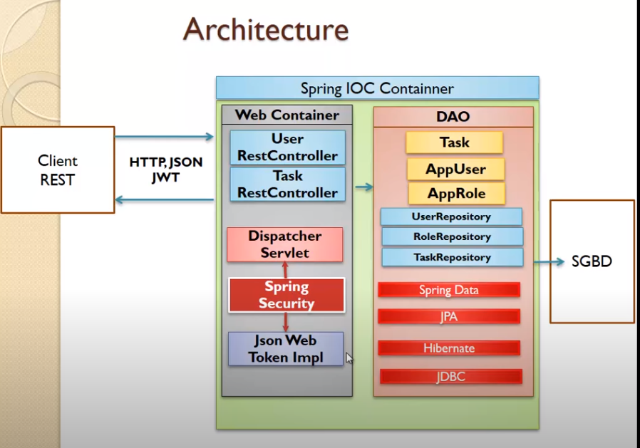

## Projet-Spring-Boot

### dépendances

<pre>
* <b>spring-boot-starter-data-jpa</b> : mapping objet relationnel
* <b>spring-boot-starter-data-rest</b> : 
	* mettre en place facilement API Rest (@RepositoryRestResource)
	* finalement non utilisé
* <b>spring-boot-starter-security</b> : spring security
* <b>spring-boot-starter-web</b>: on créer une application web
* <b>io.jsonwebtoken</b> : implémentation de jwt (dépendances manuelles)
* <b>spring-boot-devtools</b>: redémarrage serveur
* <b>org.projectlombok</b> :
* <b>spring-boot-starter-test</b>: test unitaire
* <b>spring-security-tests</b>: test unitaire de sécurité
</pre>

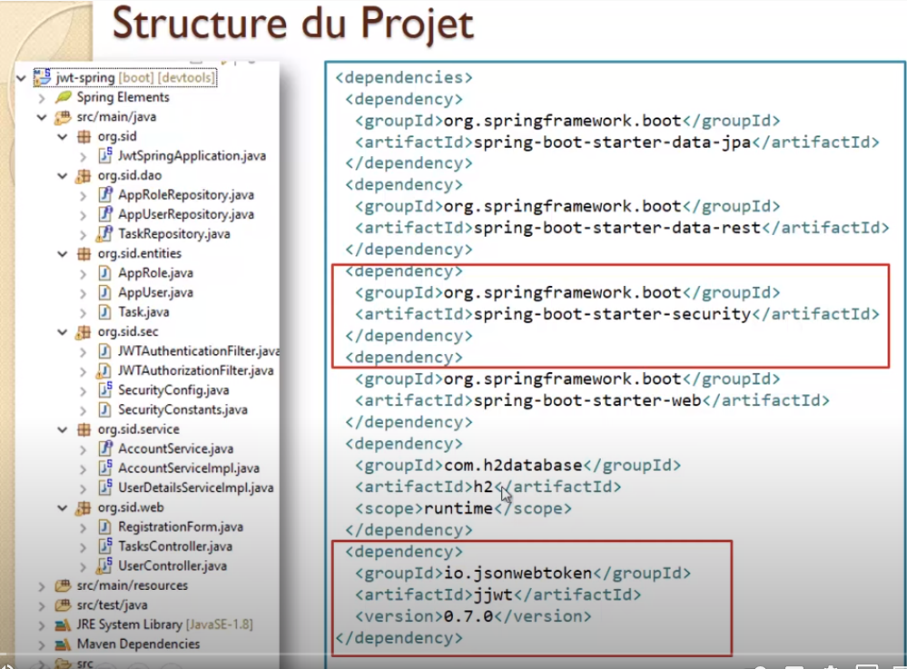

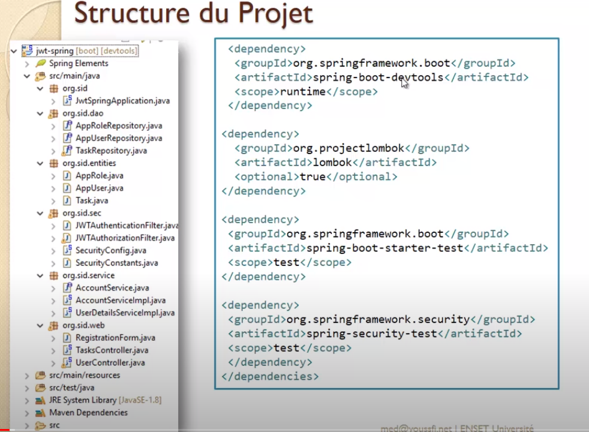

## Processus d'autentification : deux filtres à mettre en place

### Filtre pour faire l'authentification

<pre>
* Ce filtre implémente deux méthodes:
	* <b>attemptAuthentication</b>: 
		* pour fournir à Spring-Security les infos saisies par le user
	* checkPassword() : 
		* compare les infos récupérer avec <b>attemptAuthentication</b> avec les infos de <b>loadUserByName</b>
	* <b>successfulAuthentication</b>: 
		* construit le token JWT en cas d'authentifiation réussit
</pre>

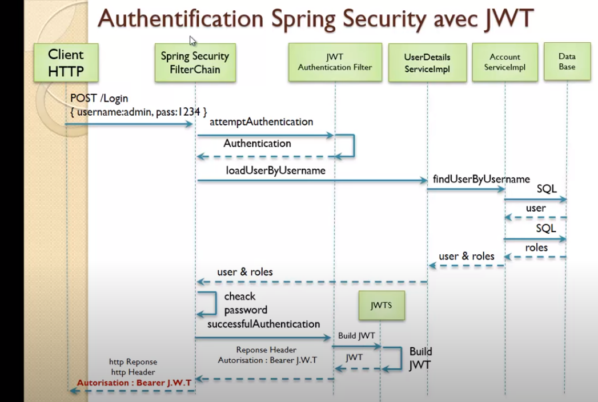

### Filtre pour vérifier les autorisations liées au token

<pre>
* JWT Autorisation Filter :
	* filtre qui s'exécute pour <b>chaque requête</b> (avant d'exécuter la requête pour avoir les résultats)
	* vérifie la <b>validité du token</b> 
		* <b>token par valeur</b> : on vérifie la signature du token 
		* il contient tout ce qu'il faut pour l'exploiter dans son contexte))
* si ok, <b>spring-security</b> met à jour son <b>contexte</b> : setAuthentication(user)
* si ok, la requete est envoyé au <b>dispatcher-servlet</b>
</pre>

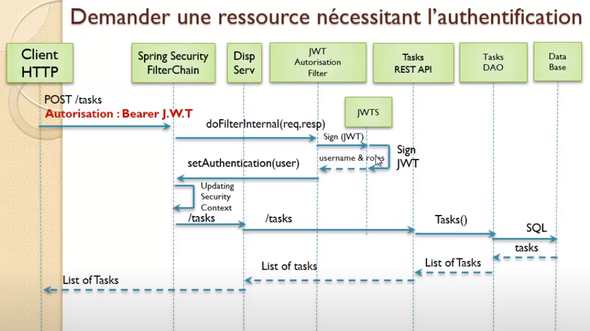

### Register (création de compte)

<pre>
* Méthode qui permet de <b>créer un user</b>
* Particularité : créer le <b>user/password</b> mais <b>ne pas retourner</b> le <b>password</b> dans le flux <b>JSon</b> de retour.

* Pour cela, sur l'<b>entity</b> on utilise les annatotations suivantes:
<i>Code:</i>

	// serialisation : on ne veut pas de mot de passe
	<b>@JsonIgnore</b>
	public String getPassword() {
		return password;
	}

	// deserialisation à la création
	// on recupère le mot de passe.
	@JsonSetter
	public void setPassword(String password) {
		this.password = password;
	}
</pre>

## Ecran

### Ecran role admin

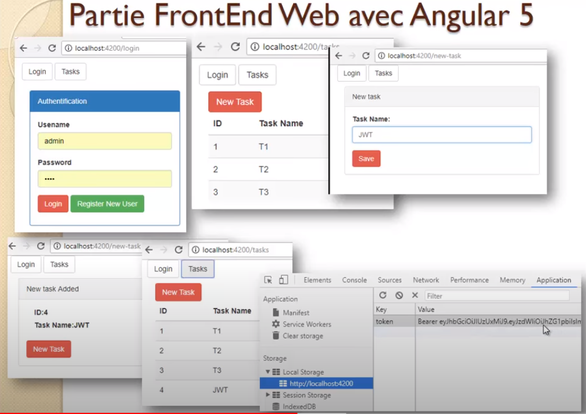

### Ecran role user

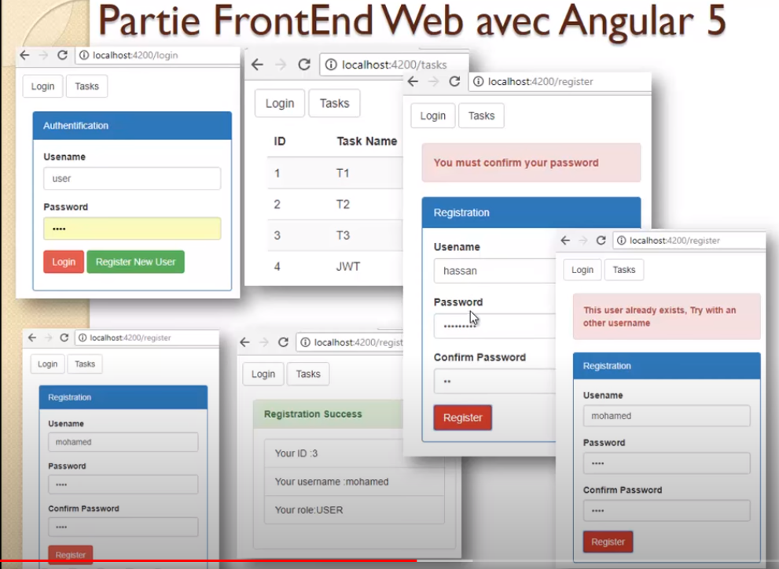

## Entité JPA

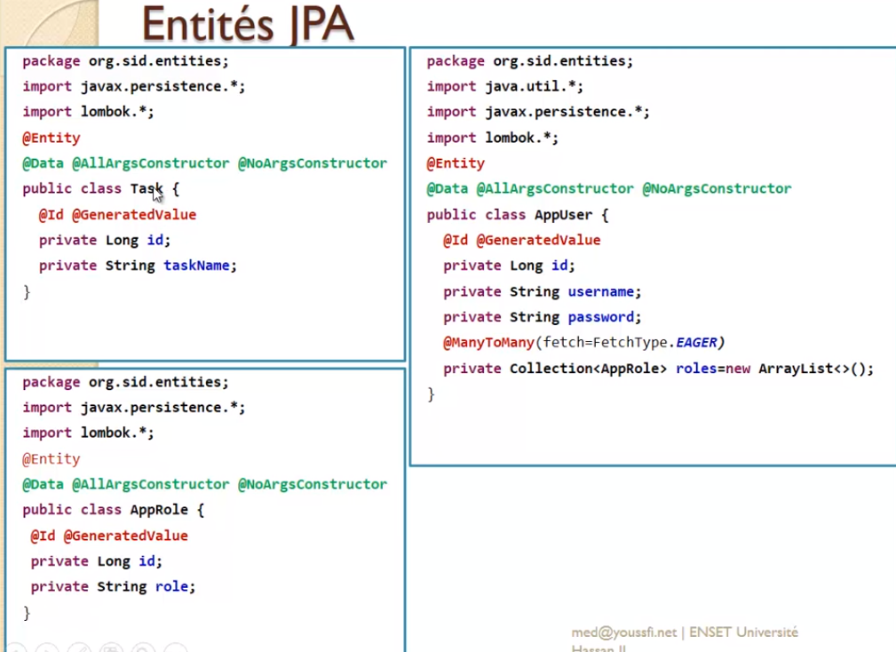

## Couche DAO

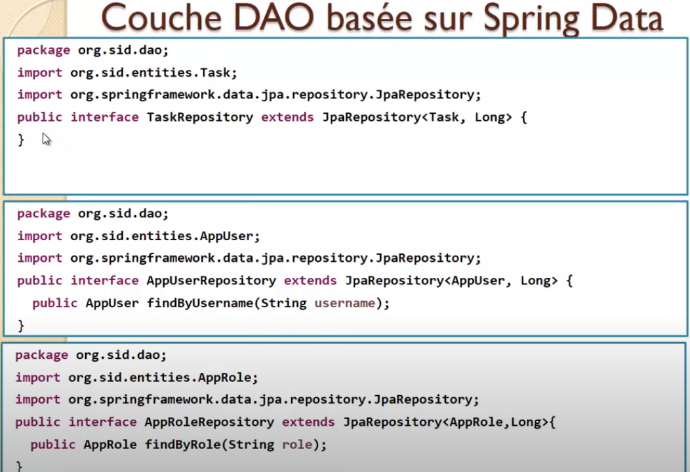

## UserDetailService

<pre>
* Imlémentation de la méthode <b>loadUserByName</b>
* récupération des informations pour validation d'authentification en base
</pre>

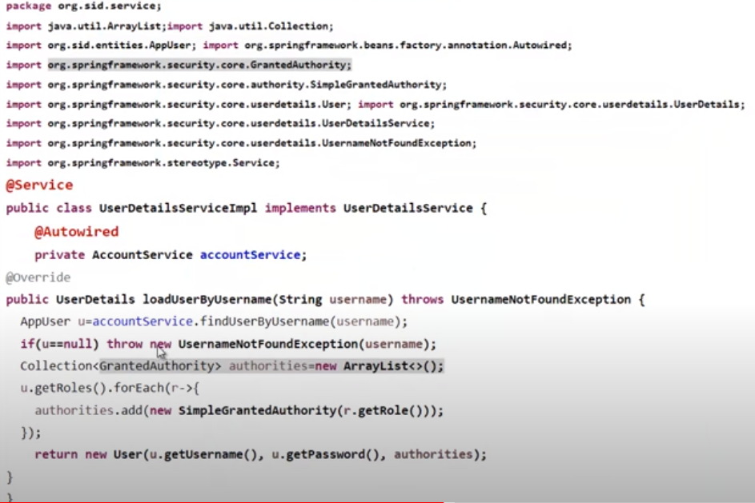

## Mise en place sécurité JWT

### Activation du mode stateless

<pre>
* Il faut modifier le comportement par défaut de Spring-security
	* <b>plus</b> besoin de <b>formulaire</b> d'authentification
	* il faut :
		* <b>activer</b> la sécurité en <b>mode stateless</b> 
		* <b>désactiver</b> la sécurité basé sur les <b>sessions</b>
	
	<i>code</i>:	
		http.sessionManagement().sessionCreationPolicy(SessionCreationPolicy.STATELESS);
	
	* on passe d'un <b>système d'authentification par référence</b> à un <b>système d'auhtenification par valeur</b>.
</pre>

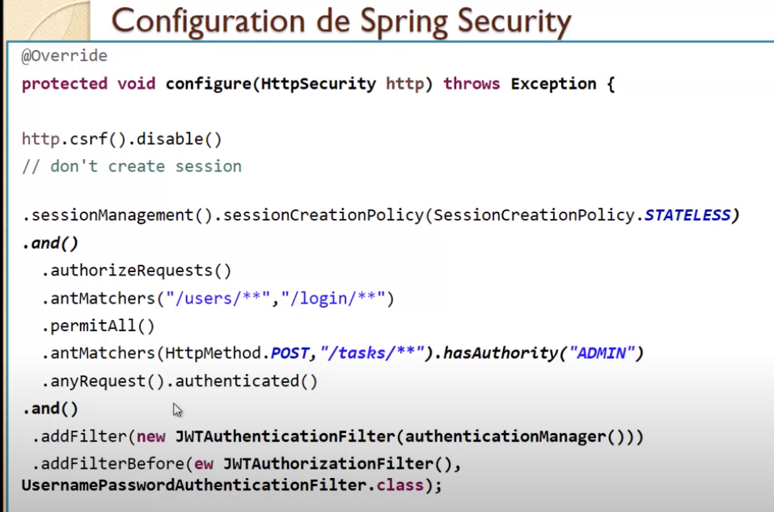

### Création des filtres

#### JWTAuthenticationFilter

<pre>
* Fonction 
	* 1- <b>faire l'authentification</b>
	* 2- <b>créer le token</b>
	
* classe qui héride de la classe : <b>UsernamePasswordAuthenticationFilter</b>
	* c'est un filtre qui intervient spécialement dans les opérations d'identification
	* c'est le filtre qui procède à l'authentification dans la méthode :
	
	<i>code :</i>
		public Authentication attemptAuthentication(HttpServletRequest request, HttpServletResponse response)
		
	* IMPORTANT : cette méthode ne met pas dans le contexte Spring, <b>en session</b>, les infos.
	* ce filtre a besoin de l'objet AuthenticationManager hérité de la classe WebSecurityConfigurerAdapter 
</pre>

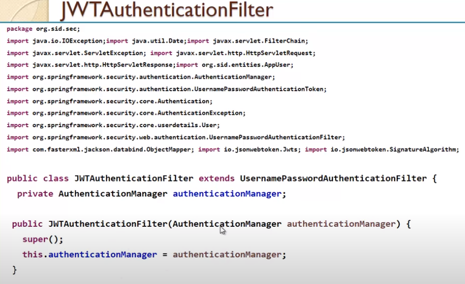

##### Override attemptAuthentication()

<pre>
* <b>Par défaut</b>, ce filtre récupère les <b>informations de connection</b> dans la <b>request</b>: 
	* via un request.getParameter("username")
	* via un request.getParameter("password")
	car par défaut les données sont envoyées au <b>format www-urlencoded</b> [username=...&password=?]

* <b>IMPORTANT</B> : <b>changement de format</b> pour la récupération des infos de connexion	
	* <b>pour s'authentifier</b>, on va utiliser username/password au <b>format JSon</b> 
	* donc la récupération par défaut n'est donc plus adequat.

</pre>

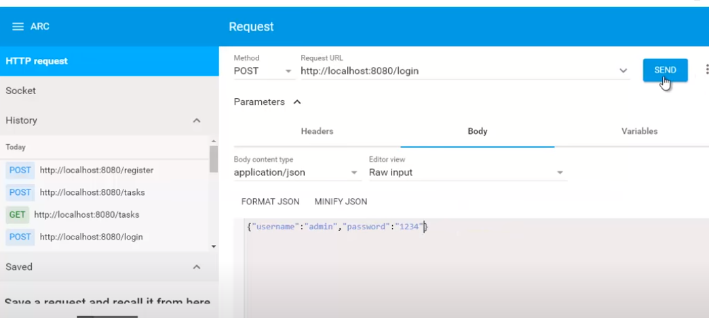

<pre>
* <b>Récupération des données au format JSon</b> - voir le code ci-après:
	* Les données au format JSon seront à récupérer par le code : <b>request.getInputStream()</b>.
	* Pour enfin, passer par l'objet ObjectMapper(Jackson) pour déserialiser dans un objet Java.
</pre>

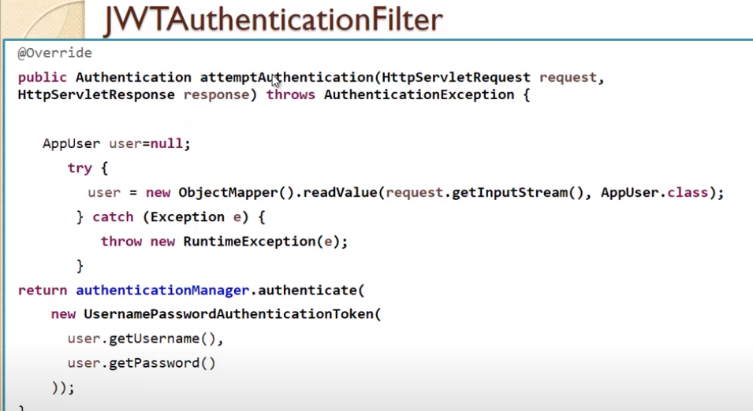

##### Override successfulAuthentication()

###### Pourquoi

<pre>
* pour <b>construire</b>/générer le <b>token JWT</b>
* cette méthode reçoit en <b>paramètre</b> le <b>résultat de l'authentification</b>
	* il faut effectivment récupérer les <b>infos du user</b> qui a été authentifié

* construction du jwtToken :
	* on met les <b>claims</b> [sujet, expiration, authorities]
	* la <b>signature</b> en précisant la méthode de hash avec le secret utilisé
	* on <b>compact</b> le tout : met en <b>base64Url</b>

* met dans la <b>réponse</b> le <b>token</b>
</pre>

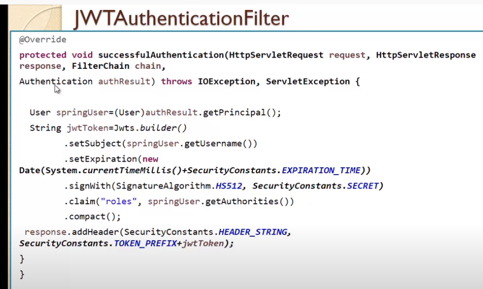

###### Insertion des constantes ou en properties

<pre>
* certaines valeurs doivent être stocké soit en properties (avec annotation values), soit en constantes
* Exemple
</pre>

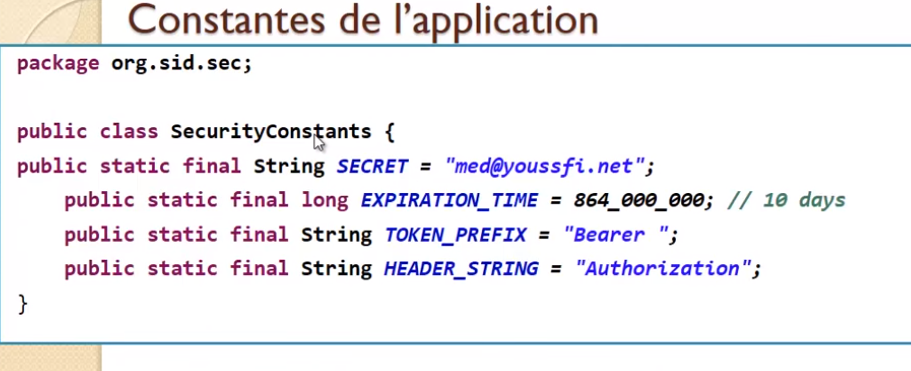

#### JWTAutorisationFilter

<pre>
* Fonction du filtre:
	* filtre devant <b>analyser le token</b> et <b>checker</b> la bonne <b>authentification</b>
	* filtre <b>appelé</b> à <b>chaque requête</b> 
		* c'est un filtre qui doit se placer avant les autres
		* c'est le premier filtre qui doit intercepter les requêtes

* classe qui héride de la classe : <b>OncePerRequestFilter</b>
	* filtre qui s'exécute à chaque requête
	* classe doFilterInternal à implémenter

</pre>

##### Fonctions

<pre>
* <b>récupération</b> du token et <b>vérification</b> que le token existe dans la requête
* si ko : on passe au filtre suivant
* si ok : on <b>parse</b> le <b>token</b> 
	* en precisant le <b>secret</b> et le préfixe (on doit le supprimer)
	* le <b>parsing déclenche</b> la <b>vérification</b> et provoque une exception si l'opération ne matche pas.

* si <b>parsing ok</b>
	* <b>récupération</b> des <b>datas</b> du token
	* mise à jour du <b>contexte Spring</b> pour que ce dernier soit au courant du user loggué et de ses rôles
	* poursuite de la chaine des filtres
	
* REMARQUE : à la fin de la requête, le <b>contexte</b> est <b>vidé</b>.
		* comme la config. de la sécurité est en mode Stateless, la session n'est pas mis à jour.
</pre>

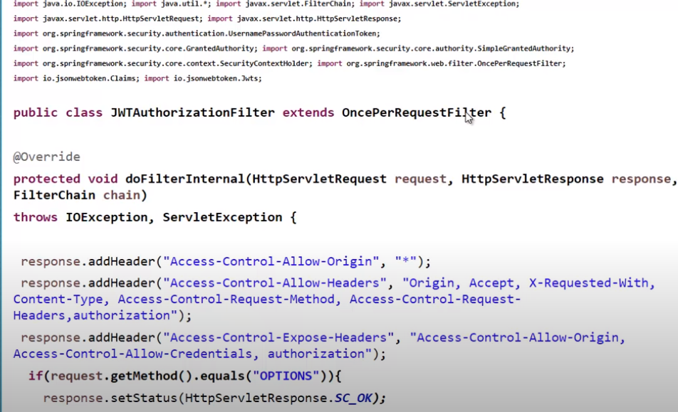

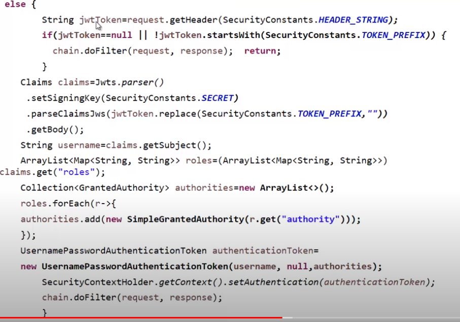

### API

#### login

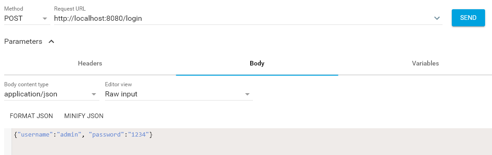

#### getTasks

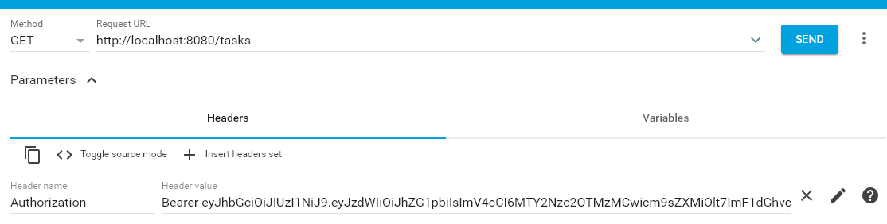

## Partie Front

### Présentation

<pre>
* un seul component
* Local Storage : stockage du token
	* à chaque fois qu'on lance l'authentification, on s'authentifier avec le token
	* SSO : une seule authentification
	
</pre>

### installation

<pre>
* ajouter les dépendances :
	* BootStrap
	* angular2-jwt : 
		* lire le token pour récupération des rôles entre autre
		* gestion de la contextualisation
</pre>

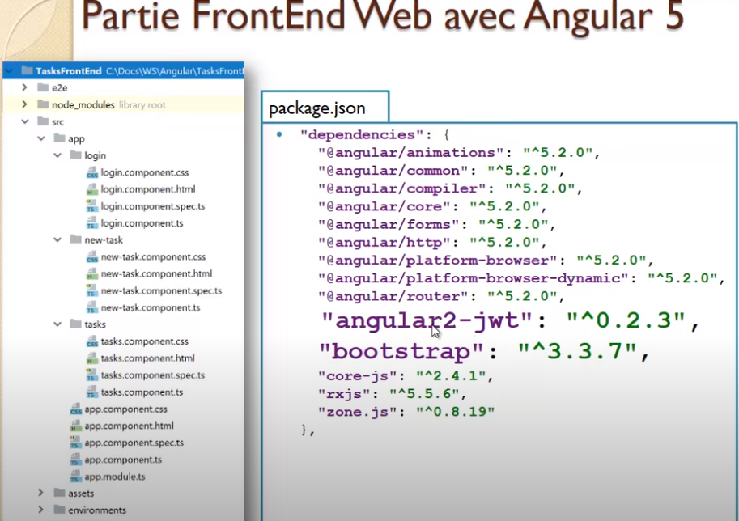

<pre>
* Création de l'application
	* ng v : version angular
	* ng new MyTaskAppWebApp

* Ajout des dépendances
	* npm install --save bootstap@3.3.7 ou autre
	* npm install --save angular2-jwt
	
* Installer Bootstrap ensuite	
</pre>

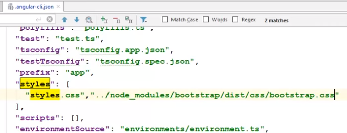

### création des composants

<pre>
ng g c login : composants d'authentification
ng g c tasks : composants pour afficher la liste des tâches
ng g c new-task: composant de création d'une nouvelle tâche
ng g c registration: composant de création utilisateur
</pre>

### routes

<pre>
* création des routes :
	* appRoutes : <b>tableau de route</b>
	* avec une route par défaut.
* Rooter le tableau: RooterModule.forRoot(appRoutes)
	
</pre>

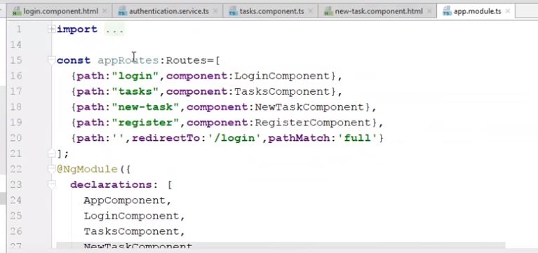
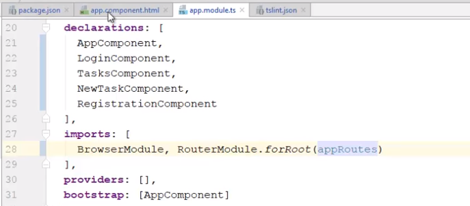

#### test de la config routes

```
<!-- app-component.html -->
<p></p>
<div class="container">
  <button (click)="onLogout()" routerLink="/login" class="btn btn-default">Login</button>
  <button routerLink="/tasks" class="btn btn-default">Tasks</button>
</div>
<p></p>
<div class="container">
  <router-outlet></router-outlet>
</div
```

### login

#### Component

<pre>

* utilisation d'un formulaire : 
	* utilisation des formulaires avec Directives (ngForm, ngModel, ...)
	* Attention ne pas oublier d'importer le module <b>FormsModule</b>
	* pour transmettre les données saises dans le formulaire (f.value)
	
	<i>code</i>
	<i>... form #f="ngForm" (ngSubmit)="onLogin(f.value)" ...</i>

</pre>

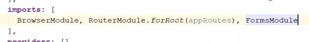

##### Structure html du form

```
<div class="container">
	<div class="col-md-6 col-md-offset-3">

		<!-- erreur d'authentification -->
		<div class="alert alert-danger" *ngIf="mode == 1">
			<strong>Bad credentials ... </strong>
		</div>

		<!-- encart d'authentification -->
		<div class="panel panel-primary">
			<div class="panel-heading">Authentification</div>
			<div class="panel-body">

				...

			</div>
		</div>

	</div>
</div>
```

##### PanelBody

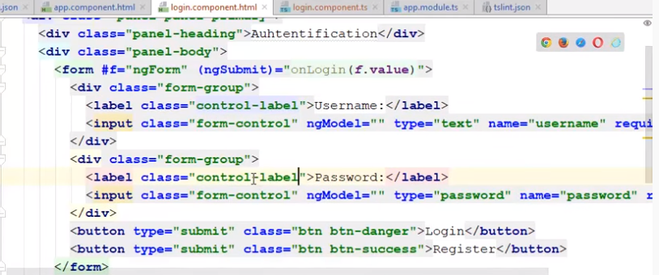

#### Service

<pre>
* Attention ne pas oublier d'importer le module <b>HttpClientModule</b>
* création du fichier : 
	services/authentication.service.ts
* Injection du service :
	app.module.ts => providers: [AuthenticationService]
</pre>

##### onLogin - controller

<pre>
* récupération du <b>token</b> dans les <b>headers</b>
* sauvegarde du token en <b>LocalStorage</b>
* redirection vers la liste des tâches
	* pour la redirection, il faut <b>injecter</b> le <b>service Router</b>
</pre>

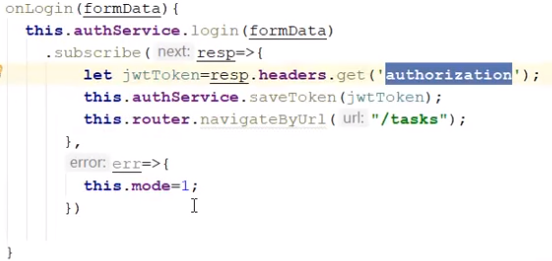

##### login - service

<pre>
<i>Note</i>:
* Par défaut, quand on appelle un service <b>REST</b> les données sont renvoyées au format <b>JSon</b>.
* Pour indiquer qu'on veut la <b>réponse brut</b> et non au format JSon, 
	il faut utiliser l'option suivante dans l'appel du service:
	
	<i>code:
		{<b>observe</b>:'response'}
	</i> 

* Avec la réponse brute, on peut alors inspecter les headers.
</pre>

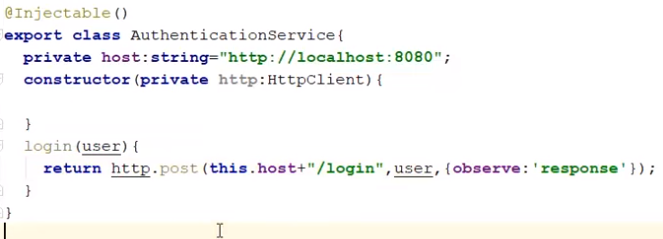

##### saveToken - service

<pre>
Le token est sauvegardé en LocalStorage
</pre>

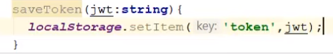

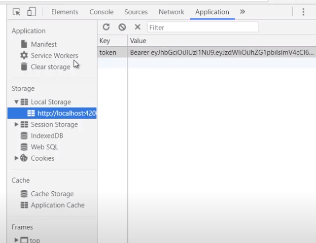

#### CORS

<pre>
* Premier Problème 
* CORS quand on fait du cross domaine
	* application dans un domaine qui tente d'accéder à un autre
	* il va falloir que l'<b>application back-end</b> <b>autorise</b> un certains nombre de choses
	
* Comment résoudre le problème ?
	* autoriser tous les domaines à envoyer des requêtes
	* Dans le filtre JWTAuthorizationFilter (exécuter à chaque requête), ajouter le 

	<i> code:
		response.addHeader("Access-Control-Allow-Origin", "*");
	</i>

</pre>

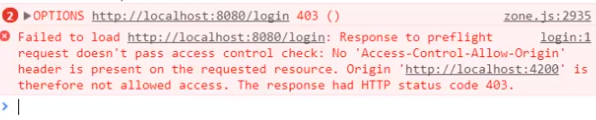

<pre>
* Deuxième problème: 
* côté FrontEnd, on peut ne pas être <b>autorisé</b> à accéder à certains en-tête.
* La requête Post envoie deux requêtes:
	* une première avec <b>OPTIONS</b>
	* Options retourne des en-tête qu'il faut autorisé
	
* Angular tente d'accèder au content-type, c'est à dire il tente d'envoyer
	une requête qui contient 'Content-Type'
* Or la configuration ne le permet pas.
* Il faut donc autorisés les en-têtes qu'il faut envoyés dans le filtre
	* dans la réponse, on va indiquer les headers autorisés.
	* Attention deux paramétrages sont à faire :
	
	<i> code:
	
		// autorisé le client a envoyer ces en-têtes
		response.addHeader("Access-Control-Allow-Headers", "*");
	
		// autorisé le client à exposer ces en-têtes à tes applications
		// revient à autorisé Angular à exposer ces en-têtes
		response.addHeader("Access-Expose-Allow-Headers", "Access-Control-Allow-origin, Authorization, ... ");
	
	</i>


</pre>

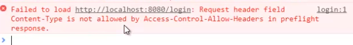

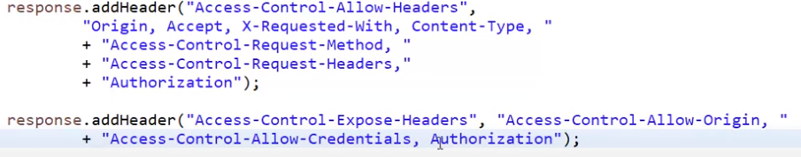

### tasks

#### récupération du token

<pre>

* au préalable de l'envoi ou de l'exécution d'un service,
	* pour récupérer les tasks par exemple
	* il faut <b>récupérer le token</b>
* dans le <b>headers</b> de l'envoi, il faut envoyer le <b>token</b>

* dans le service 
	* création d'une variable : jwtToken
	* chargement du token : <b>loadToken</b>
		<i>
		// code
		this.<b>jwtToken</b> = <b>localStorage</b>.getItem('token');
		</i>

* envoie des headers en options
	<i>
	{<b>headers</b>: new <b>HttpHeaders</b>({'<b>authorization</b>': this.jwtToken})}
	</i>
	
</pre>

#### récupération des tâches

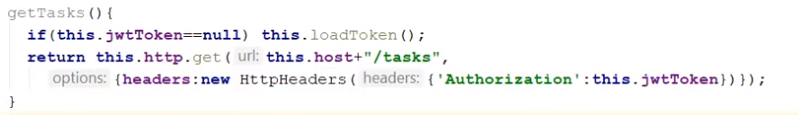

#### Component

##### Service

<pre>
* chargement des tasks
	* appel du service
	* récupération dans un tableau JavaScript ou créer un model sinon ??

* s'il y a <b>erreurs</b>	
	* on fait un <b>logout</b> car le token a pu expiré
	* on redirige vers la page de login
</pre>

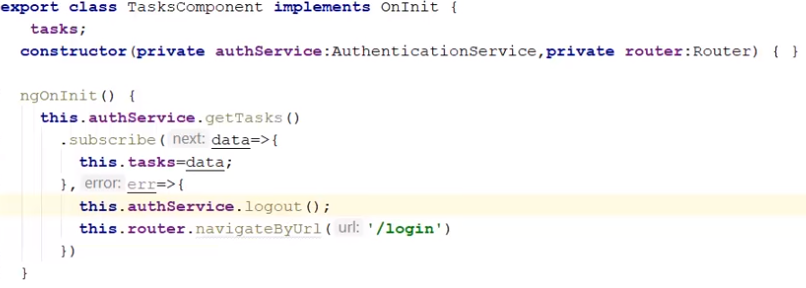

##### LOGIN - LOGOUT

<pre>
* le logout consiste :
	* à <b>vider</b> le <b>localStorage</b> du navigateur
	* dans l'application: mettre la <b>variable</b> token à <b>null</b>
</pre>

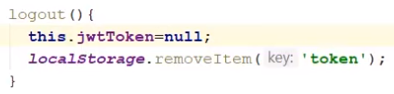

<pre>
* Quand on fait un login, en fin de compte
	* il faut faire l'opération logout
* Cliquer sur login, revient à cliquer sur logout
</pre>

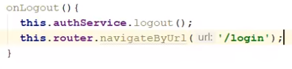

##### OPTIONS

<pre>
* Attention : quand on envoie une requête (getTask par exemple), le <b>navigateur</b>
	envoie d'abord une <b>requête</b> avec <b>OPTIONS automatiquement</b>
* La requête avec <b>OPTIONS</b> ne vient pas avec le Token et cela provoque une erreur
* C'est à dire que le Token n'est pas transmis au serveur
</pre>

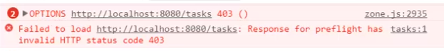
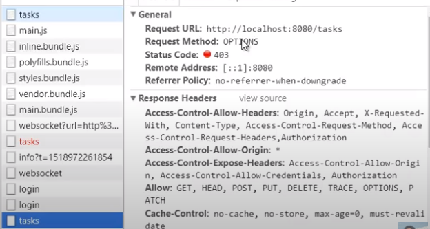

<pre>
* Il faut donc traiter ce cas <b>côté Serveur</b>
	* géré le cas OPTIONS dans une condition
	* les autres méthodes dans une autre conditions
</pre>

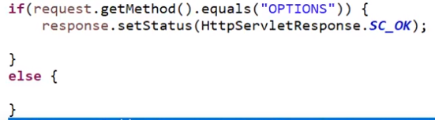

#### affichage des tâches HTML

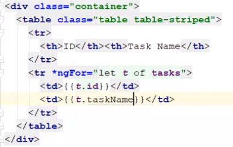
