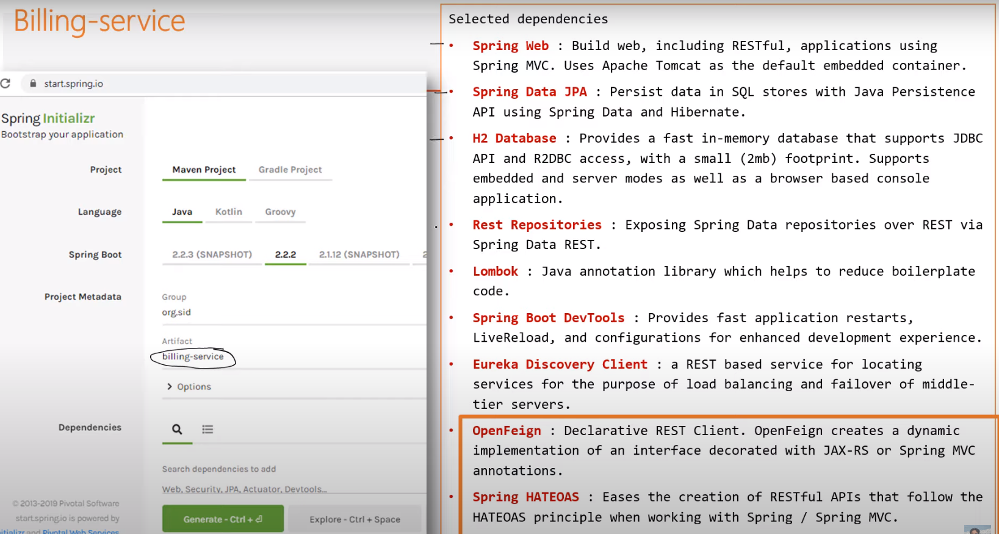
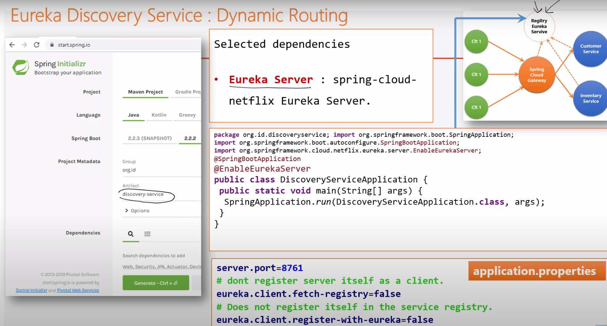

[home](../index-soa.md)

## Application Monolithique

<pre>
- application développée en un seul bloc (war, jar, ear, dll)
- déployé sur un <b>serveur d'application</b> (conteneur web + framework d'inversion de contrôle)
- Principe d'<b>inversion de contrôle</b> : se concentrer sur les aspects fonctionnels 
  pendant que le framework s'occupe des aspects techniques
</pre>


### Architecture
<pre>
- SGBD: relationnel | BigData (MongoDB, ES)
- L'application se compose de plusieurs couches:
  - <b>couche métier</b> : implémentation des spécifications fonctionnelles
  - <b>couche technique</b> : couche d'accès aux données (Spring Data | JPA | Hibernate)
  - <b>couche Web</b> : Rendu côté serveur (Spring MVC - Html géré côté serveur (Moteur de template))
  - <b>couche Web</b> : Rendu côté client (Basé sur les WebServices - Application Distribuée)
</pre>

### Système Distribuée
<pre>
- application basée sur RMI, IOP : application distribu?e mais utilisant que du Java
- application basée sur Corba : application distribuée mais multilanguage, multiplateforme (jusqu'aux années 2000)
- application basée sur les WebService : plus simple, plus léger, plus facile à mettre en place.
  - Communication synchrone
  - Communication asynchrone avec sp?cification JMS : ActiveMQ, Kafka, RabbitMQ,...
</pre>

### Inconvénient

<pre>
- centralisation des besoins fonctionnels (même processus)
  - si une fonction bloque, toute l'application est bloquée

- réalisées dans une seule techno
  - toute le monde doit être forme sur les technos
  - fonctionnalité plus apte à être réalisé avec certaines technos

- Modifications nécessite :
  - tester les régressions (test unitaire | nécessite de développer les tests unitaires)
    - Si pas de tests unitaires, impossible de mesurer l'impact de l'évolution!
    - comment garantir qu'il n'y ai pas d'impact négatif sur les autres fonctionnalités.
  - redéployer toute l'application
    - nécessite une interruption de service
  - difficile à faire évoluer au niveau fonctionnel
    - idéal : fermer à la modification, ouverte aux extensions
    - mais si le besoin fonctionnel change, c'est compliqué

- Livraison en bloc:
  - le client doit attendre beaucoup de temps pour commencer à voir les premières versions

</pre>

## Approche Micro-Services

### Principe

<pre>
> diviser pour mieux régner

- consiste à découper l'application en plusieurs petites applications (petits services) 
  indépendantes appelées Micro-Service.
- l'idée est de découper un grand problème en petites unités implémentées sous forme de micro-services.
- un service est responsable d'une fonctionnalité
- chaque ms peut être développé independamment des autres (devs, tests, déploiement)
- chaque ms peut être développé en utilisant une technologie différente (tiré parti de chaque techno)
- chaque ms tourne dans un processus différent
- la seule relation entre les différentes ms est l'échange de données effectuées à travers 
  les différentes APIs qu'ils exposent
- lorsqu'on les combine, ces ms peuvent réaliser des opérations très complexes
</pre>

### Avantage
<pre>
- les ms sont faiblement couplés puisque chaque ms est physiquement 
  séparé des autres
- indépendance relative entre les différentes équipes
- facilité de tests et déploiement
- livraison continue
- Test Driven Developpement et méthodes agiles
  - commencer par le test-unitaire: expression de besoin
</pre>

### Comment fédérer les WebServices
<pre>
- trés simples : SOAP, REST, ...
- orchestration : framework qui permet de gérer les applications basés sur MS (Spring Cloud)
</pre>

### Performances et mont?e en charge

- HPC: Hight Performance Computing - calcule de haute performance
- Minimiser l'utilisation et la consommation de ressources
- application monolithique :
  - la duplication de l'application entraine la duplication de toute l'application
  - démarrer dans plusieurs machines (plusieurs instances de l'application) : 
    donc des ressouRces importantes (scalablity horizontale avec load balancing)
  <i>Scalabilité verticale</i> : augmenter les perfs du serveur
  <i>Scalabilité horizontale</i> : démarrer l'appli en plusieurs instances
  
  <b>Problème</b> :
  - Le monolithe oblige a démarrer tous les fonctionnalités alors que seule les foncitionnalités
  problématiques auraient besoin de plus de charge et de ressources.
  
  <b>Solution</b> :
  - application ms : seul une nouvelle instance du ms qui l'exige est crée 
  pour pallier la montée en charge

### Découpage et granularité
<pre>
- un ms <==> une fonctionnalité : mais difficile à réaliser
- un ms <==> un module sinon
</pre>

## Architecture Spring-Cloud


### principe
<pre>
Spring Cloud fournit un certains nombre de ms technique
permettant de mettre en oeuvre une architecture ms.
Cette architecture permet de gérer les ms métier.
</pre>

### ms fonctionnel ou métier
<pre>
- un ms est une application complète :
  - couche web: exposer les services
  - couche métier (une fonctionnalit?) business-architecture
  - couche DAO (sa propre base de donn?es ou base de donn?es partag?es)
  - couche technique (composants qui permettent au ms de communiquer)

- Chaque ms est démarré dans une machine (machine virtuel dans le cloud)
- Pour en faire une seule application, on utilise un framework comme <b>Spring Cloud</b> 
qui offre un ensemble de ms technique (avec des implémentations existantes - NetFlix)
</pre>

#### customer-service


#### inventory-service


#### billing-service



### Discovery Service

#### principe
<pre>
> service d'enregistrement

* annuaire qui permet de publier l'adresse de chaque ms
* son rôle : enregistrer tous les ms de l'architecture
* il va enregistrer 3 informations pour chaque ms :
    nom, 
    adresseIp, 
    port
* quand un ms démarre, la première chose qui doit faire est de 
  s'enregistrer/publier auprès de ce service

Eureka-server: implémentation de netflix
</pre>

#### implémentation


<pre>
# pas la peine d'exposer tes services car tu es le serveur
eureka.client.fetch-registry=false
# does not register itself in the service registry
# pas la peine de t'enregistrer dans ton propre annuaire
eureka.client.register-with-eureka=false
</pre>

### Gateway

#### Principe
<pre>
  > service chargé de communiquer avec l'extérieur
  > proxy - orchestrateur - load-balancing

  * Tous les clients|application envoient des requêtes les envoie au gateway 
    et ne peuvent les envoyer directement aux ms.

  * les requêtes sont envoyées au gateway qui interroge le service d'enregistement 
    pour obtenir l'adresse du ms et ainsi aiguille la requête vers le bon ms

  * joue le rôle de <b>load-balancer</b>:
    * utilise un système d'équilibrage de charge pour aiguiller intelligemment vers le bon ms
    * combien d'instance de ms dois-je utiliser pour supporter la charge, 
      on utilise un outils d'orchestration
      (docker swarm | Kubernetes : utilise des conteneurs basés sur Docker)

  * On distingue plusieurs types de gateway:
  - multithreading avec I/O bloquante
  - multithredding avec I/O non bloquante (NIO - Java7)
</pre>


#### application.properties
<pre>
// par défaut les noms des microservices sont publiés dans l'annuaire
avec des majuscules.
Pour utiliser des minuscules, qui sont transformés en majuscule par la gateway,
il faut utiliser la clé suivante: 
<b>spring.cloud.gateway.discovery.locator.lowerCaseServiceId=true</b>
</pre>


#### Type d'implementation

<pre>
* multithreading avec I/O bloquante 
* multithreading avec I/O non bloquante 
</pre>


<pre>

* multithreading avec I/O bloquante 
Type Tomcat:
* Le thread peut être mobilisé pour une durée plus ou moins longue.
* Le risque c'est que tous les threads soient mobilisés et d'avoir une
interruption de service car le serveur ne peut dépasser un certains nombre
 de thread
* Dans ce mode, c'est le débit/réseau qui peut provoquer cette situation


* multithreading avec I/O non bloquante 
<b>Problématique</b>:
* Il y a un seul thread qui utiliser. Que faire si on veut utiliser
tous les coeurs d'un processeur ?
Pour traiters les requêtes, le thread va utiliser les workers threads.
S'il y 4 CPUs, on utiliser les 4.

On utiliser un single Thread 
  * qui utilise un selector qui utilise une boucle infini 
  * la boucle infini traite toutes les communications avec les canaux (channel)
  * Les channel ne sont pas bloquants, le thread écrit/lit des données avec les buffers
Tous les channels utilisent le même selector
</pre>

#### zuul (netflix)

##### principe
<pre>
Zuul implémente une gateway dans un mode multithreading avec I/O bloquante.

<b>Carctéristique</b>:
* Système non scalable verticalement. Si le nombre de threads est atteint
les ressouces de la machine, ne sont pas forcément toute utilisée.
* Système qui n'est pas prédictible. On ne peut pas dire combien on peut
traiter de requêtes par secondes car dépend du débit
</pre>

#### spring cloud gateway

##### principe
<pre>
Gateway en mode mutlithreading avec I/O non bloquante
<b>Ribon</b> : utilisé par Spring-Cloud pour l'équilibrage de charge.

<b>Carctéristique</b>:
* Système scalable verticalement. Si le nombre de threads est atteint
les ressouces de la machine, ne sont pas forcément toute utilisée.
* Système prédictible, il n'y a pas de restrictions sur le nombre
de requêtes traités
</pre>


##### Application.properties
```
server.port=8888
spring.application.name=gateway-service
spring.cloud.discovery.enabled=true
spring.cloud.gateway.discovery.locator.lowerCaseServiceId=true
```

##### Configuration

###### principe

###### statique avec fichiers statique
<pre>
Pour configurer la Gateway, il faut configurer les routes
id: identifiant de la route
uri: url du ms
predicates: condition pour aiguiller la requêtes.
  Exemple : si la requête dont l'url contient /customers/, tu aiguilles
  vers l'URI
</pre>

```
spring:
  cloud:
    gateway:
      routes:
        - id: r1
          uri: http://localhost:8081/
          predicates:
            - Path= /customers/**
        - id: r2
          uri: http://localhost:8082/
          predicates:
            - Path= /products/**
```


###### statique avec classes de configuration
<pre>
	 Configuration Java des routes
	 A utiliser pour les routes statics
	 - dont on connait l'adresse externe à l'avance
	  et qui n'ont pas vocation a s'enregister dans le service discovery
	 
	 Avec cette méthode, si plusieurs instance de ms, il n'y a pas
	 de load balancing
</pre>
```
	@Bean
	RouteLocator gatewayRoutes(RouteLocatorBuilder routeLocatorBuilder){
		return routeLocatorBuilder.routes()
				.route((r) -> r.path("/customers/**").uri("http://localhost:8081/"))
				.route((r) -> r.path("/products/**").uri("http://localhost:8082/"))
				.build();
```

###### static avec le service eureka
<pre>
On aiguille non plus vers une URL fixe mais vers une uri qui est le nom
du microservice.
lb: load-balancing pour faire du ms.

Dans ce mode, on connait les ms et leur nom
</pre>
```
	@Bean
	RouteLocator gatewayRoutes(RouteLocatorBuilder routeLocatorBuilder){
		return routeLocatorBuilder.routes()
								  .route((r) -> r.path("/customers/**").uri("lb://CUSTOMER-SERVICE"))
								  .route((r) -> r.path("/products/**").uri("lb://PRODUCT-SERVICE"))
								  .build();
	}
```

###### dynamic avec le service eureka
<pre>
Dans ce mode, on ne connait pas le nom des ms, ni leur nombre
La gateway récupère dans l'url, le nom du microserice et utilise le 
service discovery pour faire le lien.

<b>Exemple</b>:
url ms: http://localhost:8082/products
url gateway: http://localhost:8888/product-service/products
config discovery:
le ms 'product-service' est aiguiller vers l'url suivante
  product-service =>  localhost:product-service:8082
</pre>

```
	@Bean
	DiscoveryClientRouteDefinitionLocator definitionLocator(ReactiveDiscoveryClient rdc,
			DiscoveryLocatorProperties properties) {
		return new DiscoveryClientRouteDefinitionLocator(rdc, properties);
	}
```


### Configuration service
<pre>
  > service qui permet de centraliser la configuration

  * centraliser la configuration de l'ensemble des ms
  * L'idée, c'est que l'on ne configure pas un ms mais l'application.
  * S'il faut gérer un fichier de config (application.properties) par ms, 
    cela devient compliqué: redondance d'information.
  * en général les fichiers de configuration sont déposés 
    dans un gestionnaire de version
    - application.properties : configuration commune
    - fichier spécifique par ms
  
  * quand le ms démarre :
    *  il demande sa configuration au service de configuration
    *  qui le lui retourne en le récupérant au niveau du gestionnaire de source

  * avantage : si la config change le service configuration est capable 
    de lui donner l'information directement, sous forme de requête http.
  * Le ms met à jour sa configuration à chaud (en mémoire) sans redémarrage
</pre>
  
## DevOps
<pre>
Les ms demandent plus de ressources pour déployer une application
DevOps :
* Developpeur : mise à jour régulière 
* Operationnel : 
  - stabilité
  - automatisation des opérations de déploiement

<b>Repository :GitLab</b>
Le <b>développeur</b> code et fait des tests unitaires
Il push sont code sur gitlab avec des <b>pull-requests</b>

<b>Pipeline Jenkins</b>
Une pull-request va déclencher une pipeline d'opérations:
* pop (récupération du code source sur le repository)
* audit de code (SONAR)
* <b>maven</b> pour compiler et packager (jar)
* <b>maven</b> pour déployer <b>Nexus</b>

* <b>docker </b>: 
  * permet de déployer un ms dans un conteneur et
  * <b>conteneur</b> : 
    - fait pour démarrer une application
    - fait pour tourner l'appli qq soit l'architecture
      dans son popre ecosystème
  * déployer / démmarrer le conteneur dans une machine

* <b>VM</b>: 
  - fait pour démarrer plusieurs applications
  - fait pour démarrer plusieurs conteneurs
  - tous les conteneurs installés sur la même machine partage
    le même OS
  Quand on déploie un ms, il faut savoir quel configuration de 
  VM il faut:
  - en terme de mémoire
  - en terme d'espace-disque
  - en terme de CPU

* <b>ANSIBLE</b> : 
  - permet de gérer les configurations de machine
  - permet de créer des VMs, de prendre les conteneurs
  et déployer les conteneurs.

* <b>Kubernetes</b> 
  * surveille l'architecture des ms et l'orchestrations des conteneurs:
    - qd il y a un pb de montée en charge, démarre un ms
    - qd il y a un ms qui bloque, il l'arrête
    - qd il y a une maj, nvlle version, il garde l'ancienne version 
      jusqu'à ce qu'il démarre la nouvelle version
</pre>

## Communication entre micro-service

### communication synchrone
<pre>
* la communication se fait via : REST
</pre>

#### RestTemplate
<pre>
<b>RestTemplate</b> : requêtes http vers un service pour récupérer
le <b>json</b> de résultat.
Appel programmatique qui est verbeux.
</pre>

#### Spring Cloud Feign

##### principe
<pre>
Avec Spring Cloud, un service a été ajouté pour faire l'appel de manière
délcarative et non plus programmatique (RestTemplate).
<b>OpenFeign</b> : 
- communique avec les autres ms.
- utilise HATEOAS pour sérialiser/déserialiser le json reçu/envoyé au service.
- fonctionne bien avec <b>Spring Date Rest</b> qui fait des servies HATEOAS.
- permet de faire des appels de service comme si on utilisait Spring-Data.
</pre>

#### implémentation
<pre>
* créer un package Service pour déclarer les services Feign
* <b>@EnableFeignClient</b> : pour activer les services Feign.
</pre>

### communication asynchrone
<pre>
* asyncrhone via des brokers : JMS, KAFKA
* ms, gateway envoie un message vers file d'attente, boite à lettre
* un ms fait un subscribe pour être à l'écoute de la file d'attente
* dès qu'un message arrive dans la boite, il est transférés 
  à tous les ms qui ont souscrit à la boite
* IMPORTANT : lors d'une modification ou ajout, le gateway pousse 
  des infos au broker.
  Toutes les instances ds ms abonnés peuvent alors mettre à jour 
  leur référentiel.
</pre>

## Authentification
<pre>
- <b>stateless</b>: 
  ms d'authentification qui gère, stocke les [users | rôles]
- chaque ms met en oeuvre <b>Spring-Security</b> : filtre configuré
- <b>authentification</b> : quand une requête arrive sur le gateway, 
  - une identification se fait sur le ms d'autentification (ex: keycloak)
  - un token (JWT: identity du user) est alors retourné au gateway en cas d'authentification réussi.
  - le token est renvoyé au client, stocké dans le local storage de l'application du navigateur
- <b>token</b> : qd le client envoie alors une requête, 
  le token est envoyé au gateway qui dispatche la requêtre vers le ms
- le filtre spring-security du ms, regarde le header 'Authorization', récupère le token.
- La signature du token est analysé avec un public | private key (expiration).
- Si valide, les rôles du user sont analysés et en fonction des droits exécute ou non l'action
</pre>