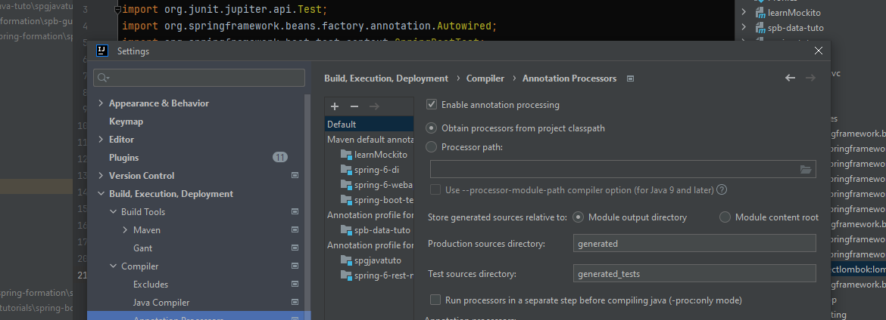

## Lombok

### Principe
* Lombok permet d'ajouter du code pour nous
* le code est ajouté au moment de la compilation. Il faut donc configurer intelliJ pour que la compilation fonctionne. Avec maven, cela fonctionnera par défaut.

* lombok s'accroche (hook) à l'API d'un processeur d'annotation. Le code source brut est transmis à Lombok pour la génération de code avant que la compilation Java ne se poursuive.
* Lombok produit un code compilé.
* le but est de fournir des annotations pour aider à éliminer le code cérémoniel et donc d'avoir un code plus propre

### override
implémenter la méthode souhaité pour que Lombok ne génère pas cette méthode.

### Features
#### val
déclarer une variable locale finale
#### var
créer une variable mutable
#### @Getter / @Setter
créer des getters/setters pour tous les attributs

#### @ToString
génére le nom de la classe puis les propriétés des champs

@EqualsAndHashCode
possibilité d'exclure des propriétés (pour JPA notamment)

#### @NoArgsConstructor

#### @AllArgsConstructor

#### @RequiredArgsConstructor
permet de définir un constructeur pour les propriétés définies

#### @Data
combine : @Getter @Setter @ToString @EqualsAndHashCode @RequiredArgsConstructor

#### @Value
* sert à créer des objets immuables
 
```java
import lombok.Value;

@Value
public class Personne {
    String nom;
    int age;
}
// Ce code génère :
/*
Un constructeur : public Personne(String nom, int age)
Deux getters : getNom() et getAge()
equals(), hashCode() et toString()
Pas de setters
La classe est final
Les champs sont private final
*/
```
* dans une classe de configuration
```yaml
app:
  name: MonAppli
  version: 1.2.3
```

```java
import lombok.Value;
import org.springframework.boot.context.properties.ConfigurationProperties;
import org.springframework.context.annotation.Configuration;

@Value
@Configuration
@ConfigurationProperties(prefix = "app")
public class AppProperties {
    String name;
    String version;
}
```
*  pour créer un DTO : le DTO est immuable, clair, et prêt pour la sérialisation/désérialisation avec Jackson
```java
import lombok.Value;

@Value
public class ProduitDto {
    Long id;
    String nom;
    double prix;
}
```
#### @NonNull

#### @Builder
* implémente le pattern builder
#### @SneakyThrows
* permet de lever les exceptions contrôlées/vérifiées sans avoir à utiliser la clause throws

#### @Synchronized
* implémentation de java Synchronized

#### @Log

#### @Slf4j
* créer un logger Slf4j qui est une façade (interface) pour un cadre de journalisation
* SpringBoot utilise LogBack comme implémentation

## Record


