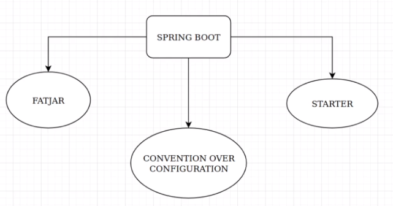

# Spring-Boot

[retour](./spb-index.md)

## principe

<pre>
Convention over configuration
* mécanisme d'auto-configuration en fonction des libraires utilisées
* spring simplifie la configuration en faisant des choix à notre place
</pre>



### fatjar
<pre>
Fatjar: le build embarque un serveur d'application
</pre>

#### ContextPath
<pre>
contextPath = ""
- identifie le serveur Tomcat 
- identifie l'application
Car on a qu'une application sur le tomcat
</pre>

### starter
<pre>
Starter: spring/maven importe les dépendances pour les briques utilisées (web, data...)
Avec le <b>starter</b>, l'infrastructure est embarquée pour démarrer la fonctionnalité.
Une implémentation par défaut est utilisé.
Cela permet d'éviter les erreurs de type:
* NoClassDefoundError
* NoSuchMethodExeption
car une implémentation par défaut est présente.
</pre>

### @SpringBootApplication

#### pom: autoconfigure

```
  <dependency>
    <groupId>org.springframework.boot</groupId>
    <artifactId>spring-boot-autoconfigure</artifactId>
    <version>2.2.4.RELEASE</version>
  </dependency>
```

#### principe

<pre>
L'annotation @SpringBootApplication inclue les annotations
- @Configuration
- @ComponentScan
- @EnableAutoConfiguration

Cette annotation se trouve dans la librairie: spring-boot-autoconfigure

<i>
@SpringBootApplication
public class App
{
    public static void main( String[] args )
    {
        ApplicationContext applicationContext = <b>SpringApplication.run(App.class, args)</b>;
        MovieController movieController = applicationContext.getBean(MovieController.class);
        movieController.addUsingConsole();
    }
}
</i>

SpringApplication.run( ... ) : permet de réccupérer l'applicationContext.
args: argument de la machine virtuelle pour configurer SpringBoot au besoin.

</pre>

### @EnableAutoConfiguration

<pre>
D'une part, il faut différencier:
* la config applicative (celle de notre application)
* la configuration des autres packages, des dépendances: autoconfiguration

La configuration applicative est prioritaire.
La configuration automatique ne s'applique que si un bean n'existe pas.

Avec cette annotation, Spring va partir à la recherche dans les <b>librairies
du projet</b> de certaines classes annotées <b>@Configuration</b>.

Ces <b>classes</b> qui <b>ne sont pas dans nos packages</b> ne sont pas détectés par le <b>@ComponentScan</b>.

<i>Exemple: Configuration du parent </i>
Pour la configuration automatique du tomcat par exemple, c'est une configuration détectée
dans une classe de la dépendance <i>spring-boot-starter-web</i> qui est recherchée.
Cette classe fait le travail de <b>configuration</b> du tomcat. 

IMPORTANT: 
Qu'est ce qui fait que Spring-Boot va créer ou non les beans?
@ConditionalOnMissingBean
@ConditionalOnClass
@ConditionalOnBean
</pre>

#### AutoConfigure

##### principe
<pre>
La configuration automatique ne s'applique que sur des infrastructures
connues de spring-boot

Toutes les classes de configurations à scanner et qui
vont être traités se trouve dans la dépendance:

<b>org.springframework.boot.autoconfigure</b>

Dans le jar, il faut consulter le fichier

META-INF/Spring/
  org.springframework.boot.autoconfigure.AutoConfigurationImport

Ancien mode:
spring.factories(spring.properties??) : la liste des fichiers étaient dans une variable

</pre>

##### création
<pre>
Il est possible de se créer ses propres classes d'autoconfiguration

Il faut créer:
- sa classe de configuration hors de la config applicative
- recréer dans le folder Resource, la structure :

META-INF/Spring/
  org.springframework.boot.autoconfigure.AutoConfigurationImport

</pre>

#### @ConditionalOnMissingBean
<pre>
s'exécute que si dans le context de Spring, cet objet
n'existe pas en tant que bean

Exemple: 
ProrpertyPlaceHolderConfigurer:
  => spring-context => autoconfigure
</pre>

#### @ConditionalOnClass
<pre>
test si des classes sont dans le classpath
</pre>

#### @ConditionalOnBean
<pre>
Est crée qui si le bean est dans le classPath
Donc, le starter est définit.
</pre>

## spb et maven

### gestion du cycle de vie de l'application avec maven

<pre>
La gestion est assuré par les starters
D'où viennent la gestion des version des Spring-Boot?
Cela vient de la dépendance du projet parent.
On indique que notre projet hérite d'un projet plus vaste qui est
<b><a href="https://mvnrepository.com/artifact/org.springframework.boot/spring-boot-starter-parent/2.7.5" target="_blank">spring-boot-starter-parent-</a></b>.
On bénéfice de tout ce qui est déclaré au niveau du parent.
Pas besoin de le redire.

Le starter fournit:
- aucune dépendance à la compilation
- mais fournit des tonnes de dépendances gérées 

managed dependencies:
- dépendances qui ne sont pas directement téléchargées 
- si on en a besoin le starter fournit les version par défaut

Le starter Web, permet par exemple de démarrer un tomcat.
</pre>

### questions

#### Question 1:

<pre>
- Faut-il un starter à minima?
- s'il on a aucun starter, la bonne manière est-elle de mettre
la dépendance suivante :
<i>
    < dependency >
      < groupId >org.springframework.boot< />
      < artifactId>spring-boot-autoconfigure< />
    < />
</i>
Non, par défaut, spring-initializr met la dépendance suivante, 
s'il non de met aucune dépendance: <b>spring-boot-starter</b>.

Cette dépendance a une dépendance transitive vers la 
dépendance <b>spring-boot-autoconfigure</b> et en cascade vers
<b>spring-contexte</b>
</pre>

```
<dependency>
  <groupId>org.springframework.boot</groupId>
  <artifactId>spring-boot-starter</artifactId>
</dependency>
```

#### Question-2:

<pre>
A ce stade, qu'apporte Spring-Boot ?
Pas grand chose.
La réponse est liée à la section suivante et au plugin maven.
Il facilite le build, le déploiement et l'exécution de l'application.
</pre>

### spring-boot-maven-plugin

#### pom.xml

```
<build>
    <plugins>
      <plugin>
        <groupId>org.springframework.boot</groupId>
        <artifactId>spring-boot-maven-plugin</artifactId>
      </plugin>
    </plugins>
</build>
```

<pre>
- permet de démarrer une application spring-boot

mvn spring-boot:run

lance la classe annnoté : @SpringBootApplication

Gestion des dépendances:
Ce plugin est essentiel car il permet de builer un jar 
qui fournit l'ensemble des dépendances nécessaires.

Sans ce plugin, on a pas dans le META-INF/manifest.xml, les infos:
- indiquant la classe à exécuter
- le classpath vers toutes les libs nécessaires
Ces infos sont nécéssaire quand on lance la commande:
java -jar core-1.0-SNAPHOT.jar

De plus comment faire que le classpath soit portable?
Comment faire si on veut déployer le jar sur une autre machine?
Le plugin permet de builder un jar qui fournit les libs nécessaires
dans le packaging:

 <i>spring-boot-maven-plugin:2.2.4.RELEASE:repackage</i>

 repackage: permet de packager le jar original en un nouveau jar.
 Ce nouveau jar contient:
 - un répertoire lib avec l'ensemble des libs que l'application a besoin
 - met à jour le Manifest pour définir:
  - la classe à lancer
  - classes et librairies qui font partis du classpath

</pre>

## spb web starter

### pom.xml

```
<dependency>
  <groupId>org.springframework.boot</groupId>
  <artifactId>spring-boot-starter-web</artifactId>
</dependency>
```

### principe

<pre>
Rien n'empêche une appli java de démarrer un conteneur de servlet
On dépose tomcat dans l'application web
On peut démarrer ainsi automatiquement le conteneur web.
	
Deux questions: 
- d'ou vient tomcat ?
  ==> @EnableAutoConfiguration
  
- faut-il vraiment redémarrer l'application pour voir les changements
	quand on modifie le contenu static?
</pre>

### fichier static

<pre>
urls:
* rien ou / pointe par défaut vers le fichier index.html
* /error ==> pour fournir une page d'erreur correcte

mettre les pages dans un répertoire 
/static
	- index.html
</pre>

### configurer un autre serveur que tomcat

```
<dependency>
	<groupId>org.springframework.boot</groupId>
	<artifactId>spring-boot-starter-web</artifactId>
      	<exclusions>
        	<exclusion>
          		<groupId>org.springframework.boot</groupId>
          		<artifactId>spring-boot-starter-tomcat</artifactId>
        	</exclusion>
      	</exclusions>

</dependency>
<dependency>
	<groupId>org.springframework.boot</groupId>
	<artifactId>spring-boot-starter-undertow</artifactId>
</dependency>
```

## application.properties

<a href="https://docs.spring.io/spring-boot/docs/current/reference/html/application-properties.html" target="_blank">liste des propriétés</a>


<pre>
* Fichier de ressource application.properties à la racine du classpath.
* sert à stocker les clés techniques

S'il est nécessaire d'ajoute des clés particulières, il faut les 
enregistrer de la manière suivante :

Ressources/META-INF/
  additional-spring-configuration-metadata.json
==> Voir exemple dans un starter

Pour tout ajout de clés métier et non technique, et qui ressort
de la configuration applicative, il faut utiliser un autre 
fichier de propriétés.
</pre>

## logs
<pre>
Autoconfiguration: 
la configuration est portée par défaut par une configuration embarquée
par défaut c'est logback.xml qui est configuré.
</pre>

## starters

### spring.cloud
<pre>
infrastructure proposé par Spring Boot pour mettre en oeuvre une architecture MicroService.
Solution sur plusieurs serveurs distribuées à base de micro-services (redondance service, partage de charge)
</pre>

### hateoas
<pre>
* embarque les liens des entités liées
* n'embarque pas les structures JSons des entitiés associées
</pre>

### halexplorer
<pre>
swagger: contrôleur explicite
halexplorer: contrôleur implicite créé par Spring
</pre>

## profiles
<pre>
spring.profiles.active=dev
</pre>