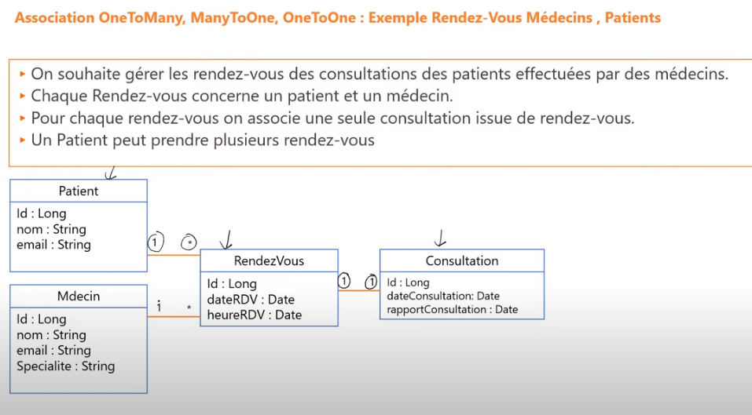
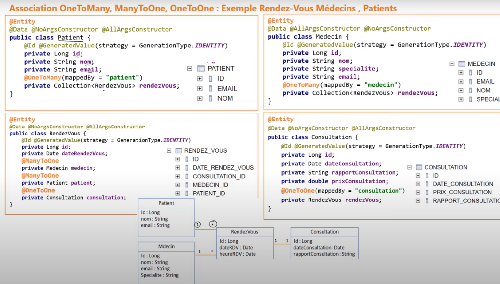
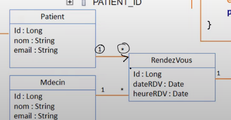

# Mapping Association

## many-to-one / one-to-many

### Modèle de données

### Schéma entity

### association bidirectionnelle / unidirectionnelle

<pre>
* un patient patient peut avoir plusieurs rendez-vous
	* se traduit par une <b>Collection</b> de <i>RendezVous</i> au niveau de <i>Patient</i>
* un rendez vous est définit pour 1 patient
	* se traduit par une entité <i>Patient</i> <b>unique</b> au niveau de d'un <i>RendezVous</i>
</pre>

#### association bidirectionnelle

<pre>
* A partir du <i>Patient</i>, je peux atteindre ses <i>RendezVous</i>
* A partir d'un <i>RendezVous</i>, je peux connaître <i>son Patient</i>
</pre>

#### association unidiretionnelle

<pre>
* Suivant le Sens, il n'est pas nécessaire de déclarer de référencer l'entité.
* Exemple: Ci-après, releation unidrectionnelle
	* dans <i>Patient</i>, je déclare la la Collection de <i>RendezVous</i>
	* dans <i>RendezVous</i>, je n'ai pas beson de déclarer la classe <i>Patient</i>
* Dans ce cas, une <b>table d'association</b> est créé.
</pre>

### Base de données
<pre>
* se définit par la création de deux tables
	* [PATIENT](id, ...)
	* [RENDEZ_VOUS] (id, ... , PATIENT_ID)
</pre>

#### clé-étrangère
<pre>
* <i>Note</i> : Dans le relationnel, il n'y pas la notion de bidirectionnel
* Dans une relation [1..*], la clé primaire de la classe(1) devient clé étrangère au niveau de la classe où il y a (*)
</pre>

### annotation jpa @ManyToOne / @OneToMany
<pre>
* <i>@ManyToOne</i> : <b>l'attribut</b> qui a cette annotation est une <b>colonne</b> en base qui est une <b>clé étrangère</b>
* <i>@oneToMany</i> : <b>l'attribut</b> est une <b>collection</b> est n'est donc pas matérialisé en base comme attribut
	* soit <b>avec</b> table d'association
	* soit <b>sans</b> table d'association : la <b>classe</b> où figure cet attribut est <b>clé étrangère</b> dans la classe de collection
</pre>

#### JoinedColumn(name="PATIENT_ID")
<pre>
* permet de définir le <b>nom</b> de la <b>clé-étrangère</b>
* si non définit, sera attribué par défaut : <b>nom de l'attribut</b> dans la classe <b>plus suffixe '_ID'</b>
</pre>

#### mappedBy (@OneToMany)
<pre>
* permet d'indiquer que la <b>relation</b> est <b>bidirectionnelle</b>
* il faut l'indiquer à JPA : <b>@OneToMany(mappedBy = "patient")</b>
	* indique à JPA que la relation est déjà mappé dans la classe <i>RendezVous</i> via l'attribut <i>Patient</i>
		* se traduit par la création d'une <b>clé étrangère</b> dans la table <i>RendezVous</i>
	* indique à JPA que les deux relations @oneToMany et @ManyToOne, sont la même représentation relationnelle
	* cela lui indique, que cela se traduit par la <b>même clé-étrangère</b>
*<b>IMPORTANT</b> : si la propriété est omise, une <b>table d'association</b> sera crée en base [PATIENT_RENDEZ_VOUS]
</pre>

#### fetch (LAZY | EAGER)

##### fetch=FetchType.LAZY
<pre>
* permet de dire à JPA/Hibernate, au chargement d'un objet <i>Patient</i>, a partir de la base de données:
	* de <b>ne pas charger en mémoire</b> la liste des <i>RendezVous</i> de ce patient
	* les autes informations seront remontées dans l'objet
* la <b>récupération</b> se fera au moment de l'appel du <b>getter</b>
	* c'est un chargement à la demande
	* au momemnt, où l'on en a besoin
</pre>

##### fetch=FetchType.EAGER
<pre>
* les <b>valeurs</b> de la <b>collection</b> sont <b>remontées directement</b> quand on charge le Patient
* <b>inconvénient</b> : chargé en mémoire des données qui ne sont pas utilisées
* <i>note</i> : à un intérêt dans certains cas :
	* gestion des rôles : charger les rôles de l'utilisateur quand on récupère ses rôles
	* composition : voiture [moteur|roues|...]
*<b>IMPORTANT</b> : il faut initailiser la collection avec EAGER dans la déclaration
	* new ArrayList<Entity>;
</pre>

## one-to-one
<pre>
* idem oneToMany
* <b>association bidirectionnelle</b>
* il y a une clé étrangère qui sera placée dans l'une ou l'autre table
	* <b>mappedBy</b> => indique que la clé étrangère est déjà mappé dans l'autre classe 
</pre>
## many-to-many