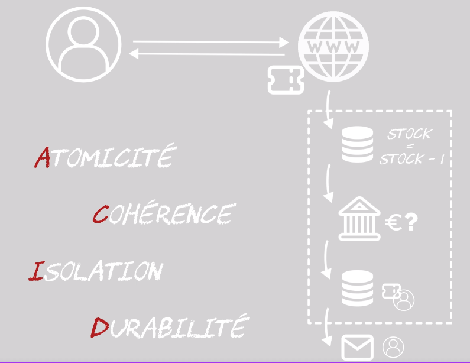
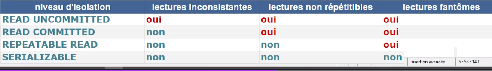

# Introduction à la concurrence d'accès

[retour](./../readme.md)

## 1. Propriétés ACID des transactions

<pre>
- Atomicité (rollback) :
  Une transaction est opération atomique qui garantit que toutes les actions sont 
  entièrement exécutées ou qu'elle n'ont aucun effet

- Cohérence
  Pour une transaction validées, les données et ressources sont alors dans un état
  cohérent d'un point de vue métier.

- Isolation 
  * contexte : plusieurs transactions peuvent manipuler le même jeu de données
  * chaque transaction doit être isolée des autres afin d'éviter la corruption de données
  * une transaction ne voit pas les modifs d'une autre (voir les différents paramétrages)

- Durabilité (commit)
  * pour une transaction terminée, les résultats doivent survivre à toute panne du système

<b>Important</b>:
- Atomicité, Cohérence et Durabilité sont absolues.
- L'isolation est relative et paramétrable.

</pre>



## 2. Problèmes consécutifs à une concurrence sans controle

### 2.1 Défaut de serialisabilité

- les mises à jours perdues
- tuples fantômes

### 2.2 Défaut de recouvrabilité

Une exécution non-recouvrable introduit un conflit insolvable entre les commit effectué par une T et les rollback d'une autre.
On se trouve face à une exécution concurrente qui rend impossible le respect d'au moins une des deux propriétés transactionnelles requqites : la durabilité (Commit) ou l'atomicité (Rollback).

#### 2.2.1. Lecture sale

T2 lit une mise à jour de T1 alors que T1 n'a pas validé. La lecture sâle transmet un tuple modifié par T1 à T2.
T2 peut modifier et valider. Quid d'un rollback de T1?
T1 devient dépendante de T2 et ne peut plus faire de rollback car T2 a committé.

- R(T2): possible
- R(T1): impossible
- ==> exécution non recouvrable

##### Annulation en cascade

Idée : interdire T2 ayant fait une lecture sâle à partir de T1 de committer avant T1.
Si Rollback de T1, on rollback T2.

```
Pour eviter l'annulation en cascade, T2 ne doit lire qu'à partir des T validées
```

Exemple: r1[x] w1[y] r2[y] c1 w2[x] c2

- R(T1): possible mais engendre R(T2)
- R(T2) : possible, écriture après commit de T1
- ==> exécution recouvrable

En pratique:
Aucun SGBD ne fait d'annulation en cascade. La solution est donc d'interdire les dirty-read.

##### 2 solutions

- Soit T2 lit l'image avant de T1, qui par définition est une valeur validée
- Soit on met en attente les lectures sur des tuples en cours de modification

#### 2.2.2. Ecriture sale

- T1 modifie un tuple, T2 modifie le même tuple sans que T1 valide
- T1 fait un rollback, que se passe-t-il pour T2?
- Restauration de l'image avant de T1 et on pert l'écriture de T2
- ==> L'écriture sale efface un tuple modifié par une autre T par rétablissement de l'image avant.

#### Recouvrabilité strict

- on peut avoir des transactions sérialisables et non recouvrables et réciproquement
- le respect des propriétés ACID des T imposent au SGBD d'assurer la sérialisabilité des T et la recouvrabilité dite stricte, sans écriture ni lecture sale

#### 2.2.3 Synthèse

```
Principe:
* généralement, on cherche les écritures dans l'exécution.
* Ensuite, pour une écriture donnée, on vérifie s'il existe après d'autres lectures/écritures sur la même variable, réalisées par d'autres transactions.

  Anaylse :
* Une lecture peut indiquer un problème de recouvrablité (T2 lit de T1 des données non validées et commit)
* Une lecture peut indiquer un problème d'annulation en cascade (T2 lit des données non validées)
* Une écriture un problème d'exécution stricte (T2 ecrit le même tuple que T1 qui n'a pas validé)

Execution:
Recouvrable <== Eviter les annulation en cascade <== stricte
```

## 3. Les niveaux d'isolation



### READ COMMITED

<pre>
- la transaction peut être influencée par les commits des autres tx.
- si une données est commitée par une autre tx, elle est visible.
</pre>

### REPEATABLE READ

<pre>
- ce qui a été lu ne sera pas changé par une autre tx.
</pre>

### SERIALISABLE

<pre>
* comme si les tx s'effectuait les unes après les autres.
* une tx concurrent qui modifie la même donnée sera rejeté si elle est 
  dans ce mode.
</pre>

## 4- PostGreSQL

### Commandes

```
show transaction isolation level;

set transaction isolation level read committed;
set transaction isolation level repeatable read;
set transaction isolation level serializable;
```

## 5- Hibernate

### dead-lock

#### problématique

<pre>
hibernate peut faire du dead-lock
Scénario
* 2 session en parallèle qui font de la modification sur au moins 2 entités identique
* l'ordre des modifications n'est pas garanti
* application à fort volume de modification
</pre>

#### solution

<pre>
* dire à hibernate d'ordonner les inserts et update par id.
* Possible avec ces propriétés
  HIBERNATE.ORDER_INSERTS
  HIBERNATE.ORDER_UPDATES
</pre>

### Lock-Optimiste

#### Problématique

<pre>
A utiliser, quand deux tx concurrentes mettent à jour les mêmes données.
La dernière transaction committé écrase les modifs de la première
==> LAST COMMIT WINS

Adapté à ce qui est CRUD, dans un environnement où les modifs sont peu nombreuses
et  qu'il y a peu de concurrence d'accès.
</pre>

#### Solution - hibernate

<pre>
* mettre une gestion de version sur l'entité
* quand on fait une mise à jour sur l'entité, on espère jusqu'au dernier moment
  qu'il n'y ait pas eu de mise à jour sur l'entité.
* s'il y a eu une modif, une exception est levée
</pre>

```
@Version
private short version
```

<pre>
- Tx 1:
  La transaction est validée et le numéro de version est incrémentée.
</pre>

```
Hibernate:
    update
        Movie
    set
        certification=?,
        description=?,
        name=?,
        version=?
    where
        id=?
        and version=?
16:52:51 TRACE o.h.t.d.s.BasicBinder.bind binding parameter [1] as [INTEGER] - [1]
16:52:51 TRACE o.h.t.d.s.BasicBinder.bind binding parameter [2] as [VARCHAR] - [desc from admin 1]
16:52:51 TRACE o.h.t.d.s.BasicBinder.bind binding parameter [3] as [VARCHAR] - [Inception]
16:52:51 TRACE o.h.t.d.s.BasicBinder.bind binding parameter [4] as [SMALLINT] - [1]
16:52:51 TRACE o.h.t.d.s.BasicBinder.bind binding parameter [5] as [BIGINT] - [-1]
16:52:51 TRACE o.h.t.d.s.BasicBinder.bind binding parameter [6] as [SMALLINT] - [0]
```

<pre>
- Tx: 2:

- Pour cette transaction, la base de données ne va pas trouvée de lignes à mettre à jour
  car le numéro de veresion a été incrémentée dans la transaction 1.
- elle indique a hibernate qu'aucune ligne n'a été mise à jour.
- hibernate va comprendre qu'il y a une mise à jour concurrente et va levé une excetpion
  <b>StaleStateException</b>
</pre>

```
Hibernate:
    update
        Movie
    set
        certification=?,
        description=?,
        name=?,
        version=?
    where
        id=?
        and version=?
16:53:43 TRACE o.h.t.d.s.BasicBinder.bind binding parameter [1] as [INTEGER] - [1]
16:53:43 TRACE o.h.t.d.s.BasicBinder.bind binding parameter [2] as [VARCHAR] - [desc from admin 2]
16:53:43 TRACE o.h.t.d.s.BasicBinder.bind binding parameter [3] as [VARCHAR] - [Inception]
16:53:43 TRACE o.h.t.d.s.BasicBinder.bind binding parameter [4] as [SMALLINT] - [1]
16:53:43 TRACE o.h.t.d.s.BasicBinder.bind binding parameter [5] as [BIGINT] - [-1]
16:53:43 TRACE o.h.t.d.s.BasicBinder.bind binding parameter [6] as [SMALLINT] - [0]
16:53:43 DEBUG o.s.o.j.JpaTransactionManager.doRollbackOnCommitException Initiating transaction rollback after commit exception

org.springframework.orm.ObjectOptimisticLockingFailureException:
Batch update returned unexpected row count from update [0]; actual row count: 0; expected: 1;
statement executed: update Movie set certification=?description=?, name=?, version=? where id=? and version=?;
nested exception is org.hibernate.StaleStateException:
  Batch update returned unexpected row count from update [0]; actual row count: 0; expected: 1; statement executed: update Movie set certification=?, description=?, name=?, version=? where id=? and version=?

```
