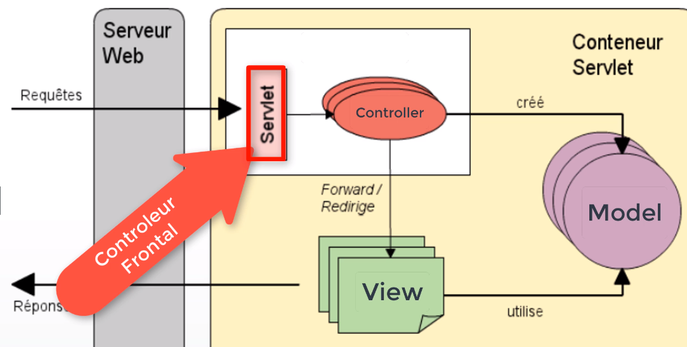

# Spring-Mvc [Boite à outils]

[retour](../index-spring.md)

[RestController](./rest-mvc.md)

[SpringBoot](../spring-boot/spb-index.md)

## Principe

### controleur frontal



<pre>
Spring MVC fait appel à un contrôleur frontal pour attraper toutes
les requêtes HTTP.
C'est une servlet (classe <b>DispatcherServlet</b>).

Dans le cas de spring-boot, elle est fournit par la lib
<b>spring-web-mvc</b> tiré par le <b>starter spring-boot-web</b>.

<i>IMPORTANT</i>: 
<b>Le dispatcher-servlet est déployé automatiquement et disponible</b>

Pour attraper toutes les requêtes, il faut associer à la servlet
une gamme d'URL.
Cette gamme d'URL à comme valeur par défaut "/", ce qui veut dire
que la servlet accepte par défaut toutes les requêtes destinées aux
serveurs.

clé de configuration de la gamme d'url
<i>spring.mvc.servlet.path</i>=/

</pre>

### @Controller

#### contrôleur web principe

<pre>
Si le dispatcher-servlet est déployé automatiquement,
il faut par contre créer des contrôleurs et des routes qui vont bien.
Les routes seront associés aux méthodes des contrôleurs ciblés pour 
définir le traitement associé à la route
Le traitement du contrôleur redirige vers une vue.
</pre>

#### exemple

<pre>
La route : /invoice-home est associer au traitement displayName.

@Controller
@RequestMapping("/movie")
public class MovieController {

	@RequestMapping("/invoice-home")
	public String displayName(){
		return "";
	}

}	
</pre>

### @RestController

<pre>
Avec cette annotation, on a plus besoin d'utiliser
la balise @ResponseBody pour convertir les sorties.
Les conversion des objets pour le corps des réponses, 
dans les méthodes sera automatique.
</pre>

### Vue

<pre>
Il faut un moteur de templating pour afficher la vue.
On utilise par exemple Thymeleaf.

Spring-Boot:
On ne doit plus mettre les fichiers dans le répertoire /static
mais dans le répertoire /templates
Pour utiliser une vue de ce répertoire, dans le controller, il faut
retourner le nom de ce fichier sans l'extension.
</pre>

#### JSP: ViewResolver

##### principe
<pre>
Le composant qui permet de configurer la vue est un ViewResolver
</pre>


##### exemple
```
@Configuration
@ComponentScan(basePackageClasses = {LivreController.class, LivreRestController.class})
@EnableWebMvc
public class BiblioWebConfig implements WebMvcConfigurer {
	
	public BiblioWebConfig() {
		System.out.println("**** BiblioWebConfig ****");
	}
	
	@Override
	public void configureViewResolvers(ViewResolverRegistry registry) {
		// si vue logique = "adherents" --> "/WEB-INF/jsp/adherents.jsp"
		InternalResourceViewResolver resolver = new InternalResourceViewResolver();
			resolver.setPrefix("/WEB-INF/jsp/");
			resolver.setSuffix(".jsp");
			registry.viewResolver(resolver);
	}
```

### Modèle

#### principe

<pre>
Jeu de données que l'on veut voir afficher sur la page.

Question 1- comment transférer les données du modèle à la vue ?
Plusieurs solutions possibles:
- setAttribute("key",value);
  Met dans le contexte/scope, l'objet, qui peut être récupéré au niveau
	de la vue : ${key}
- utiliser @ModelAttribute
- utiliser ModelAndView

Question 2 - comment rediriger vers la vue  ?
- return "nomDeLaVue"
- se servir du @RequestMapping : le nom de la vue
  est le même que le RequestMapping.
- utiliser ModelAndView

</pre>

#### Model and View

<pre>
ModelAndView : porte à la fois la vue et le modèl
- définir le nom de la vue
- enrichir le modèle avec une paire (attribut, valeur)
- retourner l'objet ModeleAndView
</pre>

```
ModelAndView mv = new ModelAndView(invoice-details");
mv.addObject("invoice", invoice);
return mv;
```

#### Model

<pre>
Objet passé par SpringMVC pour peu qu'il soit le dernier de 
la liste des arguments.
Dans la méthode, cela permet de retourner une chaine de
caractère qui est l'identifiant de la page.
On n'a a pas à utiliser l'objet de type ModelAndView.
</pre>

```
@RequestMapping("/home")
public String displayHome(Model model){
		List<Movie> movies = movieService.getMovieList();
		model.addAttribute("movies", movies)
		return "movies-home";
}
```

#### @ModelAttribute

##### principe

<pre>
- permet de définir les attributs du modèle
- alternative à Model
</pre>

##### Exemple-1 : un seul jeu de donnée

<pre>
@RequestMapping("/dvdstore-home")
public @ModelAttribute("movies") List< Movie >  displayHome(){
		List< Movie > movies = movieService.getMovieList();
		return movies;
}

1- on se sert du <b>request-mapping</b> pour rediriger vers le <b>template</b>:
dvdstore-home

2- dans le modèle, une seule données (la liste des films), identifié
via le <b>@ModeleAttribute("movies")</b>
</pre>

## locale

<pre>
Par défaut Spring tient compte de la locale du navigateur.
Cette dernière est transmise à chaque requête
voir la doc:
Locale to use. 
By default, this locale is overridden by the "Accept-Language" header.
</pre>

```
<span th:text="${#locale.country}"></span>
```

```
Pour forcer Spring à ne pas utiliser la locale du navigateur:
application.properties:
spring.web.locale-resolver=fixed
spring.web.locale=fr_FR
```

## Formulaire

### Backing Bean

<pre>
Question: 
Comment récupérer les informations saisie par l'utilisateur?
Le plus simple: 
- créer une classe qui dispose d'autant de champs
qu'il y en a dans le formulaire
- demander à Spring d'instancier cette classe avec les données 
	saisies par l'utilisateur
</pre>

### @ModelAttribute

<pre>
Permet d'instancier le bean transmis avec les données du formulaire
On peut mettre un identifiant sur cet objet de formulaire.
<b>important</b>: le model attribute donne par défaut
	un identifiant qui est le nom de la classe qui commence par une minuscule,
	dans l'exemple suivant : identifiant => invoice
</pre>

```
@PostMapping()
public String createInvoice(@ModelAttribute Invoice invoice) {
	...
}

avec identifiant

@PostMapping()
public String createInvoice(@ModelAttribute("form") Invoice invoice) {
	...
}
```

<pre>
Note: dans la méthode qui affiche le formulaire,
il convient d'ajouter le @ModelAttribute
Le formulaire sert aussi à mettre à jour l'objet.
Sert à peuple l'objet:
- en cas de modification
- mettre des valeurs par défaut en cas de création

L'objet n'est plus instancier au niveau de la méthode de création,
<i>createInvoce</i> mais un peu plus tôt au moment de l'affichage
du formulaire.
</pre>

```
public String displayInvoice(@ModelAttribute Invoce invoice){
 return "invoice-create-form";
}

Alternative :

public String displayInvoice(Model model){
 model.addAttribute("invoice", new Invoice());
 return "invoice-create-form";
}
```

### html: ThymeLeaf

<pre>
th:action
th:object
	- permet de définir l'objet de formulaire instancier par @ModelAttribute
  - on peut reprendre l'identifiant de @ModelAttribute
	- on peut ne pas donner d'identifiant ; 

th:field
	valeur: {*{customerName}} ==> attribut du backing-bean
	utilise le setter du backing bean
	En utilisant '$', fait référence à un bean en mémoire (scope Request/Session)
	Quand on utilise *, on fait référence a qqchose définit dans la balise form
</pre>

```
// Avec identifiant définit dans @ModelAttribute
<form th:action="@{/invoice}" methode="POST" th:object="${form}">

	<p>Customer name: <input type="text" th:field="*{customerName}" /></p>

	<input type="submit" value="OK">
</form>

// sans identifiant
<form th:action="@{/invoice}" methode="POST" th:object="${invoice}">

	<p>Customer name: <input type="text" th:field="*{customerName}" /></p>

	<input type="submit" value="OK">
</form>
```

### Validation

#### principe

<pre>
L'idéé général de Spring MVC est de valider les valeurs après collecte
dans le <b>backing bean</b>.

La validation se fait avant d'entrée dans la méthode du contrôleur.
C'est une validation qui ne se fait pas en temps réel. Il faut envoyer
les valeurs au serveur.

Il faut annoter le backing-bean et non pas un bean Repository.
Cela n'a pas de sens. On fait de la validation web et non de la validation
pour la base de données. Les règles ne sont pas les mêmes

* Les annotations sont à poser sur les attrbibuts de l'entité Java
* Dans le contrôleur, au niveau de la méthode, il faut ajouter l'annotation @Valid

Attention : 
BeanValidation est une spécification et pas une implémentation.
La librairie fournit les annoations mais ne dit pas comment valider ces beans.
En tirant le starter, validation, la librairie Hibernate-Validator est tiré,
qui est l'implémentation de référence de BeanValidation.
L'implémentation arrive avec des annotations spécifiques en plus.
Mais attentions, leur utilisationn nous lie à cette librairie.

Exemple d'annotation:
@Pattern(regexp= "")
String...

@CreditCardNumber()
String...

</pre>

#### @Valid, bindingResult

<pre>
L'annotation @Valid va collecter les erreurs dans un objet de type BindingResult.
Il faut ajouter ce dernier dans les arguments de la méthode.
Il doit être placé après le dernier ModelAttribute à valider.

<a href="https://salithachathuranga94.medium.com/validation-and-exception-handling-in-spring-boot-51597b580ffd" targert="_blank">Validation and Exception Handling in Spring Boot</a>

</pre>

```
@PostMapping()
public String createInvoice(@Valid @ModelAttribute InvoiceBean invoice,
	BindingResult result) {
	...

	if (results.hasError()) {
		return "add-invoice-form";
	}

	...
}
```


#### spel: afficher les erreurs

<pre>
Spring Expression-language
Langage d'expression qui peut s'utiliser partout.
vue html, code java, fichier ressource...

Permet de mettre la main sur le contexte Spring
Session, Request, locale...
Pour faire références à ces objets on utiliser un '#'
On peu mettre la maini sur l'objet BindingResult de la 
manière suivante:

< div >th:if="${#fields.hasErrors('champ_a_evaluer')}" th:errors="*{customerName}">< /div >

Le message s'il n'est pas définit vient du fichier de properties de 
hibernate validator.
Ce fichier peut être surchargé en le copiant juste dans les ressource.
</pre>

#### pom.xml

<pre>
* ajouter la dépendances spring-validation
</pre>

```
    <dependency>
        <groupId>org.springframework.boot</groupId>
        <artifactId>spring-boot-starter-validation</artifactId>
    </dependency>
```

## routes

### @RequestMapping

<pre>
Permet de configurer une route.
Se positionne:
- sur controller
- sur une méthode
	Par défaut, la méthode est "GET".
</pre>

```

@RequestMapping(value="", method="POST")
value: valeur de l'url

equivalent

@PostMapping()

```

#### @GetMapping

<pre>
Idem en faisant un GET
</pre>

#### @PostMapping

<pre>
pour créer une ressource
</pre>

```
    @PostMapping("")
    public String addMovie(@Valid @ModelAttribute("movie") MovieBean movie, BindingResult bindingResult){
        if (bindingResult.hasErrors()) {
            return "movie/add-movie-form";
        }
        movieService.registerMovie(movieMapper.toMovie(movie));
        return "movie/movie-added";
    }
```

#### @PutMapping

<pre>
pour modifier une ressource
</pre>

#### @DeleteMapping

<pre>
pour supprimer une ressource
</pre>

### annotation

#### @PathVariable

<pre>
* permet de mapper une variable du path dans une variable java (argument de la méthode)
</pre>

```

@GetMapping("/{id}")
public String displayMovieCard(@PathVariable("id") Long id, Model model) {
model.addAttribute("movie", movieService.getMovieById(id));
return "movie-details";
}

```

#### @RequestParam

<pre>
* permet de récupérer un paramètre à partir de l'url
</pre>

```

    @GetMapping(value="/books")
    public ResponseEntity<List<Book>> listBooks(@RequestParam(required = false) BookStatus status) {

    ==> /books?status=FREE

```

#### @RequestBody

<pre>
* permet de convertir/mapper le résultat de la requête
en un objet.
* Dans le cas d'un RestController : 
- mappe un objet JSon en objet Java
</pre>

```
@PostMapping("")
public Movie add(@RequestBody Movie movie){
		return movieService.registerMovie(movie);
}
```

#### @ResponseBody

<pre>
* permet de mapper de transformer l'objet en texte.
* Mais dans quel format ? xml, json
Avec Spring-Boot, spring-boot-starter-web, tire :
	->spring-boot-starter-json
		-> tire les librairies jackson
Le fait d'avoir ces libs dans le classpath indique à Spring-MVC
que le format par défaut est JSon.
==> configuration : CONTENT-NEGOCIATION
</pre>

```
@GetMapping("/{id}")
@ResponseBody
public Movie get(@PathVariable("id") Long id) {
		Movie movie = movieService.getMovieById(id);
		return movie;
}
```

## ThymeLeaf

### principe

<pre>
Moteur de templating
On peut utiliser les extensions html mais il faut modifier le namespace
</pre>

```

<html lang="en" xmlns:th="http://www.thymeleaf.org">
```

### pom.xml

```
<dependency>
	<groupId>org.springframework.boot</groupId>
	<artifactId>spring-boot-starter-thymeleaf</artifactId>
</dependency>
```

### Tableau de présentation

- th:each : pour itérer sur les éléments du tableau

```
	<tr th:each="p:${pageProduits.content}">
		<td th:text="${p.id}"></td>
		<td th:text="${p.designation}"></td>
		<td th:text="${p.prix}"></td>
		<td th:text="${p.quantite}"></td>
	</tr>
```

### 2- Pagination

<pre>
- status: objet qui permet de r�cup�rer des infos sur le tableau
- th:href: permet de construire un lien dynamique avec param�tres
- th:class: permet de faire de l'affichage de classe css conditionnel
</pre>

```
	<ul class="nav nav-pills">
		<li th:each="page,status:${pages}">
			<a th:class="${status.index==currentPage ? 'btn btn-primary' : 'btn'}"
				th:href="@{products(page=${status.index}, size=${size})}"
				th:text="${status.index + 1}"></a>
		</li>
	</ul>
```

### Liens

<a href="https://www.thymeleaf.org/doc/articles/standardurlsyntax.html" target="_blank">liens</a>
