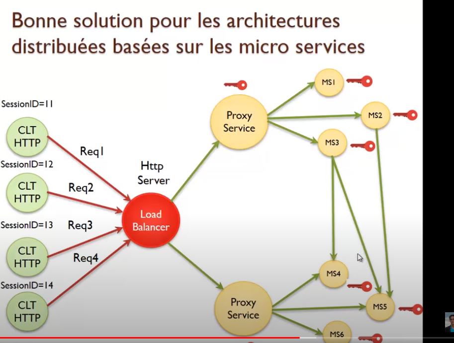

## JWT

### Définition
<pre>
* standard qui définit une solution compacte et autonome pour transmettre de manière sécurisée des infos 
	entre les applications en tant qu'objet structuré au format JSon. 
	* compacte : réduite par sa structure
	* autonome : Token généré sur la base d'un secret : qui contient toutes les infos d'identifiation 
		de l'utilisateur
* Le secret n'est connu que de la partie back-end qui génère le token	
* cette information peut être vérifiée et fiable car elle est signée numériquement
</pre>

### Structure
<pre>
* 3 parties séparés par un point : 
	* header
	* payload
	* signature
</pre>

#### headers
<pre>
* L'en-tête se compose de deux parties : le type et l'algorithme de hashage 
</pre>

#### payload

##### définition
<pre>

* contient les claims : revendications, informations
* déclarations concernant : une entité (généralement utilisateur) et métadonnées supplémentaires
* 3 types de claims : enregistrées, publiques et privées

</pre>

##### claims enregistrées
<pre>
* claims enregistrées : recommandées pour être reconnaissable au niveau de chaque application

	* iss : (issuer) celui qui a créé le token
	* exp: heure d'expiration
	* sub: sujet, en general au stocke le username
	* aud: audience - public cible - ex: web, front-end, mobile
	* iat: (issued at) date de creation du token
	* jti: JWT ID identifiant unique du token
	* name: peut servir pour stocker le username et afficher au niveau application
	* roles: roles du user
</pre>

##### claims publiques
<pre>
* claims publiques : permet d'enregistrer d'autres claims qui doivent être définies 
	dans un annuaire des jetons
</pre>

##### claimes privées
<pre>
* claims privées: claims personnalisés, ne rentre pas dans l'interopérabilité 
	mais ne concerne que mes applications
</pre>

##### exemple

#### signature :

<pre>
* partie la plus importante
* vérifier que l'expéditeur du jwt est celui qu'il prétend être
* s'assurer que le message n'a pas été modifié en cours de route
* La vérification se fait côté back-end de manière générale
* Signature créé de la façon suivante:
	HMACSHA256(base64UrlEncode(header) + "." + base64UrlEncode(payload), secret)
	secret : connu seul de la partie-back-end

* Transmission:
	* Le token est souvent transmis avec un prefixe au serveur : 
	
	<i>Authorisation: Bearer H.P.S - Bearer = Porteur</i>
	
	* Le serveur sait qu'il récupère un préfixe mais n'en tient pas compte, 
		il le supprime puis récupère le token
</pre>

### Avantage

<pre>
* Pas besoin de cache partagé ou distribué. 
* Chaque serveur d'application doit juste connaître le secret et donc le sécurisé.
* Idée pour la sécurité : passé par clé publique, qui permet de vérifier la validité du token.
</pre>

### Token par reference / valeur

### Montée en charge

<pre>
* plus besoin de cache distribuée ou partagée
<b>problème</b> : le secret est présent sur chaque instance
	* il faut sécuriser le secret
	* il ne faut pas qu'il soit accessible
</pre>

<pre>
<b>Avantage</b> : application basé sur les micro-services
* chaque ms dispose du secret (de la clé privée)
* token circule entre ms

<b>problème</b> : application massivement distribué
	* le secret qui se balade dans le cloud ou beaucoup de machine
	* risque de perdre une clé privée

</pre>

<pre>
<b>solution</b> :
* signée avec clé asymétrique (RSA)
* utilisation d'une clé publique / clé privée

<b>architeture ms</b>
* Référentiel des identités: un seul ms dipsose de la clé privée 
	* le seul ms qui permet de faire l'authenfication
	* le seul ms qui permet de générer et signer le token
* autres ms :
	* ont besoin uniquement d'une clé publique
	* permet uniquement de vérifier la validité du token
	
</pre>

#### Révocation de token
<b>Scénario</b>
* génération d'un token de validité de 30 jours
* au bout de 5 jours, le compte utilisateur est désactivé
* l'application valide le token qui est valide car la date de validité est bonne
Quel est le moyen qui permet de faire la révocation ?
* utiliser une black-list
	* dans le système d'authentification, tout utilisateur désactivé doit être
		mis dans la black-list

### Stockage 

#### LocalStorage vs SessionStorage

<pre>
* <b>localStorage</b>: partagé par toutes les instances du navigateur ; n'importe quelle application 
	peut-lire le localstorage
* <b>sessionStorage</b>: à chaque fois qu'on ouvre une fenêtre du navigateur, création d'un session storage ; 
	dès qu'on ferme une fenêtre, il disparaît.
Dans ce cas: 
* protège contre les attaques CSRF car jwt n'est pas stocké dans les cookies, 
	donc pas envoyé à partir d'un lien truqué.
* pas de protection contre la faille XSS ; un script qui arrive vers le navigateur 
	a le droit de lire le localstorage
</pre>

#### Cookies

<pre>
* pas besoin d'écrire du code JavaScript pour envoyer le JWT
* protection XSS : utiliser le flag HttpOnly (JavaScript n'a pas le droit de lire ce cookie) 
	et Secure (ne peut être envoyer que par https)
* expose aux attaques CSRF
</pre>

### comment protéger CSRF - A revoir ???

<pre>
* token est dans les cookies
* utiliser le synchronizer token ; génére à chaque fois que le serveur envoie la réponse, 
	dans le payload du JWT
* envoyé vers l'utilisateur en signant le token et en envoyant le token synchronizer 
	avec la bonne signature
* si le token envoyé ne contient pas le CSRF ou pas le bon ; ne collera pas avec la signature
</pre>

### Autres usages JWT

<pre>
* Formulaires en plusieurs parties : données stockées dans le token

* Confirmation des emails :
	* Anciennement
		* on crée une valeur secrète que l'on stocke en base
		* on envoit un lien qui contient cette valeur 
		* on demande à l'utilisateur de cliquer sur le lien et on vérifier la valeur avec la valeur en base
	* JWT
		* on crée un token qui contient la valeur et qui est signé avec la valeur
		* on génère un lien avec le token (durée de vie limitéé)
		* on demande à l'utilisateur de cliquer sur le lien et on vérifie le token
</pre>

