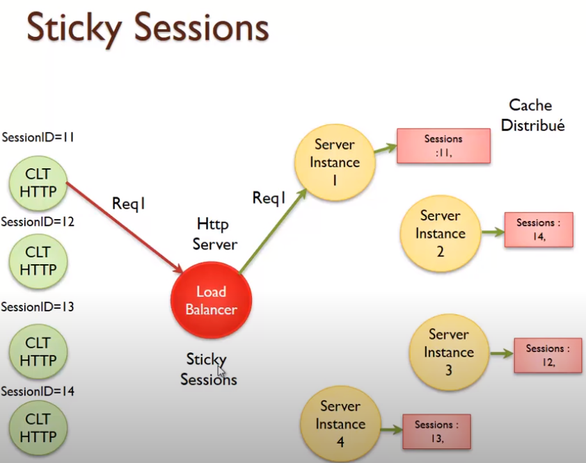

## Session HTTP
* créer après authentification par login/password
* durée de vie limitée
* cookies : contient login/password

### Faille de sécurité

#### CSRF
* Cross Site Request Forgery
* L'idée, c'est de forcer une victime à faire une opération sans qu'elle le sache en profitant de sa connexion
* La victime, c'est le serveur, car une opération d'attaque sur le serveur vulnérable sera effectuée.

<pre>
* L'utilisateur est déjà identifié et possède le cookie JSESSIONID
* ca veut dire quoi : s'il y a une requête qui sort de la machine vers le serveur, le serveur va l'accepter
* Le serveur peut recevoir le sessionid alors que la requête n'a pas été envoyé à partir d'un lien du site.
* Exemple : Mail avec un lien:
	* derrière le lien : 
	- javascript qui envoie une requête http pour faire suppression 
		(avec formulaire caché qui contient des données)
	- quand on clique on envoit la requête qui va aboutir car on est identifié
	- on force la suppression
	- est-ce que vous avez envoyé votre requête à partir d'un lien du site ou à partir d'un lien 
		d'un autre application (mail avec un lien,...)
	- le serveur ne le vérifie pas
	- le serveur ne sait pas dire de quelle application a envoyé le lien ; le site est vulnérable ; 
		le serveur vérifie juste le JSESSIONID
</pre>

##### Exemple

##### Solution :
<pre>
* CSRF Synchronizer Token
* demander des confirmations
* verifier le référent
</pre>

#### XSS
<pre>
* Cross Site Scripting
* La vitcime ici c'est le client. On ajout du script pour agir au niveau du client.
* Comment protéger les visiteurs de votre site pour qu'on ne leur vole pas des informations, 
	qu'on attaque pas leur machine?
</pre>

##### prevention server

##### prevention client

### Montée en charge

<pre>
* Load Balancer : 
	* site déployé dans plusieurs serveurs
	* utilisation d'un proxy | load balancer
	* load balancer : 
		* serveur web qui envoie/aiguille la requête vers une instance de l'application
		* les requêtes sont partagées entre le serveurs
	* problème : 
		* quand on fait l'authentification, chaque client est authentifié par l'une des instances
			* Session créé en mémoire de la machine (RAM)
		* pour la seconde requête, le LB peut envoyer la requête vers une autre instance	
</pre>

#### cache mémoire partagé
<pre>
<b>solution</b>
	* cache mémoire partagé : 
		* chargé d'enregistrer les sessions
		* comme si on créait un serveur
		* toutes les instances utilisent, ce cache mémoire partagé
</pre>

<b>Problème</b>
<pre>
* création d'un spoof : single point of failure
* si le serveur / point tombe en panne ; toutes les sessions utilisateurs sont perdues
</pre>

#### cache mémoire distribué
<pre>
* cache pour lequel, 
	* quand une requête arrive au niveau d'une instance (d'un serveur),  
		le numéro de session est enregistré au niveau de tous les serveurs.
	* les sessions sont enregistrées dans tous les serveurs
* Avantages :
	* le LB peut travailler d'une manière normale
	* si une instance tombe en panne, les autres répondent
</pre>

#### sticky session

<pre>
* sorte de gestionnaire de session intelligent
	* configuration du LB : 
		* LB : aiguille les requêtes d'un même utilisateur toujours vers le même serveur
</pre>

<pre>
<b>Avantage</b> : on règle de problème d'aiguillage des requêtes
<b>Inconvénient</b> : intolérance aux pannes
	* un serveur qui tombe en panne et la session utilisateur est perdue
</pre>

#### sticky session et cache mémoire distribue
<pre>
* deux solutions pour assurer :
	* aiguillage des requêtes
	* cache distribué en cas de panne
</pre>

#### Gestion session côté client

