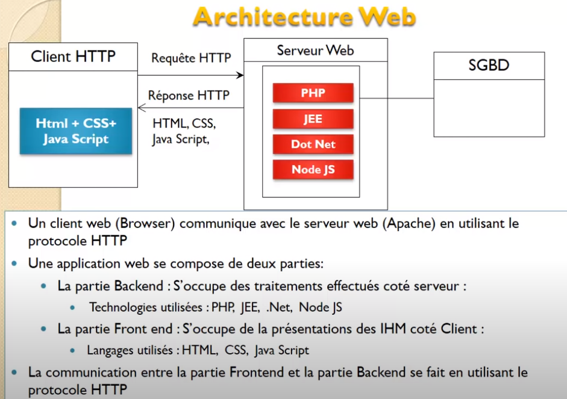
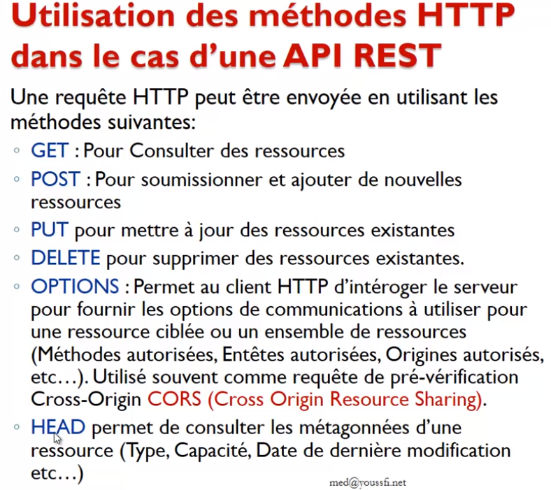
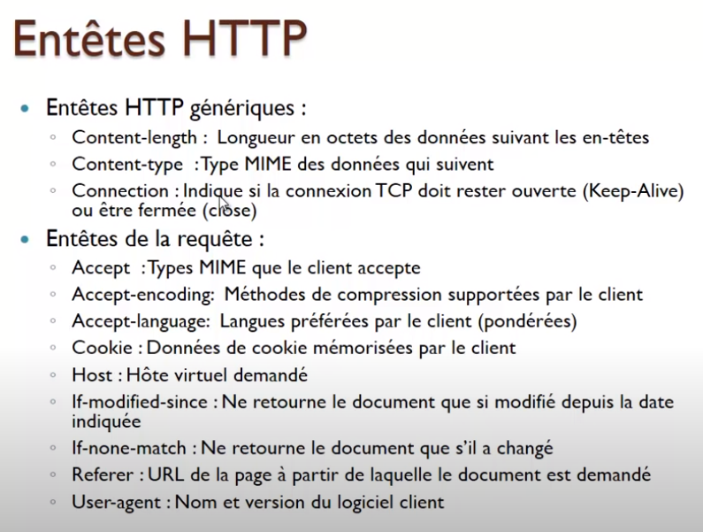
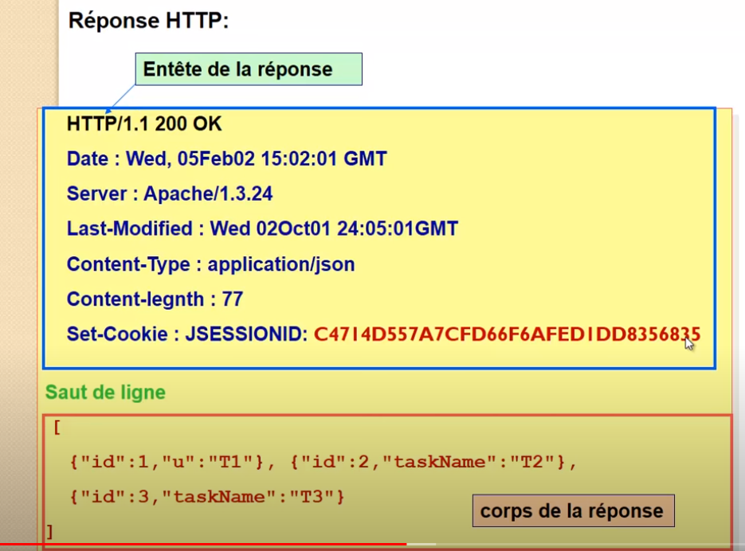

## protocole http

- [home](../../index-sp-security.md)
- [session-http](../connexion-session-cookies/sessions-http.md)
- [jwt-http](../connexion-jwt/notes-jwt.md)

### Architecture web



### Définition

```
* Protocole qui permet de récupérer des documents du serveur
	* récupération de ressources statiques
	* récupération de ressource dynamiques
* permet de soumissioner les formulaires
```


[Définition](0-protocole-http-0.PNG)

#### http-1.0

- à chaque récupération de ressource, nécessite une connexion, même pour une page nécessitant le chargement de plusieus ressources.

#### http-1.1

- moyen de garder une même connexion pour plusieurs requêtes

## Requête HTTP - Méthodes-HTTP

```
GET | POST | PUT | DELETE | OPTIONS | HEAD
```



#### CORS

```
* Origine autorisés
* Par défaut, le navigateur refuse d'envoyer une requête http à un domaine Y, à partir d'une page récupérée à partir d'un domaine X.
* Avant d'envoyer la requête, il faut savoir si le serveur autorise celà. Pour tester cela:
	* requête OPTION envoyé par le navigateur ; récupération des infos (Origines autorisés)
	* pour une appli REST : config (cross-domaine = *) => j'accepte les requêtes venant de n'import quel domaine)
```

### Headers Requête

```
* Méthode: Post /login HTTP/1.1
* host: intra.net
* Accept: application/json
* Content-Type: application/x-www-form-urlencoded
* Cookie: JSESSIONID: C4577232131465456
```

#### Entêtes HTPP de requête

```
* IMPORTANT : entêtes génériques ==> valables pour requête et réponse.
* En-tête 'Connection' : indique si la connexion doit rester ouverte : Keep-Alive | close | upgrade
```



### Corps de la requête

```
* Le corps de le requête se trouve après une ligne vide
* infos transmises en fonction du content-type
```

##### ex requête url-encoded


##### ex requête json


## Réponse HTTP

### En-tête de réponse

```
* HTTP/1.1 200 OK
* Date: Wed, ...
* Server: Apache/1.3.24
* Last-Modified: WEd, ...
* Content-Type: application/JSON
* Content-length: 77
* Set-Cookie: JSESSIONID:C4577232131465456
```


### Corps de la réponse

```
* données de la réponse HTTP : HTML / XML / JSON ...
```

### exemple Corps de la réponse



### Code Status de la réponse

```
* Information 1xx
* Succès 2xxx
* Redirection 3xx
* Erreur du client 4xx
* Erreur du serveur 5xx
```


## Proxy

- plus rapide : cache
- sécurité
- 502: (Bad gateway) : le proxy n'a pas su intérrogé le serveur web
