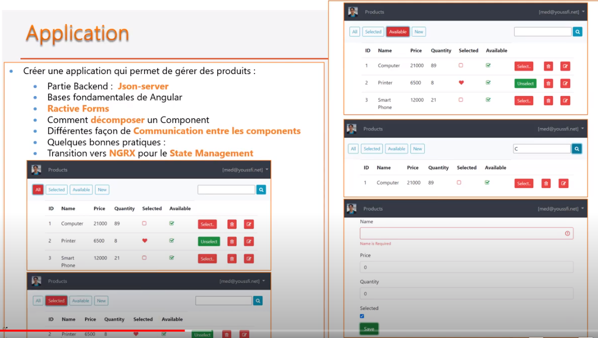
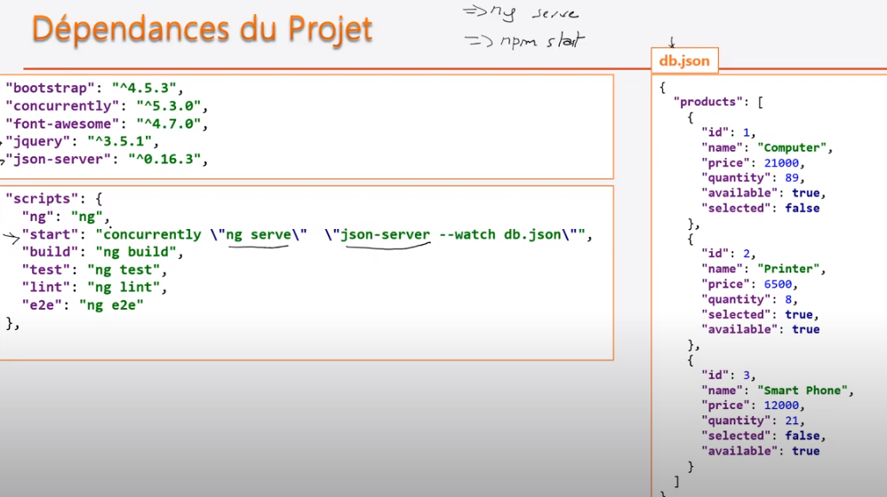
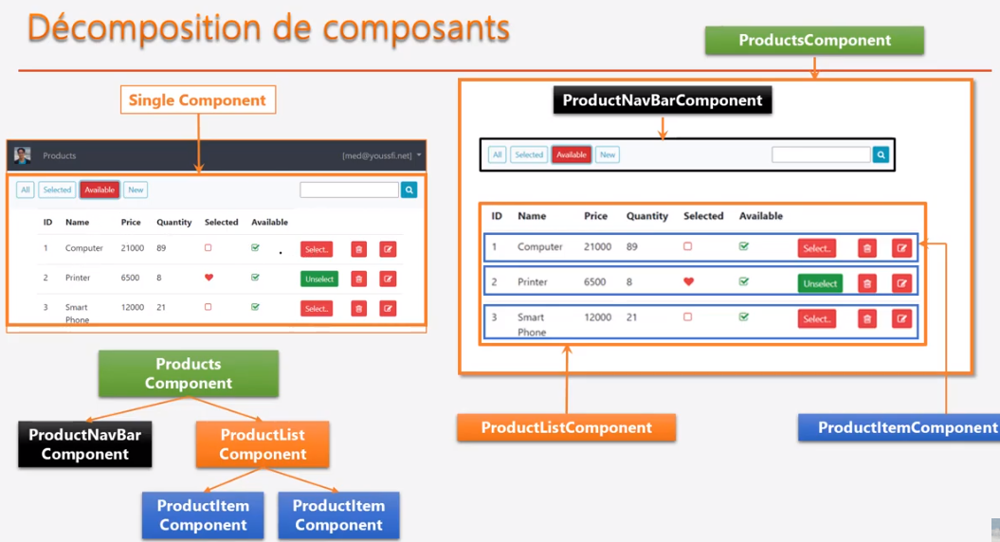
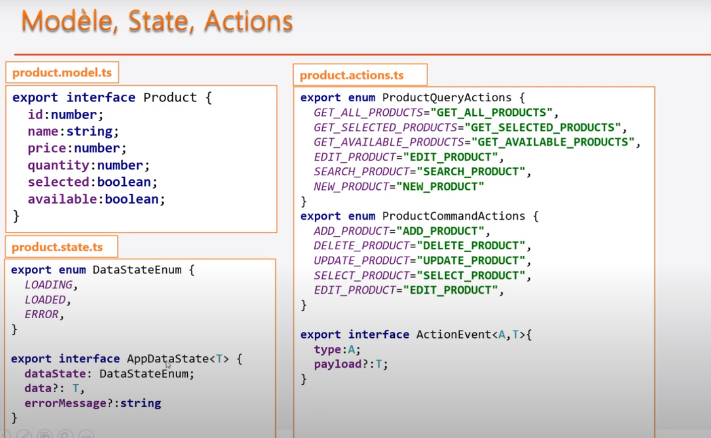

# Application

## Principe
<pre>
* application qui permet de gérer des produits
</pre>



## Technique
<pre>
* bootstrap
* concurrently : 
	* permet de lancer des applications de manière concurrente c'est à dire en parrallèle
	* permet de lancer des commandes en parallèle (ligne de commande)
* font-awesome: pour les icônes
* jquery : templating
* json-server : partie back-end (serveur node.js | création base de données au format json 'db.json')
</pre>



## Composants



### installation

### Création
<pre>
$ ng new web-cat-app
</pre>

#### dependances
<pre>
* npm install --save json-server
* npm install --save concurrently
* npm install --save bootstrap
* npm install --save jquery
* npm install --save font-awesome

</pre>

#### base de données

##### db.json
<pre>
* créer un fichier db.json à la racine du projet
* permet de démarrer une API Rest
	* localhost:3000/products
	* localhost:3000/products/2
	* localhost:3000/products?selected=true
	* localhost:3000/products?name=computer
	* localhost:3000/products?name_like=c
</pre>

<pre>
* possible d'envoyer des requêtes avec Post | Put | Delete
* POST: 
	header: content-type : application/json
	body : {
	 "name":"aaaa", 
	 "price":9999,
	 "quantity":123,
	 "available": true,
	 "selected": true
	}
</pre>

###### exemple
```
{
  "products": [
    {
      "id": 1,
      "name": "computer",
      "price": 4300,
      "quantity": 600,
      "selected": true,
      "available": true
    },
    {
      "id": 2,
      "name": "printer",
      "price": 300,
      "quantity": 100,
      "selected": true,
      "available": true
    },
    {
      "id": 3,
      "name": "smartphone",
      "price": 1200,
      "quantity": 100,
      "selected": false,
      "available": true
    }
  ]
}
```

##### db.routes.json
<pre>
* Permet de faire une configuration sur les routes.
* On veut faire une configuration pour préfixer toutes les routes par /api/
* Prendre en compte ces nouvelles routes au démarrage du serveur
</pre>
```
{
  "/api/*": "/$1"
}
```

[doc](https://www.positronx.io/handle-cors-in-angular-with-proxy-configuration/)

#### package.json
<pre>
... "start": "concurrently \"ng serve\" \"json-server --nc --routes db.routes.json --watch db.json\"",
</pre>

## Application

### cors
<pre>
* Le serveur angular démarre sur : http://localhost:4200/
* Le serveur back démarre sur : http://localhost:3000/
<b>Cela provoque une erreur CORS car les deux serveurs travaillent sur des domoines et port différents.</b>
</pre>

#### configuration Proxy
<pre>
* il faut dire au serveur angular de transmettre toutes les urls(source) que l'on veut réaiguiller vers une autre cible
* ainsi il faut configurer un proxy avec :
	* source : http://localhost:4200/api
	* cible: http://localhost:3000/api
</pre>

* générer un fichier src/proxy.conf.json
```
{
    "/api/*": {
        "target": "http://localhost:3000",
        "secure": false,
        "logLevel": "debug"
    }
}
```

* Définir le proxy dans le fichier angular.json
```
"architect": {
    "serve": {
            "builder": "@angular-devkit/build-angular:dev-server",
            "options": {
                "browserTarget": "project-name:build",
                "proxyConfig": "src/proxy.conf.json"
            },
          }
}
```

### Initialisation

#### environnement
<pre>
* ce fichier permet de faire des configuration par environnement
* à utiliser donc pour les variables d'environnement
* la variable host pour la confifuration du serveur backend a été défnit.
	* pose un problème cors, du coup, il faut passer par un proxy sur le serveur Angular.
</pre>

#### bootstrap | JQuery 
<pre>
* integration bootstrap | jquery ==> intégré dans package.json
</pre>

<pre>
"styles": [
  "./node_modules/bootstrap/dist/css/bootstrap.min.css"
  "src/styles.css"
],
"scripts": [
  "./node_modules/jquery/dist/jquery.min.js",
  "./node_modules/bootstrap/dist/js/bootstrap.min.js"
]
</pre>


      "styles": [

        "node_modules/bootstrap/dist/css/bootstrap.min.css",

        "src/styles.css"

      ],

      "scripts": [

          "node_modules/jquery/dist/jquery.min.js",

          "node_modules/bootstrap/dist/js/bootstrap.min.js"

      ]

#### font-awesome
<pre>
* font-awesome ==> intégré dans styles.css
</pre>

<pre>
@import "../node_modules/font-awesome/css/font-awesome.min.css";	
ou
@import "~font-awesome/css/font-awesome.min.css";
</pre>

#### Création des composants
<pre>
$ ng g c components/products
$ ng g c components/home
</pre>

#### Routes

* app/app-routing.modules.ts
```
const routes: Routes = [
  {path: "products", component: ProductsComponent},
  {path: "", component: HomeComponent}
];
```

* app.component.html
```
<router-outlet></router-outlet>
```

* nav-bar.component.html
```
<li class="nav-item">
<a class="nav-link" routerLink="/">Home</a>
</li>
<li class="nav-item">
<a class="nav-link" routerLink="/products">Products</a>
</li>
```

#### Création Modele, state, actions


#### Création des services