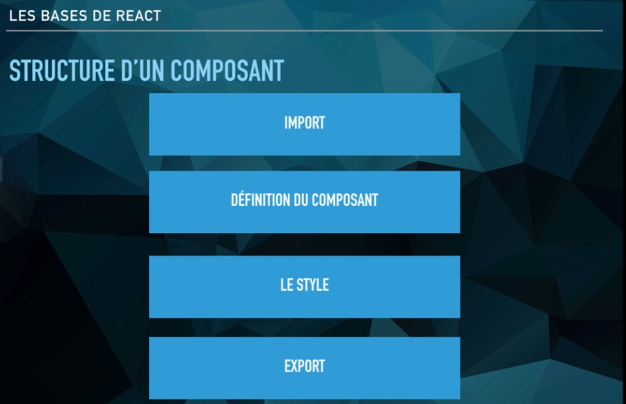
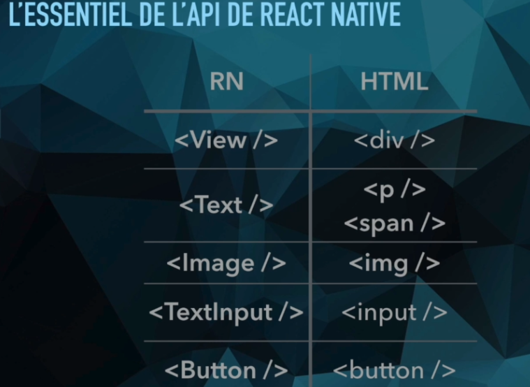

[home](../../index-js.md)

## Introduction

### Principe

### Composants

### Style

[lien-utile](https://github.com/vhpoet/react-native-styling-cheat-sheet#flexbox)

#### Mise en place

<pre>
* Passage de style sous-forme de tableau
	* permet de concaténer plusieurs souces de style
< View style="{[{background-color: this.props.color}, styles.container]}" >

const styles = StyleSheet.create({
	container: {height: 50, width: 50}
});
</pre>

### Composant

<pre>
* FlatList

* Image

* TextInput

* Button
</pre>

### les touchables

<pre>
* rendre les éléments cliquables d'un point vue visuel (feedback)
* ressenti utilisateur
</pre>

