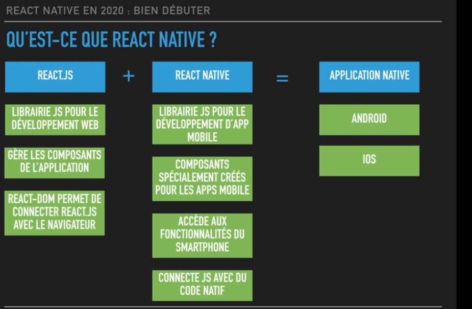

[home](../../index-js.md)

## Introduction

### Principe

### Composants

### Style

[lien-utile](https://github.com/vhpoet/react-native-styling-cheat-sheet#flexbox)

#### Mise en place
<pre>
* Passage de style sous-forme de tableau
	* permet de concaténer plusieurs souces de style
< View style="{[{background-color: this.props.color}, styles.container]}" >

const styles = StyleSheet.create({
	container: {height: 50, width: 50}
});
</pre>	

#### Flex-Box
<pre>
* <b>flex</b> 
	* permet de mettre une valeur pour une occupation de l'espace.
	* plus cette valeur est grande, plus la place occupé par
		le composant est grande
* <b>flexDirection </b> 
	* valeur par défaut : column
	* valeurs :
		* row / 
		* row-reverse / 
		* column / 
		* column-reverse
</pre>

<pre>
* <b>justifyContent </b>:
	* valeur par défaut : flex-start 
	* valeurs
		* center / 
		* flex-end / 
		* space-between : les éléments essaient de s'éloigner le plus des uns des autres
		* space-around : espace entre le début et fin de container
		* space-evenly : toutes les distances sont égales
</pre>

<pre>
* <b>alignItems</b>  
	<i>principe</i> : alignement sur l'axe perpendiculaire à l'axe principal (flexDirection)
	* flex-start / 
	* center / 
	* flex-end
</pre>	
	

	
### Composant
<pre>
* FlatList

* Image

* TextInput

* Button
</pre>

### les touchables
<pre>
* rendre les éléments cliquables d'un point vue visuel (feedback)
* ressenti utilisateur
</pre>
