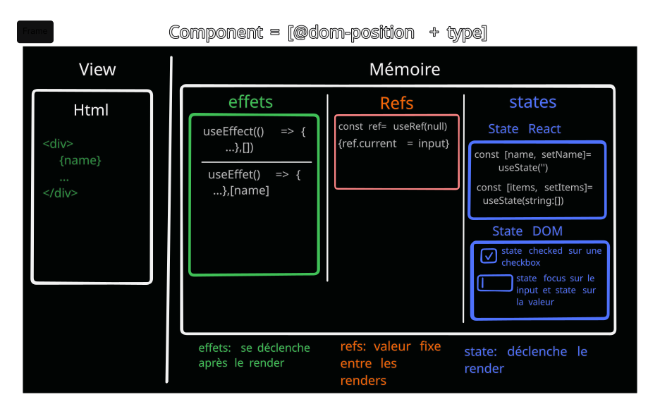
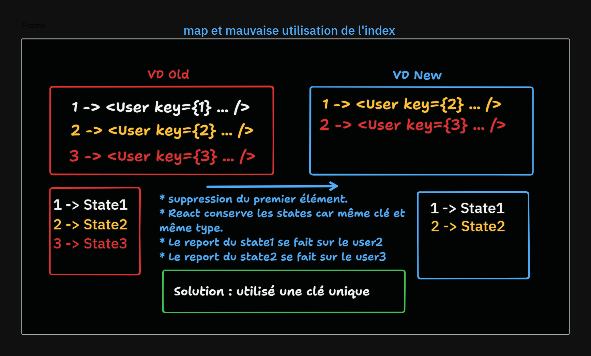

## Components

[home](../../index-react.md)

### Virtual-DOM

### JSX


### Component

#### Instance
<pre>
L'instance correspond à l'instance dans le DOM.
Si ton composant est **enlevé** du DOM 
puis rajouté par la suite, son state va être détruit. 
Car si <i>l'instance</i> de ton composant n'est plus présente dans le DOM 
durant un render,  React "clean" son state.
A toute instance, un état est conservé en mémoire par REACT entre les Renders

<b>IMPORTANT</b>:
Les composants fonctionnels n'ont pas d'instance en tant que tel.
Les fonctions sont simplement utilisées pour rendre du code
Elles sont appelées encore et encore lorsque notre interface utilisateur change.

React les reconnaît en préservant leur état:
* grâce à leur position dans le DOM 
* et grâce à leur type.

Note: 
Il est donc impossible de leur attacher une référence qui doit être 
persistante entre les rendus (voir forwardRef).
</pre>



#### <a href="https://react.dev/learn/preserving-and-resetting-state" target="_blank">Preserving state</a>
<pre>
C'est quoi un state d'un composant:
* tout ce qui est en rapport avec useState (state interne du composant)
* un state du DOM :
	* comme une checkbox ou REACT doit se souvenir que c'est élément est check (state checked)
	* comme un input qui posséde un state pour sa valeur, s'il a le focus. 	

React peut RESET le state. Cela signifie que React va supprimer et recréer le composant.
Ce sera un nouveau composant avec un nouveau state, un nouveau noeud dans le DOM.

React préserve le state d'un composant entre les renders en fonction de 3 paramètres :
	* sa <b>position</b> dans le DOM :
		* définit une adresse (postale) pour le composant
		* une même instance de composant ou deux composants ayant la même référence
		utilisé deux fois dans le DOMs auront des states différents car ils sont une adresse 
		différente dans le DOM. 
	* le <b>type</b> de composant
		* si le type est différent à la même position (lors d'un rendu conditionnel), 
		* le state du composant n'est pas préservé, car le composant est unmount.
	* la props key
		* Quand la key change, le composant est détruit et recréé. 
		* Pour React c'est un autre composant.
</pre>

#### Props

##### <a href="https://react.dev/learn/rendering-lists">Props Drilling</a>

##### <a href="https://developer.mozilla.org/fr/docs/Web/JavaScript/Reference/Operators/Spread_syntax" target="_blank">Délégation de props</a>
<pre>
Utilisation du spread operator pour déléguer les props à un composant enfant
Il ne faut pas abuser de ce pattern, car tes composants ne devraient pas pouvoir être 
facilement override (modifier des propriétés). 
Le but d'un composant, c'est justement de le contrôler. 
Je te conseille d'utiliser ce pattern uniquement pour des buttons ou des inputs
et/ou des composants qui ont plusieurs/multitudes de props.
</pre>

#### State
#### Quand créer des composants ?

#### Conditionnal Rendering

##### Le if
<pre>
* doit être obligatoirement fait à la racine de la fonction
</pre>
```jsx
const AuthButton = ({ isLogged }) => {
  if (isLogged) {
    return <button>Logout</button>;
  } 
  return <button>Login</button>;
};
```

##### Ternary Operator
<pre>
* peut être utilisé dans du JSX
* attention : à ne pas les empiler
</pre>
```jsx
const AuthButton = ({ isLogged }) => {
  return isLogged ? <button>Logout</button> : <button>Login</button>;
};
```

##### && operator


### Les Listes
<a href="https://react.dev/learn/rendering-lists" target="_blank">Rendering list</a>

#### map

<pre>
* Les listes utilisent .map car ReactDOM sait afficher des tableaux.
.map va donc créer un tableau de ReactElement que le ReactDOM va afficher.

* La fonction .map retourne un nouveau tableau avec les résultats d'une 
* fonction fournie surchaque élément du tableau parent.

* Les listes amènent un cas assez intéressant : le fait qu'on ouvre une porte JSX 
dans du JS lui-même dans du JSX.
Dans la deuxième ligne, on vient utiliser des crochets `{}` pour ouvrir 
une porte sur le "Vanilla JS" dans notre JSX. 
Mais ensuite, on utilise du JSX à l'intérieur des crochets !
</pre>
```jsx
<ul>
  {users // porte du JS
    .map(user => ( // porte sur le JSX
    <li key={user.id}>
      {user.name} {/* Porte sur le JS */}
    </li>
  ))}
</ul>
```

<pre>
On pourrait croire que c'est étrange, mais le compilateur JSX arrive totalement 
à résoudre cette syntaxe.
En React on crée des listes en passant des tableaux :
</pre>
```jsx
React.createElement(
  "ul", 
  null, 
  users.map(user => (
    React.createElement(
      "li", 
      { key: user.id }, 
      user.name
    )
  ))
);

équivalent à:
React.createElement(
  "ul", 
  null, 
  [
    React.createElement("li", { key: 1 }, 'titi'),
    React.createElement("li", { key: 2 }, 'toto'),
    ...
  ]
);

```

```jsx
const ShoeCardList = [
  {  
    image: '/images/shoes-4.png',  
    title: 'Darku Shoes',  
    description:  
      'Wow, this shoes is so cool. You can wear it for any occasion.',  
  },  
];
<div className='grid grid-cols-1 gap-4 md:grid-cols-2'>  
  {shoeCardsList.map(shoe => (  
    <ShoeCard key={shoe.title} {...shoe} /> 
    /*
    équivalent à  
    <React.createElement(ShoeCard, {key=shoe.title, ...shoe},null)  
	*/
  ))}</div>
```

#### key
<pre>
Il est généralement recommandé d'utiliser une valeur unique et stable 
comme identifiant, surtout si l'ordre des éléments peut changer

Les `key` React sont utiles pour :
- Identifier les éléments qui changent, sont ajoutés ou sont supprimés
(dans une liste)
- Rerender des composants en les identifiant

Effectivement, les clés ne sont pas <b>imitées</b> aux listes en React !

Mais pour le comprendre... il faut comprendre comment React préserve les états de ton application !
</pre>

#### <a href="https://react.dev/learn/preserving-and-resetting-state" target="_blank">Preserving state</a>
<pre>	
<b>Important pour les LISTES</b>
Dans les listes, les éléments ont le même type. La problématique est la suivante :
Comment fait React pour détecter qu'un emplacement a changé ?
Comment il fait pour retrouver le state du bon composant?

* Il y a un ordre de priorité : key > type > position
Si la clé et le type sont identique entre deux render, alors REACT préserve le state.
Ce qui fait qu'entre deux renders REACT sait les éléments de la liste qu'il doit
préserver.
MAIS L'utilisation de l'index comme clé est autorisée quand la liste ne change jamais d'ordre
et qu'aucun élément n'est supprimé ou ajouté.  
React va comparer le VD old et le nouveau. Avec l'index, comme les types ne changent pas,
REACT ne saura pas quel élément est ajouté et modifié. Il ne pourra pas supprimé le bon 
state et le report des states se fera mal.



Note: 
* comme React ne sait pas associer les éléments aux states et qu'il est un peu perdu,
il unmount tous les éléments et mount les nouveaux éléments de la liste.
Avec les bonnes clés, seul l'élément supprimé est unmount.

* pour les éléments qui n'ont pas de clé, REACT se base sur la position dans le DOM 
et le type pour le report des states.
</pre>

### Logique et Réutilisabilité

<pre>
La logique doit être mis dans les composants parents
En rendant les composants moins spécifiques, on les rend plus réutilisable. 
Pour être réutilisable, un composant :
* doit utilisé des props / children pour être générique
* ne pas hésiter à utiliser des classes wrappers
En créant des wrapper qui gère la logique, on va pouvoir séparer nos composant 
pour avoir des composants qui ne gère justement pas la logic et peuvent être 'coper/coller' 
d'un projet à un autre facilement. Pour faire ça, on va généralement utilisé les props.
</pre>

## styles

### modules
<pre>
Dans le composant faire l'import de styles qui est un objet javascript contenant
le nom des classes.
</pre>
```js
use client";
import styles from "./3.module.css"

styles = {
    "badgeBase": "__3_badgeBase__NlXYx",
    "badgeSizeDefault": "__3_badgeSizeDefault__mZdh_",
    "badgeSizeLarge": "__3_badgeSizeLarge__0kBAr",
    "badgeColorRed": "__3_badgeColorRed__AZQFT",
    "badgeColorGreen": "__3_badgeColorGreen__SY__0",
    "badgeColorPurple": "__3_badgeColorPurple__4_v1D",
    "__checksum": "9b6e1f7bf251"
}
```

### emotion.css
```jsx
const SIZES = {
  default: {
    padding: "2px 6px",
  },
  lg: {
    padding: "4px 8px",
  },
};

const VARIANTS = {
  red: {
    background: "#ef444415",
    color: "#b91c1c",
  },
  green: {
    background: "#22c55e15",
    color: "#15803d",
  },
  purple: {
    background: "#8b5cf615",
    color: "#6d28d9",
  },
};

const COMMON = {
  display: "inline-flex",
  alignItems: "center",
  borderRadius: "6px",
  fontWeight: "500",
  width: "fit-content",
  fontSize: "14px",
}


const Badge = ({ size, variant, children }) => {

  const style = {...VARIANTS[variant], ...SIZES[size], ...COMMON};
  console.log(style);

  // on peut passer un objet javascript
  const Badge = styled.div`
    ${style}
  `;

  return (
    <Badge>
      {children}
    </Badge>
  );
};
```
### toasts

<pre>
- permet d'afficher des messages.

Exemple: 
- Projet Sharebook
</pre>

<a href="https://medium.com/@aibolkussain/creating-toast-api-with-react-hooks-94e454379632" target="_blank">tuto</a>
<a href="https://react-bootstrap.github.io/components/toasts/#toast-props" target="_blank">react-bootstrap</a>
