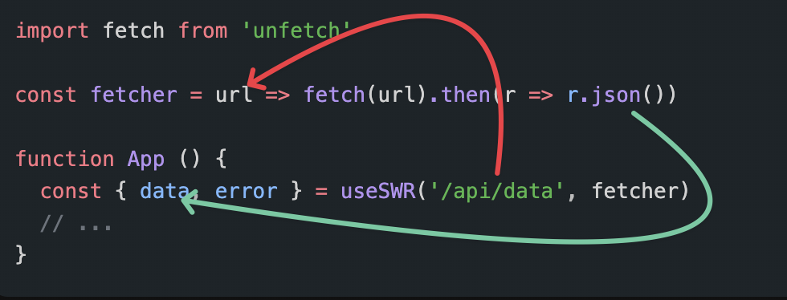

useSWR

[retour](./index-datafetching.md)

## Liens
<a href="https://swr.vercel.app/fr-FR/docs/api" target="_blank">doc-FR</a>
<a href="https://betterprogramming.pub/mastering-data-fetching-in-react-using-swr-and-typescript-648df3b15efa" target="_blank">data fetching with useSwr and TypeScript</a>

## Principe

<pre>
`useSWR` est un wrapper du `fetch` natif et permet de facilement faire des requests en ayant différents states :
</pre>

```js
export const Agify = ({ name }) => {
  const { data, error, isLoading, isValidating } = useSWR(
    `https://api.agify.io/?name=${name}`,
    fetch
  );

  if (isLoading) return <div>loading...</div>;
  if (isError) return <div>failed to load</div>;
  return <div>hello {data.name}, you are {data.age} years old!</div>;
};
```

<pre>
- `data`: contient les données de la requête une fois qu'elle est terminée
- `error`: est `true` si la requête a échoué 
- `isLoading`: est `true` tant que la requête n'est pas terminée
- `isValidating`: est `true` si une nouvelle requête est en cours

Ce hook a un avantage, il évite les différents problèmes qu'on a vu avec le `useEffect`
</pre>

## hook useSWR

Ce hook prend deux paramètres :

```js
const { data, error } = useSWR(key, fetcher)
```
- key : la clé unique de notre request, on utilisera souvent l'url de celle-ci. La clé va être passée en premier argument de `fetcher`
- fetcher : la fonction qui va faire la requête. Elle prend en paramètre la clé et doit retourner une promise qui contient les données de la requête.

Souvent, le fetcher est juste une function qui va :

- faire un `fetch` sur l'url
- récupérer le `json` de la réponse

L'exemple qu'il donne est :

JS

```js
const fetcher = url => fetch(url).then(r => r.json())
```

Ce hook a plusieurs avantages :

- **cache** : il y a un cache par défaut qui permet de ne pas refaire la requête si on a déjà fait la requête avec la même clé
- **revalidation** : il y a une revalidation automatique des données, si on a déjà fait la requête, il va la refaire en arrière plan pour mettre à jour les données
- **simplification** : il simplifie la gestion des différents états de la requête
- **clean** : il permet de faire des fetch requests dans le composant, et non dans un `useEffect` qui peut être difficile à lire

Tous ces avantages rendent `useSWR` **obligatoire** quand tu souhaites faire des requêtes dans ton application.
