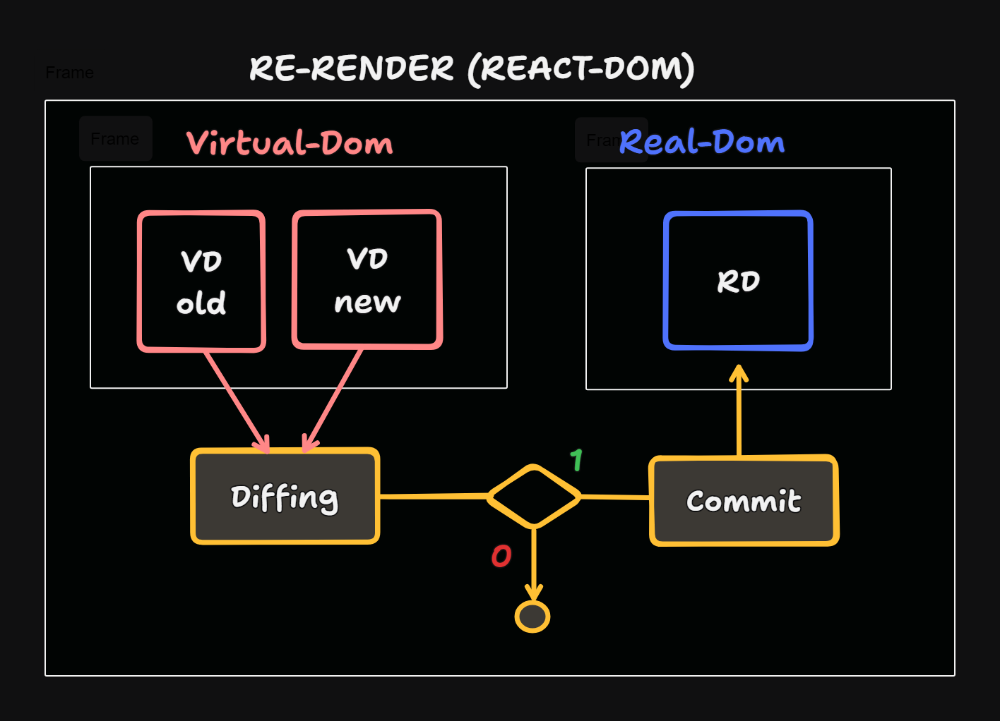
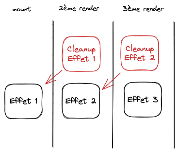
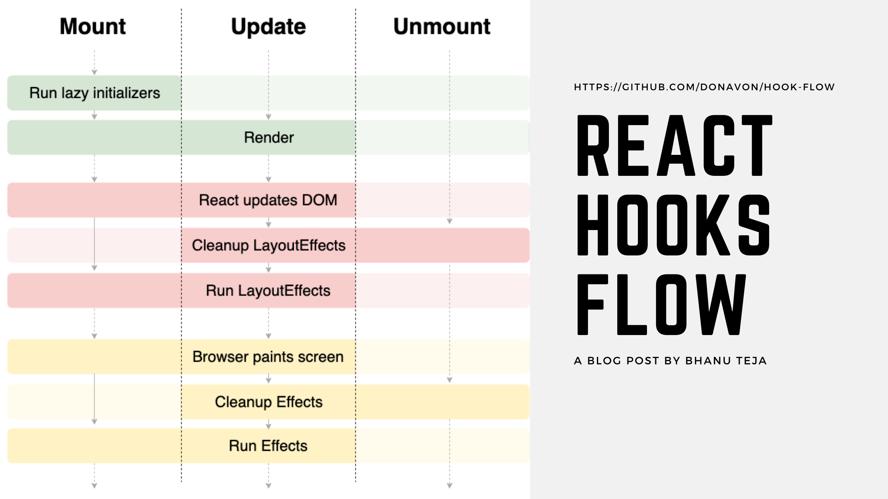

# Hook

[home](../../index-react.md)

## tips
```
const [, rerender] = useState([]);

rerender([])

```

## Principe

<pre>
Les hooks sont un excellent moyen d’accéder aux méthodes d’état et
 de cycle de vie de React à partir d’un composant fonctionnel.

Les hooks ne peuvent être appelés que 
* dans des <b>fonctions</b> : les composants sont des fonctions qui nous permettent
d'avoir des hooks.
* dans des <b>customs hooks</b> : eux mêmes appelés dans des composants React.

Les hooks ne sont pas <b>conditionnels</b>:
Les hooks créent une Chained List reliant les hooks les uns avec les autres. 
Quand React rend ton composant, il arrive à savoir quel state est lié à quelle valeur
en fonction de l'ordre de tes hooks et de leur valeur !
C'est pour cela que si tu rends des hooks conditionnellement, React ne 
comprends plus rien et n'arrive plus à retrouver les valeurs.
</pre>



## Cycle de vie

### DOM Virtuel

<pre>
Le pouvoir de React réside dans son processus de <b>réconciliation</b> robuste. 
Lorsque nous utilisons JSX pour créer ou mettre à jour des composants, 
React crée son propre <b>DOM virtuel</b> qui est une représentation mémoire
de l'interface utilisateur.

Il compare ce DOM virtuel au DOM réel dans le navigateur, calculant 
le moins de changements nécessaires pour mettre à jour le DOM réel 
pour correspondre au DOM virtuel.
React change juste la partie qui a besoin d'être mise à jour. 
</pre>


### RENDER : Dom Virtuel et State

<pre>
* Mise à jour du state
* Pour modifier le DOM, on passe par le State
* Le state met à jour le DOM Virtuel qui met à jour le DOM

<b>Important </b>: 
Différence entre <b>réinterpréter</b> (exécuter une nouvelle fois le code)
et <b>réafficher</b> dans le DOM
* la réinterprétation n'est pas problèmatique pour REACT 
  - elle ne coûte pas chère.
* l'affichage du DOM coûte plus chère

REACT peut donc <b>interpréter</b> moulte fois le code, il ne <b>réaffiche</b> que 
les élements HTMLs qui ont été modifiés.  

<b>Attention</b>, dans la méthode RENDER, à chaque rerendu : 
- Pour un objet de style présent, recréation d'un objet mis en mémoire 
- Pour une arrow function, nouvelle référence mise en mémoire   
</pre>

### collections d'éléments

<pre>
Parfois, nous utilisons <b>plusieurs instances</b> du même composant au même endroit. 
Comme les multiples instances d’un composant 'TodoItem' dans un composant 'TodoList'. 
Lorsque cela se produit, les <b>clés uniques</b> sont très importantes, car elles permettent 
à React de différencier ces composants similaires, et de cibler ceux qui peuvent 
avoir besoin d’être mis à jour individuellement, au lieu de les ré-afficher tous.
</pre>


## strict mode

<a href="https://react.dev/reference/react/StrictMode#" target="_blank">strict-mode</a>

### Pourquoi ?
<pre>
Le `Strict Mode` de React est une fonctionnalité qui est conçue 
pour aider les développeurs à trouver et à corriger les erreurs potentielles 
et les problèmes de performances dans leurs applications.
Le but est d'éviter les problèmes de performances et de mauvais usage 
de certain hooks, comme le `useEffect`.
Avec le strict mode, chaque composant est rendu, unmount et rerendu.
</pre>

### Quel effet a-t-il ?
<pre>
Il a 3 effets :

1- Le premier c'est qu'il va re-render une "fois de plus" pour trouver des bugs causés par des <b>renders impurs</b>.

2- il re-run les `useEffect` une fois de plus, ce qui est directement lié avec 
le `re-render` de nos composants.
Ce deuxième cas permet de voir quand tu oublies de `cleanup` les effets et évite les fuites
mémoires et des problèmes de performances.

3- Le Strict Mode va afficher des avertissements supplémentaires, 
par exemple si tu utilises des fonctionnalités React dépréciées !
</pre>

### StrictMode et UseEffect
<pre>
* Quand le `StrictMode` est activé, le hook `useEffect` run 2x !
* C'est pour éviter que tu aies des bugs dans le futur et te rendre attentif
au fait de bien <b>cleanup</b> tes effets.
</pre>

#### Composant Impur
```jsx
import React, { useState, useEffect } from 'react';

const Todos = ({ todos }) => {
  todos.push("Delete all todo")
  return (
    <ul>
      {todos.map(todo => (
        <li>{todo}</li>
      ))}
    </ul>
  )
}

export default function App() {
  return (
    <Todos todos={["Faire mes courses", "Manger dehors"]} />
  )
}
```

## useState

### principe

<pre>
Le hook `useState` de React va nous permettre de stocker "en mémoire" un état 
et le modifier à l'aide d'une fonction. 
C'est la syntaxe de `getter` et `setter` !
<b >Attention</b>: 
<i>si la mise à jour est fait via le getter, la variable est mise à jour
sans déclencher de render.</i>

* le state stocke les données <b>dynamiques</b> liées aux composants.
* le changement d'une données du state engendre la mise à jour 
  du composant (<b>update du state => trigger un render avec le nouveau state</b>) 
  et donc la mise à jour du dom virtuel.
<b>Attention</b>: le state met à jour le DOM virtuel qui met à jour le DOM réel.

<b>Rappel</b>:
<i>
Un <b>render</b> 
* n'est que l'appel de la fonction du composant,
* il n'update pas forcément le DOM 
* se produit quand un state est modifié ou lors du mount.
</i>
</pre>

### Hierarchie des composants
<pre>
Deux concepts à comprendre :
- Les données vont d'en haut à en bas !
- Les states doivent être le plus proche possible de leur utilisation
Un state ne doit pas provoquer le render d'éléments qui ne sont pas liés à ce state.
Le composant qui gère le state, c'est le composant:
* qui utilise ce state
* qui doit passer le state à au moins deux sous-composants
Si le composant passe le state à un seul composant, sans l'utiliser, le state doit être 
descendu dans le composant de plus bas niveau.
La mise à jour du state provoque:
* le render du composant
* le render de tous les composant enfants

Pattern de lifting state up:
Si deux composants 'frères' ont besoin de partager le même state, 
cela signifie que le state doit être mis dans le composant parent.
Exemple :  
- ShoppingForm : élément qui affiche le formulaire de saisie
- ShoppingList: élément qui affiche la liste des éléments
- Shopping

Pattern Props Drilling:
C'est la conséquence de trop monter le state.
Il va falloir passer en props et en cascade le state pour 
qu'un composant enfant puisse y accéder.
</pre>


### Immuabilité des states
<pre>
Les states sont immuables, c'est à dire qu'on ne peut pas les modifier directement. 
Pour cela, on utilise la fonction `setState` qui prend en paramètre un objet 
qui va remplacer l'ancien state.
<b>Attention</b>:
Changer directement la valeur du state sans passer par la fonction setter, ne déclenche
pas de Render.
</pre>

### asynchrone
<pre>
Le setState trigger un nouveau Render, avec le nouveau state.
Les states ne sont pas réactifs car il faut attendre le nouveau Render pour voir
la prochaine valeur du state. React va tout recréer.
React va toujours comparer <b>l'ancien</b> et le <b>nouveau</b> state quand on
utilise `setState`, pour voir s'il y a des changements.
- S'il y a des changements : React va re-render le composant
- S'il n'y a pas de changement : React ne va rien faire !

Note : un setter peut quand même utiliser la valeur courante du state en utilisant
une fonction de mise à jour qui prend en paramètre la valeur courante.
Exemple: p => p + 1;
</pre>

### Les Events Handlers
<pre>
* utiliser très souvent pour modifier les states
</pre>
```jsx
<div onMouseMove={...}>
```

<pre>
C'est la syntaxe recommandée par React, et voici les raisons :

- <b>Cleanup automatique</b>: quand on ajoute un event, il faut aussi l'enlever. 
React s'en charge quand notre composant est unmount.
- <b>Meilleures performances</b> : React va appeler nos events en même temps 
pour réduire le nombre de renders.
- <b>Pas d'intéraction avec le DOM</b> : c'est une des règles de React, 
le but est de pas trop toucher au DOM. En utilisant les props, on laisse React s'en occuper.

<b>Note:</b>
Si la logique qui tourne autour des states commence à être importante,
il faut penser à créer un <b>custom-hook</b>.
</pre>

#### Les types d'évènements

#### onChange
#### onMouseEnter
#### onMouseLeave

#### onMouseMove

#### onKeyUp / onKeyDown
<pre>
Lorsque l'utilisateur tape au clavier dans l'input.
</pre>

### State vs Props
<pre>
Props : sont des paramètres passer à un composant ; ces paramètres
servent à configurer, initialiser le composant.

State: est local au composant ; son changement provoque le rerender
du composant.

<b>Relation :</b> 
La confusion vient du fait qu'on peut passer des states en props.
On peut passer les getter mais aussi et surtout les setters.
Passer le setter permet d'avoir la main sur le composant parent
</pre>

### Previous state

<a href="https://fr.reactjs.org/docs/hooks-reference.html#functional-updates" target="_blank">Functional updates</a>

<pre>
Quand la mise à jour du state tient compte de la valeur précédente,
il faut passer par une fonction.
</pre>

<b>exemple: 1</b>

```js
function Counter({initialCount}) {
  const [count, setCount] = useState(initialCount);
  return (
    <>
      Count: {count}
      <button onClick={() => setCount(initialCount)}>Reset</button>
      <button onClick={() => setCount(prevCount => prevCount - 1)}>-</button>
      <button onClick={() => setCount(prevCount => prevCount + 1)}>+</button>
    </>
  );
}
```

<b>exmple 2</b> 
```js
  const addToast = useCallback(content => {
    setToasts(toasts => [
      ...toasts,
      { id: id++, content }
    ]);
  }, [setToasts]);
```

<b>exemple 3</b>
```js
  const goPreviousSlide = () => {
    setSlideAnim((slideAnim) => {
      if (!slideAnim.inProgress) {
        setTimeout(() => {
          setSlideAnim({index: slideAnim.index > 1 ? slideAnim.index - 1 : 5, inProgress: false})
        }, 500);
        return {index: slideAnim.index > 1 ? slideAnim.index -1 : 5, inProgress: true}
      } else {
        return {...slideAnim}
      }
  }
```

### valeur de rendu vs valeur courante
<pre>
⚠️  Attention:  Si une fonction fait appel à deux setState( ... ) et que la mise à jour
tient compte de la valeur pécédente, il faut veiller à bien utiliser la valeur courante
du state car la valeur de rendu est la même pour les deux setState.
<b>valeur de rendu</b>: valeur du state au moment du render
<b>valeur courante</b>: valeur du state dans le traitement en cours de la fonction

Exemple:
	un bon exemple est celui d'un effet ajouté au mount du composant. L'effet
	affiche la valeur d'un state mais qui n'est pas mis dans le tableau de dépendance.
	 Pour que l'effet affiche la bonne valeur, on doit utiliser la valeur courante du state et
	 non la valeur de rendu.
</pre>
```jsx
const CounterComponent = () => {
  const [counter, setCounter] = useState(0);

  useEffect(() => {
    const handleKeyDown = (e) => {
      if (e.code === "Space") {
        setCounter(curr => curr + 1)
      }
    }
    
    window.addEventListener("keydown", handleKeyDown);

    return () => {
      window.removeEventListener("keydown", handleKeyDown);
    }
  }, []);

  return (
    <div>
      <h3>Counter: {counter}</h3>
      <p>Tape Space to increment Counter</p>
    </div>
  );
};
```

### valeur initiale


<pre>
La valeur initiale du useState peut être définie via une fonction.
Quand les traitements d'initialisation sont lourds, il faut utiliser une arrow fonction 
pour que cette dernière ne s'effectue qu'au mount du composant.
</pre>
```js

const getInitialValue = (key = NAME_KEY, defaultValue = ''): string => {  
  const storedItem = localStorage.getItem(key);  
  console.log('[INITIAL VALUE] : storedItem  = ', storedItem);  
  
  if (!storedItem) return defaultValue;  
  
  try {  
    return JSON.parse(storedItem);  
  } catch (e) {  
    localStorage.removeItem(key);  
    return defaultValue;  
  }  
};

const NameInput = ({ defaultValue }: NameInputProps) => {  
  const [name, setName] = useState(() =>  
    getInitialValue(NAME_KEY, defaultValue),  
  );

	...

}
	
```

## useId
<pre>
* génère un id  qui est gardé entre les renders
* A utiliser par exemple quand on veut coupler des éléments HTML, comme
un Input et un Label, avec un identifiant. 
</pre>

## useEffect

<a href="https://betterprogramming.pub/tips-for-using-reacts-useeffect-effectively-dfe6ae951421" target="_blank">Tips UseEffects</a>

<a href="https://blog.logrocket.com/guide-to-react-useeffect-hook/" target="_blank">Cycle de vie</a>

### principe

#### Défintion

<pre>
* Le Hook useEffect est une fonction (effet) qui s’exécute après le rendu (RENDER) 
à chaque mise à jour.
* Le hook useEffect permet de gérer le cycle de vie d'un composant en nettoyant les effets, 
et en synchronisant les effets avec les données.



</pre>

#### Side-Effect
<pre>
⚠️ Comme son nom l'indique, il permet de gérer les `side effect`.

Mais c'est quoi un `side effect` ?
Il permet de garder ton composant synchronisé avec des systèmes externes.
(browser APIs ex: localStorage, third-party libraries, network, etc...)

<b>Important</b>:
Pour update un state basés sur un autre state tu n'as pas besoin d'avoir de useEffect
==> passé par un custom-hook.
</pre>

### useEffect, fetch et AbortController
<pre>
Quand on fetch des données  dans un useEffect il faut penser à cleaner l'effet 
En effet, si dans la réponse on met un state du composant à jour et que le 
composant est potentiellement unmount, alors le navigateur va stocker ces infos
dans la mémoire et ces infos ne seront jamais clean.
<a href="https://codeline.app/products/cld1rbuvp0003knu4nhodbbf0/articles/clfb5uzop0003id08vbpfyoex" target="_blank">abortController<a>
</pre>


```jsx
useEffect(() => {  
  
    const controller = new AbortController();  
    const signal = controller.signal;  
    fetch('https://api.agify.io/?name=Jean', {signal: signal})  
        .then(res => res.json())  
        .then(data => setAgeData(data))  
        .catch(err => {  
            console.error('Error fetching data:', err);  
            console.error(err);  
            console.error('Error fetching data:', err.name);  
        })  
        .finally(() => {  
            setIsLoading(false);  
        })  
  
    return () => {  
        controller.abort();  
    }  
}, []);
```

### child vs parent

<pre>
L’utilisation du hook d'effet se comporte de manière similaire aux méthodes 
de cycle de vie de la classe.
* composant DidMount, 
* composant DidUpdate 
* et composant WillUnmount combinés.
 
Un comportement à noter est que le rappel de l’enfant est déclenché avant le rappel du parent.
Disons que vous devez déclencher un paiement automatiquement. 
Ce code est écrit dans la composante enfant qui s’exécute après le rendu, 
mais les détails réels (montant total, escompte, etc.) requis pour le paiement 
sont récupérés dans l’effet de la composante mère. Dans ce cas, 
comme le paiement est déclenché avant de définir les détails requis, il ne sera pas réussi.
Gardez cela à l’esprit et structurez votre code en conséquence.
</pre>


### Workflow

#### tableau de dépendances

<pre>
Le hook s'exécute après le rendu.
Néammoins, avec un tableau de dépendance renseigné le callback
ne s'exécutera que sous-condition.
Le tableau de dépendance est donc très important quand au cycle 
de déclenchement de l'effet sur le composant.

Dans le tableau de dépendance, on peut trouver:
* state 
* fonctions 
* simple variable 
Pour savoir si le hook se déclence, la nouvelle valeur est comparée avec l'ancienne.
Qu'en est il pour les fonctions ?

⚠️ Suivant qu'il y ait ou non un tableau
de dépendance, le comportement d'exécution de l'effet sera
différent.

`useEffect` permet de savoir :
- quand un state change
- quand le composant est monté (`onMount`)
- quand le composant est démonté (`onUnmount`)
- quand le composant change (`onChange`)



* useEffect est appelé une fois que le layout est affiché
* useLayoutEffect  est appelé juste avant que le layout est affiché
* ⚠️ unmout ne veut pas dire purge de la mémoire :
on le constate avec un composant impur
</pre>

#### ESLint
Pour t'aider à ajouter les bonnes dépendances à ton `useEffect`, tu peux utiliser la règle [react-hooks/exhaustive-deps](https://www.npmjs.com/package/eslint-plugin-react-hooks) de ESLint.

#### Pas de dépendances

<pre>
Le hook accepte un second argument, connu sous le nom de tableau de dépendance, 
pour contrôler quand le callback devrait se lancer.
Effets d’exécution sur chaque mise à jour DOM
<b>Attention</b>
Ne pas passer dans un tableau de dépendances exécutera le callback 
sur chaque mise à jour DOM.
</pre>

#### tableau vide et rendu initial

<pre>
* Effets d’exécution sur le rendu initial
Passer un tableau vide exécute les effets seulement après le rendu initial. 
A ce moment l’état est mis à jour avec ses valeurs initiales. 
Les autres mises à jour dans le DOM n’appellent pas cet effet.
Ceci est similaire aux méthodes de cycle de vie 
* componentDidMount 
* componentWillUnmount (sur retour).

<b>important</b>
C’est là que tous les écouteurs et abonnements requis pour votre page est ajouté.
</pre>

#### effets sur des propiétés qui changent

<pre>
Supposons que vous devez chercher des données (détails du produit) en fonction du produit
qui intéresse un utilisateur. Le produit sélectionné a un ID de produit, par exemple.
Nous devons lancer le callback chaque fois que le productId change
et pas seulement sur le rendu initial ou sur chaque mise à jour DOM.

Ceci a essentiellement répliqué la méthode de cycle de vie componentDidUpdate.
Nous pouvons également passer plusieurs valeurs au tableau de dépendance.
</pre>

#### Passé un objet dans le tableau de dépendance

<pre>
Maintenant, que se passe-t-il si votre callback dépend d’un objet. 
Nos effets s’exécuteraient-ils avec succès si vous faisiez cela ? :
<i>
const [obj, setObj] = useState({'a' : 1}) 
useEffect(() => {
    //do something on `obj` change
}, [obj] );
</i>
La réponse est non, car les objets sont des types de référence. 
Toute modification d'une propriété de l’objet passerait inaperçue par le tableau de dépendance 
car seule la référence est vérifiée mais pas les valeurs à l’intérieur.
</pre>

Solution :
JSON.stringify l'objet
```jsx
const [objStringified, setObj] = useState(JSON.stringify({'a' : 1}))
useEffect(() => {
    //do something on `objStringified` change 
    // use JSON.parse to access a property of the object 
}, [objStringified])
```

#### Gérer les dépendances dans les fonctions

Supposons que vous voulez décomposer le code en plus petites fonctions 
et l’appeler de l’effet, comme ci-dessous :

```JSX
function MyComponent({ data}) {

  function doSomething() {
    console.log(data);  
  }

  useEffect(() => {
    doSomething();
  }, []); // we call the function which is dependent on the prop 
          but not included in the dependency array
}
```

<pre>
Cela ne nous donnerait pas le comportement attendu 
- doSomething dépend de données qui ne sont pas incluses dans le tableau useEffect. 
Toute mise à jour des données ne déclenchera pas notre callback.

C’est pourquoi React recommande que nous ayons la fonction dans le useEffect 
car il est plus facile de tracer les dépendances.

Mais que faire si vous voulez écrire des fonctions réutilisables? 
Ou le transmettre à partir d’un composant parent?

Lorsque vous voulez passer une fonction en tant que prop à son composant enfant, vous devez ajouter 
la fonction au tableau de dépendance dans l’effet du composant enfant. 
Mais chaque fois que quelque chose change dans parent, de nouvelles instances de ces fonctions 
sont créées et notre callback est lancé. C’est inefficace.

useCallback vient à la rescousse.
Similaire à useEffect, useCallback accepte un callback et un tableau de dépendances. 
Il retournera une version memoized du callback qui ne change son identité que si l’une des dépendances a changé, 
en veillant à ne pas créer une nouvelle instance de la fonction à chaque fois que le parent re-rend.
</pre>

## useCallback

### principe
<pre>
Dans un composant (parent), à chaque fois que le composant est rerendu,
toute fonction créée dans le composant se voit assignée d'une nouvelle empreinte
mémoire. Ce qui signifie que c'est une nouvelle fonction.

<b>Problème potentiel</b>:
1- si cette fonction est passée en parmètre via des props à un autre composant (enfant),
le composant est rerendu car la fonction a changé.
2- si cette fonction est utilisé dans un useEffect(), le useEffect() sera réinitialisé
également pour les mêmes raisons et ce n'est pas forcément ce que l'on veut. 
Effectivement, on ne veut peut être que ce useEffect() ne se déclenche qu'une seule fois.

<b>Solution</b>:
Il faut mémoiser la fonction.
* Il s'agit ici de stocker la fonction (callback) dans une variable via un <b>useCallback</b>.
* useCallback prend en premier paramètre votre fonction callback et en deuxième paramètre 
  une liste de dépendances similaires à ce qu’il peut y avoir pour un useEffect.
* Ce qui se passe en interne, c’est qu’un appel à useCallback va créer une fonction et 
  la retourner dans une variable.
* Lors d’un appel successif à useCallback, et si la liste des dépendances n’a pas changé 
  par rapport au précédent appel, la fonction ne sera pas recalculée et la même adresse 
  sera ainsi retournée.
  React a désormais un moyen de savoir si le callback calculé est une nouvelle valeur 
  ou non et ainsi 
    * déclencher un nouveau rendu si cela est nécessaire.
    * redéclencher le useEffect dans le composant enfant.
      Il convient dans ce cas de mettre en paramètre du useEffect, la fonction mémoisée.
  Dans la documentation, React conseille donc de passer en dépendance toute variable et 
  fonction utilisée dans le callback à l’exception évidemment des paramètres de la fonction.

<b>Note:</b>
* un composant dont l'état est modifié avec changement de valeur, 
  est rerendu ainsi que ses composant enfants.
* un composant dont l'état est modifié mais sans changer la valeur,
  est rerendu mais pas ses composants enfants.
* le rerendu des composants enfant n'impacte pas le dom, si pas de changements
  constatés au niveau de ces composants.
</pre>

## useRef

### Principe

#### Ref et variable
<pre>
On parle de référence-objet. 
Une **ref**, c'est une référence sur un **objet**.
La ref est une variable qui pointe sur un objet JS qui a une propriété **current**.
En JS, une référence est un objet, un tableau ou une classe personnalisée.
Un <a href="https://la-cascade.io/articles/un-guide-visuel-des-references-en-javascript" target="_blank">référence</a> se distingue d'une <a href="https://developer.mozilla.org/en-US/docs/Glossary/Primitive" target="_blank">Primitive</a>.
</pre>

#### instanciation
```JSX
export default function App() {
	const inputRef = { current: null } 
	return ( <div> <input ref={inputRef} /> </div> ); 
}
```
<pre>
Une ref. est instancié uniquement au premier Render.
Effectivement, sans ref (dans le code ci-dessus), à chaque render notre variable va être réinitalisée. 
Comme la référence n'est appelée que lors du premier render, elle ne sera pas réinitalisée.
</pre>

#### ref vs state et and rerender
<pre>
Avec un 'ref',  on modifie l'objet référencé. La référence pointe sur le même objet.
Donc, modifier la ref. ne change pas l'objet et ne provoque pas de rerender. 
C'est ce que l'on fait avec useRef().
Pour avoir un rerender, il faut une nouvelle référence.
Par contre, quand on fait un setState(value) ;  on change la référence.
L'objet n'est plus le même. La variable pointe sur un nouvel objet.
En fait, c'est une nouvelle référence qui est créé. Le state
pointe alors sur cette nouvelle référence. C'est ce qui provoque le rerender.

Une ref, c'est un state qui ne change jamais.

const ref = useRef(0);
const [state] = useState({current: 0});
ref.current = 1 ==> pas de rerender
state.current = 1 ==> pas de rerender

</pre>

### Cas d'utilisation
<pre>
Quand se servir de useRef :
* <b>useRef</b> est parfait pour stocker des valeurs qui ne sont pas affichées dans la vue
* Pour stocker des références d'élément afin de <b>récupérer</b> des valeurs, pas les modifier.
   S'il y a besoin de modifier le DOM, il vaut mieux laisser REACT le faire. Il est optimiser pour.
* Pour utiliser des librairies externes qui demandent la référence d'un élément du DOM
</pre>

### <a href="https://react.dev/reference/react/useRef" target="_blank">usage</a>
<pre>
* référencer et manipuler un élément du DOM
* référencer une valeur
</pre>

#### useRef et Valeur
<pre>
* useRef sert à référencer une valeur qui peut être mémoriser entre les renders
* La valeur n'a pas besoin d'être afficher dans la vue. La ref n'a pas vocation à être
affiché dans le JSX.
* La valeur dans la référence n'influence pas le render (on modifie la propriété de 
la référence et non la référence).
</pre>

#### useRef et DOM

<pre>
Dans ce cas, permet de définir une réf-objet qui pointe sur un élément du DOM.
La référence permet alors d'accèder et de manipuler le noeud du DOM.

La ref dans ce cas est associé au noeud du DOM via l'attribut ref.
Cela se traduit, au chargement de la page, par l'exécution d'un fonction de callback,
qui a en paramètre le noeud du DOM ciblé.
</pre>

```js
const ref = useRef<HTMLInputElement>();

useEffect(() => {  
  console.log('[EFFECT] - ref = ', ref);  
  if (ref && ref.current) {  
    // style sur input  
    ref.current.style.backgroundColor = 'red';  
    // focus sur le input  
    ref && ref.current && ref.current.focus();  
  }  
}, []);

return (  
  <>  
	 <input ref={ref} />

		est équivalent à 

	<input  
      ref={(input: HTMLInputElement) => {  
        if (ref && ref.current && input) ref.current = input;  
      }}  
    />  
  </>  
);
```
<pre>
* une ref permet d'avoir une <b>référence</b> sur un élément du <b>DOM réel</b>.

* Si un composant react cible une élément du dom avec une ref, c'est qu'il
  n'a pas vocation a se mettre à jour quand cet élément du dom change de 
  valeur.
  Par contre, à instant t, il peut ponctuellement avoir besoin d'accéder
  à la valeur de cet élément. On utilise donc la ref, pour accéder à la 
  valeur de cet élément du Dom
  <b>Attention </b>:
  Par exemple, dans le cas de checkbox géré par ref dans un formulaire,
  la mise à jour d'un élément ciblé par une ref, met à jour directement le DOM réel.
  Le composant et le DOM virtuel ne sont pas mis à jour.
</pre>

### scope des variables
<pre>
* state: mémoire dynamique du composant (change entre les renders)
* ref : mémoire statique, scoppé au composant, qui ne change pas entre
	les renders
* variable : mémoire scoppé à l'application
</pre>

### exemple -1

```JS
  // dom
  <input ref={inputPwd} type="password"
  <input ref={inputPwd} type="password"

  // javascript
  const inputPwd = useRef();
  const inputRepeatPwd = useRef();

  if (
    inputPwd.current.value.length < 6 ||
    inputRepeatPwd.current.value.length < 6
  ) {
    setMessageValidation("Longueur trop petite");
    return;
  }
```

### exemple-2
<pre>
<b>Attention</b>, dans cet exemple, tiré d'une modal,
quand la modal est close, le composant n'est pas forécment démonté,
mais disparaît qd même du dom.
Du coup, il faut nettoyer les refs sur le close car qd le composant
est réaffiché car qd il est réaffiché c'est un nouvel elément du dom
qui est inséré dans le tableau.
</pre>

```JS
  // dom
  <input ref={addInputs} type="password"
  <input ref={addInputs} type="password"

  const inputsPwd = useRef([]);
  const addInputs = (el) => {
    if (el && !inputsPwd.current.includes(el)) {
      inputsPwd.current.push(el);
    }
  };
```

## custom-hook

### principe
<pre>
Les custom hooks permettent de créer des hooks personnalisés pour les besoin de ton projet 
et pouvoir les réutiliser plusieurs fois dans ton application.
</pre>

### règles de création
<pre>
un custom hook est une fonction :  
* qui commence par 'use'.
* qui utilise au moins un autre hook
* qui est appelée dans une fonction composant.
</pre>

### pourquoi
<pre>
* Mieux séparer ton code
* Créer des utilitaires que tu utilises beaucoup
</pre>

### exemple
```JS
const useCounter = () => {
  // Utilise au moins un hooks
  const [count, setCount] = useState(0);
  const increment = () => setCount(count + 1);
  const decrement = () => setCount(count - 1);
  return { count, increment, decrement };
};

// Utilise les custom hooks dans des composants
const Counter = () => {
  const { count, increment, decrement } = useCounter();
  return (
    <div>
      <button onClick={decrement}>-</button>
      <span>{count}</span>
      <button onClick={increment}>+</button>
    </div>
  );
};
```

## api Context

### principe

<pre>
Un contexte est un objet (zone mémoire) qui a voccation à stocker 
de la data qui doit être diffusé à d'autres composants.
Le contexte doit pouvoir être <b>exporté</b> pour pouvoir être utiliser 
via le hook useContext
</pre>

### Quand utiliser un contexte:

<pre>
* Un contexte est à utiliser pour gérer des données transverses:
- connexion utilisateur
- theme
* Pour partager des données entre composants qui n'ont pas de 
  hiérarchie.

</pre>

### Créer un contexte

```
export const LangContext = createContext({});
```

### provider

### Définition

<pre>
Le provider est un composant s'utilise sur le contexte et à vocation :
* à <b>alimenter</b> le contexte
* à <b>diffuser</b> le contexte au élément enfants

Dans sa définition, on utilise la propriété <b>provider</b> du contexte pour 
définir le composant.
La propriété <b>value</b> permet d'initialiser les valeurs du contexte.

Dans son utilisation, le provider vient encapsuler/wrapper les composants enfants.
Le provider va alors hydrater/fournir aux composants enfants les données du contexte.

Exemple: 
    < LangContext.Provider <b>value</b>={{ lang: lang, toggleLang: toggleLang }} >
      {props.children}
    < />
</pre>

#### provider et HOC

<pre>
En utilisant un simple provider, il est difficile d'agir dynamiquement sur le
contexte et de gérer toute la logique et les données que l'on veut gérer pour
nos composants.

On utilise alors un autre composant d'ordre supérieur (HOC). A l'image d'une 
fonction d'ordre supérieure qui peut utiliser une autre fonction callback ou 
en retourner une autre, le HOC retourne un composant.
Dans le corps de ce HOC, on peut créer une logique qu'on partegera au composant 
qu'on retourne, qui lui même partagera à tous les composants qu'il entoure.

Ce <b>provider</b> est un composant à part entière qui doit donc être exporter.
 
Une pratique courant est d'alimenter le contexte avec le state du composant.
Cela permet aux élément enfants d'agire sur le state du composant parent et
d'ainsi mettre à jour le contexte.
</pre>

#### exemple Provider HOC

<pre>
export const <b>LangContext</b> = createContext({});

const <b>LangContextProvider</b> = (props) => {
  const browserLang = navigator.language.slice(3);

  const [lang, setLang] = useState(browserLang);

  const authorizedLang = ["FR", "ES", "EN"];

  const toggleLang = (activeLang) => {
    authorizedLang.indexOf(activeLang) >= 0
      ? setLang(activeLang)
      : setLang("EN");
  };

  return (
    < LangContext.Provider <b>value</b>={{ lang: lang, toggleLang: toggleLang }} >
      {props.children}
    < />
  );
};
</pre>

##### utilisation provider

```
function App() {
  return (
    <LangContextProvider>
      <ToggleLang />
      <Contenu />
    </LangContextProvider>
  );
}
```

### useContext

#### principe

<pre>
Le hook useContext s'utilise sur les composants enfants pour pouvoir
récupérer les données de contexte.
Il faut donc aussi récupérer le contexte à utiliser.
Une fois le contexte récupéré, les données du contexte (simple data ou fonction) peuvent 
être alors utilisées dans le composant enfant.
</pre>

#### exemple

<pre>

// <b>récupération du contexte</b>
import { LangContext } from "../../context/LangContext";

// <b>composant enfant qui utilise le contexte</b>
export default function ToggleLang() {

  // récupération des données du contexte
  const { lang, toggleLang } = useContext(LangContext);

</pre>
