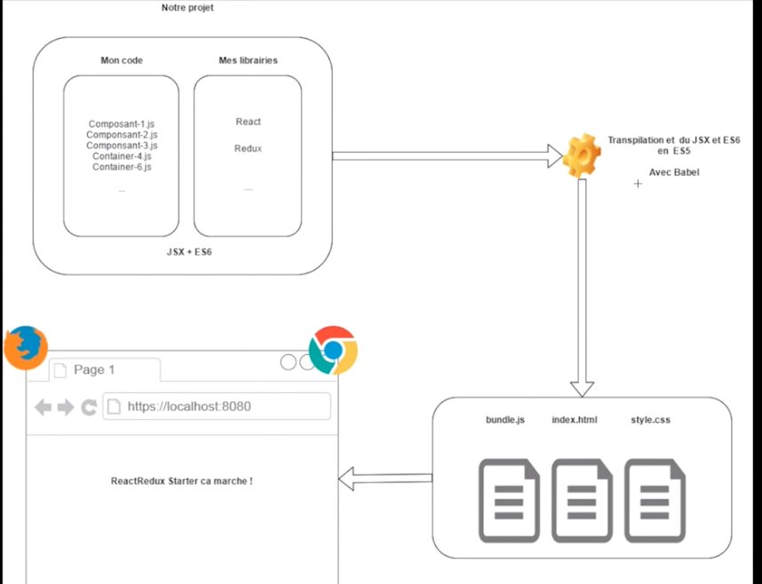

# REACT

[retour](../index-react.md)

<a href="./d0-react-fondamentaux.pdf" target="_blank">fondamentaux</a>

## Définition

<pre>
* <b>librairie</b> à destination de la partie <b>Front</b>.
    *  liste de fonctionnalité disponible mais non obligatoire.
    * on peut donc se passer de react dans certaines parties du code.

* ce n'est pas un <b>framework</b>
    * ne permet pas de gérer des accès à une base de données ou un serveur de manière directe
    * il faut utiliser d'autres utilitaires pour se connecter à un serveur : ajax ou axios (API Rest).

* permet d'éviter de recharger tout le contenu d'une page | seul les parties impactées par données
     et traitements sont rafraîchies.
* peut-être utiliser de manière autonome avec la réalistion d'application complète ou de manière sporadique.
</pre>

## Logique de composants.

<pre>
* <b>pas d'architecture mvc</b> mais logique de composant.
* Permet de découper la page Web en morceaux.
    * <b>Container</b> : composant statefull disposant de données et/ou regroupant d'autres composant à l'interieur.
    * <b>Component</b> : composant stateless ne disposant pas de données et ne fait que de l'affichage.
</pre>

## Fonctionnement de react : state

<pre>
* Appli : données <==> traitement <==> affichage
* React : dès lors que les données sont mises à jour par un traitement l'affichage est mis à jour directement.
* Seul les parties (composants) impactées par les modification sont mises à jour.
* Les données sont appelées <b>'state'</b>, 
    * toute modifiation d'un state engendre le rafraîchissement d'un composant.
</pre>

## Projet REACT, c''est quoi ?

<pre>
* React permet d'écrire du code JavaScript avancé.
    * babel permet de traduire le code pour les navigateur en javascript classique.

* <b>JSX</b> : JavaScript + XML (Ressembe à du HTML)
* <b>ES 5</b> : Javascript compris par les navigateurs
* <b>ES 6</b> : JavaScript avancé 
    * non compris par tous les navigateurs ; d'où une transpilation par <b>babel</b>
    * ecritrue à base de class, module,...
</pre>

<pre>
* Projet REACT : 
    * écrire du code modulaire (JSX + ES6) + Librairie REACT
    * transpiler le code en ES5 et packager
    * le <b>package</b> final comprend :
        * une fichier html : <b>index.html</b>
        * une fichier javascript : <b>bundle.js</b>
        * un fichier de style

</pre>

## Environnement

<pre>
* <b>node</b> 
    * permet de compiler le projet
    * permet de lancer le projet
    * permet de builder le package final

* <b>npm</b> : node package manager
    * gestionnaire de package qui permet d'installer les dépendances
    * après, il faut les importer dans le projet pour utilisation
    * <b>node_modules</b> : là où sont stocker les packages
    * <b>package.json</b> : configuration du projet avec les packages

* <b>npm install</b> : installe le projet
* <b>npm install dependance version</b> : installe une dépendance
* <b>npm start</b> : compile et lance le projet
</pre>

## module / composant

<pre>
* un <b>module</b> correspond à un fichier JavaScript
* un composant sera donc un module
* par défaut un module n'a <b>aucun contact</b> avec l'extérieur
* il faudra donc le lier avec le monde exterieur via les fonctionnalités <b>IMPORT / EXPORT</b>

Que peut on exporter (?) :
==> Tout objet que l'on peut récupérer par ailleurs via un import :
- une fonction pour un composant
- une liste javascript 
- un objet javascript

</pre>

### Fichier js

#### IMPORT des librairies

<pre>
* Tout fichier JS sera donc lié à REACT par import des librairies suivantes
* Récupération des libraires REACT 

    <b>import React from 'react';</b> 
        * récupération de la librairie REACT et ses fonctionnalités

* Insertion des éléments dans le DOM
 
    <b>import ReactDom from 'react-dom'</b>; 
        * manipulation du dom avec REACT

</pre>

#### IMPORT / EXPORT composants

<pre>
* <b>export</b> : pour pouvoir être utilisé dans les autres composant

    <i>export default MonComposant;</i>

* <b>import</b>
    
    <i>import App from './app'</i>
    
    * './': indique le répertoire courant 
    * pour les fichier '.js', pas besoin de l'extension
    
</pre>

### ReactDom / React

<pre>
ReactDom.render(composant / JSX, elementDom)
    => appel de la méthode render sur le module ReactDom

... extends React.Component <==>
    import 'React' from 'react';
    ... extends Component

</pre>
