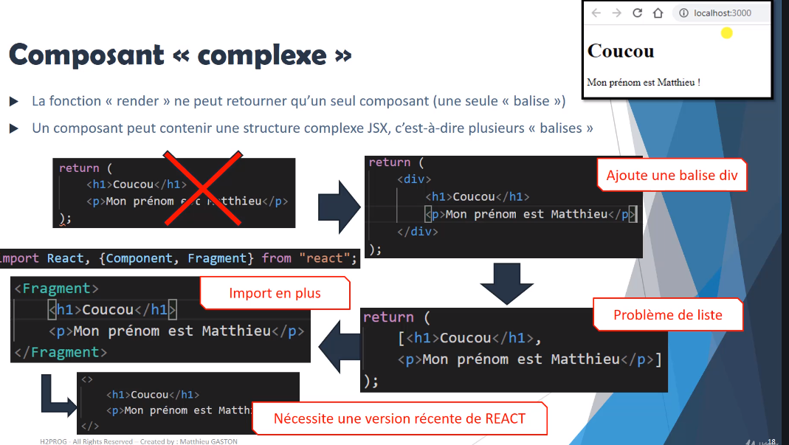

[retour](../index-react.md)

## Architecture

### Commande pour lancer la création d'un projet REACT

<pre>
* npx create-react-app projet0
</pre>

### Structure-Projet

<pre>
* folder node_modules : ensemble des modules à dispo pour réaliser l'application REACT
* folder public : 
    - index.html, seul fichier html du site
    - robot.txt : https://developers.google.com/search/docs/advanced/robots/create-robots-txt?hl=fr&visit_id=637459098710031895-641018878&rd=1
    - manifest.json : config de la partie public
        * logo
        * favicon ...
* folder src : application REACT
* package.json : gestion des modules de l'application
</pre>

### folder public

<pre>
* contient tous les fichiers publics accessible depuis le client
* tous les fichiers seront mis dans le build
* Dans l'application les urls ou chemin commençant par '/' pointe
  vers ce folder.
</pre>

#### index.html

<pre>
* <b>index.html</b> : structure standard d'une page web.
    * possibilité d'enrichir ce fichier : meta, css, des parties script (bootstrap).
    * le contenu de index.js est basculé directement dans le fichier index.html
</pre>

### Structuration du folder SRC

<pre>
* créer un folder Component pour les composants Stateless (fonction-composant)
* créer un folder Container pour les composants Statefull (class)

* un folder par Composant
    * qui contient le fichier du composant
    * fichier de style dediée
    * des sous-composant dépendants (component en général) 
</pre>

#### index.js

<pre>
* <b>index.js</b> 
    * fait le lien avec le fichier <b>index.html</b> du fichier public.
    * permet de prendre toute l'application REACT et la positonne dans la balise <b>id="root"</b>
    * appelle l'application 'App' présente dans le fichier App.js
</pre>

### build

<pre>
Quand on build on construit le dossier final qui sera envoyé sur le serveur web.
Il y aura alors une URL spécial
En mode production, devant le chemin des images, il y aura l'url du site
Il est donc conseiller de préfixer les images mis dans le folder public
par:
<b>process.env.PUBLIC_URL</b>
</pre>

### images

#### PUBLIC

<pre>
Quand on a besoin de référencer les images avec leur chemin, il faut les 
mettre dans le folder public.
Donc, mettre dans ce folder les images du site qui sont du contenu statique
qui ne bouge pas mais qui doit être accessible via une url.

<b>process.env.PUBLIC_URL</b>: préfixé le chemin des images avec cette variable
</pre>

#### Autres

<pre>
Pour les images n'ayant pas besoin d'être accessible par une url, il faut 
les mettre dans le folder /src, là où l'image est accéder en créant si besoin
des foldes spécifiques commes 'commons/icons'
Pour ces images, il faut les importer comme un composant classique dans REACT.
Cela concerne les images SVG, png, jpeg...
</pre>

```
import rightArrow from "./icons/right-arrow.svg";
==> Render

```

### styles

#### scss

<pre>
CSS avec des supers pouvoirs

Avec React: 
yarn add node-sass
</pre>

#### css

<pre>
* <b>index.html</b>
    * un fichier présent dans le répertoire <b>public</b> peut être inséré :
    <i>
    < link rel="stylesheet" href="<b>%PUBLIC_URL%</b>/style.css"  type = "text/css" />
    </i>    

* <b>FICHIER GLOBAL</b>: dans App.js : utiliser le système d'import.
    <i>
    import './App.css'
    </i>

* <b>FICHIER CSS</b> pour un <b>composant</b>
    * Ex: pour le composant : 'src\components\Personne\Personne.js'
    * Créer un fichier Personne.css dans le folder et faire l'import
    <i>
    import './Personne.css'
    </i>
    * <i>Attention</i>: les classes CSS sont <b>disponibles</b> pour <b>tous</b> les composants.

* <b>FICHIER CSS SPECIFIQUE</b> à un <b>composant</b> :
    * <b>Module</b> (disponible depuis version récente de React)
    * Ex: pour le composant : 'src\components\Personne\Personne.js'
    * Créer un fichier Personne.module.css dans le folder et faire l'import
    * permet récupérer dans la variable 'classes' mon module que l'on peut utiliser comme un objet
    <i>
        import classes from './Personne.module.css'
        render() {
            < div className={`${classes.monTitre} horloge`} >
        }
    </i>

* <b>STYLE INLINE</b> - Css dynamique
    * INTERET : 
        * créer du CSS dynammique: monStyle.fontSize = '12px'
        * qui varie en fonction des props, pkoi pas
    <i>
        en JSX:
        const monStyle = {backgroundColor: 'green', color:'white'}
        < div style={monStyle} >
    </i>
</pre>

### Bootstrap

#### index.html / bootswatch

<pre>
Il faut aller sur le site de bootstrap et ajouter les liens vers
la CSS et les scripts necessaires
* ajouter la CSS dans le fichier index.html
* ajouter les scripts nécessaires à bootstrap à la fin du fichier index.html
    avant la fin du body

Bootswatch : il est possible de customiser le thème via bootswatch.
Exemple: https://bootswatch.com/4/lumen.bootstrap.min.css
Dans le href du css, il faut remplacer la css par défaut par celle 
précédente
</pre>

#### via npm

<pre>
yarn add bootswatch
yarn add boostrap

Au niveau du composant < App >, faire l'import 
import "bootswatch/dist/lumen/bootstrap.min.css";
import "bootstrap/dist/js/bootstrap.bundle.js";

Certains composants ont besoin du JS
</pre>

### react/Bootstrap

<pre>
- intégration plus facile des composants
</pre>

```
yarn add react-boostrap
```

## JSX

### Principe

<pre>
* <b>ressemble</b> à du code <b>Html</b>
* permet de facilité l'implémentation d'élément du DOM ; 
    nécessite l'<b>import</b> de la librairie <b>REACT</b>
* génère en fait un code javascript (géré par REACT) plus simple à écrire
</pre>


### JSX et Ecriture JavaScript

<pre>
* Lien : https://medium.com/javascript-in-plain-english/curly-braces-versus-parenthesis-in-reactjs-4d3ffd33128f
* {} : permet d'exécuter du code JS dans du JSX
* <b>props</b>:
     <i> < Personne nom={this.state.personnes[0].nom} .../ ></i> 

* <b>style avec backstick</b>: 
    <i> < div className={`${classes.monTitre} horloge`}> ... </i>

* <b>Test dans le jsx</b>
    * dans le return on renvoit du code JSX et on ne peut faire de test sinon qu'entre les 
        accolades (ternaire)
    * sinon faire du code avant le return.

* <b>Itération pour afficher une liste</b> : utilisation de la fonction map
    * retourne un tableau que le JSX est capable d'afficher dirctement
    > Exemple :
    <i>
        < FRAGMENT >
        {this.state.personnes.map((personne, index) => {
            return < Personne key={index} {...personne} clic={this.anniversaireHandler.bind(this, index)}>
                < AgePersonne age={personne.age} />
            < /Personne>
        })}
        < /FRAGMENT >    

        équivaut à un <b>tableau d'élément</b> :

        return (
            [< Personne/ >, < Personne />, ...]
        ); 

    </i>
</pre>

## Composant

### défintion

<pre>
* C'est du code JSX
    - Simple fonction qui retourn du code JSX
    - Classe qui implémente méthode Render()

* Ce que peut renvoyer un composant :
    - un bloc <b>'< div/ >'</b>
    - Fragments: <b>'< Fragment >< /Fragment >'</b>
    - un bloc de chevrons - balises vides: <b><>< /></b>
    ou <b>un tableau</b> d'élément (jsx = javascript) : 
        <i>IMPORTANT</i> : Ne pas oublier que l'on renvoit du <b>javascript</b> et pas du html
        voir les exemples ci-dessous.
</pre>



### Création des composants - définition

#### A base de fonction: fonction-composant

<pre>
La création des composants dans React se fait :

* 1- soit sous forme d'une <b>définition de  fonction</b> qui renvoit du JSX
    * à utiliser pour composant qui ne fait que le l'affichage : <b>stateless</b>
    * la fonction est créée dans un fichier dédié portant un nom en <b>majuscule</b>
        ex: Personne.js

    * Syntaxe : définition du <b>nom</b> de la fonction et <b>export</b> en <b>minuscule</b>.

        * Définition :  
        <i>
            // définition
            const personne = (props) => { ... }; 

            // export
            export defaut personne;
        </i>

        * Import : 
            * permet d'instancier le composant portant liée à la fonction personne();
                < Personne/ > = personne(); // correspond à l'exécution de la fonction.
            
            *norme pour une fonction : minuscule ou <b>majuscule</b> pour l'instance du composant.
            <i>
                // import
                import Personne from './Personne.js';
            </i>

        <i>
    * <b>important</b> : une fonction composant n'a pas d'instance
        * Une <b>instance</b> correspond à ce que vous appelez <b>this</b> dans la classe 
            du composant que vous écrivez. 
        * C’est utile pour stocker l’état local et réagir aux événements du cycle de vie.
        </i>

</pre>

#### A base de classe : container

<pre>
* 2- soit sous forme de <b>classe</b>
    * composant ayant besoin de connaître 
        * le state
        * ou un morceau de l'état de l'application
    * composant avec logique : 
        * datas(state) + traitement(fonction) + composants(affichage) : <b>statefull</b>
    
    * la fonction est créée dans un fichier dédié portant un nom en <b>majuscule</b>
    * nom de classe avec une majuscule
    * étend un élément spécifique de React : Component.
    * implémenter de manière obligatoire la fonction Render qui retourne du JSX
    * pour l'import : majuscule pour le nom/instance du composant.
    
    * Exemple
        <i>
        // Composant de type class.
        class Personne extends Component{
            
            constructor(props){
                super(props);
            }
            
            render() {
                return <h1 className="test">Coucou</h1>;
            }   
        }
        export default Personne;
        </i>

    <i>Note:</i>
        * Un composant de type 'fonction' correspond à la méthode 
            'render' d'un compoant de type 'class'.
        * L'avantage des composants est donc leur réutilisabilité 
            pour créer des objets à la volée. 
</pre>


### props (propriété)

<pre>
* permet de passer des informations à un composant

* IMPORTANT : 
    * il est impossible de modifier des props dans un composant.
    * ce sont les données d'entrée du composant.
    * props ne permettent pas de mettre à jour le composant

* Component
    * déclaré les props en paramètre d'entrée
        <i>
            const personne = (props) = { ... }
        </i>

* Container
    * depuis ecmascript 7 plus besoin d'initialiser les props dans constructor dans un composant
        * Accès direct dans le JSX : this.props.maproriete
        * Avant ecmascript 7 :
        <i>  
            constructor(props){
                super(props); // appel constructeur de la classe mère
            }
        </i>    

* Passage des props à un composant
    * 1- Passer de manière <b>unitaire</b>
    <i>
        < Personne nom={this.state.personnes[1].nom} 
            age={this.state.personnes[1].age} sexe={this.state.personnes[1].sexe} / >
    </i>
    
    * 2- Passer de manière <b>globale</b>:
    <i>
        < Personne {... this.state.personnes[0]} / >
    </i>
</pre>

### Cycle de vie dans REACT

<pre>
* Montage d'un composant : 
    > constructor : construction du composant
        * on peut ici initialiser le state avec les props du composant.
    > render : le composant est affiché dans le navigateur
    > Mise à jour du Dom et les références des différents composants
    > componentDidMount : après le montage du composant
        * permet de réaliser une action après le premier chargement du composant, 
            une fois qu'il a fait son premier affichage.

* Mise à jour du composant: new props | setState() | forceUpdate()
    * Ces 3 évènement déclenchent la mise à jour du composant :
    > render
    > Mise à jour du Dom et les références des différents composants
    > componentDidUpdate : à utiliser pour faire de actions après la mise à jour
        du composant

* Démontage:
    > componentWillUnmount : avant le démontage du composant
</pre>


### state

#### Définition

<pre>
* Moyen pour conserver une information : stocker, manipuler, véhiculer et mettre à jour de l'information 
    au travers des composants.

* 'state' est un <b>objet hérité</b> qui sert à stocker des objets (datas = données) que l'on souhaite gérer 
    pour <b>mise à jour</b>.

* Pour ce faire, on stocke l'information 'new Date()' au niveau d'un attribut de la classe Horloge 
    'date', dans l'<b>attribut state</b>, attribut <b>spécifique</b> de la <b>classe Component</b>.

* La <b>mise à jour</b> du <b>state</b> engendre la <b>mise à jour</b> de l'<b>affichage</B>, 
    tous les composants utilisant l'information mise à jour sont impactés et rafraichis.

* L'<b>application réagit</b> en fonction des <b>données</b> et les données sont les <b>'state'</b> 
    ( ou stockée dans le state).

* création du state:
1- via le <b>constructeur</b>:
<i>
    constructor(props){
        super(props);
        this.state = {
            date: new Date().toLocaleTimeString()
        }
    }
</i>

2- <b>directement</b>:
<i>
    state = {
        date: new Date().toLocaleTimeString()
    }
</i>

</pre>

#### setState()

<pre>

* permet de mettre à jour les données du composant pour réafficher celui-ci.

* fonction obligatoire qui permet de fusionner les données dans le state avec les données 
    nouvellement transmises.

* <b>Important </b> : ne pas utiliser le code suivant car il ne déclenche pas la méthode Render(); 
    
    <i>this.state.attribut = newValeur ;</i> 

* deux options
    1- mettre à jour en passant un <b>objet</b> comme paramètre
        * ici on modifie la valeur sans tenir compte de la valeur précédente
    2- mettre à jour en fonction de la valeur précédente
        * il faut passer par <b>une fonction</b> qui va modifier le state
            voir ci-dessous : immutabilité
</pre>

#### immutabilité

<pre>
* Consiste à faire en sorte de <b>créer de nouvelle variables / constantes</b> pour <b>modifier</b> la valeur d'un 
    <b>state</b> ; c'est à dire que l'on passe par une copie des informations des states sans utiliser 
    directement les précédentes valeurs

* La <b>mise à jour</b> du <b>state</b> est faite de manière <b>asynchrone</b>   
    
    * il peut donc y avoir une incohérence dans le state dés lors que l'on veut modifier une valeur du 
        state en utilisant la précédente valeur du state pour un attribut donné.

    * Comme l'appel setState est asynchrone, on est pas certains que les opérations se déroulent 
        dans le bon ordre entre <b>setState</b> et la mise à jour <b>this.state.compteur...</b>
    <i>
        this.setState({
            date: new Date(r),
            compteur: this.state.compteur + 1
        });    
    </i>

    * Pour garantir l'immutabilité, il faut privilégier le passage par une fonction pour la mise à 
        jour du state:
    
    <i>
        this.setState((oldState, props) => {
            return {
                date: new Date().toLocaleTimeString(),
                cpt: oldState.cpt + 1
            }
        });    
    </i>

    * Pour annuler l'opération de mise à jour du state:
    <i>
    this.setState((oldState, props) => {
        if (...) { return null; }
        ...
        let newState = { ... };
        return newState;
    </i>
</pre>

#### Fusion dans les states

<pre>
* On peut faire un <b>'setState'</b> en remplaçant qu'une seule propriété du state, 
    les autres propriétés ne sont pas modifiés. 
    Dans ce cas, c'est une fusion qui est réalisée : 
        * copie
        * modif sur la copie
    
    <i>
    handleChangeImage = (getNewImage) => {

        this.setState((oldState,props) => {
        
            const newPersonnage = {...oldState.personnage};
            newPersonnage.image = getNewImage(oldState.personnage.image);
            // fusion dans les states
            return {
                personnage: newPersonnage
            }

        });

    }    
    </i>

</pre>

#### Synthese


### Fonction

#### contexte

<pre>
Une fonction crée dans un composant est créé une fois pour toute en mémoire.
=> pour une fonction non définit dans la méthode Render.

<b>IMPORTANT</b>: cette fonction s'exécutera en fonction du contexte
du composant et de son state à l'instant où elle est exécutée.
En fonction, du moment où elle s'exécute, le résultat sera donc différent.
</pre>

### TESTS dans méthode Render

<pre>
* Pour faire des test dans la fonction de rendu 
    * si code <b>JSX</b> : utiliser les <b>ternaires</b>
    * sinon avant la <b>methode return</b> en utilisant : if ... else ...
</pre>


## Evènement

### Gestion des évnènements dans REACT

### Principe REACT

<pre>
* 1- définir les <b>évènements</b> au niveau d'un container sous forme de <b>fonctions</b> de classe.
    * xxxxHandler
    * handleXxxxxx

* 2- Transmission de la fonction à un composant fils 
    * en <b>transmettant la référence</b> par l'intermédiaire d'une <b>props</b>.
    * pour les <b>paramètres</b>, utlisations des <b>fonctions fléchées</b> ou de la fonction bind
</pre>

### Evenement en jsx : ajout du code javascript sur onClick

#### Cas 1 : execution immediate

<pre>
    <i>
    < button onClick={alert('coucou')}>Anniversaire< /button >
    </i>
    * page affiche 'coucou' au démarrage.
</pre>

#### Cas 2a : execution au click via une fonction

<pre>
    <i>
    < button onClick={function(){alert('coucou'); console.log(this);}.bind(this)} >
    </i>

    * this existe dans la fonction car binding explicite
    *  execute la fonction au click.
</pre>

#### Cas 2b : execution au click via une fonction fleche

<pre>
    <i>
    < button onClick={() => alert('coucou')}>Anniversaire< /button >
    </i>
    * this existe dans la fonction car utilisation d'une fonction fléchée.
    * execute la fonction au click.
</pre>

#### Cas 3 : execution au click sur une reference de fonction sans binding

<pre>
    <i>
    ditBonjour() {
        ....
    }
    < button onClick={this.ditBonjour}>Anniversaire< /button >
    </i>
    * On passe la référence de la fonction, sans les parenthèses pour ne pas l'exécuter
    * <b>attention</b>: this n'existe pas dans la fonction
</pre>

#### Cas 4 : execution au click sur une reference de fonction avec binding

<pre>
    <i>
    ditBonjour() {
        ....
    }
    </i>
    < button onClick={this.ditBonjour.bind(this)}>Anniversaire< /button >

    * this existe dans la fonction, car utlisation de la fonction 'bind' sur this
    * pas de paramètre passé à la fonction
    * pas besoin de passer event en paramètre : passé implicitement en dernier paramètre
</pre>

#### Cas 5 : execution au click sur une reference de fonction flèche

<pre>
    <i>
    ditBonjour = () => {
        ....
    }
    </i>
    < button onClick={this.ditBonjour}>Anniversaire< /button >

    * this existe dans la fonction car la fonction est définit avec une fonction flèchée.
</pre>

#### Cas 6 : bind explicit sur this avec parametre et event

<pre>
    <i>
    ditBonjour(args, e) {
        // console.log('Bonjour ' + nom);
        console.log('event = ', e);
        console.log('dit Bonjour : this = ', this);
        console.log('dit Bonjour : args = ', args);
    }
    < button onClick={this.ditBonjour.bind(this, ['param1','param2'])}>Anniversaire< /button >
    </i>

    * this existe dans la fonction, car utlisation de la fonction 'bind' sur this
    * les paramètres sont passés sous la forme d'un tableau
    * Dans cet appel, e(event) est passé implicitement en tant que dernier paramètre.
</pre>

#### Cas 7 : execution au click sur une reference de fonction flèche + event

<pre>
    * à privilégier
    <i>
    ditBonjour = (event, args) => {
        // console.log('Bonjour ' + nom);
        console.log('event = ', event);
        console.log('dit Bonjour : this = ', this);
        console.log('dit Bonjour : args = ', args);
    }
    </i>
    
    < button onClick={(event) => this.ditBonjour(event, 'toto1')}>Anniversaire< /button >

    * fonction fléchée pour déclarer la fonction
    * fonction fléchée pour appeler la fonction
</pre>


## Children ou composition

### principe

<pre>
* Système d'emballage de REACT ou composition : permet de manipuler des composants par des 
    composants via la proprité children
* permet d'indiquer que l'on aura un composant 'enfant' qui sera affiché à cet endroit, 
    peut-import ce que sait.
* Information définit à l'intérieur d'un composant
* Elle peut être exploitée par le compsants via la fonctionalité children : {this.props.children}
* L'intérêt d'utiliser ces composants fils, c'est de transmettre des informations au composant 
    sans savoir ce que l'on va récupérer
* IMPORTANT : l'info transmises peut-être un composant, on parle de composant fils.
> exemple : composant d'erreur ou d'alerte | modale : "tu n'as pas à savoir ce que j'affichage 
    mais juste tu dois de le mettre à cette place".
</pre>

### Exemple

```
Exemple avec un provider de context:
  return (
    <LangContext.Provider value={{ lang: lang, toggleLang: toggleLang }}>
      {props.children}
    </LangContext.Provider>
  );
```

## Liste et fonction map()

<pre>
* Dans le JSX, l'idée est souvent de parcourir le state qui dispose de données sous-forme de tableau
* La fonction map permet alors de traiter ce tableau de données et de le 'retourner/transformmer' 
    en  'un tableau / une liste' de composants.
* La propriété 'key' est alors à définir pour chaque composant quand une liste de composants 
    est ainsi générée
* La clé de la fonction map doit être présente sur le composant de plus haut niveau.
    
    <i>
        < div className="row no-gutters">{
            armes.map((arme) => {
                return (
                    < div key={arme.key} className="col-3 text-center align-items-center">
                    < Arme label={arme.label} img={arme.img} />
                    < /div>
                )
            })
        }
        < /div>
    </i>

</pre>


## CallBack

<pre>
<b>définion</b>
* fonction passée en tant que props
* fonction passée en paramètre d'une autre fonction
<b>but</b>:
* le callback a pour but de mettre à jour le state du composant parent pour 
	rédéclencher un render
</pre>
