# Projet Sharebook

[retour](../../index-react.md)

## Archi

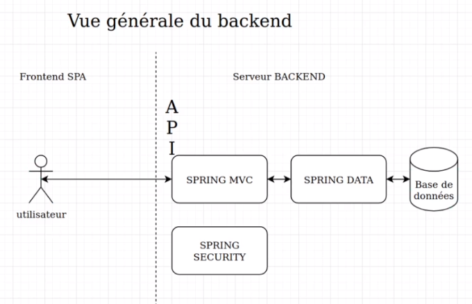

## Spring

### spring-core

<pre>
* container spring initialiser au runtime (lancement de l'appication)
  ==> permet d'ajouter des comportements dynamiquement
* contient la config. de l'application
* on utilise une interface.
 * au niveau de la déclaration des beans dans la configuration 
 * au niveau des beans injectés dans les classes, 
    * mais c'est l'implémentation qui sera injecté: @autowired
</pre>

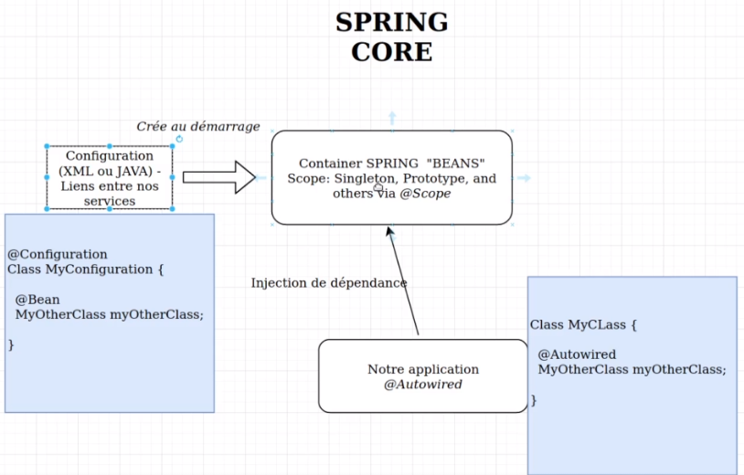

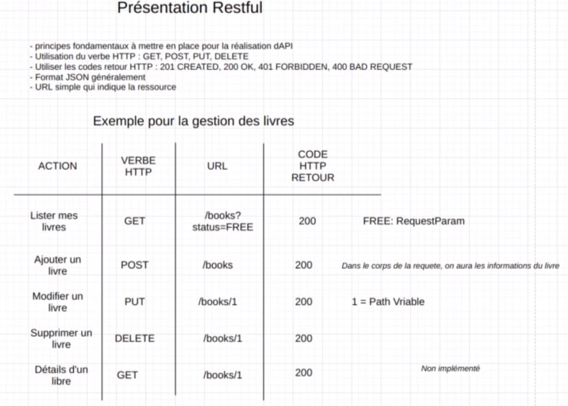

### spring mvc

<a href="../../../../../java/spring/spring-mvc/rest-mvc.md" target="_blank">Rest-Mvc</a>

#### RestFul

<pre>
* approche RestFull : respecter au maximum l'approche REST
</pre>

#### @RestController

<pre>
Spring MVC fournit la notion de controleur, qui permet de donner 
des points d'entrée dans l'application pour se brancher aux services.
Contrôleur métier:
BookController: gestion des livres
UserController: gestion des utilisateurs et incscription
BorrowController: gestion des emprunts

Contrôleur technique
JwtController: gestion de la partie authentification
</pre>

#### BookController

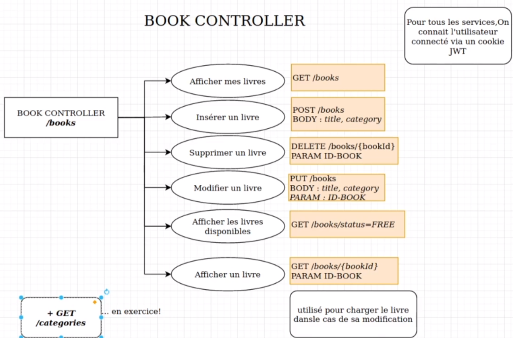

#### UserController

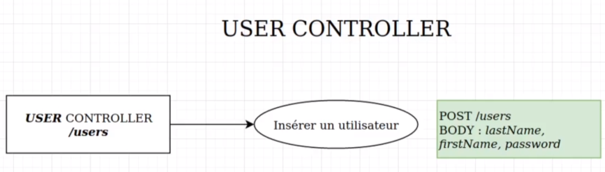

#### BarrowController

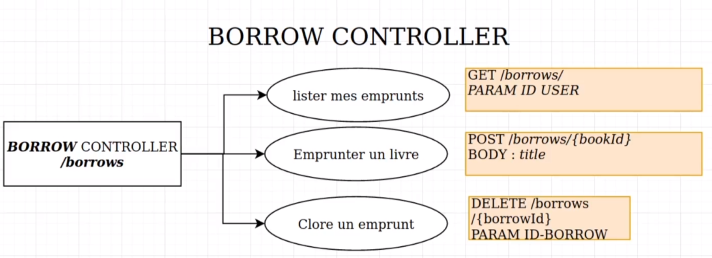

## Modèle de données

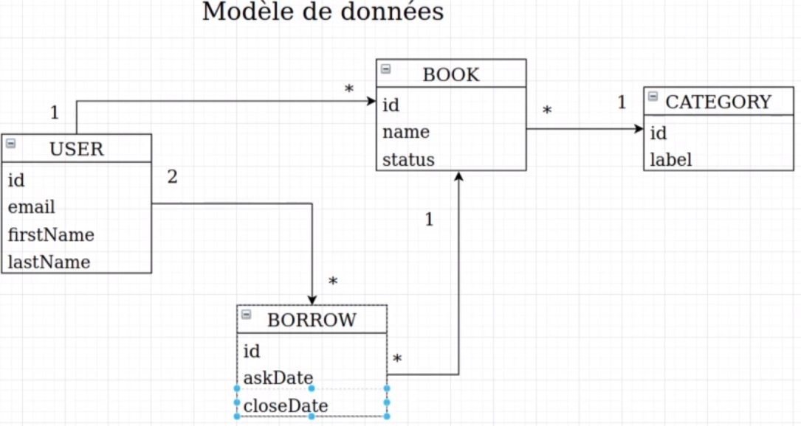

### Spring data

#### modèle

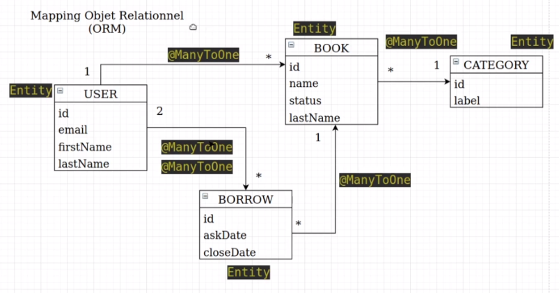

#### pom.xml

```

```

## Front

### Ecran

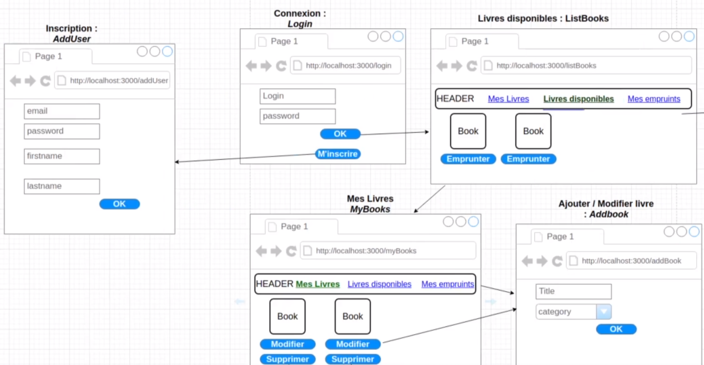

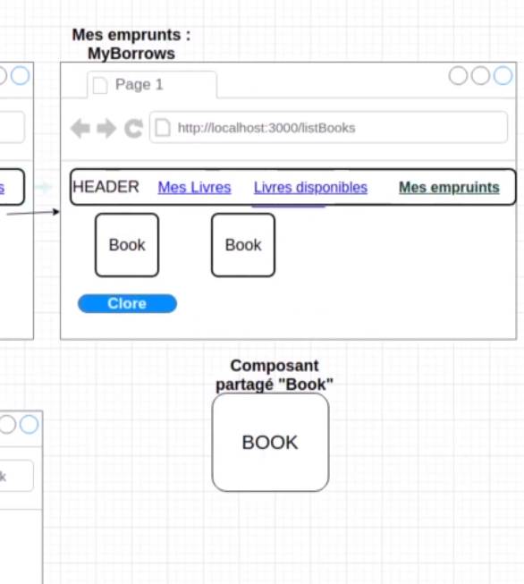

### React-Router

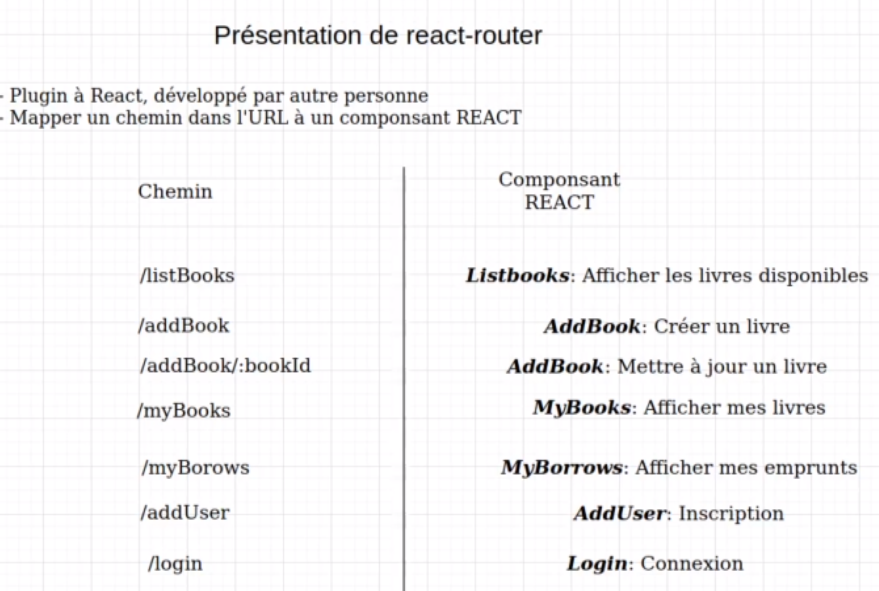

### Hook

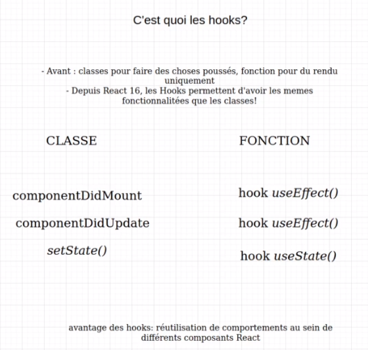

### axios

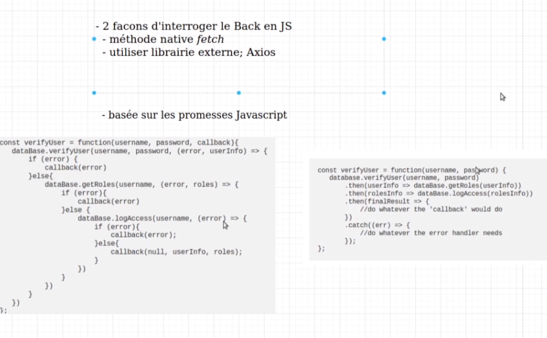
