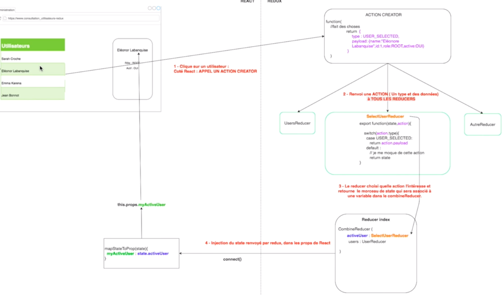

## REACT

[home](../../index-js.md)

### Reducers

#### Root Reducer
<pre>
* <i>rappel</i> : le store se base sur les reducer pour avoir son résultat
* Root-Reducer : (fichier Reducer/index)
    * fichier racine des reducers
    * sorte de fichier de configuration qui définit l'architecture du store
    * chaque clé est associé à un reducer 
    * rootReducer = <b>fonction CombienReducer</b> qui fait le <b>binding / mapping </b> 
        entre ce qui est retourné par les <b>reducers</b> vial les <b>clés</b> et 
        le <b>store</b> de redux pour mise à jour du <b>state</b>.
    * le résultat du reducer finit par être <b>publier</b> dans le store
</pre>

#### Appel des reducers
<pre>
* les reducers : on ne les appelle jamais
* c'est un <b>déclencheur</b> qui va appeler tous les reducers
* tous les reducers sont appelés pour initialiser le state :
    * 1 fois au démarrage
    * 1 fois dans la phase d'initialisation
    ==> donc 2 fois au démarrage
</pre>

#### Connecter Redux à React
<pre>
* <b>connect</b> : permet de connecter le composant à Redux

    <i>Code : </i>
        <i>import {connect] from 'redux'</i>
        
        <i>
        function mapStateToProps(state) {
            return {
                users : state.users    
            }
        }
        </i>

        <i>export connect(mapStateToProps)(composant)</i>

* <b>mapStateToProps(state)</b> :
    * est appelé à chaque fois que le <b>state</b> est <b>modifié</b>
    * le <b>retour</b> est mis dans les <b>props</b> du composant
    * devient la fonction de pont entre React et Redux
</pre>

### ActionCreators

#### définition - actionCreator
<pre>
* utiliser pour <b>appeler les Reducers</b>
    * par exemple au click sur un utilisteur d'une liste pour accéder
        à l'écran de détail
* simple fonction qui <b>retourne</b> une <b>action</b> à <b>destination</b> des <b>reducers</b>
* fonction qui peut prendre un paramètre 
</pre>

#### Exemple
<pre>
<i>
export const USER_SELECTED = 'USER_SELECTED'

export function selectUser(user){
    return {
        type: USER_SELECTED,
        payload: user
    }
}
</i>
</pre>

#### principe
<pre>
1- un ActionCreator retourne une action
2- Redux envoi alors l'action à tous les reducers (Type / Payload)
3- suivant le <b>type</b> de l'action, le reducer traitera ou non l'action
4- le reducer retourne alors le <b>payload</b>
5- si le type d'action ne correspond pas, le state est retourné
</pre>

#### appel des actions
<pre>
<i>Comment appeler une action côté React ?</i>

* <b>bindActionCreators</b> : 
    * met l'<b>actionCreator</b> dans les <b>props</b>
    * permet d'<b>envoyer</b> l'<b>action</b> à tous les <b>reducers</b> via 
        la fonction <b>dispatch</b> de redux, quand l'actionCreator est déclenché.
    

    <i>Code : </i>
        <i>import {bindActionCreators] from 'redux'</i>
        
        function mapDispatchToProps(dispatch) {
            return bindActionCreators({selectUser: selectUser}, dispatch);
        }

        <i>export connect(mapDispatchToProps)(composant)</i>

* <b>mapDispatchToProps(dispatch)</b> :

    1- selectUser : actionCreators qui retourne une action
        * l'objet action, on n'en veut pas tel quel dans le composant car l'<b>info</b>
            ne sera pas mise dans le <b>state</b> et non accessbile de façon permanente
        * ce que l'on veut, c'est que l'<b>action mette à jour le store</b> de redux

    2- actionCreators doit <b>envoyer l'action aux reducers</b>
        * pour cela, il faut binder l'actionCreator dans les props et quand on
            utiliser le code : this.props.selectUser, l'action est alors 
            envoyé aux reducers (via dispatch) et non renvoyé au composant

    3- le reducer concerné attrape l'info et la met dans le state

    4- comme le composant est connecté au state via <b>mapStateToProps</b>,
        le composant se met alors à jour
    
</pre>

