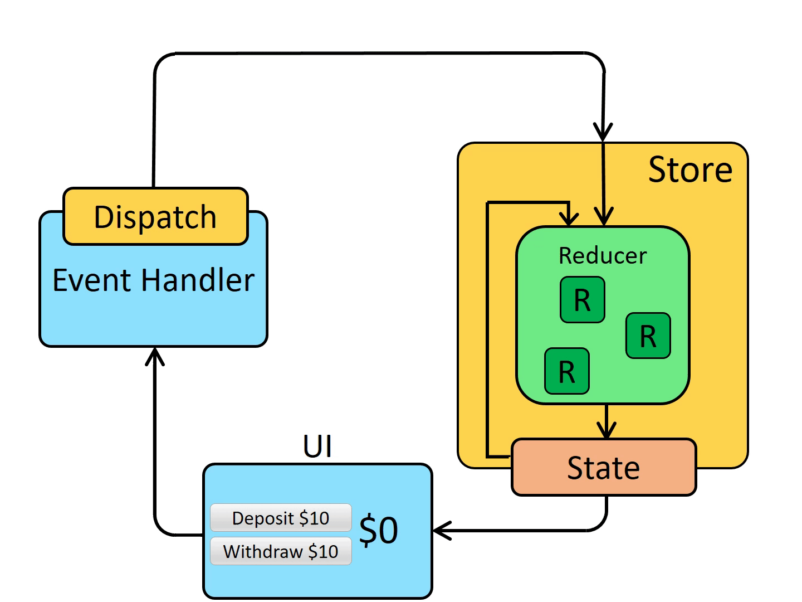

[home](../../index-js.md)

## Dev Tools

## Redux

### OverView
<pre>
Redux is made of:
- actions
- reducers
- state
- store


</pre>

## Store

### Définition

### configureStore

#### principe
<pre>
* The configure store function does all the hard work for us. 
  It creates the store which :
  * holds our state, 
  * holds our reducers and managed them for us, 
  * and has some nice built in middleware

* requires that we pass a <b>reducer</b> argument
  which we do by passing an object
* application is composed of several  features ; 
  each feature have its own <b>reducer function</b>
* keyName in Object reducer define the keys in our final state value
* each keyName define a <b>section</b> of our redux state object
* keyName is associated with a <b>reducer</b>

* The configureStore function gives us back a store, which we can export
</pre>

#### code
```
import { configureStore } from '@reduxjs/toolkit';
import todoReducer from './todoSlice';

export default configureStore({
	reducer: {
		todos: todoReducer,
	},
});
```

#### reducer 
<pre>
* reducer function export from a file 'componentSlice.js'
* reducer : it the content of the slice in fact.
  - it return an envelop that contains: 
    - state
    - reducers
  define in the slice
* this reducser is different form reducer fonction in the slice
</pre>

### Provider
<pre>
* connect the store to the App
* App component must be wrapped in the <b>Provider</b> component.
</pre>
```
import React from 'react';
import ReactDOM from 'react-dom';
import './index.css';
import App from './App';
import store from './redux/store';
import { Provider } from 'react-redux';

ReactDOM.render(
	<React.StrictMode>
		<Provider store={store}>
			<App />
		</Provider>
	</React.StrictMode>,
	document.getElementById('root')
);
```

### store setup
<pre>
* redux allows store setup with different kind of plugins (middleware and enhancers)
* <b>configureStore</b> : automatically adds several middleware to the store
    * redux-thunk middleware
</pre>

## Slice

### definition
<pre>
* slice : collection of Redux reducer logic and actions
  for a <b>single feature</b> in your app 

* This is where we get our 
  * actions 
  * and reducers
 which we can export.
 So when we <b>dispatch</b> the action, it's the associated
 reducer that <b>handles</b> that action.

* slice take care of the work of <b>generating</b> :
    * <b>action type</b> string  (slice name + key name of reducer function)
    * <b>action creator</b> : (same name that action creator function)
    * <b>action objects</b> (plain object with a type field) 
    * also generate <b>reducer function</b> that knows how to respond to all these action types

* slice need a <b>initial state value</b> for the reducers
</pre>

### Exemple
```
import { createSlice } from '@reduxjs/toolkit';

export const todoSlice = createSlice({
	name: 'todos',
	initialState: [
		{ id: 1, title: 'todo1', completed: false },
		{ id: 2, title: 'todo2', completed: false },
		{ id: 3, title: 'todo3', completed: true },
		{ id: 4, title: 'todo4', completed: false },
		{ id: 5, title: 'todo5', completed: false },
	],
	reducers: {
		addTodo: (state, action) => {
			const todo = {
				id: new Date(),
				title: action.payload.title,
				completed: false,
			};
			state.push(todo);
		},

	},
});


export const { addTodo } = todoSlice.actions;

export default todoSlice.reducer;
```

## Reducers

### Rules of reducers
<pre>
A reducer sounds fancy but its just a function that takes 
* the current state (<b>of this slice</b>) from the store, 
* and the action that containes type and payload 
It combines things together and returns the new state.
</pre>

### Reducers and Immutable Updates
<pre>
* createSlice use a library called Immer inside and lets you write immutable updates an easier way.
* Immmer use a proxy to wrap the data you provide and 
    lets you write code that mutates that wrapped data
* after, immer tracks all the changes you've tried to make ant then use that list 
    of change to return a safely immutably updated value
* immer detects changes to a draft state (dans le nouvel état)
</pre>

## ActionCreator

### ActionCreator and parameters
<pre>
* all reducer don't actually have their code look at the action object.
* it will be passed anyway but we can skip declaring action parameter
* <b>important</b> : parameter of ActionCreator is being put into the action payload
</pre>

## useDispatch
<pre>
* hook that allow to dispatch an action to the store
* in paramaeter we pass the action/actionCreator
* in parameter of action we pass a new object that will
  get mapped to the action payload.
</pre>

```
	const onSubmit = (event) => {
		event.preventDefault();
		if (value) {
			dispatch(addTodo({
				title: value
			}))
		}
	};
```

## useSelector
<pre>
* lets our component extract whatever pieces of data it needs 
  from the redux store state

* <b>selector functions</b>
    * take state as an argument 
    * return some part of the state value

* Our components can't talk to the Redux store directly, because we're not allowed 
  to import it into component files. 
  But, useSelector takes care of talking to the Redux store behind the scenes 
  for us.

<b> Important </b> :
1/ Any time an action has been dispatched and the Redux store has been updated, 
  useSelector will re-run our selector function. If the selector returns a different 
  value than last time, useSelector will make sure our component 
  <b>re-renders</b> with the new value.

2/ The state value that gets passed in to the useSelector hook function 
  is the entire state tree that is stored in Redux

</pre>

```
const todos = useSelector((state) => state.todos);
```

## Async Thunk

### OverView


### Principe
<pre>


So far, all the logic in our application has been synchronous.
  * Actions are dispatched, 
  * the store runs the reducers and calculates the new state
  * the dispatch function finishes. 

1- Instead of dispatching a plain action, our component dispatches 
  an action that calls a <b>thunk</b>

2- This action gets intercepted by the middleware which does the API call.

3- Once the API does its thing and we get the response back, 
  the <b>middleware</b> takes the data and dispatches a 
  <b>plain old action</b>
  The payload here could be whatever was returned from the API

4- An extraReducer handle the actions

<b>Note</b>:
This is the logical place to do this, as we can’t do the API call : 
* in our components since it would be difficult to reuse the code
* we can’t do the API call in the reducer because the reducer 
  is a pure function that creates new state only.

</pre>

### Definition
<pre>

What is a thunk:
* is a specific kind of Redux function that <b>can contain</b> asynchronous logic.
* is a function that returns another function
    * An inside thunk function, which gets <b>dispatch</b> and <b>getState</b> as arguments
    * The outside creator function, which creates and returns the thunk function
* the outside fonction is the new action which we dispatch from our components
* the inside function is the treatement handle by the thunk:
    * execute async code
    * then dispatch an <b>plain action</b>
</pre>

### Exemple 1 : thunk sync
<pre>
export const incrementIfOdd = (amount) => (dispatch, getState) => {
  const currentValue = selectCount(getState());
  if (currentValue % 2 === 1) {
    dispatch(incrementByAmount(amount));
  }
};
</pre>

### Exemple 2 : thunk async - call API Ajax
<pre>
// the outside "thunk creator" function
const fetchUserById = userId => {
  // the inside "thunk function"
  return async (dispatch, getState) => {
    try {
      // make an async call in the thunk
      const user = await userAPI.fetchById(userId)
      // dispatch an action when we get the response back
      dispatch(userLoaded(user))
    } catch (err) {
      // If something went wrong, handle it here
    }
  }
}
</pre>

