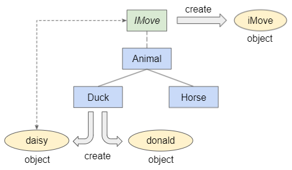

## typescript

[retour](../../index-js.md)

### Compilation vs Transpilation
<pre>
Transpilation : Typescript ==> JavaScript
	transformer un langage de haut niveau vers un autre langage de haut niveau

Compilation : java => langage machine
	transformer un langage de haut niveau vers un langage de base niveau (langage machine)
</pre>

#### tsc 
<pre>
* tsc : permet de compiler un fichier ts en js
$ tsc main.ts --target es6 --watch

* --watch : compilation à chaud
* --init ==> initialiser le projet tsconfig

    "module": "commonjs",    /* Specify what module code is generated. */
    "rootDir": "./src/scripts",
    "sourceMap": true,  
    "outDir": "./dist/scripts",
</pre>

#### tsconfig
<pre>
C'est le fichier de configuration du transpiler
<a href="https://www.typescriptlang.org/tsconfig#strictNullChecks" target="_blank">configuration de typescripts</a>
</pre>

#### projet typescript + sass
<pre>
Principe: 
initialiser un projet (node: gestionnaire de paquets)
* yarn init ==> install package.json
* npm  add -D typescript ==> install typescript (facultatif)
* installer sass: npm install -g sass
*  package.json ==>
    "scripts": {
      "sass": "sass --watch ./src/sass/main.scss ./dist/styles/style.css",
      "tsc": "tsc --watch",
      "dev": "start yarn sass && start yarn tsc"
    },

* Structure du projet: index.html
  < link rel="stylesheet" type="text/css" href="./dist/styles/style.css" />
  < script src="./dist/scripts/main.js"></>
</pre>

### Bases

#### Typage
<pre>
* déclaration de type
* casting
* typage implicite / explicit
* sans typage, le type est any.
</pre>

##### Types Primitifs
<pre>
* number
* string
* boolean
* null : la valeur nulle
* undefined: la valeur non définie
* symbol: les symboles
* bigint: les entiers de grandes tailles
</pre>

##### any
<pre>
* à éviter
* eventuellment pour des tableaux ayant des valeurs de plusieurs types ???
</pre>

##### unknown et typeof
<pre>
* à utiliser en lieu et place de any quand on ne sait pas à quel type on a affaire.
*  Permet de mieux coder et gérer les différents types en cas
   d'affectation à une autre variable typé
* utiliser sur une variable qui reçoit sa valeur d'une fonction qui peut 
  retourner différents types.
  On utilise alors le typeof pour savoir le type retourné.

  typeguard: typeof
</pre>

##### never
<pre>
sert pour typer le retour des fonctions quand elles
ne retournent rien même pas le vide.
</pre>

##### type optionel
<pre>
* ? : permet de définir une propriété comme optionnelle
* reverseWord? boolean; boolean | undefined
* reverseWord = false ==> valeur par défaut
</pre>

##### autres
<pre>
- ! : permet d'indiquer qu'un élément ne peut être null
      on indique à TypeScript que la récupération de la valeur se fait bien.
      sur les selecteurs HTMLs
- ?? : vérifier si une valeur est null ou undefined
</pre>

#### Type
<pre>
Permet la définition de type
Les types "Type" sont des variables comme const.
Une fois définie, on ne peut pas les modifier
On peut assigner à un type:
* des types primitifs (number / string)
* des unions
* des fonctions
* des objets
* des tableaux => des tuples
* des litterals : on assigne une valeur au tuple

Exemple: 
> type MajorityAge = 18 | 19 |20;
> type TraffiLightColor = 'rouge' | 'vert' | 'orange';
> type Id = MajorityAge;
> type GetByIdFn = (id:Id) => User;
> type User = {
  id: Id;
  name: string;
  feu: TraffiLightColor
}
> type Tuple = [string, number]

const getById: GetByIdFn = (id) => {
  return {id: id, name: "toto", feu: "rouge"};
}

</pre>

#### Type littéral
<pre>
Type Littéral :
Avec les "littéral", on vient limiter les valeurs possibles
En combinant avec les unions, on limite les valeurs.

Revient à faire une sorte d'Enum:
// 🦁 Utilise le bon type ici
type PaymentCardType = "visa" | "mastercard";
const payWithVisa = () => {};
const payWithMastercard = () => {};

const pay = (card: PaymentCardType) => {
  switch (card) {
    case 'visa':
      return payWithVisa();
    case 'mastercard':
      return payWithMastercard();
    default:
      throw new Error('Invalid card');
  }
};
</pre>

#### Fonctions

##### déclaration de fonction:
<pre>
// mode ES5
function ma_fonction(param1:type, param2:type) : returnType {
  ...
}

// mode fonction anonyme
var ma_fonction = function(p1:type, p2:type) : returnType{ 
  ... 
}

// mode fonction flèchée
const ma_fonction = (p1: type, p2: type) : returnType => {
  ...
}
</pre>


##### fonction de rappel
<pre>
On peut déclarer une variable de type fonction, sans préciser la signature
let test: Function
Pas bon, car on perd le typage quand on assigne une fonction à cette variable
Notamment sur les paramètres.

let test: Function;
let operation: (a:number, b:number) => number;
</pre>


#### Union de type
<pre>
Les unions sont un moyen de déclarer une variable qui peut appartenir à plusieurs types 
différents.
</pre>

#### surcharge de fonction

#### tableau // tuples
##### Définition
<pre>
Un tableau se base sur le générique Array.
Ce qui fait qu'on peut déclarer un tableau de n'importe quel type.
const names:string[] = new Array< string >("Mary","Tom","Jack","Jill") 

</pre>
==> Comment déclarer un tableau

#### type vs interface ==> Fait la même chose.

#### union et objet :
<pre>
- créer un type qui est l'union de deux objets : soit l'un, soit l'autre
- créer un objet de regroupement pour des objets similaire mais qui n'ont
  pas tout à fait les mêmes attributs
- vérifier que l'attribut est présent dans le nouveau type
  if ("attribut" in objet) {

  }
union et objets:
  - ajouter un type littéral : propriété ayant une valeur fixe
    type: "personne"
  - la propriété type doit impérativement être définie avec la valeur
    prévue dans les objets créés et se basant sur l'interface.
  - permet de caractériser les objets et donc d'utiliser ce caractère
    comme élément de discrimination dans les fonctions plus génériques
    ==> fixer les valeurs dans la définition d'un type / interface

- Le symbole de l'union est possible pour définir un type
mais pas pour définir une interface
==> Humain et Monstre : interfaces
type Personnage = Humain | Monstre;
==> ok
interface Personnage = Humain | Monstre
==> ko

Du coup, on peut étendre les interfaces.  
</pre>


#### intersection: de deux types
<pre>
l'objet est des deux types (on regroupe l'ensemble des propriétés)
permet de concaténer les propriétés

Pour les objets, on ne peut étendre que sur une classe ou une interface
Pour une interface, on peut faire l'extension multiple
</pre>


- objets et propriétés dynamiques
  [props:string]: any;

#### ENUM

##### ENUM Typescript
<pre>
- ENUM:
  * permet de définir des constantes avec une valeur
</pre>

##### ENUM Evoluée
<pre>
Principe faire une ENUM qui contient une structure d'objet.
</pre>

### POO

#### classe

#### Constructeur

#### this
<pre>
this => 
 * à utiliser dans une classe
 * à utiliser dans un objet
 
this: dépend du contexte de l'appelant
	- objet appelant
</pre>

#### méthode de classe:
afficher() => afficher(this:Voiture)
=> sert à s'assurer que c'est bien un objet qui peut provenir de la classe Voiture 
=> objet doit définir les mêmes paramètres

#### Visibilité et Accessibilité
private - public - protected

#### Getters / Setters

#### readonly
readonly : ne pas pouvoir changer la valeur après son initialisation
* constante d'objet identique : on l'appel avec instance.constante_d_objets
	- valeur identique pour tous le objets de la classe
	- definir l'attribut au niveau de la classe
	
* constante d'objet 
	- valeur spécifique de l'objet
	- définir l'attribut au niveau du constructeur
	
* variable de classe
	- utiliser le mot clé static pour la définir
	- pour l'utiliser: Classe.ma_variable_static
	- on l'appelle avec CLASSE.variable_de_classe

#### instanceof
<pre>
* Le côté gauche de l'expression instanceof ne peut pas être un type de données primitif.
  Cela doit être un objet.
 * Le côté droit de l'expression instanceof doit être une classe.



interface IMove {
    move(): void;
}

<i>
class Animal implements IMove {
    move() {
        console.log("Animal move!");
    }
}
class Duck extends Animal {}
class Horse extends Animal {}

let donald = new Duck();
console.log("donald instancef Duck? " + (donald instanceof Duck)); // true
console.log("donald instancef Animal? " + (donald instanceof Animal)); // true
console.log("donald instancef Horse? " + (donald instanceof Horse)); // false

let daisy: IMove = new Duck();
console.log("daisy instancef Duck? " + (daisy instanceof Duck)); // true
console.log("daisy instancef Animal? " + (daisy instanceof Animal)); // true
console.log("daisy instancef Horse? " + (daisy instanceof Horse)); // false

let iMove: IMove = {
     move : function() {
         console.log('IMove move!');
     }
};
console.log("iMove instancef Duck? " + (iMove instanceof Duck)); // false
console.log("iMove instancef Animal? " + (iMove instanceof Animal)); // false
console.log("iMove instancef Horse? " + (iMove instanceof Horse)); // false
</i>
</pre>

#### cast
<pre>
let current:Aliment = new Fruit(nom, nbCalories, nbLipides, nbGlucides, nbProteines, image);
this.FRUITS.add(current as Fruit);
</pre>

#### static
<pre>
- indique que l'info est accessble directement depuis la classe
- attibuts communs aux classes (sans readonly ==> peut être modifier)
- liste d'objets provenant d'une classe
	exemple : tableaux stockant les instances
- fonction commune aux objets
	- service - récupération de data de la BD
	- créer des classes qui regrfonction utilitaire
- fonction de service
	==> Créer une fonction static qui récupère les données de la base
	==> Service DAO
 </pre> 

 moyenne (...nombre:number[]) { ... }	
	
#### héritage
<pre>
- super: accéder au parent:
	==> info en private dans le parent
- protected: sont accessibles par les classes filles
- redéfinition de fonction pour les enrichir
	super.fonction_parente
	ajouter code supplémentaire
</pre>


#### Abstraction

#### Interface
<pre>
1- permet de définir la structure des objets
2- définir la structure d'une classe
3- oblige à définir des attributs ou méthodes public
</pre>

## Generics

### Définition
<pre>
Exemple de génériques: les tableaux via la syntaxe Array
* S'utilise en combinaison d'un autre type
* il n'a pas été créé un type spécifique par tableau
const monTab:Array<string> = new Array("toto","titi");
const monTab:Array<string> = ["toto","titi","tata"];

Un généric s'utilise en combinaison d'un autre type
La généricité s'applique :
- classe
- fonction
- type générique : Readonly, Partil, Required
</pre>

### Fonction
<pre>
Typesscript peut capturer le type < Type > ou < T > dans une fonction générique.
Utile pour retourner un type spécifique et avoir une fonction générique.

A la différence de param:any => la fonction retourne un type explicit que 
l'appelant pourra traiter.
</pre>

#### exemple
```
function maFonction<T>(param: T):T{
	return param;
}

function maFonction<T>(param:T[]) : T {
  return param[0];
}

let bool = maFonction<number>([1,2]);
let nombre = maFonction< string >(["titi", "toto"]);
```

### Fonction et Objet
<pre>
Fonction qui prend en paramètre un objet générique et 
l'enrichit d'un attribut
==> retourne le type combiné : objet + attribut

function guerrier<T extends Perso>(p:T){
  return {
    ...p,
    classe: "Guerrrier"
  }
}
</pre>

### Contraintes
<pre>
* principe mettre une contrainte sur le type générique
que doit respecter le type passé en paramètre
</pre>
```
* function creerGuerrier<T extends {nom: string}>(param:T):Perso{
		return {...param, classe:"GUERRIER"};
}

* function creerGuerrier<T extends Perso>(param:T): T {
		return {...param, classe:"GUERRIER"};
}
```

### Multiples paramètres
```
function buildGuerrier<T extends Perso, U extends Fonction>(p:T, fonction: U): Required<Perso> {
  return {
    ...p,
    ...fonction
  }
}
```

### Classes
<pre>
Creer une classe qui traite un généric
Exemple : classe pour gérer une liste
</pre>

```
class Personnages<T extends Perso> {
  
  private list:T[]
  
  constructor(){
    this.list = [];
  }

  public get(): T[] {
    return this.list;
  }

  public add(perso:T): Personnages<T>{
    this.list.push(perso);
    return this;
  }
}
```
### Types Génériques
<pre>
IMPORTANT: s'utilise en combinaison des autres types
</pre>

#### Partial
<pre>
* Permet de construire un objet sans connaitre au préalable
	toutes ses valeurs
* Permet de constuire un objet d'un type donné par petits bouts
</pre>
```
interface Perso {
  nom: string;
  type: string;
  classe: string;
}

interface Humain extends Perso {
  age: number,
  type: "humain"
}

interface Orc extends Perso {
  tribu: string,
  type: "orque"
}

interface Fonction {
  classe: string;
}

interface Archer extends Fonction {
  classe: "ARCHER";
  nbFleches: number;
}

interface Guerrier extends Fonction {
  classe: "GUERRIER"
}

const h1 = buildHumain({nom: "Gildas", age: 47}, {classe: "ARCHER", nbFleches: 12}) ;
const o1 = buildOrc({nom: "Orc1", tribu: "Orc Vert"}); 

function buildHumain<T extends Fonction>(h:Partial<Humain>, f:T):Humain {
  return {...h, ...f, type: "humain"} as Humain;
}

function buildOrc(o:Partial<Orc>):Orc {
  return {...o, type: "orque"} as Orc;
}
```

#### Required
<pre>
* Permet de définir une interfaces avec des attributs optionnels
* A un instant t, on veut que tous les champs soient obligatoires:
</pre>
```
interface User {
  id?: number;
  firstname: string;
  lastname: string;
}

const updateUser = (user: Required<User>) => {
  db.update(user);
};

updateUser({
  id: 12,
  firstname: 'Chris',
  lastname: 'Bongers',
});
```

#### Readonly
##### principe
<pre>
* s'utilise en composition d'un autre type
* fixer les valeurs d'un tableau
	* empeche la modification des valeurs
	* empeche l'ajout des valeurs dans le tableau
* fixer les propriétés d'un objet
	* empêche la modification des attributs
</pre>

##### Exemple
<pre>
Enum évolués :
* on définit un objet en Readonly :
  fait que l'on ne pourra pas modifier ses attributs
* on définit le contenu de chaque attribut en Readonly
  fait qu'on ne pourra modifier le contenu des attributs
</pre>
```
export const ALIMENT_TYPES: Readonly <{
   FRUIT: Readonly<Type_Aliment>;
   LEGUME: Readonly<Type_Aliment>;
   CHARCUTERIE: Readonly<Type_Aliment>;
   VIANDE: Readonly<Type_Aliment>;
   PRODUITS_LAITIERS: Readonly<Type_Aliment>;
   PRODUITS_CEREALIERS: Readonly<Type_Aliment>;
   PRODUITS_SCURES: Readonly<Type_Aliment>;
   MATIERE_GRASSE: Readonly<Type_Aliment>;
   POISSON: Readonly<Type_Aliment>;
   FRUITS_DE_MER: Readonly<Type_Aliment>;
}> = {
  FRUIT: {label: "fruit", value: "FRUIT"},
  LEGUME: {label: "légume", value: "LEGUME"},
  CHARCUTERIE: {label: "charcuterie", value: "CHARCUTERIE"},
  VIANDE: {label: "viande", value: "VIANDE"},
  PRODUITS_LAITIERS: {label: "produits laitiers", value: "PRODUITS LAITIERS"},
  PRODUITS_CEREALIERS: {label: "produits céréaliers", value: "PRODUITS CEREALIERS"},
  PRODUITS_SCURES: {label: "produits sucrés", value: "PRODUITS SUCRES"},
  MATIERE_GRASSE: {label: "matière grasse", value: "MATIERE GRASSE"},
  POISSON: {label:  "poisson", value: "POISSON"},
  FRUITS_DE_MER: {label: "fruits de mer", value: "FRUITS DE MER"}
}
```