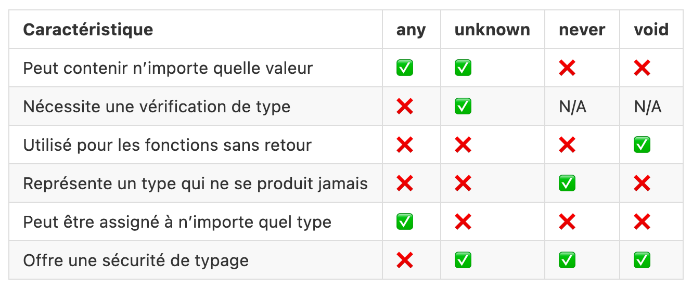
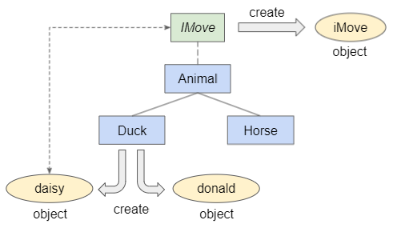

## typescript

[retour](../../index-js.md)


<a href="https://www.freecodecamp.org/news/build-strongly-typed-polymorphic-components-with-react-and-typescript/" target="_blank">Reat + typescript + polymorphisme</a>
### Compilation vs Transpilation
<pre>
Transpilation : Typescript ==> JavaScript
	transformer un langage de haut niveau vers un autre langage de haut niveau

Compilation : java => langage machine
	transformer un langage de haut niveau vers un langage de base niveau (langage machine)
</pre>

#### tsc 
<pre>
* tsc : permet de compiler un fichier ts en js
$ tsc main.ts --target es6 --watch

* --watch : compilation à chaud
* --init ==> initialiser le projet tsconfig

    "module": "commonjs",    /* Specify what module code is generated. */
    "rootDir": "./src/scripts",
    "sourceMap": true,  
    "outDir": "./dist/scripts",
</pre>

#### tsconfig
<pre>
* C'est le fichier de configuration du transpiler
* fichier qui explique à Typescript, comment il doit fonctionner
<a href="https://www.typescriptlang.org/tsconfig#strictNullChecks" target="_blank">configuration de typescripts</a>
</pre>

#### projet typescript + sass
<pre>
Principe: 
initialiser un projet (node: gestionnaire de paquets)
* yarn init ==> install package.json
* npm  add -D typescript ==> install typescript (facultatif)
* installer sass: npm install -g sass
*  package.json ==>
    "scripts": {
      "sass": "sass --watch ./src/sass/main.scss ./dist/styles/style.css",
      "tsc": "tsc --watch",
      "dev": "start yarn sass && start yarn tsc"
    },

* Structure du projet: index.html
  < link rel="stylesheet" type="text/css" href="./dist/styles/style.css" />
  < script src="./dist/scripts/main.js"></>
</pre>

### Bases

#### Type
<pre>
Permet la définition de type
Les types "Type" sont des variables comme const.
Une fois définie, on ne peut pas les modifier.

On peut assigner à un type:
* des types primitifs (number / string)
* des unions
* des fonctions
* des objets
* des tableaux => des tuples
* des litterals : on assigne une valeur au tuple
</pre>

```js
Exemple: 
> type MajorityAge = 18 | 19 |20; // litteral, union
> type Id = MajorityAge;
> type GetByIdFn = (id:Id) => User;
> type User = {
  id: Id;
  name: string;
  feu: TraffiLightColor
}
> type Tuple = [string, number]

const getById: GetByIdFn = (id) => {
  return {id: id, name: "toto", feu: "rouge"};
}
```

#### Inférence
##### Principe
<pre>
 à partir d'une valeur, typescript peut déterminer le type de la variable.
</pre>

##### Constante
<pre>
Les constantes vont prendre un type litteral.
Avec une constante, il est impossible de modifier le type.
</pre>
```js
const name = 'John Doe';
//  ?^ name est de type "John Doe"
```

##### inférence de  Fonction
<pre>
* les  types de paramètres ne sont pas inférés (sauf quand ils sont définis par défaut)
* le retour de la fonction lui est inféré

* déclaration de type
* casting
* typage implicite / explicit
* sans typage, le type est any.
</pre>

```js
const pow = (x: number, y = 2) => x ** y;
// via l'inférence y est de type number
```

##### inférence des objets
```js
const dog = {
  name: 'rex',
  age: 3
} 
// name est de type string (inférence) car on peut le modifier
```

##### as const
<pre>
* permet de faire un type assertion ou cast en anglais et limite ainsi le type.
* on indique au transpileur que le type est différent de celui qu'il a déduit
* le cast doit être assignable à la valeur déjà définit.
* transforme le type primitif en littéral
	* typescript les rend Readonly
	* on ne peut plus modifier le type, ce qui rend la variable immuable
* sur un objet / tableau
	* permet de bloquer tous les types des attributs.
	* transforme les attributs en Readonly / littéral
</pre>
```js
type DogName = "rex" | "rexy"; 
let dogName = "rex" as DogName;
// transforme le type dogName : string => litteral

let dogName = "rex" as number;
// => impossible le cast ne correspond pas

// tableau
const variants = ['primary','sceondary','tertiary'] as const;
// sans le as const: le type est string[]
// avec le as const: le type: tableau de litteral: readonly
// => const variants: readonly ["primary", "sceondary", "tertiary"]
type VARIANT = typeof variants[number];
// => type VARIANT = "primary" | "sceondary" | "tertiary"
```

##### typeof
```js
const dog = {
  name: 'rex',
  age: 3
};
// typeof permet de passer du mon javascript au typescript
// on récupère le type d'une variable javascript pour l'inclure dans 
// un type typescript
type DogType = typeof dog;
```

#### types

##### <a href="https://developer.mozilla.org/en-US/docs/Glossary/Primitive" target="_blank">Types Primitifs</a>

<pre>
* number
* string
* boolean
* null : la valeur nulle
* undefined: la valeur non définie
* symbol: les symboles
* bigint: les entiers de grandes tailles
</pre>

##### <a href="https://www.typescriptlang.org/docs/handbook/2/everyday-types.html#literal-types" target="_blank">Type littéral</a>
<pre>
Type Littéral :
Avec les "littéral", on vient limiter les valeurs possibles.
En combinant avec les unions, on limite les valeurs.
On définit une sorte de constante.

Revient à faire une sorte d'Enum:
</pre>

```JS
> type TraffiLightColor = 'rouge' | 'vert' | 'orange'; // type litteral union
> const a: TraffiLightColor = 'rouge';
> const b: TraffiLightColor = 'foo' ; // Erreur typescript

// 🦁 Utilise le bon type ici
type PaymentCardType = "visa" | "mastercard";
const payWithVisa = () => {};
const payWithMastercard = () => {};

const pay = (card: PaymentCardType) => {
  switch (card) {
    case 'visa':
      return payWithVisa();
    case 'mastercard':
      return payWithMastercard();
    default:
      throw new Error('Invalid card');
  }
};

// les constantes vont prendre un type littéral
const name = 'John Doe';
//  ?^ name est de type "John Doe"

```
##### type objet / fonctions
```js
// les types primitifs
type NumberOrString = number | string

//les types d'objets
type UserOrAdmin = User | Admin

// les types de fonction
type GetByIdFn = (id:Id) => User;
```


#### types speciaux



##### <a href="https://www.typescriptlang.org/docs/handbook/2/everyday-types.html#any" target="_blank">any</a>
<pre>
* à éviter car désactive toutes les sécurités de type
	* si une fonction prend en paramètre un type String, si on définit une variable de type
	any qui contient un number , cette dernière pourra être passé à la fonction.
* eventuellment pour des tableaux ayant des valeurs de plusieurs types ???
</pre>
```js
const add = (a: number, b: number) => a + b;

const catName: any = "Mittens";
const catAge: any = 7;

add(catName, catAge); // 7Mittens, pas d'erreur

```

##### unknown et typeof

<pre>
* à utiliser en lieu et place de any quand on ne sait pas à quel type on a affaire.
* Je ne sais pas ce que c'est, c'est un type inconnu
*  Permet de mieux coder et gérer les différents types en cas
   d'affectation à une autre variable typé
* utiliser sur une variable qui reçoit sa valeur d'une fonction qui peut 
  retourner différents types.
  On utilise alors le typeof pour savoir le type retourné.

  typeguard: typeof
</pre>
```js

const add = (a: number, b: number) => a + b;

const catName: unknown = "Mittens";
const catAge: unknown = 7;

// Erreur : Type 'unknown' is not assignable to type 'number'.
add(catName, catAge);

// Ici la condition ne sera pas valide, car catName est de type string
if (typeof catName === 'number' && typeof catAge === 'number') {
  // ✅ OK pour TypeScript, mais ce code ne sera jamais appelé
  add(catName, catAge);
}
```


##### <a href="https://www.typescriptlang.org/docs/handbook/2/functions.html#unknown" target="_blank">never</a>
<pre>
* sert pour typer le retour des fonctions quand elles ne retournent aucune valeur même pas le vide.
* permet de représenter un type qui ne devrait jamais se produire
</pre>

```js
// NEVER
const throwError = (message: string): never => {
  throw new Error(message);
};

try {
  throwError("test error");  
} catch(error) {
  console.log({error});
}

function infiniteLoop(): never {
  while (true) {
    console.log("Boucle infinie");
    // Cette fonction ne se termine jamais, car elle entre dans une boucle infinie
  }
}
```
##### void
<pre>
Type de retour a preciser quand la fonction ne retourne rien.
En javascript, une fonction retourne toujours undefined.
</pre>

#### type optionel
<pre>
* ? : permet de définir une propriété comme optionnelle
* reverseWord? boolean; boolean | undefined
* reverseWord = false ==> valeur par défaut
</pre>

#### Opérateurs

##### keyof vs récupérer le type d'une clé
<pre>
Permet de récupérer le type d'un objet et produit une liste de littéral (string ou numeric) des clés.
</pre>
```js
type User = {
  name: string;
  age: number;
}
// récupérer le type d'une clé
type UserName = User["name"]; // string
type UserAge = User['age']; // number

// récupérer les clés sous forme de littéral
type UserKeys = keyof User; // name, age

// user[key] : key (string) => erreur
// user[key as UserKeys]: key (name | age) => ok
console.log(Object.keys(user));
Object.keys(user).forEach(key => {
  console.log(user[key as UserKeys]); // génère une erreur si pas de cast
});
```
<a href="https://www.typescriptlang.org/docs/handbook/2/keyof-types.html" target="_blank">doc typescript</a>
<a href="https://www.scaler.com/topics/typescript/typescript-keyof/" target="_blank">typescript</a>
<a href="https://blog.logrocket.com/how-to-use-keyof-operator-typescript/" target="_blank">blog logrocket</a>

##### |
<pre>
unions de string, number ou tout autre type
(voir union de type et littéral)
</pre>

##### !
<pre>
- ! : permet d'indiquer qu'un élément ne peut être null
      on indique à TypeScript que la récupération de la valeur se fait bien.
      sur les selecteurs HTMLs
</pre>

##### ?
<pre>
Permet de merger les types
</pre>
```js
type UserBase = {
  name: string;
  age: number;
}

type User = {
  admin: false;
} & UserBase; // On ajoute UserBase à User

type UserAdmin = {
  admin: true;
  permissions: string[];
} & UserBase; // On ajoute UserBase à UserAdmin
```

#####  [truthy](https://developer.mozilla.org/en-US/docs/Glossary/Truthy) or [falsy](https://developer.mozilla.org/en-US/docs/Glossary/Falsy):
```
Dans un contexte booleen certaines valeurs peuvent prendre la valeur true ou false
false
0 et -0
0n
NaN
""
null
undefined
```

##### ?? <a target="_blank" href="https://mariusschulz.com/blog/nullish-coalescing-the-operator-in-typescript">nullish coalescing</a>				
<pre>
- ?? :  permet de donner une fallback value quand une autre valeur est null ou undefined
value ?? fallbackValue;
</pre>
```ts
null ?? "n/a"; // "n/a" 
undefined ?? "n/a"; // "n/a"

Otherwise, the `??` expression evaluates to the left operand:
false ?? true; // false
0 ?? 100; // 0
"" ?? "n/a"; // ""
NaN ?? 0; // NaN

Notice that all left operands above are falsy values. 
If we had used the `||` operator instead of the `??` operator,
all of these expressions would've evaluated to their respective right
operands:

false || true; // true
0 || 100; // 100
"" || "n/a"; // "n/a"
NaN || 0; // 0
```
				
#### <a href="https://www.typescriptlang.org/docs/handbook/2/everyday-types.html#union-types" target="_blank">Union de type</a>
<a href="https://camchenry.com/blog/typescript-union-type" target="_blank">union de type</a>
<pre>
Les unions sont un moyen de déclarer une variable qui peut appartenir à plusieurs types 
différents.
</pre>
```js
type TrafficLightColor = 'red' | 'orange' | 'green';
==>Le type `TrafficLightColor` est égal à `red` OU `orange` OU `green`.

type User = {
  name: string;
  age: number;
  admin: false; // On définit false, soit un type littéral
}

type AdminUser = {
  name: string;
  age: number;
  admin: true; // On définit true, soit un type littéral
  permissions: string[]; // Si c'est true, alors il y a un tableau de string `permissions`
}
const isAuthorized = (user: User | AdminUser) => {
  if (user.admin) {
    // Ici on est sûr que user est un AdminUser
    // On peut donc accéder à la propriété `permissions`
    user.permissions
  }

  user.permissions // Erreur, car `permissions` n'existe pas sur User
}

```
#### type générique
<a href="https://www.typescriptlang.org/docs/handbook/2/generics.html" target="_blank">generics</a>
<a href="https://www.typescriptlang.org/docs/handbook/type-inference.html" target="_blank">inférence</a>
<pre>
Les types génériques c'est un peu comme une boîte. 
Tu peux mettre n'importe quel objet dans une boîte. 
Quand tu passes un type générique en paramètre tu définis précisément l'objet que peut contenir la boîte.		
<a href="https://benmcmahen.com/generics-in-typescript/" target="_blank">Beginning Generics</a>
</pre>
<pre>
Les types génériques sont très utiles pour créer des fonctions qui peuvent être utilisées 
avec n'importe quel type.
Les types génériques sont des types qui peuvent prendre en paramètre un autre type. 
Comme une fonction prend en paramètre une valeur.
</pre>
```ts
type MyType<T> = T extends string ? "string" : "pas-string";
type A = MyType<string>; // "string"
type B = MyType<number>; // "pas-string"

function useState<T>(initialValue: T): [T, (value: T) => void] {
  let value = initialValue;
  const setValue = (newValue: T) => {
    value = newValue;
  }
  return [value, setValue];
}
```
```js
// definir un type Role qui override l'inférence
type Role = 'admin' | 'user';
const [role, setRole] = useState<Role | null>(null);
// => les valeurs possible sont admin, user ou null
```

####  Dériver plutôt que Dupliquer		
On préférera toujours "dériver" certains types d'autres types. Beaucoup d'utilitaires existent dans TypeScript, et aussi des librairies.

- [utility types](https://www.typescriptlang.org/docs/handbook/utility-types.html), les types utilitaire intégrer dans TypeScript
- [ts-toolbelt](https://millsp.github.io/ts-toolbelt/), une librairie de type utilitaire

Pour t'entrainer à la création de custom types, tu peux faire les [type challenge](https://github.com/type-challenges/type-challenges)		

```ts
type UserNames = {
  X? : string | null;
  O? : string | null;
}

type DeepNonNullable<T> = {
  [P in keyof T]: NonNullable<T[P]>
}

type UserNamesNoNullable = DeepNonNullable<UserNames>;
```
			
##### <a href="https://www.typescriptlang.org/docs/handbook/utility-types.html" target="_blank">Utility Types</a>
				
<pre>
Ils permettent de modifier et changer les types qui existent. 
Imagine-toi qu'on veuille enlever le `id` d'un type `User` :
</pre>

```js
type User = {
  id: number;
  name: string;
  email: string;
}

type UserWithoutId = Omit<User, "id">
```

#### Fonctions
<a href="https://www.youtube.com/watch?v=nwSe95uFN8E" target="_blank">should you use return types</a>

##### déclaration de fonction:
```JS
// mode ES5
function ma_fonction(param1:type, param2:type) : returnType {
  ...
}

// mode fonction anonyme
var ma_fonction = function(p1:type, p2:type) : returnType{ 
  ... 
}

// mode fonction flèchée
const ma_fonction = (p1: type, p2: type) : returnType => {
  ...
}
```
##### fonction de rappel
<pre>
On peut déclarer une variable de type fonction, sans préciser la signature
let test: Function
Pas bon, car on perd le typage quand on assigne une fonction à cette variable
Notamment sur les paramètres.

let test: Function;
let operation: (a:number, b:number) => number;
</pre>


#### surcharge de fonction

#### tableau // tuples
##### Définition
<pre>
Un tableau se base sur le générique Array.
Ce qui fait qu'on peut déclarer un tableau de n'importe quel type.
const names:string[] = new Array< string >("Mary","Tom","Jack","Jill") 

</pre>
==> Comment déclarer un tableau

#### <a href="https://codelynx.dev/posts/typescript-type-vs-interface" target="_blank">type vs interface</a> 

#### union et objet :
<pre>
- créer un type qui est l'union de deux objets : soit l'un, soit l'autre
- créer un objet de regroupement pour des objets similaire mais qui n'ont
  pas tout à fait les mêmes attributs
- vérifier que l'attribut est présent dans le nouveau type
  if ("attribut" in objet) {

  }
union et objets:
  - ajouter un type littéral : propriété ayant une valeur fixe
    type: "personne"
  - la propriété type doit impérativement être définie avec la valeur
    prévue dans les objets créés et se basant sur l'interface.
  - permet de caractériser les objets et donc d'utiliser ce caractère
    comme élément de discrimination dans les fonctions plus génériques
    ==> fixer les valeurs dans la définition d'un type / interface

- Le symbole de l'union est possible pour définir un type
mais pas pour définir une interface
==> Humain et Monstre : interfaces
type Personnage = Humain | Monstre;
==> ok
interface Personnage = Humain | Monstre
==> ko

Du coup, on peut étendre les interfaces.  
</pre>


#### intersection: de deux types
<pre>
l'objet est des deux types (on regroupe l'ensemble des propriétés)
permet de concaténer les propriétés

Pour les objets, on ne peut étendre que sur une classe ou une interface
Pour une interface, on peut faire l'extension multiple
</pre>


- objets et propriétés dynamiques
  [props:string]: any;

#### ENUM

##### ENUM Typescript
<pre>
- ENUM:
  * permet de définir des constantes avec une valeur
</pre>

##### ENUM Evoluée
<pre>
Principe faire une ENUM qui contient une structure d'objet.
</pre>

### POO

#### classe

#### Constructeur

#### this
<pre>
this => 
 * à utiliser dans une classe
 * à utiliser dans un objet
 
this: dépend du contexte de l'appelant
	- objet appelant
</pre>

#### méthode de classe:
afficher() => afficher(this:Voiture)
=> sert à s'assurer que c'est bien un objet qui peut provenir de la classe Voiture 
=> objet doit définir les mêmes paramètres

#### Visibilité et Accessibilité
private - public - protected

#### Getters / Setters

#### readonly
readonly : ne pas pouvoir changer la valeur après son initialisation
* constante d'objet identique : on l'appel avec instance.constante_d_objets
	- valeur identique pour tous le objets de la classe
	- definir l'attribut au niveau de la classe
	
* constante d'objet 
	- valeur spécifique de l'objet
	- définir l'attribut au niveau du constructeur
	
* variable de classe
	- utiliser le mot clé static pour la définir
	- pour l'utiliser: Classe.ma_variable_static
	- on l'appelle avec CLASSE.variable_de_classe

#### instanceof
<pre>
* Le côté gauche de l'expression instanceof ne peut pas être un type de données primitif.
  Cela doit être un objet.
 * Le côté droit de l'expression instanceof doit être une classe.



interface IMove {
    move(): void;
}

<i>
class Animal implements IMove {
    move() {
        console.log("Animal move!");
    }
}
class Duck extends Animal {}
class Horse extends Animal {}

let donald = new Duck();
console.log("donald instancef Duck? " + (donald instanceof Duck)); // true
console.log("donald instancef Animal? " + (donald instanceof Animal)); // true
console.log("donald instancef Horse? " + (donald instanceof Horse)); // false

let daisy: IMove = new Duck();
console.log("daisy instancef Duck? " + (daisy instanceof Duck)); // true
console.log("daisy instancef Animal? " + (daisy instanceof Animal)); // true
console.log("daisy instancef Horse? " + (daisy instanceof Horse)); // false

let iMove: IMove = {
     move : function() {
         console.log('IMove move!');
     }
};
console.log("iMove instancef Duck? " + (iMove instanceof Duck)); // false
console.log("iMove instancef Animal? " + (iMove instanceof Animal)); // false
console.log("iMove instancef Horse? " + (iMove instanceof Horse)); // false
</i>
</pre>

#### cast
<pre>
let current:Aliment = new Fruit(nom, nbCalories, nbLipides, nbGlucides, nbProteines, image);
this.FRUITS.add(current as Fruit);
</pre>

#### static
<pre>
- indique que l'info est accessble directement depuis la classe
- attibuts communs aux classes (sans readonly ==> peut être modifier)
- liste d'objets provenant d'une classe
	exemple : tableaux stockant les instances
- fonction commune aux objets
	- service - récupération de data de la BD
	- créer des classes qui regrfonction utilitaire
- fonction de service
	==> Créer une fonction static qui récupère les données de la base
	==> Service DAO
 </pre> 

 moyenne (...nombre:number[]) { ... }	
	
#### héritage
<pre>
- super: accéder au parent:
	==> info en private dans le parent
- protected: sont accessibles par les classes filles
- redéfinition de fonction pour les enrichir
	super.fonction_parente
	ajouter code supplémentaire
</pre>


#### Abstraction

#### Interface
<pre>
1- permet de définir la structure des objets
2- définir la structure d'une classe
3- oblige à définir des attributs ou méthodes public
</pre>

## Generics

### Définition
<pre>
Exemple de génériques: les tableaux via la syntaxe Array
* S'utilise en combinaison d'un autre type
* il n'a pas été créé un type spécifique par tableau
const monTab:Array<string> = new Array("toto","titi");
const monTab:Array<string> = ["toto","titi","tata"];

Un généric s'utilise en combinaison d'un autre type
La généricité s'applique :
- classe
- fonction
- type générique : Readonly, Partil, Required
</pre>

### Fonction
<pre>
Typesscript peut capturer le type < Type > ou < T > dans une fonction générique.
Utile pour retourner un type spécifique et avoir une fonction générique.

A la différence de param:any => la fonction retourne un type explicit que 
l'appelant pourra traiter.
</pre>

#### exemple
```
function maFonction<T>(param: T):T{
	return param;
}

function maFonction<T>(param:T[]) : T {
  return param[0];
}

let bool = maFonction<number>([1,2]);
let nombre = maFonction< string >(["titi", "toto"]);
```

### Fonction et Objet
<pre>
Fonction qui prend en paramètre un objet générique et 
l'enrichit d'un attribut
==> retourne le type combiné : objet + attribut

function guerrier<T extends Perso>(p:T){
  return {
    ...p,
    classe: "Guerrrier"
  }
}
</pre>

### Contraintes
<pre>
* principe mettre une contrainte sur le type générique
que doit respecter le type passé en paramètre
</pre>
```
* function creerGuerrier<T extends {nom: string}>(param:T):Perso{
		return {...param, classe:"GUERRIER"};
}

* function creerGuerrier<T extends Perso>(param:T): T {
		return {...param, classe:"GUERRIER"};
}
```

### Multiples paramètres
```
function buildGuerrier<T extends Perso, U extends Fonction>(p:T, fonction: U): Required<Perso> {
  return {
    ...p,
    ...fonction
  }
}
```

### Classes
<pre>
Creer une classe qui traite un généric
Exemple : classe pour gérer une liste
</pre>

```
class Personnages<T extends Perso> {
  
  private list:T[]
  
  constructor(){
    this.list = [];
  }

  public get(): T[] {
    return this.list;
  }

  public add(perso:T): Personnages<T>{
    this.list.push(perso);
    return this;
  }
}
```
### Types Génériques
<pre>
IMPORTANT: s'utilise en combinaison des autres types
</pre>

#### Partial
<pre>
* Permet de construire un objet sans connaitre au préalable
	toutes ses valeurs
* Permet de constuire un objet d'un type donné par petits bouts
</pre>
```
interface Perso {
  nom: string;
  type: string;
  classe: string;
}

interface Humain extends Perso {
  age: number,
  type: "humain"
}

interface Orc extends Perso {
  tribu: string,
  type: "orque"
}

interface Fonction {
  classe: string;
}

interface Archer extends Fonction {
  classe: "ARCHER";
  nbFleches: number;
}

interface Guerrier extends Fonction {
  classe: "GUERRIER"
}

const h1 = buildHumain({nom: "Gildas", age: 47}, {classe: "ARCHER", nbFleches: 12}) ;
const o1 = buildOrc({nom: "Orc1", tribu: "Orc Vert"}); 

function buildHumain<T extends Fonction>(h:Partial<Humain>, f:T):Humain {
  return {...h, ...f, type: "humain"} as Humain;
}

function buildOrc(o:Partial<Orc>):Orc {
  return {...o, type: "orque"} as Orc;
}
```

#### Required
<pre>
* Permet de définir une interfaces avec des attributs optionnels
* A un instant t, on veut que tous les champs soient obligatoires:
</pre>
```
interface User {
  id?: number;
  firstname: string;
  lastname: string;
}

const updateUser = (user: Required<User>) => {
  db.update(user);
};

updateUser({
  id: 12,
  firstname: 'Chris',
  lastname: 'Bongers',
});
```

#### Readonly
##### principe
<pre>
* s'utilise en composition d'un autre type
* fixer les valeurs d'un tableau
	* empeche la modification des valeurs
	* empeche l'ajout des valeurs dans le tableau
* fixer les propriétés d'un objet
	* empêche la modification des attributs
</pre>

##### Exemple
<pre>
Enum évolués :
* on définit un objet en Readonly :
  fait que l'on ne pourra pas modifier ses attributs
* on définit le contenu de chaque attribut en Readonly
  fait qu'on ne pourra modifier le contenu des attributs
</pre>
```
export const ALIMENT_TYPES: Readonly <{
   FRUIT: Readonly<Type_Aliment>;
   LEGUME: Readonly<Type_Aliment>;
   CHARCUTERIE: Readonly<Type_Aliment>;
   VIANDE: Readonly<Type_Aliment>;
   PRODUITS_LAITIERS: Readonly<Type_Aliment>;
   PRODUITS_CEREALIERS: Readonly<Type_Aliment>;
   PRODUITS_SCURES: Readonly<Type_Aliment>;
   MATIERE_GRASSE: Readonly<Type_Aliment>;
   POISSON: Readonly<Type_Aliment>;
   FRUITS_DE_MER: Readonly<Type_Aliment>;
}> = {
  FRUIT: {label: "fruit", value: "FRUIT"},
  LEGUME: {label: "légume", value: "LEGUME"},
  CHARCUTERIE: {label: "charcuterie", value: "CHARCUTERIE"},
  VIANDE: {label: "viande", value: "VIANDE"},
  PRODUITS_LAITIERS: {label: "produits laitiers", value: "PRODUITS LAITIERS"},
  PRODUITS_CEREALIERS: {label: "produits céréaliers", value: "PRODUITS CEREALIERS"},
  PRODUITS_SCURES: {label: "produits sucrés", value: "PRODUITS SUCRES"},
  MATIERE_GRASSE: {label: "matière grasse", value: "MATIERE GRASSE"},
  POISSON: {label:  "poisson", value: "POISSON"},
  FRUITS_DE_MER: {label: "fruits de mer", value: "FRUITS DE MER"}
}
```