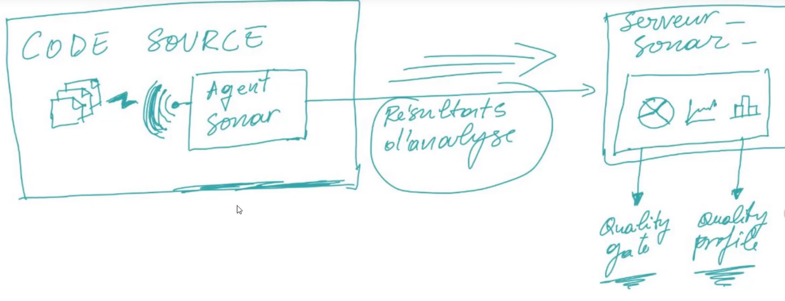

# CI / CD

[retour](../index-systeme.md)

https://github.com/eazytraining/cicd-testing-java-cours/tree/eazytraining

## Principe
<pre>
L'intégration continue et le déploiement continu ont pour but d'automatiser
les opérations suivantes:
- lancement des tests (unitaires, intégration, fonctionnel)
- la qualimétrie
- la construction de l'application (build)
- le déploiement de l'application

CI: continuous intégration

CD: continuous deployment
</pre>

## Tests

### Définition
<pre>
Ensemble de procédés qui visent à vérifier que les fonctionnalités implémentées
 le sont tel que demander par le métier.
</pre>

### Place des tests
<pre>

* Rapide fine feedback: avoir un retour rapide du métier
* continuous process: avoir des incréments de petites fonctionnalités
* shared understanding:  compréhension commune entre métier et technique
</pre>

### Types de tests
<pre>

Pyramide de tests : recommandation pour le pipeline CICD
</pre>

#### Test unitaire
<pre>
Base: 
* test atomique
  => tester de manière unitaire et isolé les composants de l'application
* rapide et pas chère
* mais pas réaliste car l'application n'exécute pas les composants de manière
  indépendante mais les intègre pour exécuter une fonctionnalité plus riche
</pre>

#### Test d'intégration
<pre>
* tester l'intégration de plusieurs composants unitaires
</pre>

#### Test fonctionnel
<pre>
* tester d'un point de vue utilisateur une fonctionnalité
* fragile
* chère à mettre en place
</pre>

#### Cône de glace
<pre>

</pre>

### Test Driven Development
<pre>

* Le test est un garde fou pour la fonctionnalité
1- on écrit le test avant la fonctionnalité
2- comme la fonctionnalité n'est pas développé, ni optimal, le test va planter
3- il faut faire en sorte que le test passe
4- une fois que le est est ok, s'assurer que le code est de bonne qualité

</pre>

### Test automatisés vs manuels
<pre>

</pre>

## Qualimétrie

### principe
<pre>
La qualimétrie consiste à auditer le code (via un outils d'analyse).
L'audit permet suivant des métriques et de seuils d'acceptance définis 
pour ces métriques, d'avoir une idée de la qualité du code fournit.
</pre>

### Notion de qualimétrie
<pre>

<b>Code defecteux</b>: mauvais pratique ou utilisation
<b>Dette technique</b>: temps que cela va prendre pour corriger du code defectueux
</pre>
<pre>

</pre>

### sonarqube

#### agent-sonar / serveur sonar
<pre>

agent-sonar: 
* sonar s'appuie sur des scanners pour analyser le code
  - scanner pour jenkins, maven, ...
* envoie les résultats d'analyse au serveur

serveur-sonar:
* récupère et analyse l'audit fait par l'agent
* affiche un compte-rendu
* <b>quality-gate</b>: seuil qui ne doit pas être dépassé

</pre>

#### agent-sonar: maven
<pre>
- maven lance l'audit de code via un plugin dédié
  org.sonarsource.scanner.maven
- créer un fichier : m2/settings.xml dans le projet

<a href="https://docs.sonarqube.org/latest/analyzing-source-code/scanners/sonarscanner-for-maven/" target="_blank">maven</a>
</pre>

##### proxy
<pre>
<b>Attention</b>:
Quand on lance l'audit de code et qu'on pousse les résultats
vers le serveur, il est important d'exclure de la configuration
du proxy, le serveur cible.
==> propriété 'nonProxyHosts' du settings.xml
</pre>

##### m2/settings
```
<settings>
  <pluginGroups>
    <pluginGroup>org.sonarsource.scanner.maven</pluginGroup>
  </pluginGroups>
  <profiles>
    <profile>
      <id>sonar</id>
      <activation>
        <activeByDefault>true</activeByDefault>
      </activation>
      <properties>
        <sonar.host.url>
          http://192.168.56.107:9000
        </sonar.host.url>
      </properties>
    </profile>
  </profiles>
  <proxies>
    <proxy>
      <id>optional</id>
      <active>true</active>
      <protocol>http</protocol>
      <username>name</username>
      <password>password</password>
      <host>ip-host</host>
      <port>8080</port>
      <nonProxyHosts>192.168.56.107</nonProxyHosts>
    </proxy>
  </proxies>
</settings>
```

##### commande
<pre>
// audit de code: analyse plus envoie au serveur sonar
// via le token : à privilégier
$ mvn sonar:sonar -s .m2/settings.xml -Dsonar.token=squ_8113f701cd57f263a3e9d882dec01898b3bf92ae

// en pécisant le plugin, le host, le login...
$ mvn org.sonarsource.scanner.maven:sonar-maven-plugin:3.7.0.1746:sonar sonar:sonar -Dsonar.host=http://192.168.56.107:9000 -Dsonar.login=squ_d29c31cba33473b5375462b3f161d2a29b45878e 

$ mvn org.sonarsource.scanner.maven:sonar-maven-plugin:3.2:sonar sonar:sonar -s .m2/settings.xml -Dsonar.login=squ_d29c31cba33473b5375462b3f161d2a29b45878e

</pre>

#### serveur sonar : docker

##### Image
<pre>
Configuration : utilisation de l'image docker 'sonarqube'
<b>attention</b>: une fois lancé il faut se connecter avec le compte
* compte initial : admin/admin
</pre>

##### Conteneur 
<pre>
<i>Commande</i>:
// générer et lancer le conteneur
λ docker container run --name sonarqube -e SONAR_ES_BOOTSTRAP_CHECKS_DISABLE=true -p 9000:9000 sonarqube:latest

// lancer le conteneur existant
λ sudo docker container run -e SONAR_ES_BOOTSTRAP_CHECKS_DISABLE=true -p 9000:9000 sonarqube

Une fois lancé le conteneur est accessible via l'url:
http://192.168.56.107:9000/projects
</pre>

##### Token
<pre>
On doit passer un token à SONAR:
- pour s'identifier auprès de SONAR
- pour qu'il puisse identifier quel est le projet qui essaie de me contacter

Il faut donc générer le token à partir du serveur SONAR :
> Administration > Security > Users > Tokens
</pre>

##### Volume ==> ???

### JaCoCo

#### Principe
<pre>
Outils permettant d'évaluer la couverture de code.
</pre>

#### Plugin maven
<pre>
Le plugin maven Jacoco se déclenche lors de la phase d'exécution des tests.
<b>Attention</b> à utiliser un jdk compatible (11) avec le plugin maven jacoco.
</pre>
```
<plugin>
  <groupId>org.jacoco</groupId>
  <artifactId>jacoco-maven-plugin</artifactId>
  <version>0.8.2</version>
  <executions>
    <execution>
      <goals>
        <goal>prepare-agent</goal>
      </goals>
    </execution>
    <!-- attached to Maven test phase -->
    <execution>
      <id>report</id>
      <phase>test</phase>
      <goals>
        <goal>report</goal>
      </goals>
    </execution>
  </executions>
</plugin>
```

#### Commandes maven
<pre>
$ mvn test
$ mvn sonar:sonar -s .m2/settings.xml -Dsonar.token=squ_d2bf18cc6b1320aa1a6f6ab094a10070aec3e8cd
</pre>

### Déploiement

#### Principe
<pre>
Pour le déploiement, il faut:
* builder le projet: un war
* builder une image docker
* construite un conteneur à partir de l'image
</pre>

#### Constuire l'application
<pre>
// builder l'image de l'application à partir du dockerfile
$ docker build -t calculator-light:1.0.0 .
</pre>

#### Déployer l'application
<pre>
// Il s'agit ici de déployer l'application dans un conteneur
// <b>Important</b>: le déploiement tient compte du profile

// profile dev
$ docker run --name calculator-launch-dev -e SPRING_ACTIVE_PROFILES=dev -p 8090:8090 calculator-light:1.0.0

// profile prod
$ docker run --name calculator-launch-prod -e SPRING_ACTIVE_PROFILES=prod -p 8092:8092 calculator-light:1.0.0
</pre>


