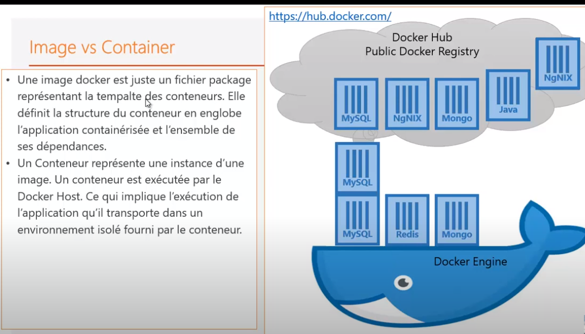
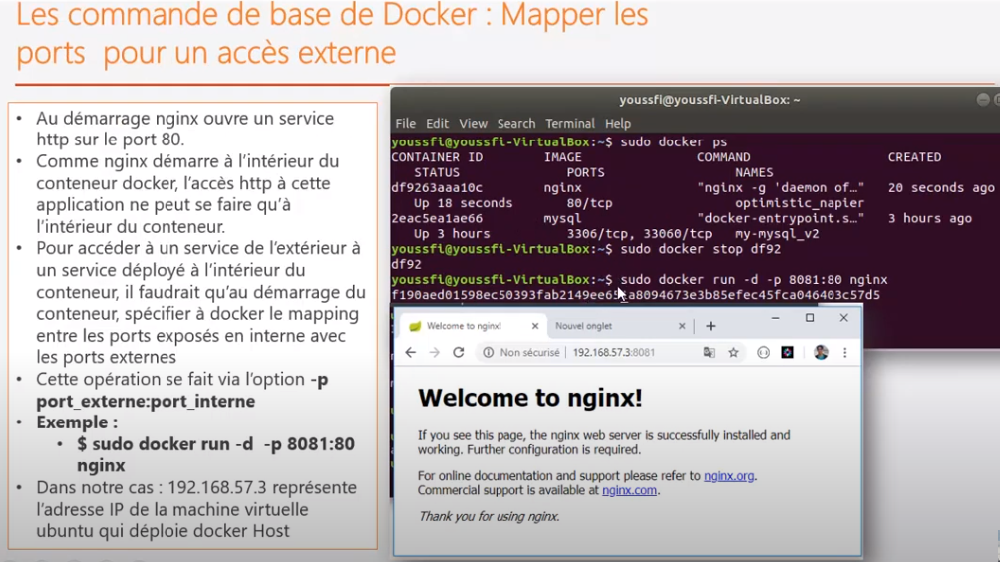
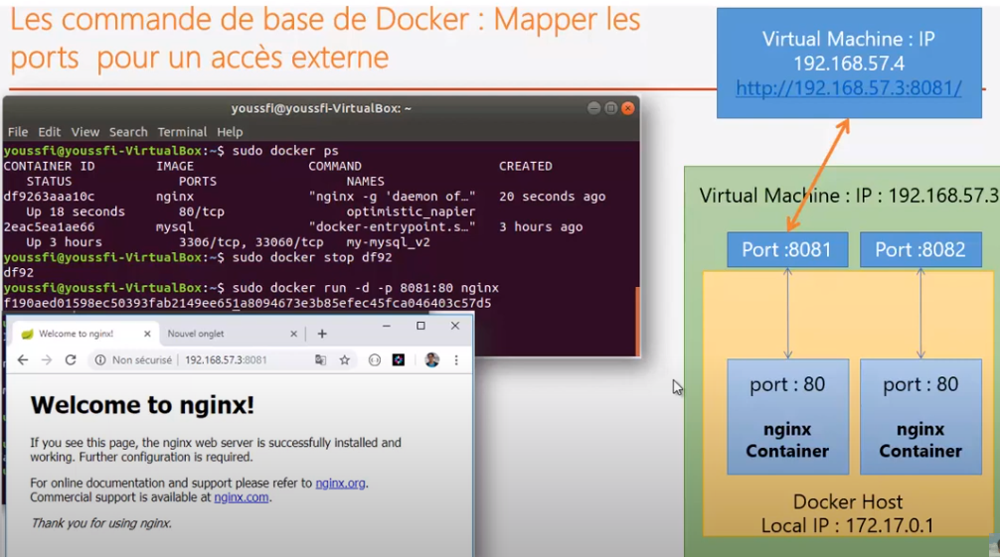
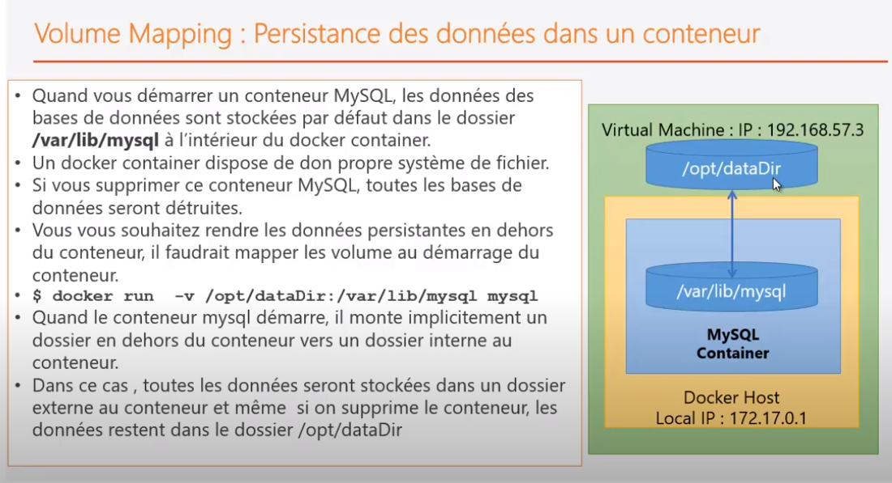

## Docker

[Virtual-Box](../virtualisation.md)

### Menu
- [installation](installation-docker.md)
- [commandes](docker-cmd/docker-cmd.md)
- [exercices](exercices-formation/exercices.md)
- [docker-engine](docker-engine/docker-engine.md)
- [dockerfile](dockerfile/dockerfile-notes.md)

### Documentation
- 📄 <a href="docker.pdf" target="_blank">pdf-formation-orsys</a>
- 📄 <a href="./formation/assouline/D%C3%A9marrer%2Bavec%2Bles%2Bconteneurs.pdf" target="_blank">docker section 1</a>

### URLs 🔗
- **Définition Docker**
  - https://www.lebigdata.fr/docker-definition
  - https://guillaumebriday.fr/comprendre-et-mettre-en-place-docker

- **Volumes**
  - https://rominirani.com/docker-on-windows-mounting-host-directories-d96f3f056a2c
  - https://stackoverflow.com/questions/46529884/windows-docker-external-mount

- **Installation - Docker Toolbox**
  - https://github.com/docker/toolbox/issues/636

- **Docker Machine**
  - https://docs.docker.com/machine/get-started/

### Questions ❓
- Où sont stockées les images docker physiquement ?

### Docker Engine / Docker Host ⚙️
- Le docker-engine s'exécute sur un OS Linux.
- Tout conteneur utilise l'OS de la machine hôte via le docker-engine.
- Toute image embarque les libs et les binaires nécessaires à son exécution.
- La couche de base d'une image correspond à la couche Linux (Ubuntu...).
- Pour démarrer un conteneur, on instancie une image via le docker-engine et l'OS de la machine hôte.

### Conteneur 📦

#### Définition
- Il faut considérer le conteneur comme l'instance d'une application.
- C'est donc l'instance d'une image.
- Avec la même **image**, on peut créer **plusieurs instances/conteneurs**.
- Chaque conteneur a un **identifiant unique** qui le différencie des autres.

#### Stockage
- **Images** : gourmandes en espace disque.
- **Conteneur** : ne prend pas beaucoup de place.
  - C'est une instance.
  - Ce sont des fichiers très légers.

### Image vs Conteneur

### Images 🖼️

#### Définition
- Une image contient l'**ensemble des éléments** permettant de **packager** une **application**.
- Une image est constituée de :
  - fichiers binaires
  - librairies
  - code source
  - métadonnées d'exécution
- Pas de système d'exploitation complet, pas de kernel, ni modules (drivers).
- Les images sont stockées dans le **docker-engine** (en cache local).
- On peut créer une image personnalisée contenant :
  - fichier de configuration
  - variables d'environnement
  - fichiers de données
  - etc.
- L'image sert de base pour exécuter une application dans un **conteneur**.

🔗 <a href="https://docs.docker.com/registry/spec/manifest-v2-2/" target="_blank">manifest</a>

#### Image et OS 🧠
- `$ sudo docker run ubuntu`
- L'image est téléchargée puis tentée d'être exécutée, mais s'arrête automatiquement.
- **Docker n'est pas fait pour contenir un OS**.
  - Il est conçu pour **envelopper des applications**.
- Tous les conteneurs Docker utilisent le noyau Linux comme host.
- L'image de base permet au conteneur d'accéder au noyau pour la gestion des processus.

#### Notion de couches 🧱
- Docker utilise une architecture en **couches** pour les images.
- Une image est une **succession de couches** pour démarrer une application.
- Toutes les images commencent par une couche vide appelée `scratch`.
- Tous les changements (fichiers, métadonnées, commandes) ajoutent des couches.

#### Cache d'une image
- Chaque couche a une signature SHA (digest) unique.
- Les couches déjà téléchargées sont réutilisées pour les nouvelles images.

### DockerHub ☁️

#### Utilisation
- Dépôt cloud géré par Docker pour publier/utiliser des images.
- 🔗 <a href="https://hub.docker.com/" target="_blank">dockerhub</a>

- **Images officielles** : créées par Docker.
  🔗 <a href="https://github.com/docker-library/official-images/tree/master/library" target="_blank">images officielles</a>
  - Pas de `/` dans le nom.

- **Verified publishers** : groupes reconnus par Docker.
- **Images personnelles** : ont un `/` (nom du créateur/groupe).

#### Tagguer / Publier 🏷️
- Un tag permet de différencier la version d'une image.
- Plus le tag est précis, mieux on contrôle la version utilisée.

Exemple avec MySQL :
- `8` → dernière 8.x
- `8.0` → dernière 8.0.x
- `8.0.19` → version exacte

#### Dockerfile 📃
🔗 <a href="./dockerfile/dockerfile-notes.md" target="_blank">dockerfile</a>

### Conteneurisation vs Virtualisation 🆚

#### Virtualisation 💻
- Une VM embarque un OS.
- L'OS virtualisé communique via un hyperviseur avec la machine hôte.
- Les images contiennent l'OS et les drivers.

#### Conteneurisation 🧳
- Le conteneur **n'embarque pas d'OS** mais des binaires et librairies.
- Il contient une application avec ses dépendances.
- **Avantage** : indépendant de la structure hôte.

Méthode :
- Basée sur LXC (Linux Containers)
- Cloisonnement au niveau de l'OS
- Plusieurs environnements Linux isolés, partageant le même noyau
- Le conteneur accède à l'OS hôte de manière isolée via le docker-engine

🔑 Important : les conteneurs sont **de simples processus**.

#### Contrôleur 🕹️
- Gère les interactions conteneur/OS
- Gère la sécurité (privilèges, ressources)
- Gère la scalabilité (ajout/suppression)
- Gère l'accessibilité via APIs et CLI

#### LXC
- **Cgroups** : limite/isole l'utilisation des ressources
- **Namespaces** : cloisonne les espaces de nommage

#### Conteneur vs VM ⚖️
- VM = lourde (OS complet, drivers)
- Conteneur = léger, portable, rapide
- Virtualisation : autre OS que celui de la machine hôte
- Conteneurisation : même OS, dans conteneur isolé

### Kubernetes ☸️
- À l'exécution, un conteneur dépend fortement du kernel et de la machine hôte.
- Le conteneur ne voit pas au-delà de cette machine.
- Kubernetes gère l'abstraction et l'orchestration des conteneurs sur plusieurs machines/hôtes (clusters).
- Prise en charge de serveurs physiques, virtuels, cloud (public/privé/hybride).

### Port 🔌

#### Installation nginx & Mapping de port
- Installation : `$ sudo docker run -d nginx`
- Docker crée sa propre interface réseau (172.17.0.1)
- Le serveur web nginx démarre dans le conteneur sur le port 80
- Ce port n'est accessible **que depuis l'intérieur du conteneur**
- Pour accéder au service depuis l'extérieur (hôte/VM), il faut **mapper les ports**

#### Mapping de port 🔁
- `$ sudo docker run -d -p 8082:80 nginx`
  - Port 80 (interne) mappé sur le port 8082 (externe)
  - Accès à nginx via `http://192.168.56.101:8082/`
- On peut démarrer plusieurs conteneurs nginx, chacun mappé sur un port différent

### Volume 💾

#### Durée de vie d’un conteneur
- **Immuable** et **éphémère**
- Toute modification → nouveau déploiement basé sur une image différente

Avantages :
- Fiabilité & cohérence
- Reproductibilité
- Base pour l’industrialisation (CI/CD)

#### Persistance des données

##### Volume
- Données stockées **à l'extérieur du conteneur** (sur l'hôte)
- Conteneur accède au volume externe

##### Bind mounts
- Lien virtuel entre chemin du conteneur et celui de l'hôte
- Toute modification de l’un se reflète dans l’autre

###### Utilisation
- Partage de données entre plusieurs conteneurs

