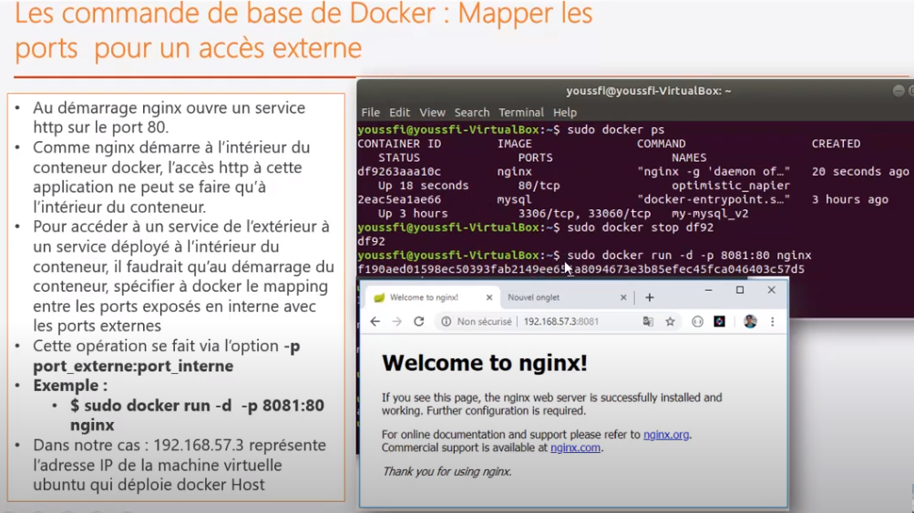

## Docker

[Virtual-Box](../virtualisation.md)

### Menu
* [installation](installation-docker.md)
* [commandes](docker-cmd/docker-cmd.md)
* [exercices](exercices-formation/exercices.md)
* [docker-engine](docker-engine/docker-engine.md)
* [dockerfile](dockerfile/dockerfile-notes.md)

### doc
* <a href="docker.pdf" target="_blank">pdf-formation-orsys</a>

* <a href="./formation/assouline/D%C3%A9marrer%2Bavec%2Bles%2Bconteneurs.pdf" target="_blank">docker section 1</a>

### url
<pre>
*  Docker 
==> HyperViseur : 

* Définition
https://www.lebigdata.fr/docker-definition
https://guillaumebriday.fr/comprendre-et-mettre-en-place-docker

* urls volume
https://rominirani.com/docker-on-windows-mounting-host-directories-d96f3f056a2c
https://stackoverflow.com/questions/46529884/windows-docker-external-mount

* install - docker toolbox
https://github.com/docker/toolbox/issues/636

* docker-machine
https://docs.docker.com/machine/get-started/
</pre>

### Questions : 
<pre>
* où sont stockées les images docker physiquement ?
</pre>

### docker-engine / docker-host
<pre>
- Le docker-engine s'éxecute sur un OS linux
- Tout conteneur utilise l'OS de la machine hôte via le docker-engine
- Toute image embarque les libs et les binaires nécessaire à son exécution
- La couche de base d'une image, correspond à la couche Linux (Ubuntu...)
- Pour démarrer un conteneur, on instancie une image via le docker-engine et
  l'OS de la machine hôte.
</pre>

### conteneur 

#### défintion
<pre>
* il faut considérer le conteneur comme l'instance d'une application
* c'est donc l'instance d'une image
* avec la même <b>image</b>, on peut créer <b>plusieurs instances/conteneurs</b>
* chaque conteneur à un <b>identifiant unique</b> qui le diffère de l'autre
</pre>	
	

#### stokage : 
	* images : gourmand en espace disque
	* conteneur : ne prend pas beaucoup de place
		* c'est une instance
		* ce sont de fichiers très légers

### image vs conteneur
	
	
### images 

#### definition
<pre>
* une image contient l'<b>ensemble des éléments</b> permettant de <b>packager</b> une <b>application</b>.
* Une image est constitué:
	* des fichiers binaires
	* des librairies
	* du code source
	* métadonnées concernant la façon dont il faudra l'exécuter

* une image est une collection ordonnées de modifications du filesystème root et
de paramètres d'exécution correspondants, pour l'exécuter à l'interieur d'un conteneur.

* <b>important</b>: pas de d'os complet, pas de kernel, pas de modules kernel(drivers)

* les images sont stockées dans le <b>docker-engine</b>
	=> l'image est téléchargé la première fois et socker dans son cache local

* l'idée est de créer une image custom, où sont liés :
	* fichier de configuration
	* varaibles d'environnement
	* fichiers de données
	*...
* ainsi, l'image contient une configuration de base et pour utiliser l'application,
* il suffit alors de l'<b>exécuter</b> dans un <b>conteneur</b>.	

<a href="https://docs.docker.com/registry/spec/manifest-v2-2/" target="_blank">manifest</a>
</pre>

#### image et OS
<pre>
* $ sudo docker run ubuntu
* Que se passe-t-il?
	* l'image est téléchargé et tenté de l'exécuter mais va s'arrêter automatiquement.
	* <b>docker</b> n'est <b>pas fait pour contenir un OS</b>. 
		* donc cette couche seule ne fonctionne pas
	* Il est fait pour <b>envelopper des applications</b>.
	* tous les <b>conteneurs docker</b> ont besoin d'<b>utiliser le noyau Linux</b> comme host
	* toutes les images docker vont se baser sur cette image. 
	* C'est l'image de base qui permet au conteneur d'accéder au noyau. 
		* le noyau a besoin de gérer les processus.
		* le noyau crée un espace processus pour le conteneur.
</pre>

#### notion de couches
<pre>
* docker utilise la notion de couche pour télécharger les images
* une image est une <b>succession de couches</b> qui permettent de <b>démarrer une application</b>

* Toutes les images démarrent au tout début avec une couche vide appelée "scratch"
		et tous les changements qui arrivent ensuite sur le système de fichiers de cette
		image est une autre couche

* Tous les changements n'influent pas sur la taille de l'image, comme pour les 
		metadonnées (comme pour les commandes)

</pre>

#### Cache d'une image
<pre>
* Chaque couche possède sa propre signature SHA unique / digest.
* Les couches qui ont déjà été téléchargées n'ont pas besoin
  de l'être à nouveau pour une nouvelle images
</pre>

#### DockerHub

##### utilisation
<pre>
* DockerHub est un dépôt sur le cloud totalement géré par Docker
* on peut y publier et utiliser des images (officielles ou non)

<a href="https://hub.docker.com/" target="_blank">dockerhub</a>

* images officielles: créer et publier par les équipes de Docker
<a href="https://github.com/docker-library/official-images/tree/master/library" target="_blank">images officielles</a>
Les images officielles n'ont pas de "/"

* verified publisher: créer et pulbier par un groupe reconne par Docker

* images personnelles
Elles ont un "/" dans leur nom
Avant le slash: nom de la personne ou groupe qui a créé l'image
Ce sont des images personnelles.

</pre>

##### tagguer / publier
<pre>
<b>tag</b>: un tag permet de défnir et différencier la version d'une image

Il faut essayer de préciser le tag le plus précis pour savoir
la version précise que l'on télécharge

Exemple avec MySql
Les tags: 8 / 8.0 / 8.0.19
8 : avoir la denière version 8. ..
	* on peut avoir une 8.1 et une 8.2 ...
8.0: avoir la denière version 8.0 ...
	* on ne peut avoir de 8.1
8.0.19: avoir la dernière version de 8.0.19
</pre>

#### Dockerfile
<pre>
<a href="./dockerfile/dockerfile-notes.md" target="_blank">dockerfile</a>
</pre>

### conteneurisation vs virtualisation

#### virtualisation
<pre>
Dans la virtualisation, la machine virtuelle embarque un OS.
L'OS est virtualiser et communique via l'hyperviseur avec la machine hôte.
Dans les images, on a l'OS et les drivers.
</pre>

#### Conteneurisation
<pre>
* Dans la conteneurisation, le conteneur 
	* n'embarque pas d'OS mais des binaires et libs.
		==> Il n'y a pas d'OS complet, pas de kernel et pas de modules kernel (drivers par exemple).
	* il embarque une application avec ses dépendances
	* <b>Intérêt</b>: il est indépendant de la structure hôte

Méthode de virtualisation par conteneur:
* elle se base sur la virtualisaiton LXC pour linux containers
* c'est une méthode de cloisonnement au niveau de l'OS
* il s'agit de faire tourner des environnement linux isolés les uns des autres
  dans des conteneurs mais partageant le même noyau.
* Le conteneur s'appuie sur les fonctionnalités de l'OS de la machine hôte
* Le conteneur accède à l'OS hôte de manière totalement isolée les uns des autres
	via le contrôleur (docker-engine)

* Le conteneur virutalise l'environnement d'exécution:
	- processeur / mémoire vive / système de fichier
	=> mais pas la machine

* <b>Important</b>: Les conteneurs ne sont que de simples processus.
</pre>

#### contrôleur
<pre>
Il gère un ensemble de fonctionnalité pour les conteneurs:
* les interactions des conteneurs aves l'OC
* la sécurité avec la gestion de privilèges et de ressources
* la scalabilité: ajout/suppression de conteneurs
* accessibilité des conteneurs à travers la gestion des api et cli
</pre>

#### LXC
<pre>
repose sur deux fonctionnalités du noyau Linux
* Cgroups: control groups
	permet de limiter et d'isoler l'utilisation des ressources
* Namespace: fonctionnalité de cloisonnement des espaces de nommage
	permet d'empêcher qu'un groupe voit les ressources d'un autres groupes
</pre>

#### conteneur vs VM
<pre> 
* La VM est donc beaucoup plus grosse en terme de mémoire et est plus gourmande en place et mémoire.
	Les conteneurs sont donc plus performants ; ils sont légers, portables et permettent à des applications
	d'être packagées et déplacées rapidement.

* Virtualisation : but, c'est d'utiliser un autre système que celui installé.
* Conteneurisation : faire tourner des applis sur le même système que celui installé mais dans un conteneur.
	 Typiquement : des conteneurs linux qui tournent sur une machine linux seront plus performant que des VMs.
</pre>

#### Kubernetes
<pre>
* A l'exécution, le conteneur est fortement lié au kernel et à la machine hôte.
  Le kernel, c'est la partie de l'OS qui gère le matériel;.
	Le conteneur n'a pas conscience de ce qui se passe au délà de ce kernel et donc
	de la machine hôte.
	C'est là que Kubneretes intervient.
	Il apporte une abstraction et la gestion des conteneurs sur des clusters 
	de serveurs.
	Kubernetes prend en charge plusieurs kernel et donc la gestion des conteneurs
	sur des différents serveurs hôtes linux, qu'ils soient physiques, virtuels ou
	situés sur des clouds publics, privés, hybrides.
</pre>

### port
		
#### installation nginx et mapping de port

<pre>
* installation : 
	$ sudo docker run -d nginx
* Quand docker est installé :
	* il créé sa propre <b>interface réseau</b>		
	* docker-engine crée une <b>carte-réseau</b>
		c'est à dire une interface qui est <b>propre au conteneur</b> avec <b>son adresse ip</b> : 172.17.0.1
* le server web nginx est démarré dans le conteneur sur le port 80
	* ce port 80 ne peut être utilisé que <b>dans le conteneur</b>
	* c'est à dire par une application qui se trouve dans le conteneur
		et qui appelle le serveur web avec l'adredse locale IP_CONTENEUR et sur le port 80 
		soit <b>172.17.0.1:80</b>
	* si je suis sur la machine hôte, impossible d'accèder. Pourquoi?
		* <b>192.168.56.101:80</b> : accès <b>machine virtuelle</b> sur le port 80
		* parce que je suis sur une machine (machine virtuelle) en dehors du conteneur et je veux accéder au port 80,
			alors que le port 80 est utilisé pour accéder à l'application à l'intérieur du conteneur
		* pour pouvoir accèder au serveur web <b>en dehors du conteneur</b>, il faudrait <b>mapper les ports</b>.
		* pour accèdder à un service, déployé à l'intérieur du conteneur, de l'extérieur, il faut
			* au démarrage du conteneur
			* spécifier à docker le mapping entre les <b>ports</b> exposés en <b>interne</b> avec les <b>ports externes</b>.
</pre>	

		
#### mapping de port	

<pre>
* $ <b>sudo docker run -d -p 8082:80 nginx</b>
	* nginx dans le conteneur démarre sur le port 80 ; on le mappe sur le port 8082
	* quand on est en dehors du conteneur, on peut y accéder en accédant à ce numéro de port : 8082.
	* 192.168.56.101 représente l'adresse IP de la machine virtuelle qui déploie docker Host
	* Accès à ngInx de l'exterieur via la machine virtuelle : <b>http://192.168.56.101:8082/</b>
	
* on peut démarrer <b>plusieurs containers nginx</b> qui en interne utilise le <b>port 80</b>
	* chacun des containers devra voir son port 80 <b>mapper sur un port distinct de la VM</b>.
	* intéressant pour tester des applications en versions différentes ou une nouvelle et ancienne version applicative
</pre>

### volume
#### durée de vue d'un conteneur
<pre>
conteneur: <b>immuable</b> et <b>éphémère</b>
docker a été conçu pour rendre l'infrastructure immuable

* immuable: on ne fait que redéployer un conteneur qui ne change jamais
  si modification : on redéploie de nouveaux conteneurs basés sur des images
	différentes:
	- fichier différent
	- variable d'environnement différents
	- commandes différentes

* éphémère: non changeant et temporaire

Avantage : 
- on est sûr de la fiablité et de la consistance de l'infra.
- on peut reproduire tous les changements mis en place dans l'infra.
  essentiel pour l'industrialisation: automatiser l'automatisation des
	déploiements.
</pre>

#### persistance de données
##### volume
<pre>
* localisation à l'extérieur du conteneur
* conteneur va chercher les données dans un volume stockée sur 
	l'ordinateur ou le serveur

	
</pre>

##### bind mounts
<pre>
création d'un lien virtuel entre un chemin absolu au niveau du conteneur
et un chemin absolu au niveau de la machine hôte
Si on modifier les données au niveau de la machine hôte, les changements
sont répercutés au niveau du conteneur car les deux chemins sont
virtuellment liés
</pre>

###### utilisation
<pre>
volume: 
* partager des données entre plusieurs conteneurs en cours d'exécution
</pre>

	
