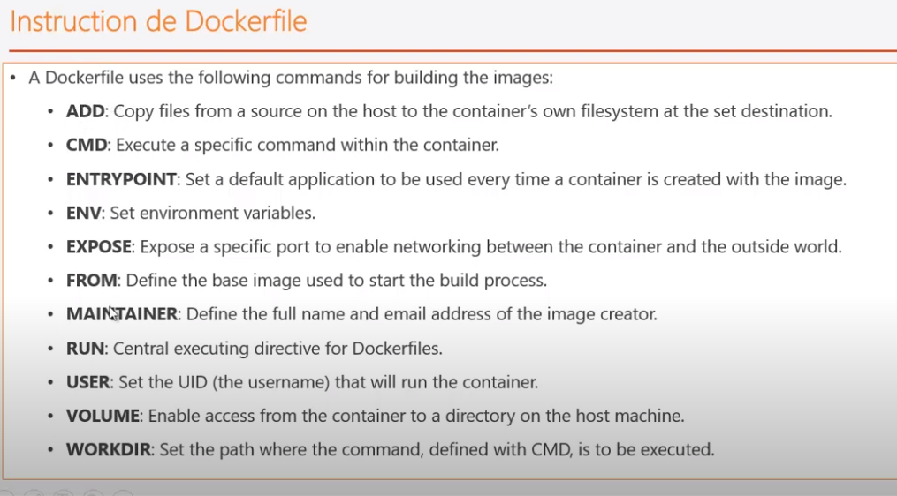
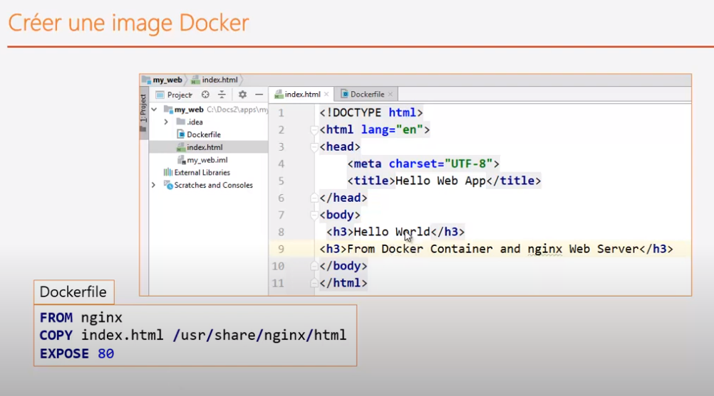
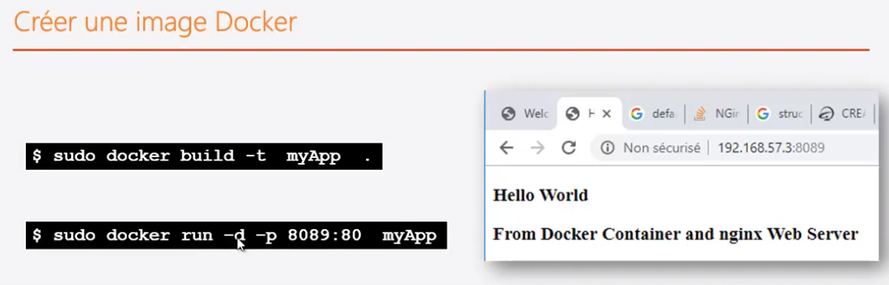
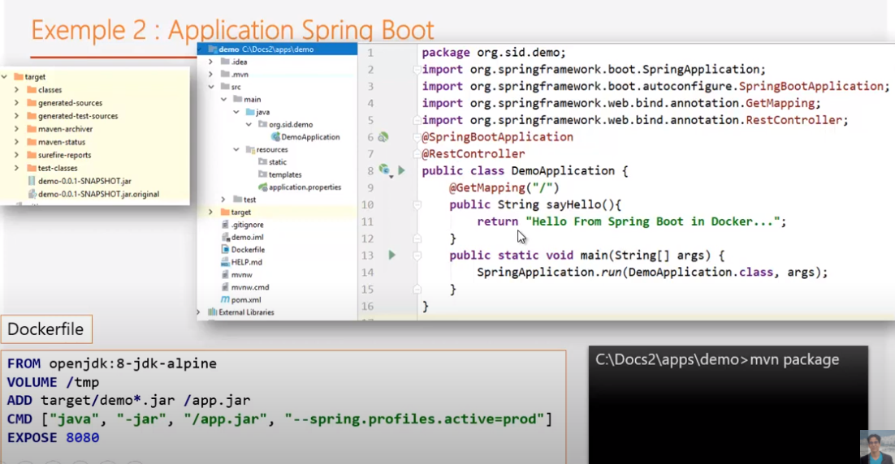

## docker file

[retour](../docker.md)

### url
<pre>
<a href="https://docs.docker.com/engine/reference/builder/" target="_blank">reference</a>
<a href="https://putaindecode.io/articles/les-dockerfiles/" target="_blank">dockerfiles</a>

<a href="./exemple/Dockerfile" target="_blank">exemple</a>
</pre>

### Définition
Un fichier Dockerfile :
*  C'est une sorte de recette qui indique à Docker ce qu'il doit faire étape par étape.
* C'est fichier texte dans lequel sont décrit avec des commandes de base des **instructions** qui définissent les étapes nécessaires avec lesquelles on va construire l'image (qui sera instancier et exécuter par le conteneur).
* une image se compose de plusieurs couches (layer)
* il existe des paramètres obligatoires et des paramètres optionnels

### 🧱 instructions

* FROM : image de base (paramètre obligatoire) sur laquelle toutes les instructions suivantes seront appliquées.  
❗Sans cette instruction, le processus de construction n'a pas de point de départ
* RUN : pour exécuter des commandes shell dans l'image en cours de construction. Elles s'exécutent pendant le processus de construction et servent 
	* à installer des dépendances
	* mettre à jour le système
	* ou effectuer des tâches d'installation
* ADD : copier des fichiers source dans le host du conteneur
* ENTRYPOINT: quel est l'application qui va s'exéctuer ; point d'entrée
* ENV: paramètre optionnel permettant de définir des variables d'environnement
* EXPOSE : 
	- exposer le numéro de port
	- permet d'ouvrir les ports au niveau du contenur

* VOLUME : pour activer les volumes
* WORKDIR : espace de travail
* CMD : 
	- paramètre obligatoire
	- commande à exécuter lorsque le conteneur démarre

</pre>

## Créer une image	

### exemple avec simple appli-web

<pre>
* utiliser une image d'un conteneur web pour la couche sup�rieur
* générer l'image : <b>docker build</b>
	-t : donner un nom à l'image
	. : specifier le dossier ou se trouver le fichier Dockerfile
* exécuter l'image : <b>docker run</b>
</pre>

### Exemple avec appli-Spring-Boot

#### Principe
<pre>
* appli java
* se base sur image java
	* se base sur l'openjdk
	* spéficier un volume
		* application a besoin d'un folder temporaire
* création du dockerfile
</pre>

#### Dockerfile
<pre>
FROM openjdk:8-jdk-alpine
VOLUME /tmp
ADD target/demo*.jar /app.jar
CMD ["java", "-jar", "/app.jar", "--spring.profiles.actives=prod"]
EXPOSE 8080
</pre>
	
#### Déploiement
<pre>
* <b>packaging</b> :
	* génération du jar avec maven
	* mvn package
* <b> générer l'image </b> :
	$ docker build -t demo-web-spb .
* <b>exécuter l'image </b>: 
	$ docker run -d -p 8087:8080 demo-web-spb
</b>
</pre>

