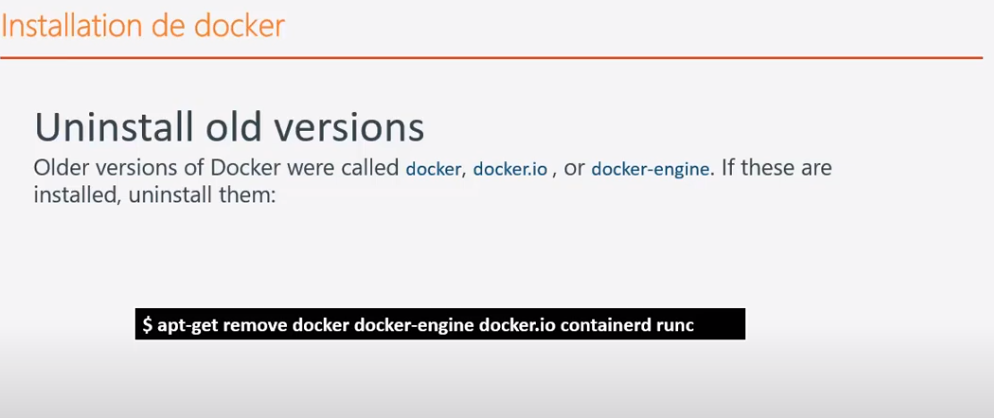

## installation

[retour](docker.md)

### Structure
```
* La structure normale :
	* une machnie hôte (machine physique)
	* une machine virtuelle sur la machine hôte
	* un conteneur sur la machine virtuelle
	* une application géré par le conteneur
```

### docker-desktop windows

#### groupe utilisateur docker-users
<pre>
Gestion des users:
* menu démarrer > Gestion de l'ordianateur
	=> ajouter des utiisateurs aux groupes docker-users
</pre>

### Installation de docker

* il faut s'assurer de la version de Linux
```
> Permet de voir la version de l'OS installé
$ cat /etc/*relesase*
```

* Url pour checker les version de linux pour installer Docker.
```
https://docs.docker.com/engine/install/
```

* Uninstal old versions



* Installation à partir d'un script qui fait l'installation et mise à jour de Docker.

```
> Télécharger le script
$ curl -fsSL https://get.docker.com -o get-docker.sh
> installer curl si besoin
$ sudo apt-get install curl
> Exécuter le script
$ sudo sh get-docker.sh
```


	
* checker l'installation
```
$ docker version
```


### Télécharger des images pour tester

#### whalesay

```
* télécharger image sur DockerHub : whalesay
* application simple qui permet d'afficher un message
```

```
$ docker run docker/whalesay cowsay exagone
```	

## docker installer
https://docs.docker.com/docker-for-windows/release-notes/#docker-community-edition-17062-ce-win27-2017-09-06-stable

## Configure Proxy
<pre>
<b>Attention</b>:
Le docker-daemon (docker-engine) et les conteneurs ne partagent pas la même configuration de proxy
<a href="https://dev.to/mcastellin/use-docker-with-proxy-servers-tutorial-10gg" target="_blank">proxy conf</a>
</pre>

### Docker Engine

<a href="https://docs.docker.com/config/daemon/systemd/" target="_blank">docker-engine</a> 

#### linux: docker.service
<pre>
* Configurer le service:
> sudo systemctl edit docker.service

==> Ajouter dans le fichier
[Service]
Environment=“HTTP_PROXY=http://10.0.1.60:3128”
Environment=“HTTPS_PROXY=http://10.0.1.60:3128”
Environment=“NO_PROXY=localhost,127.0.0.1”

> sudo systemctl restart docker.service
</pre>

### Conteneur

#### .docker/config.json
<pre>
* Configuration pour tous les conteneurs
<a href="https://docs.docker.com/network/proxy/" target="_blank">conteneur</a>
</pre>

#### Configuration pour un conteneur
<pre>
> docker run \
    --env http_proxy="http://my.proxy.com:3128" \
    --env https_proxy="http://my.proxy.com:3128" \
    nginx sh -c "curl google.com"
</pre>