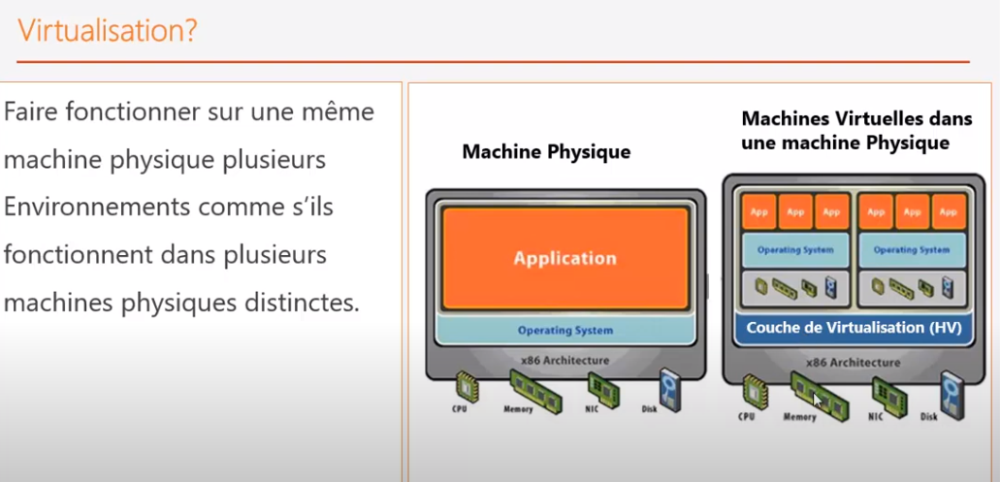
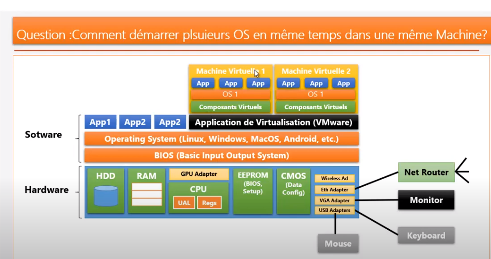
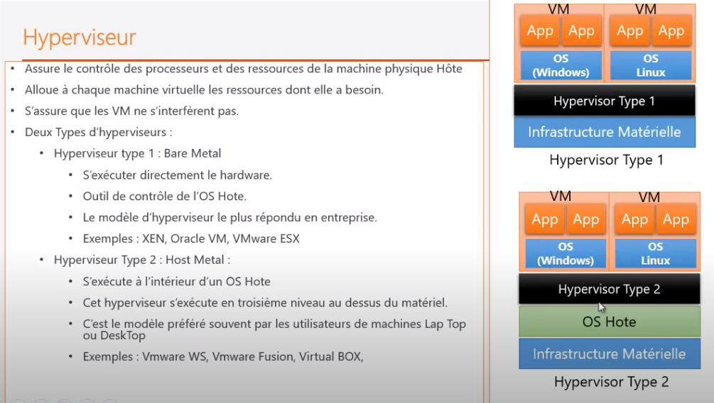
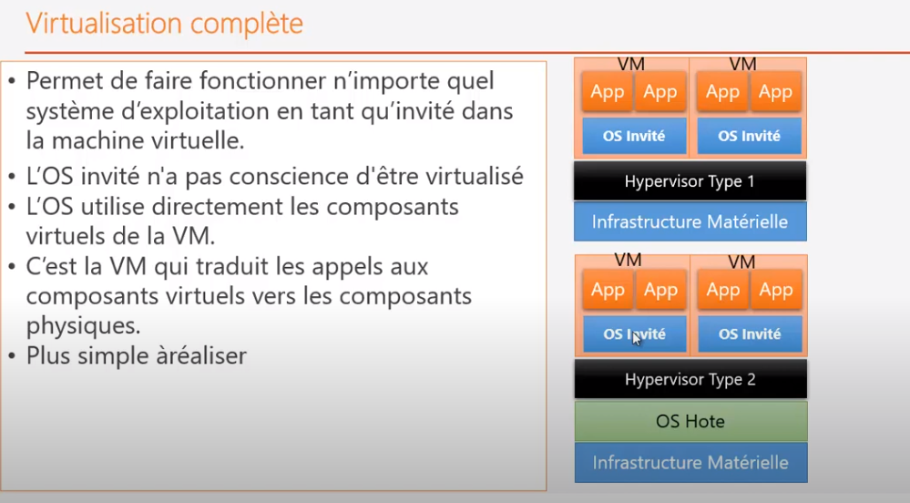
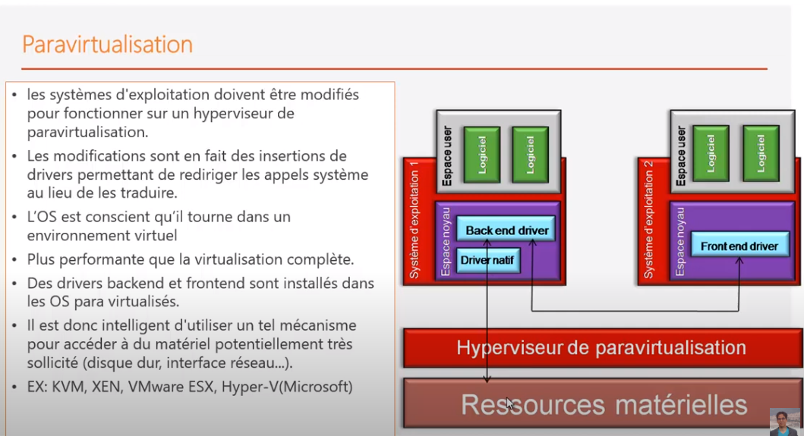

## Virtualisation

[retour](../index-systeme.md)

### Liens
* [Virtual-Box](vitualbox/virtualbox-config.md)
* [Docker](docker/docker.md)

### Structure d'un ordinateur - HardWare

#### Processeur

<pre>
- <b>CPU [ULA + Registre]</b>
	* à partir du P4, augmentation de fréquence élevé, la matière du microprocesseur chauffe
	* quand ça chauffe performance diminue
	* le mp est incapable d'augmenter ses performances avec cette fréquence
	* la loi de Moore ne tient plus
	* la solution pour accroitre les performances des ms ne viendrait pas d'une augementation de fréquence 
		mais en faisant du multi-processeur
	* apparition des processus mutli-coeur, capable d'effectuer plusieurs instruction en même temps
	
- <b>GPU</b> : Graphical processing unit => comment accélérer le rendu graphique pour les jeux	
	* ce qui rend puissant : architecture massivement parallèle
	* carte-graphique : NVidia
		- offre des milliers de petits processeur graphiques
		- animation 3G: 30 images par s | chaque image 640 *1080, beaucoup de pixels
		- avec 1CPU, incapable de faire un rendu en temps réel
		- on fait le calcule avec le GPU (calcul massif parallèle)
		- important pour l'intelligence artificielle
		- a partir de 2010, ouverture du GPU pour le calcul scientifique (calcul matricielle)
</pre>

#### RAM :
<pre>
* données valatiles
* instruction des programmes chargés dans la RAM
* exécuté par le processeur
</pre>

#### Disque Dur
<pre>
* unités de persistence (Sata | SD)
</pre>

#### BIOS | EEROM | CMOS 
<pre>
* <b>BIOS</b> : premier programme qui démarre sur un PC, stocké dans <b>mémoire morte ROM</b> (une fois stocké, on ne peut plus modifié)
* <b>EEPROM</b>: maintenant ce sont des EEPROM (<b>ROM pragrammable</b>, mais qu'on peut modifier par programme (voie éléctrique |flashé))
	- permet d'effacer et rempacer le programme
* <b>CMOS</b> : stocke l'ensemble de données de configuration de la machine dont l'<i>option de virtualisation</i>
</pre>

##### BIOS et démarrage du PC:
<pre>
* qd l'ordinateur est mis sous tension, le système charge le <b>bios dans la RAM</b> et le CPU l'exécute
* bios (basic input output system) : <b>mini OS de base</b> qui permet de gérer les éléments matériels d'E/S
* <b>opérations</b> de base d'<b>E/S</b> sont faites par le BIOS 
</pre>

##### Auto-test et Setup
<pre>
* le <b>bios</b> fait alors l'<b>autotest de démarrage</b> :
	* c'est un test de <b>fonctionnalité du matériel</b> :
	* le bios teste si tous les éléments sont connectés
* l'autotest de démarrage est <b>configurable via le Setup</b> qui permet d'accèder aux <b>données de configuration</b> de la machine 
	Exemple de configuration :
	* le nombre de disque dur
	* sur quel élément booter
	* activer l'option de virtualisation
</pre>

##### Boot
<pre>
* une fois l'autotest, setup effectué, passage au boot 	
* <b>boot</b> va vers un <b>secteur</b> particulier (boot) du <b>disque dur</b> pour démarrer l'<b>OS</b>
* le bios va chercher les infos de l'OS dans la <b>configuration du Setup</b>
* qd un OS est trouvé dans l'opération de boot, l'<b>OS est démarré</b>
* l'<b>OS</b> va alors gérer toutes les applications 
	 en permettant leur accès aux différentes ressources du PCs
* tout est orchestré par l'<b>OS</b> mais il <b>s'appuie sur le BIOS</b> 
	pour faire les <b>opérations de base</b> d'E/S
	
* dual boot : choisir l'OS sur lequel on boot
	* impossible d'utiliser deux OS en même temps
</pre>

#### Adapters 

<pre>
* cartes permettant de connecter le PC avec le monde extérieur
	* réseau (ethernet)
	* moniteur (vga)
	* usb (souris, clavier)
	* bluetooth
	...
</pre>		
		
### Principe de la virtualisation

<pre>
<i>Principe</i>
* démarrer et faire fonctionner sur une même machine physique plusieurs environnements / OS
	comme s'ils fonctionnent dans plusieurs machines physiques distinctes.
</pre>	

	
#### application de virtualisation

<pre>	
<b>Hyperviseur</b> : 
* application de virtualisation (VMware ou VirtualBox) 
	qui va créer et gérer des <b>machines virtuelles</b>
</pre>

#### Créer une machine virtuelle

##### Principe
<pre>
* créer un environnement dans lequel seront créés des <b>composants virtuels</b> 
	* composant virtuel = objet virtuel  => comparaison avec le modèle objets
	* ce ne sont pas des composants physiques.
* parmi les composants virtuels : disque dur virtuel, BIOS, tous les adaptateurs (carte réseau) 
	<i>Attention</i> : <b>sauf</b> le <b>processeur, CPU</b> qui sont des <b>ressources partagées</b>, <b>RAM</b> également je pense.
* L'<b>ensemble</b> des <b>composants virtuels</b> permettent de créer une <b>application/machine virtuelle</b>
	* qui représente l'architecture physique de l'ordinateur, 
	* l'application va <b>traduire l'architecture physique</b> de l'ordinateur hôte mais sous forme de composants virtuels
* Un <b>composant virtuel</b>  
	* se charge de <b>traduire les appels d'OS vers l'OS hôte</b> qui permet d'accéder aux ressources matérielles
	* c'est un <b>proxy</b> qui va interprété et <b>demandé à l'hyperviseur</b> de faire l'opération demandée en passant par l'OS hôte
* Qd on démarre cette machine, on peut démarrer un nouveau OS qui ne connaît que les composants virtuels
* On a donc les <b>couches suivantes</b> pour représenter une machine virtuelle
	- couche des applications (app1, app2, ...)
	- couche OS (OS invité)
	- composants virtuels
	- hyperviseur (application / couche de virtualisation)
	- OS hôte - ordinateur hôte
	- composants hardware hôte
* qd une application veut écrire vers le disque dur, l'application écrit sur le disque dur virtuel ; 
	le composant virtuel traduit l'opération vers une écriture physique
</pre>

##### Performances et partage des ressources

<pre>
* on peut démarrer une ou plusieurs machines virtuelles
* les machines virtuelles partagent les mêmes ressources
* chaque machine vituelle se voit allouer des ressources processeurs: CPU, RAM
* si tout ce que l'on fait se trouve dans les machines virtuelles, pourquoi pas utiliser l'hyperviseur comme OS
	* On a besoin de l'essentiel pour gérer les E/S
	* l'hyperviseur peut jouer ce rôle et remplacer l'OS hôte
</pre>

### Hyperviseur

<pre>
C'est une <b>couche de virtualisation</b> qui permet :
* assurer le contrôle des processeurs et des ressources de la machine physique hôte
* alloue à chaque machine virtuelle les ressources dont elle a beoin
* s'assure que les VM ne s'interfèrent pas
* 2 types d'hyperviseur
	- hyperviseur de type 1
		* l'hyperviseur joue le rôle de l'OS hôte
		* s'exécute directement sur le hardware
		* XEN, Oracle VM, VMware ESX
	- hyperviseurde type 2
		* hyperviseur se repose sur l'OS hôte
		* VMware WS, VMware Fusion(mac), Virtual BOX (gratuit)
</pre>

### Virtualisation Complète

### Paravirtualisation

<pre>
* En virtualisation complète, les composants virtuels interprète les appels pour les traduire vers des appels systèmes physiques
* En paravirtualisation, les appels systèmes sont redirigés directement vers les composants physiques (via les drivers installés sur l'OC)
</pre>

