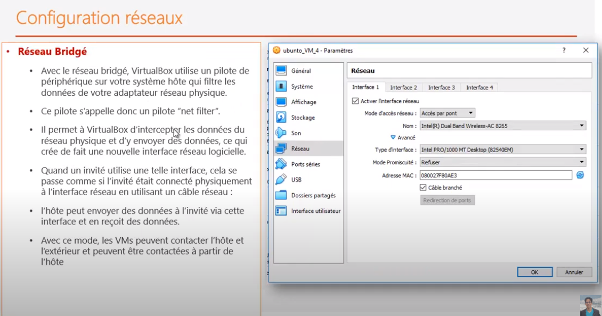
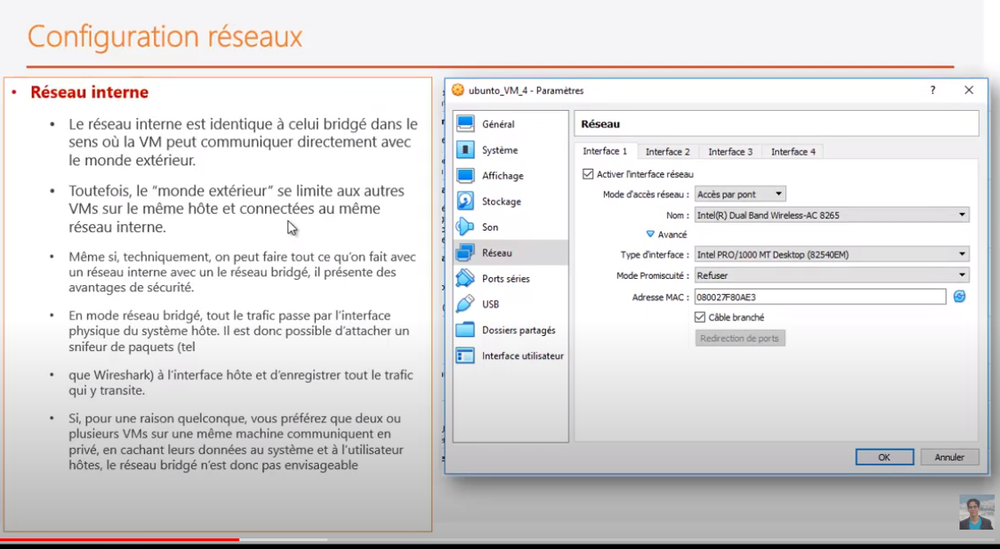
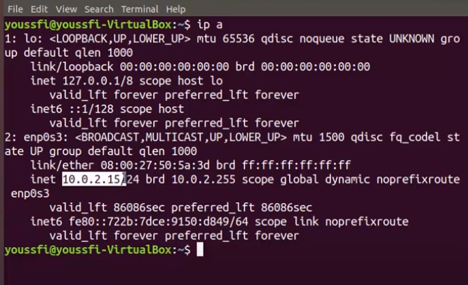
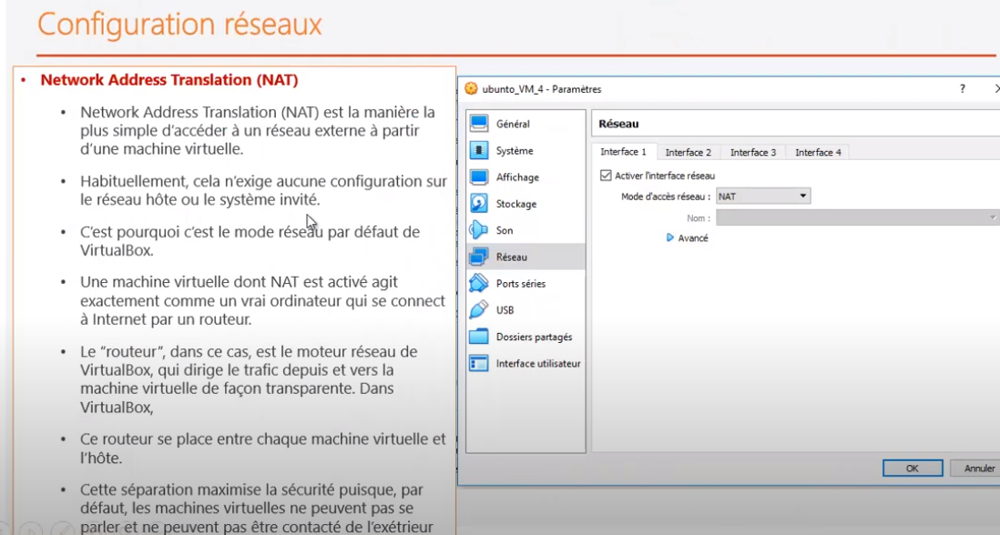
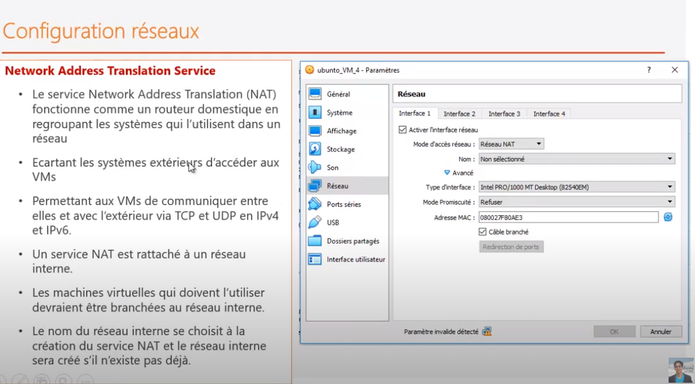
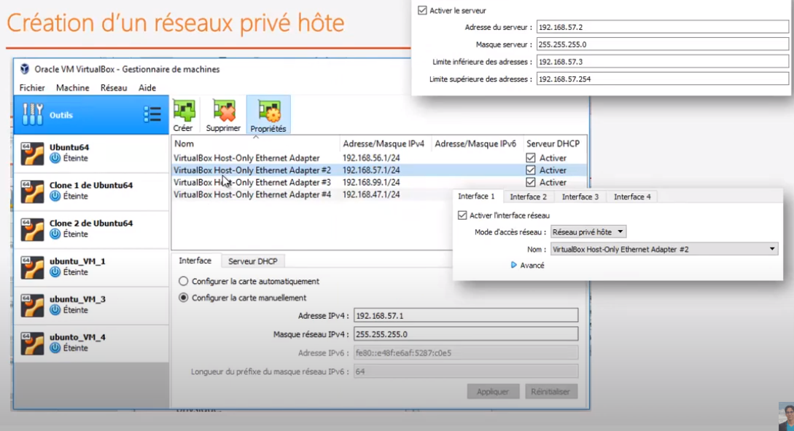

### Liens
[Virtual-Box](../virtualisation.md)

## VM Ubuntu
```
* login: grouault
* password:gildas1234
* ssh grouault@grouault-VirtualBox
```

## VM Ubuntu Server
```
* ssh grouault@ub-server
* login: grouault
* password: 1234
```

## VM Fedora Server
```
* root: grouault
* password: gildas1234
```

## installation
```
* installation local des VMs:
C:\Users\grouault\VirtualBox VMs


* installation des images
C:\Users\grouault\VirtualBox VMs\UbuntuServer\UbuntuServer.vdi
```

### hosts
```
Windows
C:\Windows\System32\drivers\etccvap
```

## Question
<pre>
install-docker?
Ou est install� docker-host / docker-engine sur la VM?
</pre>

## Cr�ation d'adaptateur
<pre>
* pour cr�er une nouvelle carte r�seau virtuelle.
</pre>

## Configuration R�seau 

### configuration R�seau-Bridg�



### configuration Acces-Pont
<pre>
* machine virtuelle va utiliser la m�me interface r�seau que la machine physique
* exactement comme s'il s'agit d'une vraie machine physique
* on peut pinger d'une machine � l'autre
* <b>par contre pas d'internet</b>
</pre>



### connexion � Internet en NAT
<pre>
* Aucune configuration n'est � faire pour faire cela
	> test connexion internet
	$ ping google.com
* En NAT, c'est VB qui attribue une adresse IP dynamique � la machine virtuelle
	* Addresse IP qui est fournit par d�faut � la machine : 10.0.2.15
	$ ip a => inet 10.0.2.15/24 brc
* Avec cet IP, la machine peut se connecter � internet 
	VB va faire la translation d'adresse (pour tous les paquets envoy�s) 
		de fa�on � utiliser la carte ethernet physique de la machine.
</pre>







### Tester les applications en dehors de la machine virtuelle
<pre>
En NAT, il y a un pb. Ce n'est pas configur� par d�faut.
</pre>

### configuration R�seau Priv�
<pre>
Configuration avec <b>plusieurs interface</b>

* interface 1 : <b>NAT</b> pour avoir acc�s Internet

* interface 2 : R�seau priv� h�t� pour permettre � la VM de <b>contacter l'ext�rieur</b>
	* cr�ation d'un r�seau priv� sur la machine virtuelle mais <b>connect� � la machine h�te</b>
	* pour un r�seau priv�, il faut pr�ciser l'adaptateur � utiliser : carte r�seau
		* carte pour pouvoir acc�der au r�seau
	* pour cela, il est possible de cr�er un adaptateur
	
</pre>	


	
## SSH : connection serveur � distance
```
* sur la version Desktop, il faut installer OpenSsh
* sudo apt-get install openssh-server
* sur la version Server, OpenSsh est d�j� install�
```


	


```	