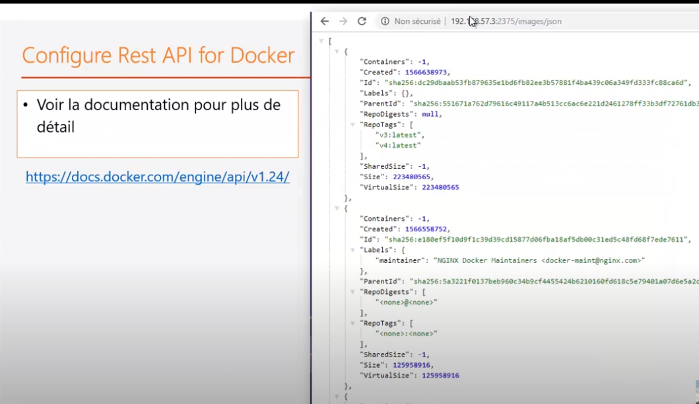
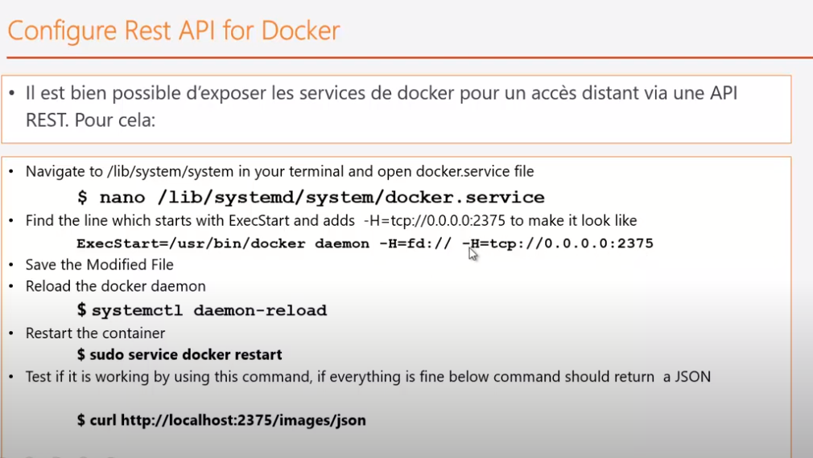
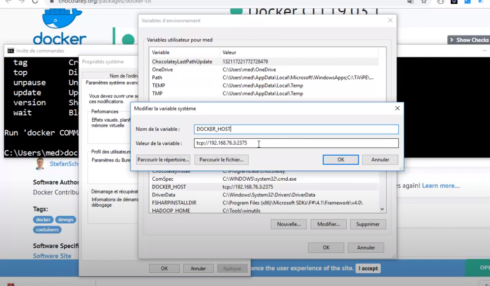

## docker engine

[retour](../docker.md)

### API-REST
<pre>
docker-engine peut exposer ses services via une API Rest
</pre>

<pre>
* 0.0.0.0:2375
	* 0.0.0.0: C'est à dire on peut la consulter depuis n'importe quelle machine
	* 2375: port d'exposition de l'API Rest
</pre>	
	
	
### windows : client docker
<pre>
* Le client docker permet de se connecter au docker-engine
</pre>
<pre>
1-<b>choco</b>: Pour installer le client docker on utilise 'choco'
	* outils comme npm, iptget
	* installation : https://chocolatey.org/install#individual (suivre la procédure)

2- une fois choco installé
	* installé docker : <b>choco install docker-cli</b>
	* https://community.chocolatey.org/packages/docker-cli#individual

</pre>

### établir une connexion avec docker-engine
<pre>
* ajouter variable d'environnement: DOCKER_HOST
</pre>

