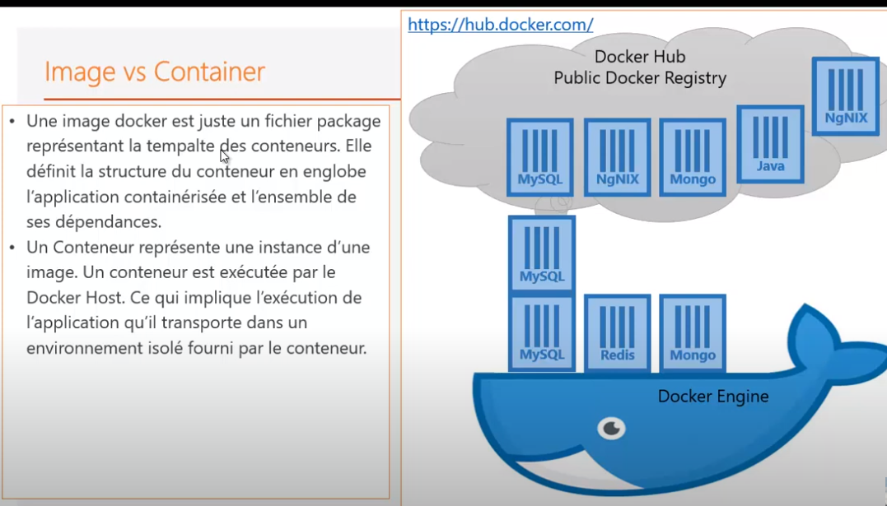
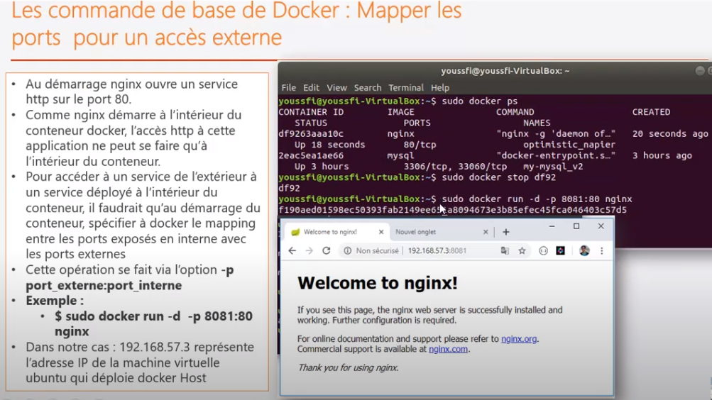
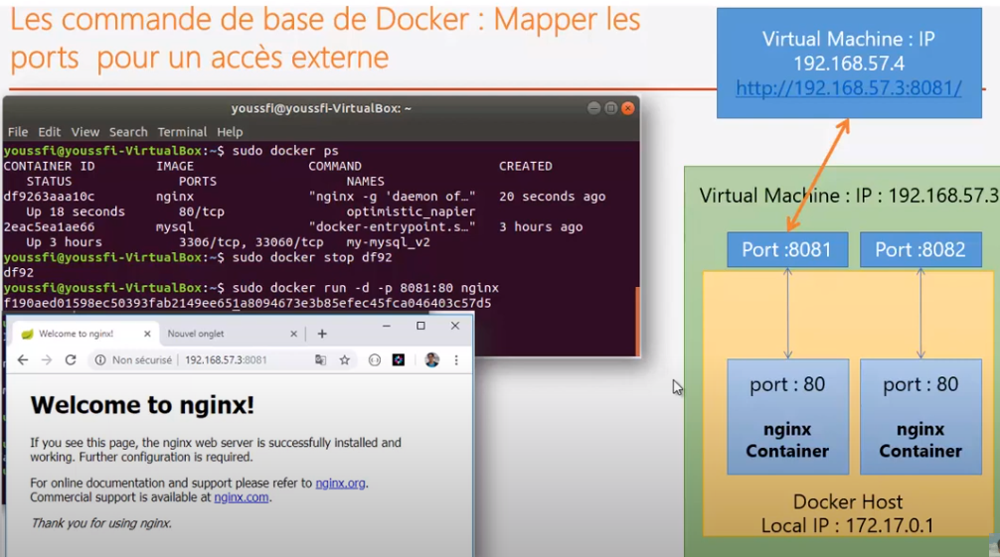

## Docker

[Virtual-Box](../virtualisation.md)

### Menu
* [installation](installation-docker.md)
* [commandes](docker-cmd/docker-cmd.md)
* [exercices](exercices-formation/exercices.md)
* [docker-engine](docker-engine/docker-engine.md)
* [dockerfile](dockerfile/dockerfile.md)

### doc
* [pdf-formation](docker.pdf)

### url
<pre>
*  Docker 
==> HyperViseur : 

* Définition
https://www.lebigdata.fr/docker-definition
https://guillaumebriday.fr/comprendre-et-mettre-en-place-docker

* urls volume
https://rominirani.com/docker-on-windows-mounting-host-directories-d96f3f056a2c
https://stackoverflow.com/questions/46529884/windows-docker-external-mount

* install - docker toolbox
https://github.com/docker/toolbox/issues/636

* docker-machine
https://docs.docker.com/machine/get-started/
</pre>

### Questions : 
<pre>
* où sont stockées les images docker physiquement ?
</pre>

### docker-engine
???

### docker-host
???	
	
	
### image vs conteneur
	
	
### images 

#### definition
<pre>
* c'est un <b>fichier</b> qui contient l'<b>ensemble des éléments</b> permettant de <b>packager</b> une <b>application</b>.
* cette application est liée à une image
* les images sont stockées dans le <b>docker-engine</b>
* l'idée est de créer une image custom, où sont liés :
	* fichier de configuration
	* varaibles d'environnement
	* fichiers de données
	*...
* ainsi, l'image contient une configuration de base et pour utiliser l'application,
* il suffit alors de l'<b>exécuter</b> dans un <b>conteneur</b>.	
</pre>

#### image et OS
<pre>
* $ sudo docker run ubuntu
* Que se passe-t-il?
	* l'image est téléchargé et tenté de l'exécuter mais va s'arrêter automatiquement.
	* <b>docker</b> n'est <b>pas fait pour contenir un OS</b>. 
		* donc cette couche seule ne fonctionne pas
	* Il est fait pour <b>envelopper des applications</b>.
	* tous les <b>conteneurs docker</b> ont besoin d'<b>utiliser le noyau Linux</b> comme host
	* toutes les images docker vont se baser sur cette image. 
	* C'est l'image de base qui permet au conteneur d'accéder au noyau. 
		* le noyau a besoin de gérer les processus.
		* le noyau crée un espace processus pour le conteneur.
</pre>

#### notion de couches
<pre>
* docker utilise la notion de couche pour télécharger les images
	* l'image de base est ubuntu pour chaque appliation téléchargée	
	* une image est une <b>succession de couches</b> qui permettent de <b>démarrer une application</b>
</pre>

### conteneur 

#### défintion
<pre>
* il faut considérer le conteneur comme l'instance d'une application
* c'est donc l'instance d'une image
* avec la même <b>image</b>, on peut créer <b>plusieurs instances/conteneurs</b>
* chaque conteneur à un <b>identifiant unique</b> qui le diffère de l'autre
</pre>	
	

#### stokage : 
	* images : gourmand en espace disque
	* conteneur : ne prend pas beaucoup de place
		* c'est une instance
		* ce sont de fichiers très légers

### mapping de port
		
#### installation nginx et mapping de port

<pre>
* installation : 
	$ sudo docker run -d nginx
* Quand docker est installé :
	* il créé sa propre <b>interface réseau</b>		
	* docker-engine crée une <b>carte-réseau</b>
		c'est à dire une interface qui est <b>propre au conteneur</b> avec <b>son adresse ip</b> : 172.17.0.1
* le server web nginx est démarré dans le conteneur sur le port 80
	* ce port 80 ne peut être utilisé que <b>dans le conteneur</b>
	* c'est à dire par une application qui se trouve dans le conteneur
		et qui appelle le serveur web avec l'adredse locale IP_CONTENEUR et sur le port 80 
		soit <b>172.17.0.1:80</b>
	* si je suis sur la machine hôte, impossible d'accèder. Pourquoi?
		* <b>192.168.56.101:80</b> : accès <b>machine virtuelle</b> sur le port 80
		* parce que je suis sur une machine (machine virtuelle) en dehors du conteneur et je veux accéder au port 80,
			alors que le port 80 est utilisé pour accéder à l'application à l'intérieur du conteneur
		* pour pouvoir accèder au serveur web <b>en dehors du conteneur</b>, il faudrait <b>mapper les ports</b>.
		* pour accèdder à un service, déployé à l'intérieur du conteneur, de l'extérieur, il faut
			* au démarrage du conteneur
			* spécifier à docker le mapping entre les <b>ports</b> exposés en <b>interne</b> avec les <b>ports externes</b>.
</pre>	

		
#### mapping de port	

<pre>
* $ <b>sudo docker run -d -p 8082:80 nginx</b>
	* nginx dans le conteneur démarre sur le port 80 ; on le mappe sur le port 8082
	* quand on est en dehors du conteneur, on peut y accéder en accédant à ce numéro de port : 8082.
	* 192.168.56.101 représente l'adresse IP de la machine virtuelle qui déploie docker Host
	* Accès à ngInx de l'exterieur via la machine virtuelle : <b>http://192.168.56.101:8082/</b>
	
* on peut démarrer <b>plusieurs containers nginx</b> qui en interne utilise le <b>port 80</b>
	* chacun des containers devra voir son port 80 <b>mapper sur un port distinct de la VM</b>.
	* intéressant pour tester des applications en versions différentes ou une nouvelle et ancienne version applicative
</pre>

#### mapping de volume
	
	

	
