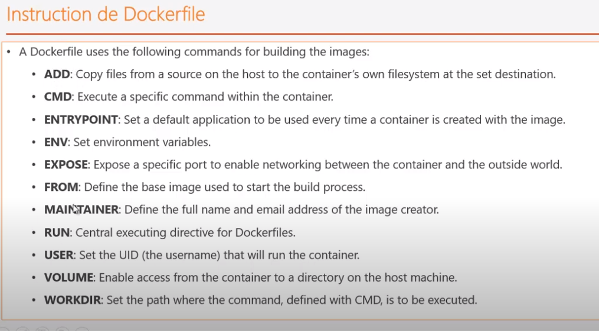
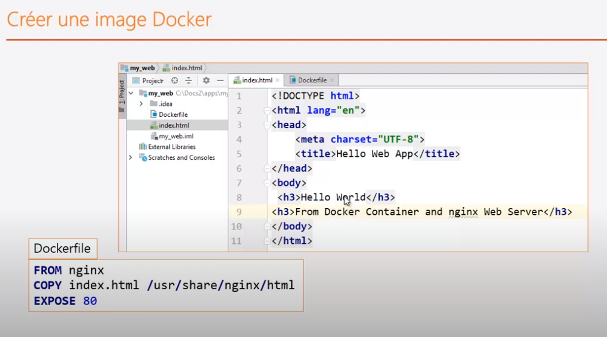
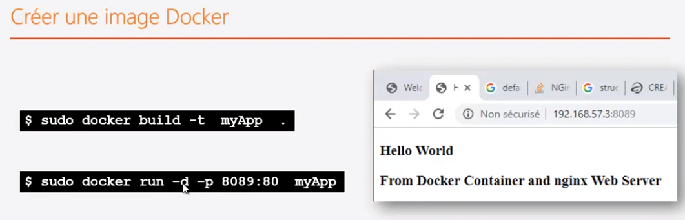
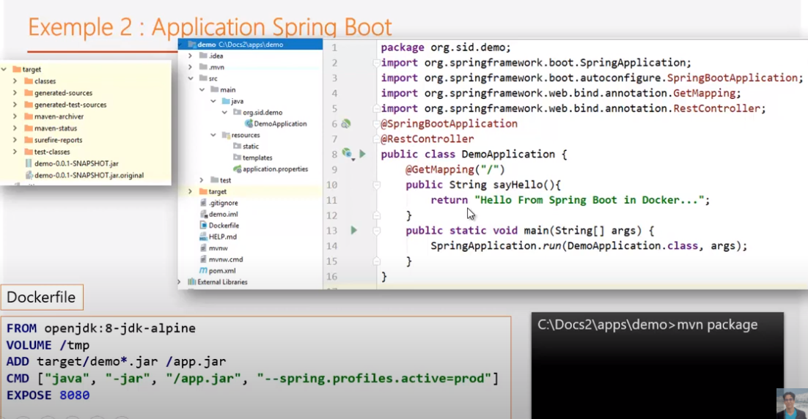

## docker file

[retour](../docker.md)

### url
* https://putaindecode.io/articles/les-dockerfiles/

### Définition
<pre>
* comment créer une image ou une nouvelle application
* fichier dans lequel est décrit avec des commandes de base la manière avec laquelle on va construire l'image
* une image se compose de plusieurs couches (layer)
</pre>	
	
### Commandes
<pre>	
* add : copier des fichers source dans le host du conteneur
* entrypoint: quel est l'application qui va s'exéctuer ; point d'entrée
* env: 
* expose : exposer le numéro de port
* From : image de base
* RUN : pour exécuter
* VOLUME : pour activer les volumes
* WORKDIR : espace de travail
</pre>

## Créer une image	

### exemple avec simple appli-web

<pre>
* utiliser une image d'un conteneur web pour la couche supérieur
* générer l'image : <b>docker build</b>
	-t : donner un nom à l'image
	. : specifier le dossier ou se trouver le fichier Dockerfile
* exécuter l'image : <b>docker run</b>
</pre>

### Exemple avec appli-Spring-Boot

#### Principe
<pre>
* appli java
* se base sur image java
	* se base sur l'openjdk
	* spéficier un volume
		* application a besoin d'un folder temporaire
* création du dockerfile
</pre>

#### Dockerfile
<pre>
FROM openjdk:8-jdk-alpine
VOLUME /tmp
ADD target/demo*.jar /app.jar
CMD ["java", "-jar", "/app.jar", "--spring.profiles.actives=prod"]
EXPOSE 8080
</pre>
	
#### Déploiement
<pre>
* <b>packaging</b> :
	* génération du jar avec maven
	* mvn package
* <b> générer l'image </b> :
	$ docker build -t demo-web-spb .
* <b>exécuter l'image </b>: 
	$ docker run -d -p 8087:8080 demo-web-spb
</b>
</pre>

