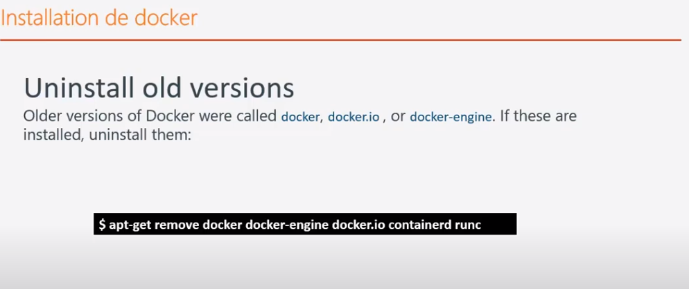
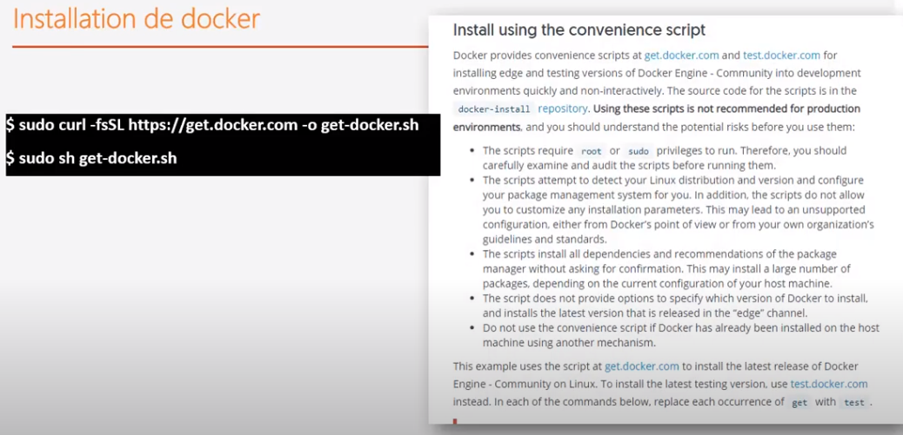
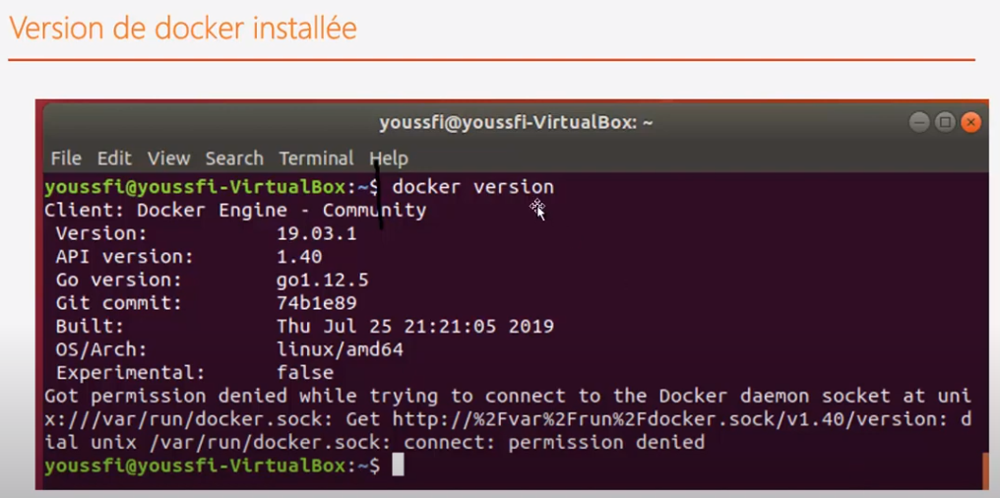

## installation

[retour](notes-docker.md)

### Structure
```
* La structure normale :
	* une machnie hôte (machine physique)
	* une machine virtuelle sur la machine hôte
	* un conteneur sur la machine virtuelle
	* une application géré par le conteneur
```

### Installation de docker

* il faut s'assurer de la version de Linux
```
> Permet de voir la version de l'OS installé
$ cat /etc/*relesase*
```

* Url pour checker les version de linux pour installer Docker.
```
https://docs.docker.com/engine/install/
```

* Uninstal old versions



* Installation à partir d'un script qui fait l'installation et mise à jour de Docker.

```
> Télécharger le script
$ curl -fsSL https://get.docker.com -o get-docker.sh
> installer curl si besoin
$ sudo apt-get install curl
> Exécuter le script
$ sudo sh get-docker.sh
```



	
* checker l'installation
```
$ docker version
```




### Télécharger des images pour tester

#### whalesay

```
* télécharger image sur DockerHub : whalesay
* application simple qui permet d'afficher un message
```

```
$ docker run docker/whalesay cowsay exagone
```	