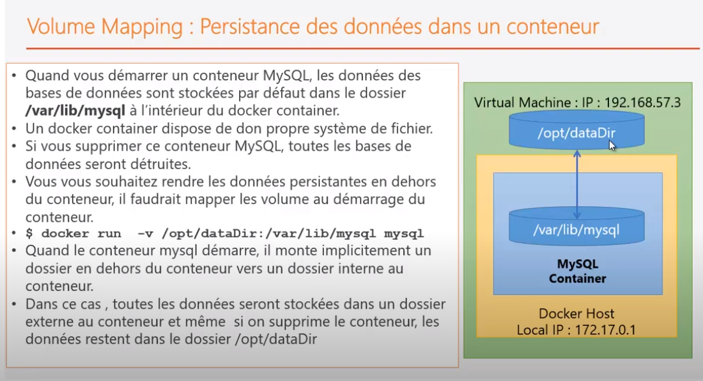

## Docker

### Menu
* [installation](installation-docker.md)

###
Questions : 
* où sont stockées les images docker physiquement ?


## Images a connaître

#### alpine

```
$ sudo docker run --rm alpine ping 8.8.8.8
```	

```
* image linux réduite
* contient l'essentiel pour exécuter les scripts ou cmd sur shell
* -- rm le conteneur est détruit en fin de traitement
```

#### mysql

#### commande installation

##### générique

```
* $ docker run --name some-mysql -e MYSQL_ROOT_PASSWORD=my-secret-pw -d mysql:tag
````

##### exemple

######  minimal
```	
* $	docker run --name my2 -e MYSQL_ROOT_PASSWORD=root -d mysql
	* --name : nom du conteneur
	* mysql: référence l'image
````

###### avec volume
```	
* $	docker run -v /opt/datas/mysql:/var/lib/mysql --name my2 -e MYSQL_ROOT_PASSWORD=root -d mysql
	* --name : nom du conteneur
	* mysql: référence l'image
````


### docker-engine
???

### docker-host
???	
	
### conteneurs / images

#### image : 
```	
* c'est un fichier qui contient l'ensemble des éléments permettant de packager une application.
* elles sont stockées dans le docker-engine	
```
	
#### image : succession de couches

```
* $ sudo docker run ubuntu
* Que se passe-t-il?
	* l'image est téléchargé et tenté de l'exécuter mais va s'arrêter automatiquement.
	* docker n'est pas fait pour contenir un OS. Il est fait pour envelopper des applications.
	* tous les conteneurs docker ont besoin d'utiliser le noyau Linux comme host
	* toutes les images docker vont se baser sur cette image. 
	* C'est l'image de base qui permet au conteneur d'accéder au noyau. Il a besoin de gérer les processus.
		* pour créer un espace processus pour le conteneur.
		
* docker utiliser la notion de couche pour télécharger les images
	* l'image de base est ubuntu pour chaque appliation téléchargée
	* mais docker n'est pas fait pour faire tourner un OS 
	* donc cette couche seule ne fonctionne pas
	* une image est une succession de couches qui permettent de démarrer une application
```	
	
	

#### conteneur 

##### instance d'une image
	* avec la même images, on peut créer plusieurs instances/conteneurs
	* chaque conteneur à un identifiant unique qui le diffère de l'autre
	
##### défintion
	* il faut considérer le conteneur comme l'instance d'une application
	* cette application est liée à une image
	* l'idée est de créer une image custom, où son liés :
		* fichier de configuration
		* varaibles d'environnement
		* fichiers de données
		*...
	* ainsi, l'image contient une configuation de base et pour utiliser l'application,
		il suffit d'exécuter le conteneur.

#### stokage : 
	* images : gourmand en espace disque
	* conteneur : ne prend pas beaucoup de place
		* c'est une instance
		* ce sont de fichiers très légers

### mapping de port
		
#### installation nginx et mapping de port

```
* installation : sudo docker run -d nginx
* Quand docker est installé, il créé sa propre interface réseau		
* docker-engine crée une carte-réseau, une interface qui est propre au conteneur avec son adresse ip :172.17.0.1
* le server web nginx est démarré dans le conteneur sur le port 80
	* ce port 80 ne peut être utilisé que dans le conteneur, c'est à dire par une application qui se trouve dans le conteneur
		et qui appelle le serveur web avec l'adredse locale IP_CONTENEUR et sur le port 80 : 172.17.0.1:80
	* si je suis sur la machine hôte, impossible d'accèder. Pourquoi?
		* 192.168.56.101:80 : accès machine virtuelle sur le port 80
		* parce que je suis sur une machine (machine virtuelle) en dehors du conteneur et je veux accéder au port 80,
			alors que le port 80 est utilisé pour accéder à l'application à l'intérieur du conteneur
		* pour pouvoir accèder au serveur web en dehors du conteneur, il faudrait mapper les ports.
		* pour accèdder à un service de l'extérieur à un service déployé à l'intérieur du conteneur, il faudrait
			qu'au démarrage du conteneur, spécifier à docker le mapping entre les ports exposés en interne avec les ports externes.
```		
		
#### mapping de port	

```	
* au démarrage, on a besoin de mapper le port 80 avec un autre port accessible de l'exterieur
* $ sudo docker run -d -p 8082:80 nginx
	* nginx dans le conteneur démarre sur le port 80 ; on le mappe sur le port 8082
	* quand on est en dehors du conteneur, on peut y accéder en accédant à ce numéro de port : 8082.
	* 192.168.56.101 représente l'adresse IP de la machine virtuelle qui déploie docker Host
	* Accès à ngInx de l'exterieur via la machine virtuelle : http://192.168.56.101:8082/
* on peut démarrer plusieurs containers nginx qui en interne utilise le port 80
	* chacun des containers devra voir son port 80 mapper sur un port distinct de la VM.
	* intéressant pour tester des applications en versions différentes ou une nouvelle et ancienne version applicative
```


#### mapping de volume
	
	

	
### Commande de base

####  diverses
```
* $ docker version
	* voir la version de docker

* $ cat /etc/*relesase*
	* Permet de voir la version de l'OS installé

* $ sudo shutdown -h 0
	* Arrêter la machine
```

#### images

```
* $ docker images
	* permet de voir les images installés dans le docker-host
	* chaque image présente à un identifiant unique au niveau du docker-host: [IMAGE ID]
	* le tag indique la version : par défaut, 'latest'

* $ docker rmi <<nom_image>>
	* permet de supprimer une image du host docker.
	* pour ce faire, il faut s'assurer de stopper et supprimer d'abord tous les conteneurs instanciés de cette image

* $ docker pull image
	* docker-pull: permet de télécharger l'image et de la mettre dans le repository local de docker (docker-engine)
	* docker-run: vérifie si présent dans le repository local de docker
		* Si oui, il l'instancie et l'exécute
		* si non, il lancer le téléchargement de l'image (pull + run)

* $ docker run image
	* Fait un pull et exécute l'image

* $ docker run -d image
	* -d : Exécuter une application en arrière plan 
		* Exemple: $ sudo docker run -d nginx
		* sous form de deamon (ex: serveur avec numéro de port)
		* comme service de fond
	* --name : nom du coneneur
		* Exemple : $ docker run --name some-mysql -e MYSQL_ROOT_PASSWORD=my-secret-pw -d mysql:tag

* $ docker run image:tag
	* Pour spécifier la version
		* Exemple: docker run redis:4.0
		
* $ docker run --rm image
	* permet de supprimer le conteneur, une fois celui-ci terminé et libérér de la taille sur le disque.
	* bien pour les conteneurs utilisé pour très peu de temps, juste pour accomplir quelque chose
		* comme compilé une application
		* faire des tess
		* lancer une commande de base
	
```

#### conteneur

```
* $ docker ps
	* permet de lister les conteneurs qui sont en cours d'exéution
	* chaque conteneur créé dispose d'une identifiant unique et d'un nom de conteneur

* $ docker ps -a
	* permet de lister tous les conteneurs avec leurs statuts (Up, Exited, Created)
		
* $ docker stop << containerID or Container Name>>
	* permet de stopper un conteneur demarrer ou en cours de démarrage.
	* spécifier le nom nom ou 4 premiers caractère de l'identifiant  

* $ docker restart << containerID or Container Name >>

* $ docker rm << containerID or Container Name>>
	* permet de supprimer un container de façon permanente.  

* $ sudo docker logs -t mysql3
	* consulter les logs quand un problème sur le conteneur est constaté

* $ sudo docker exec << containerID or Container Name >> << fonction >>
	* exemple : docker exec -it my2 mysql --password
		* demande d'exécuter le client mysql dans le conteneur my2
	* option -it : 
		* mode interactif : execution le conateneur en donnant la possibilité de rentrer en interaction avec l'utilisateur
		* terminal : 
			* on utilise le terminal utilisé sur vm comme console d'interaction avec le container.
			* commse si on attachait la console au conteneur.
		* sans cette option, le conteneur démarre, mais on ne peut voir aucun message
	* exec (explication)
		* une fois l'image téléchargé, une instance (un conteneur) est créée.
		* le conteneur démarre alors MySql
		* Question : comment communiquer avec mysql une fois le conteneur mis en place ?
		* MySql : client et Serveur MySql.
			* on veut exécuter le client MySql dans le conteneur
			* on veut entrer en interaction avec le conteneur
			* on va utiliser 'exec' pour rentrer dans le contexte du conteneur et exécuter une commande
			* c'est comme si on allait dans le répertoire myqsl/bin et qu'on lançait le client mysql
			
* $ sudo docker attach << containerID or Container Name >>
	* comment attacher une console à un conteneur
	* util pour aller voir ce qui se passe dans un conteneur démarré avec l'option -d
	
* $ sudo docker inspect << containerID or Container Name >>
	* permet d'avoir plus de détail sur le container au format JSon
	
```