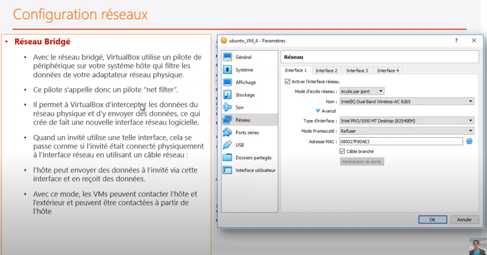
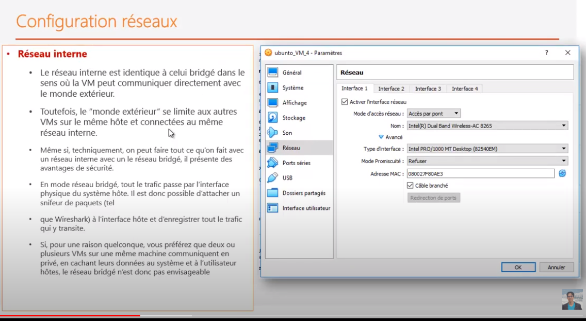
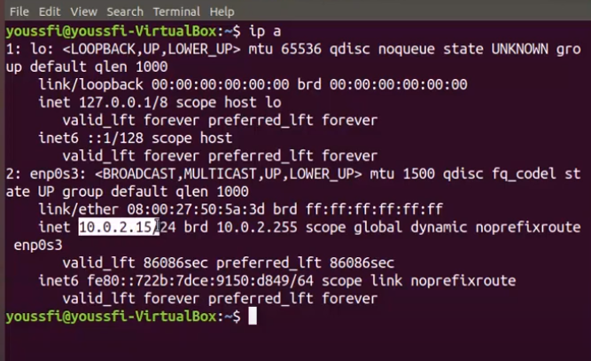
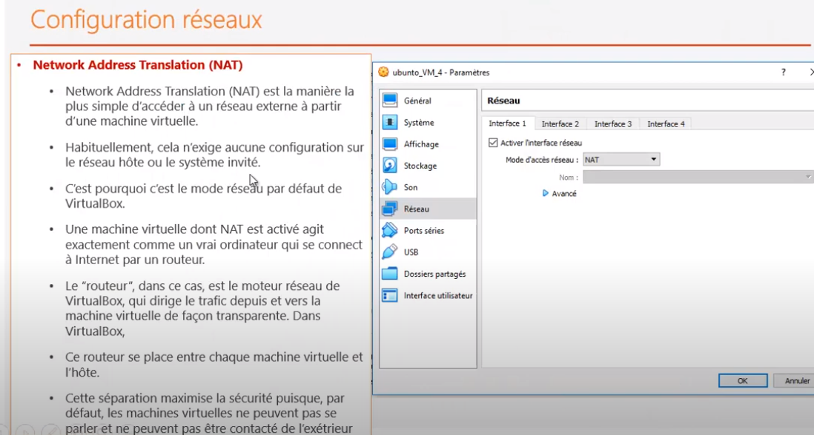
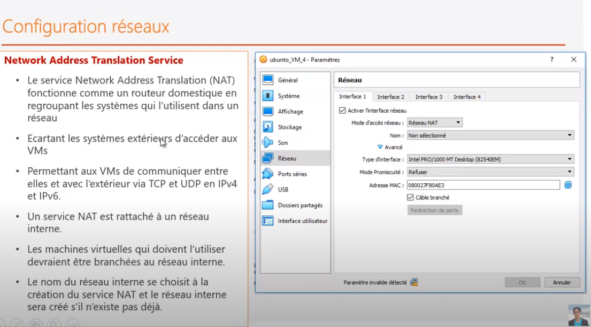
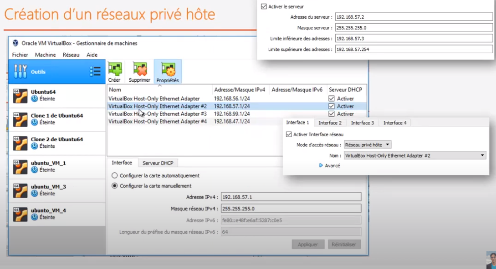

### Liens
[Virtual-Box](../virtualisation.md)

## VM Ubuntu
```
* login: grouault
* password:gildas1234
* ssh grouault@grouault-VirtualBox
```

## VM Ubuntu Server
```
* ssh grouault@ub-server
* login: grouault
* password: 1234
```

## VM Fedora Server
```
* root: grouault
* password: gildas1234
```

## installation
```
* installation local des VMs:
C:\Users\grouault\VirtualBox VMs


* installation des images
C:\Users\grouault\VirtualBox VMs\UbuntuServer\UbuntuServer.vdi
```

### hosts
```
Windows
C:\Windows\System32\drivers\etccvap
```

## Question
<pre>
install-docker?
Ou est installé docker-host / docker-engine sur la VM?
</pre>

## Création d'adaptateur
<pre>
* pour créer une nouvelle carte réseau virtuelle.
</pre>

## Configuration Réseau 

### configuration Réseau-Bridgé



### configuration Acces-Pont
<pre>
* machine virtuelle va utiliser la même interface réseau que la machine physique
* exactement comme s'il s'agit d'une vraie machine physique
* on peut pinger d'une machine à l'autre
* <b>par contre pas d'internet</b>
</pre>



### connexion à Internet en NAT
<pre>
* Aucune configuration n'est à faire pour faire cela
	> test connexion internet
	$ ping google.com
* En NAT, c'est VB qui attribue une adresse IP dynamique à la machine virtuelle
	* Addresse IP qui est fournit par défaut à la machine : 10.0.2.15
	$ ip a => inet 10.0.2.15/24 brc
* Avec cet IP, la machine peut se connecter à internet 
	VB va faire la translation d'adresse (pour tous les paquets envoyés) 
		de façon à utiliser la carte ethernet physique de la machine.
</pre>







### Tester les applications en dehors de la machine virtuelle
<pre>
En NAT, il y a un pb. Ce n'est pas configuré par défaut.
</pre>

### configuration Réseau Privé
<pre>
Configuration avec <b>plusieurs interface</b>

* interface 1 : <b>NAT</b> pour avoir accès Internet

* interface 2 : Réseau privé hôté pour permettre à la VM de <b>contacter l'extérieur</b>
	* création d'un réseau privé sur la machine virtuelle mais <b>connecté à la machine hôte</b>
	* pour un réseau privé, il faut préciser l'adaptateur à utiliser : carte réseau
		* carte pour pouvoir accèder au réseau
	* pour cela, il est possible de créer un adaptateur
	
</pre>	


	
## SSH : connection serveur à distance
```
* sur la version Desktop, il faut installer OpenSsh
* sudo apt-get install openssh-server
* sur la version Server, OpenSsh est déjà installé
```


	


```	